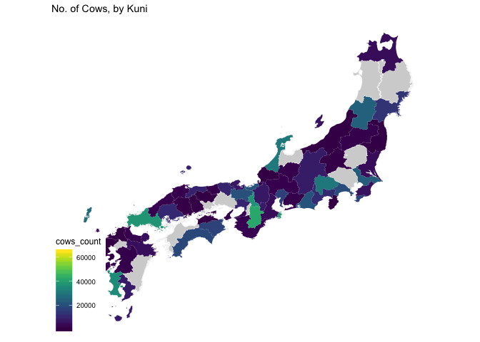
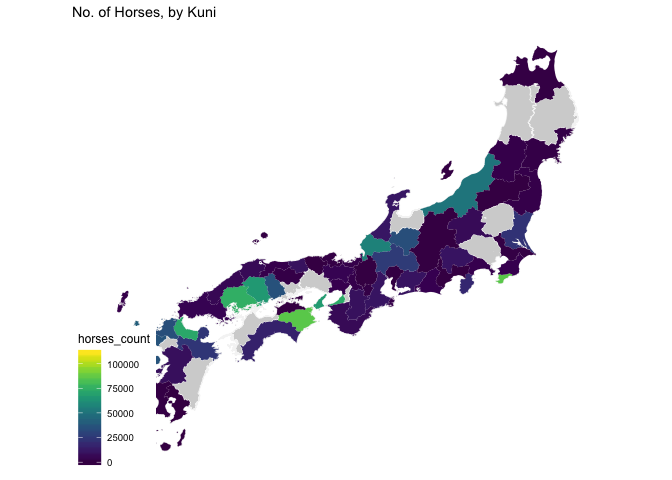

GIS 1887
================
Ye Seul Byeon
5/16/2018

``` r
#reading in excel file
#list.files('data')
tabular <- read_xlsx('data/JapanG_RawData_beta.xlsx')
tabular
```

    ## # A tibble: 718 x 205
    ##    KGun_ID Kuni_ID M17G_ID Ken_Nm Kuni_Nm Gun_Nm     MeijiYear Notes      
    ##      <dbl>   <dbl>   <dbl> <chr>  <chr>   <chr>      <chr>     <chr>      
    ##  1     101       1       1 Aomori Mutsu   Higashits… M20       <NA>       
    ##  2     102       1       2 Aomori Mutsu   Nishitsug… M20       <NA>       
    ##  3     103       1       3 Aomori Mutsu   Nakatsuga… M20       <NA>       
    ##  4     104       1       4 Aomori Mutsu   Minamitsu… M20       <NA>       
    ##  5     105       1       5 Aomori Mutsu   Kitatsuga… M20       <NA>       
    ##  6     106       1       6 Aomori Mutsu   Kamikita   M20       <NA>       
    ##  7     107       1       7 Aomori Mutsu   Shitakita  M20       <NA>       
    ##  8     108       1       8 Aomori Mutsu   Sannohe    M20       <NA>       
    ##  9     109       1       9 Aomori Mutsu   Ninohe     M22       <NA>       
    ## 10     201       2       1 Iwate  Rikuchû Nishiiwai  M22       Cells with…
    ## # ... with 708 more rows, and 197 more variables: RSI_19Sep07 <dbl>,
    ## #   RSIX19Sep07 <dbl>, RSI_11Sep07 <dbl>, RSIX11Sept07 <dbl>,
    ## #   RSI_9Jun07 <dbl>, RSIX9Jun07 <chr>, CPZ <chr>, Hi_LUH <chr>,
    ## #   Sum_Pop <chr>, URC <dbl>, Pct_class <dbl>, Size_class <dbl>,
    ## #   Pct_Urb <dbl>, AreaGIS <dbl>, Calc_Pop <chr>, JPT_ID <chr>,
    ## #   G277 <chr>, G278 <chr>, G001_cho <dbl>, G001_km2 <dbl>,
    ## #   G002_cho <dbl>, G282_km2 <dbl>, G1_G2 <dbl>, Missing <dbl>,
    ## #   G4_G5 <dbl>, G004_cho <dbl>, G005_cho <dbl>, G006_cho <dbl>,
    ## #   G007_yen <dbl>, G009_cho <dbl>, G010_yen <dbl>, G137 <dbl>,
    ## #   G402_cho <dbl>, G405_cho <chr>, G016_cho <dbl>, G016_km2 <dbl>,
    ## #   G408_cho <dbl>, G398 <dbl>, G399 <dbl>, G021 <dbl>, g021P <dbl>,
    ## #   g015R <dbl>, g21_g305 <dbl>, G347 <dbl>, G026 <dbl>, G032 <dbl>,
    ## #   G033 <dbl>, G034 <dbl>, G035 <dbl>, G036 <dbl>, G037 <dbl>,
    ## #   G038 <dbl>, G039 <dbl>, G301 <dbl>, G302 <dbl>, G303 <dbl>,
    ## #   G304 <dbl>, G305 <dbl>, G306 <dbl>, G316 <dbl>, G318 <dbl>,
    ## #   G319 <dbl>, G320 <dbl>, G321 <dbl>, G322 <dbl>, G323 <dbl>,
    ## #   G336 <dbl>, G337 <dbl>, G040 <dbl>, G041 <dbl>, G338 <dbl>,
    ## #   G339 <dbl>, G340 <dbl>, G341 <dbl>, G029 <dbl>, G030 <dbl>,
    ## #   G031 <dbl>, G348 <dbl>, G283 <dbl>, G284 <dbl>, G285 <dbl>,
    ## #   g303_g285 <chr>, G286 <dbl>, G525 <dbl>, G523 <dbl>, G042 <dbl>,
    ## #   G043 <chr>, G044 <chr>, G045 <dbl>, G046 <chr>, G047 <chr>,
    ## #   G324 <dbl>, G325 <chr>, G326 <chr>, G360 <dbl>, G361 <dbl>,
    ## #   G362 <dbl>, G054 <chr>, G055 <chr>, G056 <chr>, …

``` r
#tidying the tabular dataset
tabular_tidy <- tabular %>%
  #converting meiji year to calendar year
  mutate(MeijiYear = as.numeric(gsub("M", "", MeijiYear))) %>%
  mutate(Year = MeijiYear + 1867) %>%
  select(KGun_ID, Kuni_ID, Ken_Nm, Kuni_Nm, Gun_Nm, Year, G063, G064, G121, G203, G206)

#rename columns
names(tabular_tidy)[7:11] = c("All_Bovine", "All_Horses", "Malnutrition_Deaths", "Bovine_Bred", "Horses_Bred")
```

``` r
animal_consumption <- read_csv('data/animal_product_cleaned.csv') %>%
  select(-c(8:11))

cols_to_change = c(2, 3, 5:8)
for(i in cols_to_change){
   class(animal_consumption[, i]) = "double"
}
str(animal_consumption)
```

``` r
list.files("data")
```

    ##  [1] "animal_product_cleaned.csv"          
    ##  [2] "japan_animal_product_consumption.xls"
    ##  [3] "JapanG_RawData_beta.csv"             
    ##  [4] "JapanG_RawData_beta.xlsx"            
    ##  [5] "JapanGun_1887.dbf"                   
    ##  [6] "JapanGun_1887.prj"                   
    ##  [7] "JapanGun_1887.qpj"                   
    ##  [8] "JapanGun_1887.shp"                   
    ##  [9] "JapanGun_1887.shx"                   
    ## [10] "JapanGun_1887.sld"                   
    ## [11] "JapanKen_1887.dbf"                   
    ## [12] "JapanKen_1887.dbf~"                  
    ## [13] "JapanKen_1887.prj"                   
    ## [14] "JapanKen_1887.qpj"                   
    ## [15] "JapanKen_1887.shp"                   
    ## [16] "JapanKen_1887.shx"                   
    ## [17] "JapanKuni_1887.dbf"                  
    ## [18] "JapanKuni_1887.prj"                  
    ## [19] "JapanKuni_1887.qpj"                  
    ## [20] "JapanKuni_1887.shp"                  
    ## [21] "JapanKuni_1887.shx"                  
    ## [22] "JapanKuni_Hokkaido__1887.dbf"        
    ## [23] "JapanKuni_Hokkaido__1887.prj"        
    ## [24] "JapanKuni_Hokkaido__1887.qpj"        
    ## [25] "JapanKuni_Hokkaido__1887.shp"        
    ## [26] "JapanKuni_Hokkaido__1887.shx"        
    ## [27] "JapanT_20130319.dbf"                 
    ## [28] "JapanT_20130319.prj"                 
    ## [29] "JapanT_20130319.qpj"                 
    ## [30] "JapanT_20130319.shp"                 
    ## [31] "JapanT_20130319.shx"                 
    ## [32] "new_shp.cpg"                         
    ## [33] "new_shp.dbf"                         
    ## [34] "new_shp.prj"                         
    ## [35] "new_shp.qpj"                         
    ## [36] "new_shp.shp"                         
    ## [37] "new_shp.shx"

``` r
japan1887_kuni <- readOGR("./data/JapanKuni_1887.shp")
```

    ## OGR data source with driver: ESRI Shapefile 
    ## Source: "/Users/yeseulbyeon/Desktop/treatyports/data/JapanKuni_1887.shp", layer: "JapanKuni_1887"
    ## with 70 features
    ## It has 5 fields

``` r
hokkaido1887_kuni <- readOGR("./data/JapanKuni_Hokkaido__1887.shp")
```

    ## OGR data source with driver: ESRI Shapefile 
    ## Source: "/Users/yeseulbyeon/Desktop/treatyports/data/JapanKuni_Hokkaido__1887.shp", layer: "JapanKuni_Hokkaido__1887"
    ## with 10 features
    ## It has 5 fields

``` r
japan1887_gun <- readOGR("./data/JapanGun_1887.shp")
```

    ## OGR data source with driver: ESRI Shapefile 
    ## Source: "/Users/yeseulbyeon/Desktop/treatyports/data/JapanGun_1887.shp", layer: "JapanGun_1887"
    ## with 677 features
    ## It has 21 fields

``` r
japan1887_ken <- readOGR("./data/JapanKen_1887.shp")
```

    ## OGR data source with driver: ESRI Shapefile 
    ## Source: "/Users/yeseulbyeon/Desktop/treatyports/data/JapanKen_1887.shp", layer: "JapanKen_1887"
    ## with 39 features
    ## It has 3 fields

``` r
japan_cities <- readOGR("./data/JapanT_20130319.shp")
```

    ## OGR data source with driver: ESRI Shapefile 
    ## Source: "/Users/yeseulbyeon/Desktop/treatyports/data/JapanT_20130319.shp", layer: "JapanT_20130319"
    ## with 975 features
    ## It has 44 fields
    ## Integer64 fields read as strings:  KuniGunID T704_LUH P H RE_POP x Prov_GCS G_pop KuniGunID2 t751_JRCS t752_JGCS t753_JLCS

``` r
joined <- readOGR("./data/new_shp.shp")
```

    ## OGR data source with driver: ESRI Shapefile 
    ## Source: "/Users/yeseulbyeon/Desktop/treatyports/data/new_shp.shp", layer: "new_shp"
    ## with 70 features
    ## It has 209 fields

``` r
#hokkaido kuni
hokkaido1887_process <- hokkaido1887_kuni %>%
  fortify(region = "KUNI_RM") %>%
  as_tibble() %>%
  left_join(hokkaido1887_kuni@data, by = c("id" = "KUNI_RM"))
```

    ## Warning: Column `id`/`KUNI_RM` joining character vector and factor,
    ## coercing into character vector

``` r
#japan kuni
japan1887_kuni_process <- japan1887_kuni %>%
  fortify(region = "KUNI_RM") %>%
  as_tibble() %>%
  left_join(japan1887_kuni@data, by = c("id" = "KUNI_RM")) %>%
  mutate(Kuni_ID = OBJECTID)
```

    ## Warning: Column `id`/`KUNI_RM` joining character vector and factor,
    ## coercing into character vector

``` r
names(japan1887_kuni_process)[6]<-"Kuni_Nm"
japan1887_kuni_process <- japan1887_kuni_process %>%
  mutate(id = Kuni_ID)


#japan gun
japan1887_gun_process <- japan1887_gun %>%
  fortify(region = "GUN_RM") %>%
  as_tibble() %>%
  left_join(japan1887_gun@data, by = c("id" = "GUN_RM"))
```

    ## Warning: Column `id`/`GUN_RM` joining character vector and factor, coercing
    ## into character vector

``` r
#japan ken
japan1887_ken_process <- japan1887_ken %>%
  fortify(region = "KEN_RM") %>%
  as_tibble() %>%
  left_join(japan1887_ken@data, by = c("id" = "KEN_RM"))
```

    ## Warning: Column `id`/`KEN_RM` joining character vector and factor, coercing
    ## into character vector

``` r
head(japan1887_kuni)
```

    ## An object of class "SpatialPolygonsDataFrame"
    ## Slot "data":
    ##   OBJECTID KUNI_RM             KUNI_JP    KEN_RM              KEN_JP
    ## 0        1     Aki      \u0088À\u008c| Hiroshima \u008dL\u0093\u0087
    ## 1        2     Awa      \u0088¢\u0094g Tokushima \u0093¿\u0093\u0087
    ## 2        3   Awaji      \u0092W\u0098H     Awaji      \u0092W\u0098H
    ## 3        4   Bingo      \u0094õ\u008cã   Okayama      \u0089ª\u008eR
    ## 4        5  Bitchu \u0094õ\u0092\u0086 Hiroshima \u008dL\u0093\u0087
    ## 5        6   Bizen      \u0094õ\u0091O   Okayama      \u0089ª\u008eR
    ## 
    ## Slot "polygons":
    ## [[1]]
    ## An object of class "Polygons"
    ## Slot "Polygons":
    ## [[1]]
    ## An object of class "Polygon"
    ## Slot "labpt":
    ## [1] 132.48930  34.04103
    ## 
    ## Slot "area":
    ## [1] 5.235047e-05
    ## 
    ## Slot "hole":
    ## [1] FALSE
    ## 
    ## Slot "ringDir":
    ## [1] 1
    ## 
    ## Slot "coords":
    ##           [,1]     [,2]
    ##  [1,] 132.4937 34.04271
    ##  [2,] 132.4919 34.04033
    ##  [3,] 132.4903 34.03854
    ##  [4,] 132.4891 34.03812
    ##  [5,] 132.4855 34.03703
    ##  [6,] 132.4842 34.03478
    ##  [7,] 132.4838 34.03466
    ##  [8,] 132.4835 34.03488
    ##  [9,] 132.4827 34.03745
    ## [10,] 132.4845 34.03873
    ## [11,] 132.4864 34.04184
    ## [12,] 132.4868 34.04254
    ## [13,] 132.4875 34.04290
    ## [14,] 132.4879 34.04270
    ## [15,] 132.4883 34.04251
    ## [16,] 132.4894 34.04270
    ## [17,] 132.4924 34.04601
    ## [18,] 132.4944 34.04650
    ## [19,] 132.4960 34.04612
    ## [20,] 132.4964 34.04550
    ## [21,] 132.4947 34.04416
    ## [22,] 132.4937 34.04271
    ## 
    ## 
    ## [[2]]
    ## An object of class "Polygon"
    ## Slot "labpt":
    ## [1] 132.46502  34.05928
    ## 
    ## Slot "area":
    ## [1] 1.103971e-05
    ## 
    ## Slot "hole":
    ## [1] FALSE
    ## 
    ## Slot "ringDir":
    ## [1] 1
    ## 
    ## Slot "coords":
    ##           [,1]     [,2]
    ##  [1,] 132.4664 34.06054
    ##  [2,] 132.4673 34.05746
    ##  [3,] 132.4664 34.05710
    ##  [4,] 132.4657 34.05749
    ##  [5,] 132.4619 34.06012
    ##  [6,] 132.4621 34.06081
    ##  [7,] 132.4640 34.06044
    ##  [8,] 132.4656 34.06092
    ##  [9,] 132.4664 34.06054
    ## 
    ## 
    ## [[3]]
    ## An object of class "Polygon"
    ## Slot "labpt":
    ## [1] 132.53173  34.05881
    ## 
    ## Slot "area":
    ## [1] 0.0002548423
    ## 
    ## Slot "hole":
    ## [1] FALSE
    ## 
    ## Slot "ringDir":
    ## [1] 1
    ## 
    ## Slot "coords":
    ##           [,1]     [,2]
    ##  [1,] 132.5325 34.04737
    ##  [2,] 132.5307 34.04717
    ##  [3,] 132.5293 34.04892
    ##  [4,] 132.5276 34.04901
    ##  [5,] 132.5258 34.04904
    ##  [6,] 132.5242 34.04970
    ##  [7,] 132.5219 34.05150
    ##  [8,] 132.5213 34.05183
    ##  [9,] 132.5206 34.05262
    ## [10,] 132.5205 34.05378
    ## [11,] 132.5229 34.05454
    ## [12,] 132.5244 34.05564
    ## [13,] 132.5258 34.05714
    ## [14,] 132.5272 34.05950
    ## [15,] 132.5274 34.06018
    ## [16,] 132.5278 34.06191
    ## [17,] 132.5280 34.06521
    ## [18,] 132.5299 34.06604
    ## [19,] 132.5309 34.06892
    ## [20,] 132.5310 34.06943
    ## [21,] 132.5327 34.07014
    ## [22,] 132.5330 34.07124
    ## [23,] 132.5326 34.07398
    ## [24,] 132.5338 34.07417
    ## [25,] 132.5350 34.07195
    ## [26,] 132.5365 34.07152
    ## [27,] 132.5377 34.07028
    ## [28,] 132.5381 34.06880
    ## [29,] 132.5392 34.06778
    ## [30,] 132.5392 34.06595
    ## [31,] 132.5382 34.06245
    ## [32,] 132.5381 34.05935
    ## [33,] 132.5376 34.05711
    ## [34,] 132.5369 34.05527
    ## [35,] 132.5361 34.05120
    ## [36,] 132.5350 34.04918
    ## [37,] 132.5325 34.04737
    ## 
    ## 
    ## [[4]]
    ## An object of class "Polygon"
    ## Slot "labpt":
    ## [1] 132.55090  34.07202
    ## 
    ## Slot "area":
    ## [1] 7.636483e-05
    ## 
    ## Slot "hole":
    ## [1] FALSE
    ## 
    ## Slot "ringDir":
    ## [1] 1
    ## 
    ## Slot "coords":
    ##           [,1]     [,2]
    ##  [1,] 132.5582 34.07465
    ##  [2,] 132.5588 34.07340
    ##  [3,] 132.5597 34.07273
    ##  [4,] 132.5593 34.07169
    ##  [5,] 132.5562 34.06924
    ##  [6,] 132.5544 34.06904
    ##  [7,] 132.5525 34.06947
    ##  [8,] 132.5518 34.07003
    ##  [9,] 132.5489 34.07034
    ## [10,] 132.5486 34.07033
    ## [11,] 132.5477 34.06917
    ## [12,] 132.5423 34.06943
    ## [13,] 132.5423 34.07064
    ## [14,] 132.5435 34.07208
    ## [15,] 132.5441 34.07393
    ## [16,] 132.5454 34.07480
    ## [17,] 132.5504 34.07499
    ## [18,] 132.5513 34.07340
    ## [19,] 132.5531 34.07366
    ## [20,] 132.5547 34.07414
    ## [21,] 132.5568 34.07549
    ## [22,] 132.5578 34.07476
    ## [23,] 132.5582 34.07465
    ## 
    ## 
    ## [[5]]
    ## An object of class "Polygon"
    ## Slot "labpt":
    ## [1] 132.79287  34.11772
    ## 
    ## Slot "area":
    ## [1] 6.193783e-05
    ## 
    ## Slot "hole":
    ## [1] FALSE
    ## 
    ## Slot "ringDir":
    ## [1] 1
    ## 
    ## Slot "coords":
    ##           [,1]     [,2]
    ##  [1,] 132.7925 34.12012
    ##  [2,] 132.7932 34.11944
    ##  [3,] 132.7940 34.11968
    ##  [4,] 132.7958 34.11948
    ##  [5,] 132.7968 34.12006
    ##  [6,] 132.7983 34.12083
    ##  [7,] 132.7991 34.12044
    ##  [8,] 132.7996 34.11947
    ##  [9,] 132.7991 34.11861
    ## [10,] 132.7987 34.11705
    ## [11,] 132.7975 34.11584
    ## [12,] 132.7963 34.11468
    ## [13,] 132.7953 34.11432
    ## [14,] 132.7929 34.11509
    ## [15,] 132.7898 34.11539
    ## [16,] 132.7890 34.11475
    ## [17,] 132.7874 34.11410
    ## [18,] 132.7866 34.11432
    ## [19,] 132.7863 34.11501
    ## [20,] 132.7881 34.11818
    ## [21,] 132.7889 34.12099
    ## [22,] 132.7894 34.12157
    ## [23,] 132.7909 34.12199
    ## [24,] 132.7924 34.12086
    ## [25,] 132.7925 34.12012
    ## 
    ## 
    ## [[6]]
    ## An object of class "Polygon"
    ## Slot "labpt":
    ## [1] 132.41932  34.13301
    ## 
    ## Slot "area":
    ## [1] 1.407359e-05
    ## 
    ## Slot "hole":
    ## [1] FALSE
    ## 
    ## Slot "ringDir":
    ## [1] 1
    ## 
    ## Slot "coords":
    ##           [,1]     [,2]
    ##  [1,] 132.4189 34.13022
    ##  [2,] 132.4177 34.12997
    ##  [3,] 132.4173 34.13031
    ##  [4,] 132.4169 34.13099
    ##  [5,] 132.4170 34.13265
    ##  [6,] 132.4184 34.13411
    ##  [7,] 132.4201 34.13465
    ##  [8,] 132.4216 34.13582
    ##  [9,] 132.4226 34.13629
    ## [10,] 132.4231 34.13596
    ## [11,] 132.4196 34.13218
    ## [12,] 132.4189 34.13022
    ## 
    ## 
    ## [[7]]
    ## An object of class "Polygon"
    ## Slot "labpt":
    ## [1] 132.65445  34.15445
    ## 
    ## Slot "area":
    ## [1] 2.211048e-05
    ## 
    ## Slot "hole":
    ## [1] FALSE
    ## 
    ## Slot "ringDir":
    ## [1] 1
    ## 
    ## Slot "coords":
    ##           [,1]     [,2]
    ##  [1,] 132.6584 34.15732
    ##  [2,] 132.6579 34.15623
    ##  [3,] 132.6574 34.15582
    ##  [4,] 132.6559 34.15460
    ##  [5,] 132.6537 34.15096
    ##  [6,] 132.6528 34.15055
    ##  [7,] 132.6517 34.15099
    ##  [8,] 132.6517 34.15145
    ##  [9,] 132.6520 34.15403
    ## [10,] 132.6526 34.15615
    ## [11,] 132.6537 34.15582
    ## [12,] 132.6548 34.15699
    ## [13,] 132.6558 34.15683
    ## [14,] 132.6570 34.15770
    ## [15,] 132.6579 34.15812
    ## [16,] 132.6584 34.15732
    ## 
    ## 
    ## [[8]]
    ## An object of class "Polygon"
    ## Slot "labpt":
    ## [1] 132.7675  34.1535
    ## 
    ## Slot "area":
    ## [1] 6.160127e-05
    ## 
    ## Slot "hole":
    ## [1] FALSE
    ## 
    ## Slot "ringDir":
    ## [1] 1
    ## 
    ## Slot "coords":
    ##           [,1]     [,2]
    ##  [1,] 132.7744 34.15439
    ##  [2,] 132.7738 34.15358
    ##  [3,] 132.7725 34.15305
    ##  [4,] 132.7699 34.15142
    ##  [5,] 132.7676 34.15190
    ##  [6,] 132.7661 34.15113
    ##  [7,] 132.7644 34.15100
    ##  [8,] 132.7634 34.14984
    ##  [9,] 132.7621 34.14925
    ## [10,] 132.7609 34.14946
    ## [11,] 132.7598 34.14991
    ## [12,] 132.7596 34.15088
    ## [13,] 132.7605 34.15409
    ## [14,] 132.7623 34.15377
    ## [15,] 132.7640 34.15385
    ## [16,] 132.7658 34.15519
    ## [17,] 132.7691 34.15530
    ## [18,] 132.7700 34.15559
    ## [19,] 132.7717 34.15802
    ## [20,] 132.7732 34.15815
    ## [21,] 132.7756 34.15590
    ## [22,] 132.7754 34.15487
    ## [23,] 132.7744 34.15439
    ## 
    ## 
    ## [[9]]
    ## An object of class "Polygon"
    ## Slot "labpt":
    ## [1] 132.67029  34.15472
    ## 
    ## Slot "area":
    ## [1] 4.284822e-05
    ## 
    ## Slot "hole":
    ## [1] FALSE
    ## 
    ## Slot "ringDir":
    ## [1] 1
    ## 
    ## Slot "coords":
    ##           [,1]     [,2]
    ##  [1,] 132.6737 34.15141
    ##  [2,] 132.6729 34.15083
    ##  [3,] 132.6718 34.15121
    ##  [4,] 132.6714 34.15133
    ##  [5,] 132.6691 34.15129
    ##  [6,] 132.6679 34.15191
    ##  [7,] 132.6664 34.15394
    ##  [8,] 132.6661 34.15554
    ##  [9,] 132.6675 34.15699
    ## [10,] 132.6694 34.15731
    ## [11,] 132.6700 34.15789
    ## [12,] 132.6712 34.16019
    ## [13,] 132.6727 34.15964
    ## [14,] 132.6722 34.15746
    ## [15,] 132.6726 34.15506
    ## [16,] 132.6739 34.15336
    ## [17,] 132.6742 34.15222
    ## [18,] 132.6737 34.15141
    ## 
    ## 
    ## [[10]]
    ## An object of class "Polygon"
    ## Slot "labpt":
    ## [1] 132.43507  34.15364
    ## 
    ## Slot "area":
    ## [1] 9.604911e-05
    ## 
    ## Slot "hole":
    ## [1] FALSE
    ## 
    ## Slot "ringDir":
    ## [1] 1
    ## 
    ## Slot "coords":
    ##           [,1]     [,2]
    ##  [1,] 132.4315 34.14742
    ##  [2,] 132.4307 34.14735
    ##  [3,] 132.4300 34.14791
    ##  [4,] 132.4293 34.14996
    ##  [5,] 132.4271 34.15107
    ##  [6,] 132.4269 34.15239
    ##  [7,] 132.4282 34.15286
    ##  [8,] 132.4300 34.15301
    ##  [9,] 132.4309 34.15394
    ## [10,] 132.4303 34.15496
    ## [11,] 132.4312 34.15541
    ## [12,] 132.4323 34.15553
    ## [13,] 132.4337 34.15643
    ## [14,] 132.4342 34.15681
    ## [15,] 132.4359 34.15837
    ## [16,] 132.4368 34.15986
    ## [17,] 132.4372 34.16056
    ## [18,] 132.4385 34.16127
    ## [19,] 132.4395 34.16071
    ## [20,] 132.4398 34.16026
    ## [21,] 132.4393 34.15756
    ## [22,] 132.4401 34.15654
    ## [23,] 132.4416 34.15628
    ## [24,] 132.4408 34.15472
    ## [25,] 132.4411 34.15393
    ## [26,] 132.4419 34.15343
    ## [27,] 132.4416 34.15262
    ## [28,] 132.4373 34.15049
    ## [29,] 132.4356 34.14949
    ## [30,] 132.4337 34.14929
    ## [31,] 132.4315 34.14742
    ## 
    ## 
    ## [[11]]
    ## An object of class "Polygon"
    ## Slot "labpt":
    ## [1] 132.57505  34.16227
    ## 
    ## Slot "area":
    ## [1] 7.032797e-05
    ## 
    ## Slot "hole":
    ## [1] FALSE
    ## 
    ## Slot "ringDir":
    ## [1] 1
    ## 
    ## Slot "coords":
    ##           [,1]     [,2]
    ##  [1,] 132.5742 34.15678
    ##  [2,] 132.5730 34.15631
    ##  [3,] 132.5723 34.15635
    ##  [4,] 132.5717 34.15657
    ##  [5,] 132.5707 34.15753
    ##  [6,] 132.5708 34.15874
    ##  [7,] 132.5705 34.16130
    ##  [8,] 132.5714 34.16384
    ##  [9,] 132.5727 34.16460
    ## [10,] 132.5731 34.16518
    ## [11,] 132.5741 34.16657
    ## [12,] 132.5759 34.16722
    ## [13,] 132.5784 34.16875
    ## [14,] 132.5791 34.16864
    ## [15,] 132.5788 34.16801
    ## [16,] 132.5794 34.16716
    ## [17,] 132.5788 34.16601
    ## [18,] 132.5791 34.16510
    ## [19,] 132.5790 34.16161
    ## [20,] 132.5795 34.16064
    ## [21,] 132.5793 34.15984
    ## [22,] 132.5774 34.15958
    ## [23,] 132.5757 34.15898
    ## [24,] 132.5742 34.15678
    ## 
    ## 
    ## [[12]]
    ## An object of class "Polygon"
    ## Slot "labpt":
    ## [1] 132.39822  34.16175
    ## 
    ## Slot "area":
    ## [1] 0.0007444412
    ## 
    ## Slot "hole":
    ## [1] FALSE
    ## 
    ## Slot "ringDir":
    ## [1] 1
    ## 
    ## Slot "coords":
    ##           [,1]     [,2]
    ##  [1,] 132.3874 34.17669
    ##  [2,] 132.3894 34.17632
    ##  [3,] 132.3917 34.17676
    ##  [4,] 132.3935 34.17559
    ##  [5,] 132.3960 34.17500
    ##  [6,] 132.3972 34.17308
    ##  [7,] 132.3986 34.17281
    ##  [8,] 132.4003 34.17295
    ##  [9,] 132.4028 34.17380
    ## [10,] 132.4033 34.17386
    ## [11,] 132.4041 34.17330
    ## [12,] 132.4032 34.17049
    ## [13,] 132.4044 34.16999
    ## [14,] 132.4071 34.16940
    ## [15,] 132.4090 34.16943
    ## [16,] 132.4102 34.17002
    ## [17,] 132.4107 34.17032
    ## [18,] 132.4120 34.17076
    ## [19,] 132.4129 34.17053
    ## [20,] 132.4129 34.16984
    ## [21,] 132.4115 34.16810
    ## [22,] 132.4116 34.16753
    ## [23,] 132.4143 34.16529
    ## [24,] 132.4152 34.16129
    ## [25,] 132.4169 34.15834
    ## [26,] 132.4165 34.15691
    ## [27,] 132.4141 34.15172
    ## [28,] 132.4132 34.15062
    ## [29,] 132.4102 34.15011
    ## [30,] 132.4093 34.14964
    ## [31,] 132.4072 34.14943
    ## [32,] 132.4058 34.14838
    ## [33,] 132.4034 34.14834
    ## [34,] 132.4015 34.14803
    ## [35,] 132.4002 34.14800
    ## [36,] 132.3988 34.14701
    ## [37,] 132.3974 34.14681
    ## [38,] 132.3950 34.14820
    ## [39,] 132.3927 34.15023
    ## [40,] 132.3914 34.15072
    ## [41,] 132.3887 34.14999
    ## [42,] 132.3877 34.15055
    ## [43,] 132.3869 34.15328
    ## [44,] 132.3857 34.15578
    ## [45,] 132.3848 34.15651
    ## [46,] 132.3829 34.15733
    ## [47,] 132.3826 34.15859
    ## [48,] 132.3838 34.16147
    ## [49,] 132.3832 34.16449
    ## [50,] 132.3837 34.16731
    ## [51,] 132.3822 34.16974
    ## [52,] 132.3826 34.17347
    ## [53,] 132.3825 34.17507
    ## [54,] 132.3832 34.17720
    ## [55,] 132.3846 34.17848
    ## [56,] 132.3852 34.17877
    ## [57,] 132.3874 34.17669
    ## 
    ## 
    ## [[13]]
    ## An object of class "Polygon"
    ## Slot "labpt":
    ## [1] 132.78505  34.17393
    ## 
    ## Slot "area":
    ## [1] 0.0005617157
    ## 
    ## Slot "hole":
    ## [1] FALSE
    ## 
    ## Slot "ringDir":
    ## [1] 1
    ## 
    ## Slot "coords":
    ##           [,1]     [,2]
    ##  [1,] 132.7867 34.16280
    ##  [2,] 132.7842 34.16156
    ##  [3,] 132.7806 34.16100
    ##  [4,] 132.7789 34.16143
    ##  [5,] 132.7782 34.16166
    ##  [6,] 132.7753 34.16127
    ##  [7,] 132.7728 34.16181
    ##  [8,] 132.7718 34.16271
    ##  [9,] 132.7718 34.16792
    ## [10,] 132.7717 34.17009
    ## [11,] 132.7718 34.17164
    ## [12,] 132.7727 34.17669
    ## [13,] 132.7738 34.17888
    ## [14,] 132.7771 34.18081
    ## [15,] 132.7788 34.18238
    ## [16,] 132.7793 34.18513
    ## [17,] 132.7803 34.18578
    ## [18,] 132.7807 34.18658
    ## [19,] 132.7825 34.18787
    ## [20,] 132.7850 34.18899
    ## [21,] 132.7865 34.18884
    ## [22,] 132.7876 34.18839
    ## [23,] 132.7893 34.18704
    ## [24,] 132.7936 34.18435
    ## [25,] 132.7986 34.17921
    ## [26,] 132.7999 34.17716
    ## [27,] 132.8003 34.17448
    ## [28,] 132.7998 34.17247
    ## [29,] 132.7978 34.16970
    ## [30,] 132.7923 34.16470
    ## [31,] 132.7897 34.16335
    ## [32,] 132.7867 34.16280
    ## 
    ## 
    ## [[14]]
    ## An object of class "Polygon"
    ## Slot "labpt":
    ## [1] 132.83358  34.17238
    ## 
    ## Slot "area":
    ## [1] 0.001753763
    ## 
    ## Slot "hole":
    ## [1] FALSE
    ## 
    ## Slot "ringDir":
    ## [1] 1
    ## 
    ## Slot "coords":
    ##           [,1]     [,2]
    ##  [1,] 132.8508 34.19115
    ##  [2,] 132.8531 34.18872
    ##  [3,] 132.8539 34.18822
    ##  [4,] 132.8550 34.18803
    ##  [5,] 132.8567 34.18774
    ##  [6,] 132.8573 34.18689
    ##  [7,] 132.8573 34.18483
    ##  [8,] 132.8584 34.18398
    ##  [9,] 132.8624 34.18225
    ## [10,] 132.8631 34.18187
    ## [11,] 132.8633 34.18152
    ## [12,] 132.8643 34.18028
    ## [13,] 132.8651 34.18023
    ## [14,] 132.8664 34.18093
    ## [15,] 132.8675 34.18072
    ## [16,] 132.8695 34.18080
    ## [17,] 132.8700 34.18040
    ## [18,] 132.8700 34.17960
    ## [19,] 132.8702 34.17909
    ## [20,] 132.8710 34.17807
    ## [21,] 132.8699 34.17657
    ## [22,] 132.8698 34.17542
    ## [23,] 132.8694 34.17359
    ## [24,] 132.8686 34.17335
    ## [25,] 132.8669 34.17378
    ## [26,] 132.8656 34.17354
    ## [27,] 132.8630 34.17082
    ## [28,] 132.8599 34.16854
    ## [29,] 132.8585 34.16773
    ## [30,] 132.8578 34.16709
    ## [31,] 132.8553 34.16528
    ## [32,] 132.8510 34.16254
    ## [33,] 132.8486 34.16050
    ## [34,] 132.8448 34.15994
    ## [35,] 132.8406 34.16018
    ## [36,] 132.8399 34.15971
    ## [37,] 132.8388 34.15821
    ## [38,] 132.8361 34.15697
    ## [39,] 132.8343 34.15620
    ## [40,] 132.8311 34.15530
    ## [41,] 132.8262 34.15358
    ## [42,] 132.8222 34.15250
    ## [43,] 132.8188 34.15079
    ## [44,] 132.8182 34.15079
    ## [45,] 132.8169 34.15140
    ## [46,] 132.8150 34.15281
    ## [47,] 132.8121 34.15363
    ## [48,] 132.8106 34.15453
    ## [49,] 132.8098 34.15451
    ## [50,] 132.8076 34.15368
    ## [51,] 132.8064 34.15367
    ## [52,] 132.8032 34.15454
    ## [53,] 132.8029 34.15465
    ## [54,] 132.8028 34.15683
    ## [55,] 132.8014 34.15864
    ## [56,] 132.8016 34.15950
    ## [57,] 132.8043 34.16045
    ## [58,] 132.8058 34.16230
    ## [59,] 132.8060 34.16328
    ## [60,] 132.8048 34.16687
    ## [61,] 132.8037 34.17109
    ## [62,] 132.8040 34.17264
    ## [63,] 132.8063 34.17593
    ## [64,] 132.8068 34.17680
    ## [65,] 132.8096 34.17918
    ## [66,] 132.8124 34.18139
    ## [67,] 132.8161 34.18287
    ## [68,] 132.8194 34.18423
    ## [69,] 132.8229 34.18702
    ## [70,] 132.8251 34.18802
    ## [71,] 132.8260 34.18814
    ## [72,] 132.8277 34.18771
    ## [73,] 132.8287 34.18566
    ## [74,] 132.8291 34.18458
    ## [75,] 132.8308 34.18569
    ## [76,] 132.8322 34.18565
    ## [77,] 132.8331 34.18721
    ## [78,] 132.8331 34.18744
    ## [79,] 132.8333 34.18801
    ## [80,] 132.8317 34.18948
    ## [81,] 132.8320 34.19034
    ## [82,] 132.8333 34.19116
    ## [83,] 132.8345 34.19037
    ## [84,] 132.8350 34.19043
    ## [85,] 132.8362 34.19057
    ## [86,] 132.8395 34.19204
    ## [87,] 132.8439 34.19352
    ## [88,] 132.8442 34.19381
    ## [89,] 132.8449 34.19445
    ## [90,] 132.8464 34.19619
    ## [91,] 132.8487 34.19702
    ## [92,] 132.8497 34.19652
    ## [93,] 132.8496 34.19560
    ## [94,] 132.8483 34.19410
    ## [95,] 132.8485 34.19295
    ## [96,] 132.8486 34.19281
    ## [97,] 132.8508 34.19115
    ## 
    ## 
    ## [[15]]
    ## An object of class "Polygon"
    ## Slot "labpt":
    ## [1] 132.81451  34.19218
    ## 
    ## Slot "area":
    ## [1] 8.881897e-05
    ## 
    ## Slot "hole":
    ## [1] FALSE
    ## 
    ## Slot "ringDir":
    ## [1] 1
    ## 
    ## Slot "coords":
    ##           [,1]     [,2]
    ##  [1,] 132.8206 34.19729
    ##  [2,] 132.8209 34.19638
    ##  [3,] 132.8204 34.19403
    ##  [4,] 132.8217 34.19244
    ##  [5,] 132.8215 34.19175
    ##  [6,] 132.8198 34.19041
    ##  [7,] 132.8172 34.19027
    ##  [8,] 132.8159 34.18916
    ##  [9,] 132.8144 34.18931
    ## [10,] 132.8142 34.18903
    ## [11,] 132.8145 34.18794
    ## [12,] 132.8143 34.18737
    ## [13,] 132.8125 34.18769
    ## [14,] 132.8101 34.18708
    ## [15,] 132.8082 34.18730
    ## [16,] 132.8078 34.18734
    ## [17,] 132.8053 34.18771
    ## [18,] 132.8058 34.18851
    ## [19,] 132.8077 34.18909
    ## [20,] 132.8096 34.18965
    ## [21,] 132.8102 34.19006
    ## [22,] 132.8102 34.19029
    ## [23,] 132.8105 34.19104
    ## [24,] 132.8098 34.19234
    ## [25,] 132.8089 34.19416
    ## [26,] 132.8096 34.19497
    ## [27,] 132.8111 34.19568
    ## [28,] 132.8151 34.19567
    ## [29,] 132.8168 34.19678
    ## [30,] 132.8182 34.19674
    ## [31,] 132.8197 34.19768
    ## [32,] 132.8206 34.19729
    ## 
    ## 
    ## [[16]]
    ## An object of class "Polygon"
    ## Slot "labpt":
    ## [1] 132.30571  34.19209
    ## 
    ## Slot "area":
    ## [1] 0.0002309585
    ## 
    ## Slot "hole":
    ## [1] FALSE
    ## 
    ## Slot "ringDir":
    ## [1] 1
    ## 
    ## Slot "coords":
    ##           [,1]     [,2]
    ##  [1,] 132.3162 34.19461
    ##  [2,] 132.3175 34.19361
    ##  [3,] 132.3184 34.19139
    ##  [4,] 132.3185 34.18905
    ##  [5,] 132.3175 34.18817
    ##  [6,] 132.3138 34.18753
    ##  [7,] 132.3091 34.18723
    ##  [8,] 132.3064 34.18535
    ##  [9,] 132.3053 34.18544
    ## [10,] 132.3021 34.18510
    ## [11,] 132.3013 34.18532
    ## [12,] 132.3009 34.18875
    ## [13,] 132.3001 34.18936
    ## [14,] 132.2990 34.18929
    ## [15,] 132.2979 34.18818
    ## [16,] 132.2967 34.18782
    ## [17,] 132.2948 34.18824
    ## [18,] 132.2935 34.18953
    ## [19,] 132.2938 34.19389
    ## [20,] 132.2951 34.19528
    ## [21,] 132.2957 34.19798
    ## [22,] 132.2965 34.19897
    ## [23,] 132.2975 34.19933
    ## [24,] 132.2990 34.19878
    ## [25,] 132.2992 34.19724
    ## [26,] 132.3008 34.19658
    ## [27,] 132.3011 34.19561
    ## [28,] 132.3020 34.19408
    ## [29,] 132.3030 34.19422
    ## [30,] 132.3050 34.19608
    ## [31,] 132.3047 34.19740
    ## [32,] 132.3073 34.19778
    ## [33,] 132.3091 34.19924
    ## [34,] 132.3114 34.19946
    ## [35,] 132.3123 34.19873
    ## [36,] 132.3125 34.19655
    ## [37,] 132.3130 34.19525
    ## [38,] 132.3162 34.19461
    ## 
    ## 
    ## [[17]]
    ## An object of class "Polygon"
    ## Slot "labpt":
    ## [1] 132.31898  34.19842
    ## 
    ## Slot "area":
    ## [1] 1.074369e-05
    ## 
    ## Slot "hole":
    ## [1] FALSE
    ## 
    ## Slot "ringDir":
    ## [1] 1
    ## 
    ## Slot "coords":
    ##           [,1]     [,2]
    ##  [1,] 132.3197 34.19645
    ##  [2,] 132.3192 34.19621
    ##  [3,] 132.3186 34.19654
    ##  [4,] 132.3170 34.19692
    ##  [5,] 132.3174 34.19824
    ##  [6,] 132.3182 34.20014
    ##  [7,] 132.3195 34.20051
    ##  [8,] 132.3204 34.20052
    ##  [9,] 132.3208 34.19944
    ## [10,] 132.3203 34.19886
    ## [11,] 132.3203 34.19777
    ## [12,] 132.3197 34.19645
    ## 
    ## 
    ## [[18]]
    ## An object of class "Polygon"
    ## Slot "labpt":
    ## [1] 132.51619  34.13099
    ## 
    ## Slot "area":
    ## [1] 0.006892368
    ## 
    ## Slot "hole":
    ## [1] FALSE
    ## 
    ## Slot "ringDir":
    ## [1] 1
    ## 
    ## Slot "coords":
    ##            [,1]     [,2]
    ##   [1,] 132.5299 34.19959
    ##   [2,] 132.5318 34.19943
    ##   [3,] 132.5322 34.19944
    ##   [4,] 132.5346 34.20020
    ##   [5,] 132.5390 34.20029
    ##   [6,] 132.5415 34.19464
    ##   [7,] 132.5384 34.19479
    ##   [8,] 132.5366 34.19426
    ##   [9,] 132.5356 34.19265
    ##  [10,] 132.5356 34.18990
    ##  [11,] 132.5369 34.18894
    ##  [12,] 132.5384 34.18826
    ##  [13,] 132.5404 34.18834
    ##  [14,] 132.5421 34.18864
    ##  [15,] 132.5463 34.19044
    ##  [16,] 132.5475 34.19022
    ##  [17,] 132.5481 34.18925
    ##  [18,] 132.5486 34.18771
    ##  [19,] 132.5496 34.18715
    ##  [20,] 132.5509 34.18658
    ##  [21,] 132.5512 34.18544
    ##  [22,] 132.5506 34.18412
    ##  [23,] 132.5510 34.18252
    ##  [24,] 132.5551 34.17894
    ##  [25,] 132.5559 34.17769
    ##  [26,] 132.5562 34.17592
    ##  [27,] 132.5565 34.17529
    ##  [28,] 132.5580 34.17388
    ##  [29,] 132.5590 34.17310
    ##  [30,] 132.5575 34.17170
    ##  [31,] 132.5566 34.17151
    ##  [32,] 132.5558 34.17202
    ##  [33,] 132.5551 34.17321
    ##  [34,] 132.5515 34.17447
    ##  [35,] 132.5507 34.17585
    ##  [36,] 132.5492 34.17654
    ##  [37,] 132.5483 34.17672
    ##  [38,] 132.5476 34.17700
    ##  [39,] 132.5458 34.17607
    ##  [40,] 132.5432 34.17405
    ##  [41,] 132.5422 34.17369
    ##  [42,] 132.5415 34.17289
    ##  [43,] 132.5413 34.17191
    ##  [44,] 132.5429 34.17055
    ##  [45,] 132.5431 34.16981
    ##  [46,] 132.5426 34.16878
    ##  [47,] 132.5410 34.16499
    ##  [48,] 132.5402 34.16412
    ##  [49,] 132.5382 34.16376
    ##  [50,] 132.5367 34.16266
    ##  [51,] 132.5358 34.16231
    ##  [52,] 132.5348 34.16236
    ##  [53,] 132.5339 34.16299
    ##  [54,] 132.5335 34.16481
    ##  [55,] 132.5324 34.16544
    ##  [56,] 132.5316 34.16520
    ##  [57,] 132.5298 34.16399
    ##  [58,] 132.5278 34.16156
    ##  [59,] 132.5255 34.16058
    ##  [60,] 132.5243 34.15948
    ##  [61,] 132.5231 34.15672
    ##  [62,] 132.5232 34.15581
    ##  [63,] 132.5239 34.15530
    ##  [64,] 132.5249 34.15513
    ##  [65,] 132.5278 34.15556
    ##  [66,] 132.5290 34.15528
    ##  [67,] 132.5305 34.15437
    ##  [68,] 132.5306 34.15397
    ##  [69,] 132.5302 34.15257
    ##  [70,] 132.5293 34.15139
    ##  [71,] 132.5287 34.15036
    ##  [72,] 132.5298 34.15010
    ##  [73,] 132.5317 34.15014
    ##  [74,] 132.5330 34.14964
    ##  [75,] 132.5343 34.14943
    ##  [76,] 132.5348 34.14938
    ##  [77,] 132.5385 34.14949
    ##  [78,] 132.5406 34.14993
    ##  [79,] 132.5443 34.15096
    ##  [80,] 132.5470 34.15105
    ##  [81,] 132.5481 34.15193
    ##  [82,] 132.5489 34.15188
    ##  [83,] 132.5493 34.15115
    ##  [84,] 132.5490 34.14948
    ##  [85,] 132.5499 34.14806
    ##  [86,] 132.5500 34.14652
    ##  [87,] 132.5486 34.14278
    ##  [88,] 132.5494 34.14251
    ##  [89,] 132.5502 34.14309
    ##  [90,] 132.5511 34.14557
    ##  [91,] 132.5522 34.14627
    ##  [92,] 132.5523 34.14885
    ##  [93,] 132.5535 34.14955
    ##  [94,] 132.5540 34.15047
    ##  [95,] 132.5566 34.15183
    ##  [96,] 132.5576 34.15099
    ##  [97,] 132.5578 34.15030
    ##  [98,] 132.5573 34.14955
    ##  [99,] 132.5541 34.14681
    ## [100,] 132.5535 34.14440
    ## [101,] 132.5517 34.14185
    ## [102,] 132.5507 34.14121
    ## [103,] 132.5494 34.13844
    ## [104,] 132.5491 34.13800
    ## [105,] 132.5483 34.13694
    ## [106,] 132.5476 34.13470
    ## [107,] 132.5472 34.13343
    ## [108,] 132.5475 34.13120
    ## [109,] 132.5473 34.12937
    ## [110,] 132.5460 34.12860
    ## [111,] 132.5460 34.12574
    ## [112,] 132.5439 34.12342
    ## [113,] 132.5432 34.12278
    ## [114,] 132.5418 34.12299
    ## [115,] 132.5405 34.12280
    ## [116,] 132.5382 34.12036
    ## [117,] 132.5382 34.11962
    ## [118,] 132.5386 34.11893
    ## [119,] 132.5412 34.11657
    ## [120,] 132.5419 34.11607
    ## [121,] 132.5411 34.11474
    ## [122,] 132.5409 34.11370
    ## [123,] 132.5399 34.11238
    ## [124,] 132.5400 34.11043
    ## [125,] 132.5395 34.10871
    ## [126,] 132.5397 34.10762
    ## [127,] 132.5401 34.10711
    ## [128,] 132.5409 34.10741
    ## [129,] 132.5437 34.11094
    ## [130,] 132.5464 34.11201
    ## [131,] 132.5472 34.11243
    ## [132,] 132.5484 34.11456
    ## [133,] 132.5494 34.11578
    ## [134,] 132.5497 34.11745
    ## [135,] 132.5506 34.11803
    ## [136,] 132.5534 34.11756
    ## [137,] 132.5568 34.11829
    ## [138,] 132.5593 34.11770
    ## [139,] 132.5602 34.11760
    ## [140,] 132.5620 34.11895
    ## [141,] 132.5638 34.11937
    ## [142,] 132.5666 34.12268
    ## [143,] 132.5680 34.12355
    ## [144,] 132.5694 34.12398
    ## [145,] 132.5723 34.12425
    ## [146,] 132.5740 34.12708
    ## [147,] 132.5749 34.12778
    ## [148,] 132.5763 34.12809
    ## [149,] 132.5780 34.12788
    ## [150,] 132.5796 34.12733
    ## [151,] 132.5798 34.12711
    ## [152,] 132.5812 34.12450
    ## [153,] 132.5822 34.12405
    ## [154,] 132.5841 34.12391
    ## [155,] 132.5819 34.12130
    ## [156,] 132.5814 34.11941
    ## [157,] 132.5820 34.11684
    ## [158,] 132.5827 34.11554
    ## [159,] 132.5829 34.11468
    ## [160,] 132.5834 34.11383
    ## [161,] 132.5836 34.11292
    ## [162,] 132.5853 34.11254
    ## [163,] 132.5862 34.11169
    ## [164,] 132.5873 34.11142
    ## [165,] 132.5883 34.11161
    ## [166,] 132.5886 34.11197
    ## [167,] 132.5902 34.11381
    ## [168,] 132.5908 34.11457
    ## [169,] 132.5921 34.11527
    ## [170,] 132.5928 34.11500
    ## [171,] 132.5926 34.11402
    ## [172,] 132.5913 34.11229
    ## [173,] 132.5907 34.10936
    ## [174,] 132.5892 34.10923
    ## [175,] 132.5889 34.10922
    ## [176,] 132.5878 34.10920
    ## [177,] 132.5861 34.10746
    ## [178,] 132.5846 34.10738
    ## [179,] 132.5827 34.10792
    ## [180,] 132.5813 34.10968
    ## [181,] 132.5794 34.11119
    ## [182,] 132.5778 34.11214
    ## [183,] 132.5777 34.11403
    ## [184,] 132.5767 34.11522
    ## [185,] 132.5762 34.11653
    ## [186,] 132.5744 34.11633
    ## [187,] 132.5721 34.11589
    ## [188,] 132.5703 34.11386
    ## [189,] 132.5697 34.11225
    ## [190,] 132.5697 34.11008
    ## [191,] 132.5684 34.10600
    ## [192,] 132.5680 34.10181
    ## [193,] 132.5683 34.09930
    ## [194,] 132.5685 34.09810
    ## [195,] 132.5670 34.09768
    ## [196,] 132.5664 34.09749
    ## [197,] 132.5656 34.09611
    ## [198,] 132.5643 34.09500
    ## [199,] 132.5638 34.09345
    ## [200,] 132.5636 34.09127
    ## [201,] 132.5623 34.08988
    ## [202,] 132.5621 34.08810
    ## [203,] 132.5613 34.08694
    ## [204,] 132.5598 34.08641
    ## [205,] 132.5594 34.08560
    ## [206,] 132.5582 34.08461
    ## [207,] 132.5575 34.08328
    ## [208,] 132.5568 34.08087
    ## [209,] 132.5562 34.08052
    ## [210,] 132.5540 34.08054
    ## [211,] 132.5531 34.07950
    ## [212,] 132.5516 34.07925
    ## [213,] 132.5490 34.08029
    ## [214,] 132.5497 34.08162
    ## [215,] 132.5496 34.08322
    ## [216,] 132.5491 34.08527
    ## [217,] 132.5479 34.08645
    ## [218,] 132.5477 34.08657
    ## [219,] 132.5482 34.08846
    ## [220,] 132.5478 34.09052
    ## [221,] 132.5466 34.09153
    ## [222,] 132.5441 34.09206
    ## [223,] 132.5431 34.09302
    ## [224,] 132.5435 34.09366
    ## [225,] 132.5449 34.09425
    ## [226,] 132.5449 34.09568
    ## [227,] 132.5448 34.09642
    ## [228,] 132.5453 34.09769
    ## [229,] 132.5450 34.09877
    ## [230,] 132.5439 34.09939
    ## [231,] 132.5426 34.09920
    ## [232,] 132.5410 34.09814
    ## [233,] 132.5399 34.09635
    ## [234,] 132.5384 34.09587
    ## [235,] 132.5370 34.09631
    ## [236,] 132.5359 34.09715
    ## [237,] 132.5359 34.09955
    ## [238,] 132.5355 34.10120
    ## [239,] 132.5354 34.10241
    ## [240,] 132.5339 34.10324
    ## [241,] 132.5337 34.10324
    ## [242,] 132.5323 34.10310
    ## [243,] 132.5305 34.10153
    ## [244,] 132.5300 34.09998
    ## [245,] 132.5295 34.09940
    ## [246,] 132.5284 34.09875
    ## [247,] 132.5283 34.09778
    ## [248,] 132.5270 34.09701
    ## [249,] 132.5265 34.09643
    ## [250,] 132.5239 34.09628
    ## [251,] 132.5219 34.09453
    ## [252,] 132.5211 34.09406
    ## [253,] 132.5194 34.09398
    ## [254,] 132.5180 34.09562
    ## [255,] 132.5169 34.09577
    ## [256,] 132.5153 34.09529
    ## [257,] 132.5135 34.09251
    ## [258,] 132.5128 34.09239
    ## [259,] 132.5122 34.09318
    ## [260,] 132.5134 34.09864
    ## [261,] 132.5133 34.09972
    ## [262,] 132.5127 34.10040
    ## [263,] 132.5101 34.10179
    ## [264,] 132.5101 34.10214
    ## [265,] 132.5098 34.10299
    ## [266,] 132.5092 34.10332
    ## [267,] 132.5031 34.10283
    ## [268,] 132.5024 34.10225
    ## [269,] 132.5025 34.10103
    ## [270,] 132.5025 34.10081
    ## [271,] 132.5026 34.09967
    ## [272,] 132.5012 34.09851
    ## [273,] 132.5007 34.09695
    ## [274,] 132.5011 34.09427
    ## [275,] 132.5004 34.09243
    ## [276,] 132.4995 34.09167
    ## [277,] 132.4968 34.09180
    ## [278,] 132.4956 34.09127
    ## [279,] 132.4936 34.09209
    ## [280,] 132.4932 34.09209
    ## [281,] 132.4920 34.09207
    ## [282,] 132.4917 34.09178
    ## [283,] 132.4913 34.09091
    ## [284,] 132.4906 34.09073
    ## [285,] 132.4893 34.09145
    ## [286,] 132.4884 34.09138
    ## [287,] 132.4861 34.09152
    ## [288,] 132.4852 34.09099
    ## [289,] 132.4847 34.09047
    ## [290,] 132.4845 34.08892
    ## [291,] 132.4845 34.08800
    ## [292,] 132.4834 34.08667
    ## [293,] 132.4819 34.08613
    ## [294,] 132.4812 34.08681
    ## [295,] 132.4810 34.08869
    ## [296,] 132.4802 34.08937
    ## [297,] 132.4800 34.08943
    ## [298,] 132.4793 34.08964
    ## [299,] 132.4775 34.08919
    ## [300,] 132.4774 34.08915
    ## [301,] 132.4718 34.08735
    ## [302,] 132.4686 34.08506
    ## [303,] 132.4668 34.08458
    ## [304,] 132.4651 34.08398
    ## [305,] 132.4628 34.08286
    ## [306,] 132.4611 34.08294
    ## [307,] 132.4585 34.08399
    ## [308,] 132.4567 34.08556
    ## [309,] 132.4557 34.08892
    ## [310,] 132.4557 34.09150
    ## [311,] 132.4546 34.09308
    ## [312,] 132.4530 34.09386
    ## [313,] 132.4486 34.09425
    ## [314,] 132.4480 34.09521
    ## [315,] 132.4482 34.09933
    ## [316,] 132.4484 34.10180
    ## [317,] 132.4479 34.10517
    ## [318,] 132.4486 34.10638
    ## [319,] 132.4489 34.10770
    ## [320,] 132.4477 34.10888
    ## [321,] 132.4482 34.10975
    ## [322,] 132.4503 34.11121
    ## [323,] 132.4514 34.11243
    ## [324,] 132.4536 34.11338
    ## [325,] 132.4553 34.11518
    ## [326,] 132.4589 34.11616
    ## [327,] 132.4609 34.11533
    ## [328,] 132.4627 34.11576
    ## [329,] 132.4659 34.11736
    ## [330,] 132.4661 34.11919
    ## [331,] 132.4657 34.12107
    ## [332,] 132.4685 34.12243
    ## [333,] 132.4687 34.12246
    ## [334,] 132.4693 34.12256
    ## [335,] 132.4704 34.12240
    ## [336,] 132.4718 34.12042
    ## [337,] 132.4713 34.11898
    ## [338,] 132.4717 34.11865
    ## [339,] 132.4724 34.11860
    ## [340,] 132.4733 34.11987
    ## [341,] 132.4744 34.12052
    ## [342,] 132.4745 34.12252
    ## [343,] 132.4732 34.12291
    ## [344,] 132.4722 34.12306
    ## [345,] 132.4729 34.12508
    ## [346,] 132.4742 34.12550
    ## [347,] 132.4757 34.12500
    ## [348,] 132.4774 34.12509
    ## [349,] 132.4798 34.12679
    ## [350,] 132.4819 34.12779
    ## [351,] 132.4848 34.12852
    ## [352,] 132.4869 34.13021
    ## [353,] 132.4890 34.13122
    ## [354,] 132.4935 34.13281
    ## [355,] 132.4945 34.13318
    ## [356,] 132.4949 34.13337
    ## [357,] 132.4967 34.13363
    ## [358,] 132.4977 34.13330
    ## [359,] 132.4995 34.13251
    ## [360,] 132.5000 34.13223
    ## [361,] 132.5012 34.13292
    ## [362,] 132.5025 34.13334
    ## [363,] 132.5043 34.13352
    ## [364,] 132.5074 34.13698
    ## [365,] 132.5088 34.13951
    ## [366,] 132.5093 34.14260
    ## [367,] 132.5091 34.14370
    ## [368,] 132.5090 34.14455
    ## [369,] 132.5080 34.14609
    ## [370,] 132.5063 34.14716
    ## [371,] 132.5044 34.14686
    ## [372,] 132.5026 34.14662
    ## [373,] 132.4996 34.14780
    ## [374,] 132.4981 34.14807
    ## [375,] 132.4972 34.14886
    ## [376,] 132.4965 34.14960
    ## [377,] 132.4959 34.15083
    ## [378,] 132.4956 34.15160
    ## [379,] 132.4935 34.15445
    ## [380,] 132.4928 34.15631
    ## [381,] 132.4928 34.15763
    ## [382,] 132.4937 34.16531
    ## [383,] 132.4942 34.16668
    ## [384,] 132.4958 34.16910
    ## [385,] 132.4970 34.17077
    ## [386,] 132.4984 34.17302
    ## [387,] 132.4982 34.17593
    ## [388,] 132.4998 34.17989
    ## [389,] 132.5014 34.18283
    ## [390,] 132.5028 34.18484
    ## [391,] 132.5033 34.18616
    ## [392,] 132.5055 34.18732
    ## [393,] 132.5065 34.18905
    ## [394,] 132.5114 34.19063
    ## [395,] 132.5139 34.19186
    ## [396,] 132.5159 34.19319
    ## [397,] 132.5181 34.19343
    ## [398,] 132.5185 34.19366
    ## [399,] 132.5229 34.19610
    ## [400,] 132.5246 34.19761
    ## [401,] 132.5248 34.19788
    ## [402,] 132.5258 34.19890
    ## [403,] 132.5269 34.20054
    ## [404,] 132.5278 34.20072
    ## [405,] 132.5299 34.19959
    ## 
    ## 
    ## [[19]]
    ## An object of class "Polygon"
    ## Slot "labpt":
    ## [1] 132.66616  34.18527
    ## 
    ## Slot "area":
    ## [1] 0.0008269672
    ## 
    ## Slot "hole":
    ## [1] FALSE
    ## 
    ## Slot "ringDir":
    ## [1] 1
    ## 
    ## Slot "coords":
    ##           [,1]     [,2]
    ##  [1,] 132.6725 34.20342
    ##  [2,] 132.6743 34.20303
    ##  [3,] 132.6772 34.20316
    ##  [4,] 132.6786 34.20243
    ##  [5,] 132.6789 34.20100
    ##  [6,] 132.6781 34.19939
    ##  [7,] 132.6769 34.19606
    ##  [8,] 132.6770 34.19509
    ##  [9,] 132.6776 34.19475
    ## [10,] 132.6781 34.19521
    ## [11,] 132.6795 34.19602
    ## [12,] 132.6804 34.19580
    ## [13,] 132.6808 34.19437
    ## [14,] 132.6834 34.19307
    ## [15,] 132.6848 34.19147
    ## [16,] 132.6853 34.18907
    ## [17,] 132.6852 34.18764
    ## [18,] 132.6845 34.18678
    ## [19,] 132.6828 34.18431
    ## [20,] 132.6811 34.18206
    ## [21,] 132.6788 34.17867
    ## [22,] 132.6786 34.17846
    ## [23,] 132.6769 34.17671
    ## [24,] 132.6769 34.17651
    ## [25,] 132.6768 34.17476
    ## [26,] 132.6749 34.17303
    ## [27,] 132.6734 34.17279
    ## [28,] 132.6713 34.17135
    ## [29,] 132.6695 34.17054
    ## [30,] 132.6677 34.17001
    ## [31,] 132.6653 34.16977
    ## [32,] 132.6639 34.16964
    ## [33,] 132.6629 34.16998
    ## [34,] 132.6633 34.17153
    ## [35,] 132.6631 34.17250
    ## [36,] 132.6604 34.17437
    ## [37,] 132.6585 34.17476
    ## [38,] 132.6572 34.17435
    ## [39,] 132.6569 34.17343
    ## [40,] 132.6565 34.17326
    ## [41,] 132.6533 34.17255
    ## [42,] 132.6515 34.17094
    ## [43,] 132.6502 34.17041
    ## [44,] 132.6475 34.17043
    ## [45,] 132.6458 34.17044
    ## [46,] 132.6446 34.17100
    ## [47,] 132.6452 34.17215
    ## [48,] 132.6458 34.17282
    ## [49,] 132.6468 34.17427
    ## [50,] 132.6472 34.17474
    ## [51,] 132.6477 34.17778
    ## [52,] 132.6495 34.18117
    ## [53,] 132.6492 34.18363
    ## [54,] 132.6514 34.18903
    ## [55,] 132.6539 34.19116
    ## [56,] 132.6542 34.19196
    ## [57,] 132.6557 34.19455
    ## [58,] 132.6593 34.19732
    ## [59,] 132.6600 34.19727
    ## [60,] 132.6631 34.19740
    ## [61,] 132.6643 34.19847
    ## [62,] 132.6651 34.19925
    ## [63,] 132.6686 34.20001
    ## [64,] 132.6700 34.20077
    ## [65,] 132.6713 34.20261
    ## [66,] 132.6725 34.20342
    ## 
    ## 
    ## [[20]]
    ## An object of class "Polygon"
    ## Slot "labpt":
    ## [1] 132.72700  34.18534
    ## 
    ## Slot "area":
    ## [1] 0.001931062
    ## 
    ## Slot "hole":
    ## [1] FALSE
    ## 
    ## Slot "ringDir":
    ## [1] 1
    ## 
    ## Slot "coords":
    ##            [,1]     [,2]
    ##   [1,] 132.7203 34.19831
    ##   [2,] 132.7216 34.19729
    ##   [3,] 132.7227 34.19747
    ##   [4,] 132.7234 34.19851
    ##   [5,] 132.7244 34.19983
    ##   [6,] 132.7256 34.20012
    ##   [7,] 132.7292 34.19831
    ##   [8,] 132.7363 34.19715
    ##   [9,] 132.7368 34.19704
    ##  [10,] 132.7405 34.19614
    ##  [11,] 132.7422 34.19541
    ##  [12,] 132.7444 34.19445
    ##  [13,] 132.7472 34.19441
    ##  [14,] 132.7517 34.19518
    ##  [15,] 132.7531 34.19526
    ##  [16,] 132.7540 34.19493
    ##  [17,] 132.7549 34.19425
    ##  [18,] 132.7571 34.19365
    ##  [19,] 132.7589 34.19356
    ##  [20,] 132.7606 34.19107
    ##  [21,] 132.7606 34.19015
    ##  [22,] 132.7597 34.18722
    ##  [23,] 132.7566 34.18323
    ##  [24,] 132.7566 34.18243
    ##  [25,] 132.7581 34.18165
    ##  [26,] 132.7609 34.18214
    ##  [27,] 132.7654 34.18214
    ##  [28,] 132.7658 34.18187
    ##  [29,] 132.7656 34.17963
    ##  [30,] 132.7670 34.17839
    ##  [31,] 132.7665 34.17712
    ##  [32,] 132.7650 34.17539
    ##  [33,] 132.7645 34.17321
    ##  [34,] 132.7631 34.17250
    ##  [35,] 132.7607 34.17224
    ##  [36,] 132.7602 34.17138
    ##  [37,] 132.7599 34.16799
    ##  [38,] 132.7572 34.16698
    ##  [39,] 132.7561 34.16571
    ##  [40,] 132.7551 34.16449
    ##  [41,] 132.7533 34.16418
    ##  [42,] 132.7520 34.16331
    ##  [43,] 132.7507 34.16364
    ##  [44,] 132.7482 34.16200
    ##  [45,] 132.7464 34.16278
    ##  [46,] 132.7449 34.16401
    ##  [47,] 132.7430 34.16433
    ##  [48,] 132.7417 34.16380
    ##  [49,] 132.7407 34.16207
    ##  [50,] 132.7391 34.16090
    ##  [51,] 132.7393 34.15839
    ##  [52,] 132.7381 34.15803
    ##  [53,] 132.7367 34.15910
    ##  [54,] 132.7355 34.15965
    ##  [55,] 132.7352 34.16068
    ##  [56,] 132.7356 34.16114
    ##  [57,] 132.7374 34.16191
    ##  [58,] 132.7378 34.16283
    ##  [59,] 132.7394 34.16331
    ##  [60,] 132.7405 34.16499
    ##  [61,] 132.7420 34.16615
    ##  [62,] 132.7428 34.16788
    ##  [63,] 132.7428 34.16877
    ##  [64,] 132.7417 34.17057
    ##  [65,] 132.7401 34.17237
    ##  [66,] 132.7383 34.17319
    ##  [67,] 132.7364 34.17323
    ##  [68,] 132.7346 34.17294
    ##  [69,] 132.7318 34.17292
    ##  [70,] 132.7304 34.17224
    ##  [71,] 132.7294 34.17216
    ##  [72,] 132.7281 34.17191
    ##  [73,] 132.7262 34.17217
    ##  [74,] 132.7255 34.17182
    ##  [75,] 132.7253 34.17085
    ##  [76,] 132.7234 34.16927
    ##  [77,] 132.7223 34.16903
    ##  [78,] 132.7213 34.16993
    ##  [79,] 132.7208 34.17067
    ##  [80,] 132.7190 34.17144
    ##  [81,] 132.7162 34.17392
    ##  [82,] 132.7159 34.17592
    ##  [83,] 132.7153 34.17762
    ##  [84,] 132.7151 34.17887
    ##  [85,] 132.7130 34.18041
    ##  [86,] 132.7116 34.18069
    ##  [87,] 132.7102 34.18079
    ##  [88,] 132.7089 34.18044
    ##  [89,] 132.7072 34.18043
    ##  [90,] 132.7054 34.17961
    ##  [91,] 132.7049 34.17939
    ##  [92,] 132.7014 34.17953
    ##  [93,] 132.6992 34.17970
    ##  [94,] 132.6962 34.18065
    ##  [95,] 132.6950 34.18187
    ##  [96,] 132.6929 34.18350
    ##  [97,] 132.6918 34.18383
    ##  [98,] 132.6890 34.18385
    ##  [99,] 132.6874 34.18245
    ## [100,] 132.6863 34.18255
    ## [101,] 132.6856 34.18295
    ## [102,] 132.6856 34.18374
    ## [103,] 132.6860 34.18472
    ## [104,] 132.6857 34.18626
    ## [105,] 132.6864 34.18677
    ## [106,] 132.6869 34.18711
    ## [107,] 132.6872 34.18749
    ## [108,] 132.6878 34.18815
    ## [109,] 132.6879 34.19080
    ## [110,] 132.6879 34.19141
    ## [111,] 132.6866 34.19376
    ## [112,] 132.6862 34.19518
    ## [113,] 132.6866 34.19645
    ## [114,] 132.6899 34.19847
    ## [115,] 132.6933 34.20216
    ## [116,] 132.6946 34.20272
    ## [117,] 132.6962 34.20338
    ## [118,] 132.6980 34.20396
    ## [119,] 132.7021 34.20427
    ## [120,] 132.7067 34.20459
    ## [121,] 132.7101 34.20506
    ## [122,] 132.7136 34.20400
    ## [123,] 132.7163 34.20230
    ## [124,] 132.7177 34.20082
    ## [125,] 132.7179 34.20067
    ## [126,] 132.7203 34.19831
    ## 
    ## 
    ## [[21]]
    ## An object of class "Polygon"
    ## Slot "labpt":
    ## [1] 132.6965  34.2210
    ## 
    ## Slot "area":
    ## [1] 4.194517e-05
    ## 
    ## Slot "hole":
    ## [1] FALSE
    ## 
    ## Slot "ringDir":
    ## [1] 1
    ## 
    ## Slot "coords":
    ##           [,1]     [,2]
    ##  [1,] 132.6956 34.22417
    ##  [2,] 132.6965 34.22384
    ##  [3,] 132.6982 34.22387
    ##  [4,] 132.6995 34.22343
    ##  [5,] 132.7010 34.22036
    ##  [6,] 132.7010 34.21927
    ##  [7,] 132.6980 34.21831
    ##  [8,] 132.6967 34.21841
    ##  [9,] 132.6948 34.21769
    ## [10,] 132.6945 34.21786
    ## [11,] 132.6925 34.21978
    ## [12,] 132.6924 34.22092
    ## [13,] 132.6915 34.22200
    ## [14,] 132.6921 34.22229
    ## [15,] 132.6928 34.22282
    ## [16,] 132.6935 34.22289
    ## [17,] 132.6943 34.22375
    ## [18,] 132.6956 34.22417
    ## 
    ## 
    ## [[22]]
    ## An object of class "Polygon"
    ## Slot "labpt":
    ## [1] 132.80253  34.22937
    ## 
    ## Slot "area":
    ## [1] 8.258259e-06
    ## 
    ## Slot "hole":
    ## [1] FALSE
    ## 
    ## Slot "ringDir":
    ## [1] 1
    ## 
    ## Slot "coords":
    ##          [,1]     [,2]
    ## [1,] 132.8041 34.22821
    ## [2,] 132.8027 34.22791
    ## [3,] 132.8014 34.22800
    ## [4,] 132.8007 34.22851
    ## [5,] 132.8021 34.23162
    ## [6,] 132.8026 34.23145
    ## [7,] 132.8044 34.22896
    ## [8,] 132.8041 34.22821
    ## 
    ## 
    ## [[23]]
    ## An object of class "Polygon"
    ## Slot "labpt":
    ## [1] 132.35666  34.23971
    ## 
    ## Slot "area":
    ## [1] 1.400742e-05
    ## 
    ## Slot "hole":
    ## [1] FALSE
    ## 
    ## Slot "ringDir":
    ## [1] 1
    ## 
    ## Slot "coords":
    ##           [,1]     [,2]
    ##  [1,] 132.3580 34.23721
    ##  [2,] 132.3572 34.23691
    ##  [3,] 132.3563 34.23729
    ##  [4,] 132.3550 34.23950
    ##  [5,] 132.3547 34.24121
    ##  [6,] 132.3557 34.24226
    ##  [7,] 132.3570 34.24205
    ##  [8,] 132.3582 34.24087
    ##  [9,] 132.3585 34.23922
    ## [10,] 132.3580 34.23721
    ## 
    ## 
    ## [[24]]
    ## An object of class "Polygon"
    ## Slot "labpt":
    ## [1] 132.87993  34.22934
    ## 
    ## Slot "area":
    ## [1] 0.002723539
    ## 
    ## Slot "hole":
    ## [1] FALSE
    ## 
    ## Slot "ringDir":
    ## [1] 1
    ## 
    ## Slot "coords":
    ##            [,1]     [,2]
    ##   [1,] 132.8872 34.26258
    ##   [2,] 132.8905 34.26147
    ##   [3,] 132.8917 34.26177
    ##   [4,] 132.8932 34.26048
    ##   [5,] 132.8935 34.25848
    ##   [6,] 132.8945 34.25740
    ##   [7,] 132.8942 34.25631
    ##   [8,] 132.8928 34.25520
    ##   [9,] 132.8921 34.25509
    ##  [10,] 132.8913 34.25496
    ##  [11,] 132.8909 34.25461
    ##  [12,] 132.8922 34.25348
    ##  [13,] 132.8914 34.25210
    ##  [14,] 132.8917 34.25124
    ##  [15,] 132.8919 34.25115
    ##  [16,] 132.8923 34.25085
    ##  [17,] 132.8932 34.25069
    ##  [18,] 132.8945 34.25076
    ##  [19,] 132.8947 34.25196
    ##  [20,] 132.8952 34.25214
    ##  [21,] 132.8965 34.25056
    ##  [22,] 132.8982 34.24915
    ##  [23,] 132.8993 34.24881
    ##  [24,] 132.8983 34.24469
    ##  [25,] 132.8998 34.24230
    ##  [26,] 132.9042 34.24068
    ##  [27,] 132.9095 34.24101
    ##  [28,] 132.9116 34.23741
    ##  [29,] 132.9146 34.23550
    ##  [30,] 132.9153 34.23442
    ##  [31,] 132.9175 34.23267
    ##  [32,] 132.9184 34.23108
    ##  [33,] 132.9185 34.22885
    ##  [34,] 132.9180 34.22712
    ##  [35,] 132.9162 34.22436
    ##  [36,] 132.9175 34.22357
    ##  [37,] 132.9175 34.22265
    ##  [38,] 132.9159 34.22189
    ##  [39,] 132.9162 34.22046
    ##  [40,] 132.9176 34.21877
    ##  [41,] 132.9183 34.21711
    ##  [42,] 132.9201 34.21599
    ##  [43,] 132.9210 34.21508
    ##  [44,] 132.9210 34.21440
    ##  [45,] 132.9205 34.21371
    ##  [46,] 132.9186 34.21345
    ##  [47,] 132.9175 34.21207
    ##  [48,] 132.9149 34.21118
    ##  [49,] 132.9145 34.21117
    ##  [50,] 132.9133 34.21156
    ##  [51,] 132.9112 34.21273
    ##  [52,] 132.9093 34.21277
    ##  [53,] 132.9043 34.21242
    ##  [54,] 132.9026 34.21280
    ##  [55,] 132.8987 34.21224
    ##  [56,] 132.8946 34.21230
    ##  [57,] 132.8882 34.21054
    ##  [58,] 132.8877 34.21038
    ##  [59,] 132.8865 34.20917
    ##  [60,] 132.8855 34.20721
    ##  [61,] 132.8833 34.20673
    ##  [62,] 132.8823 34.20649
    ##  [63,] 132.8805 34.20549
    ##  [64,] 132.8792 34.20564
    ##  [65,] 132.8769 34.20630
    ##  [66,] 132.8739 34.20598
    ##  [67,] 132.8723 34.20659
    ##  [68,] 132.8708 34.20674
    ##  [69,] 132.8694 34.20764
    ##  [70,] 132.8679 34.20785
    ##  [71,] 132.8667 34.20869
    ##  [72,] 132.8647 34.20747
    ##  [73,] 132.8637 34.20723
    ##  [74,] 132.8629 34.20756
    ##  [75,] 132.8620 34.20892
    ##  [76,] 132.8610 34.20919
    ##  [77,] 132.8582 34.20842
    ##  [78,] 132.8556 34.20832
    ##  [79,] 132.8551 34.20849
    ##  [80,] 132.8546 34.20957
    ##  [81,] 132.8533 34.21007
    ##  [82,] 132.8530 34.21070
    ##  [83,] 132.8534 34.21190
    ##  [84,] 132.8529 34.21270
    ##  [85,] 132.8510 34.21296
    ##  [86,] 132.8504 34.21341
    ##  [87,] 132.8502 34.21478
    ##  [88,] 132.8478 34.21561
    ##  [89,] 132.8477 34.21698
    ##  [90,] 132.8468 34.21789
    ##  [91,] 132.8466 34.21926
    ##  [92,] 132.8441 34.22106
    ##  [93,] 132.8432 34.22322
    ##  [94,] 132.8413 34.22560
    ##  [95,] 132.8413 34.22669
    ##  [96,] 132.8415 34.22818
    ##  [97,] 132.8414 34.22966
    ##  [98,] 132.8423 34.23036
    ##  [99,] 132.8433 34.23032
    ## [100,] 132.8446 34.23005
    ## [101,] 132.8454 34.23018
    ## [102,] 132.8466 34.23116
    ## [103,] 132.8465 34.23241
    ## [104,] 132.8462 34.23528
    ## [105,] 132.8448 34.23721
    ## [106,] 132.8429 34.23833
    ## [107,] 132.8424 34.23866
    ## [108,] 132.8403 34.24070
    ## [109,] 132.8382 34.24181
    ## [110,] 132.8383 34.24279
    ## [111,] 132.8399 34.24292
    ## [112,] 132.8413 34.24352
    ## [113,] 132.8422 34.24273
    ## [114,] 132.8436 34.24263
    ## [115,] 132.8448 34.24350
    ## [116,] 132.8460 34.24352
    ## [117,] 132.8475 34.24491
    ## [118,] 132.8497 34.24517
    ## [119,] 132.8510 34.24558
    ## [120,] 132.8521 34.24434
    ## [121,] 132.8518 34.24388
    ## [122,] 132.8518 34.24308
    ## [123,] 132.8589 34.24025
    ## [124,] 132.8598 34.24094
    ## [125,] 132.8601 34.24364
    ## [126,] 132.8593 34.24506
    ## [127,] 132.8575 34.24595
    ## [128,] 132.8568 34.24709
    ## [129,] 132.8560 34.24902
    ## [130,] 132.8567 34.24955
    ## [131,] 132.8588 34.24837
    ## [132,] 132.8608 34.24656
    ## [133,] 132.8616 34.24617
    ## [134,] 132.8629 34.24607
    ## [135,] 132.8641 34.24660
    ## [136,] 132.8662 34.24886
    ## [137,] 132.8680 34.24877
    ## [138,] 132.8693 34.24919
    ## [139,] 132.8706 34.24949
    ## [140,] 132.8730 34.24878
    ## [141,] 132.8753 34.24938
    ## [142,] 132.8770 34.24854
    ## [143,] 132.8784 34.24827
    ## [144,] 132.8806 34.24773
    ## [145,] 132.8809 34.24710
    ## [146,] 132.8820 34.24586
    ## [147,] 132.8824 34.24620
    ## [148,] 132.8832 34.24782
    ## [149,] 132.8832 34.24879
    ## [150,] 132.8808 34.24887
    ## [151,] 132.8792 34.24994
    ## [152,] 132.8783 34.25171
    ## [153,] 132.8784 34.25262
    ## [154,] 132.8790 34.25360
    ## [155,] 132.8809 34.25506
    ## [156,] 132.8817 34.25655
    ## [157,] 132.8837 34.25755
    ## [158,] 132.8842 34.25819
    ## [159,] 132.8863 34.26028
    ## [160,] 132.8864 34.26148
    ## [161,] 132.8872 34.26258
    ## 
    ## 
    ## [[25]]
    ## An object of class "Polygon"
    ## Slot "labpt":
    ## [1] 132.77358  34.26678
    ## 
    ## Slot "area":
    ## [1] 1.163073e-05
    ## 
    ## Slot "hole":
    ## [1] FALSE
    ## 
    ## Slot "ringDir":
    ## [1] 1
    ## 
    ## Slot "coords":
    ##           [,1]     [,2]
    ##  [1,] 132.7747 34.26703
    ##  [2,] 132.7747 34.26491
    ##  [3,] 132.7744 34.26468
    ##  [4,] 132.7735 34.26506
    ##  [5,] 132.7718 34.26453
    ##  [6,] 132.7716 34.26647
    ##  [7,] 132.7720 34.26728
    ##  [8,] 132.7734 34.26850
    ##  [9,] 132.7752 34.26921
    ## [10,] 132.7759 34.26859
    ## [11,] 132.7747 34.26703
    ## 
    ## 
    ## [[26]]
    ## An object of class "Polygon"
    ## Slot "labpt":
    ## [1] 132.87131  34.26334
    ## 
    ## Slot "area":
    ## [1] 0.0001129606
    ## 
    ## Slot "hole":
    ## [1] FALSE
    ## 
    ## Slot "ringDir":
    ## [1] 1
    ## 
    ## Slot "coords":
    ##           [,1]     [,2]
    ##  [1,] 132.8718 34.26937
    ##  [2,] 132.8729 34.26852
    ##  [3,] 132.8741 34.26945
    ##  [4,] 132.8748 34.26849
    ##  [5,] 132.8762 34.26856
    ##  [6,] 132.8768 34.26811
    ##  [7,] 132.8748 34.26603
    ##  [8,] 132.8748 34.26351
    ##  [9,] 132.8742 34.26236
    ## [10,] 132.8744 34.26122
    ## [11,] 132.8783 34.25846
    ## [12,] 132.8785 34.25783
    ## [13,] 132.8773 34.25702
    ## [14,] 132.8765 34.25558
    ## [15,] 132.8755 34.25522
    ## [16,] 132.8745 34.25566
    ## [17,] 132.8734 34.25634
    ## [18,] 132.8726 34.25827
    ## [19,] 132.8717 34.25815
    ## [20,] 132.8714 34.25694
    ## [21,] 132.8697 34.25698
    ## [22,] 132.8684 34.25811
    ## [23,] 132.8678 34.25907
    ## [24,] 132.8686 34.25994
    ## [25,] 132.8696 34.26138
    ## [26,] 132.8693 34.26235
    ## [27,] 132.8682 34.26337
    ## [28,] 132.8640 34.26315
    ## [29,] 132.8638 34.26394
    ## [30,] 132.8648 34.26562
    ## [31,] 132.8650 34.26762
    ## [32,] 132.8653 34.26831
    ## [33,] 132.8664 34.26867
    ## [34,] 132.8684 34.26801
    ## [35,] 132.8687 34.26847
    ## [36,] 132.8694 34.27157
    ## [37,] 132.8701 34.27163
    ## [38,] 132.8718 34.26937
    ## 
    ## 
    ## [[27]]
    ## An object of class "Polygon"
    ## Slot "labpt":
    ## [1] 132.92994  34.26924
    ## 
    ## Slot "area":
    ## [1] 0.00022611
    ## 
    ## Slot "hole":
    ## [1] FALSE
    ## 
    ## Slot "ringDir":
    ## [1] 1
    ## 
    ## Slot "coords":
    ##           [,1]     [,2]
    ##  [1,] 132.9294 34.25895
    ##  [2,] 132.9260 34.25797
    ##  [3,] 132.9230 34.26059
    ##  [4,] 132.9240 34.26496
    ##  [5,] 132.9219 34.26904
    ##  [6,] 132.9224 34.27171
    ##  [7,] 132.9247 34.27465
    ##  [8,] 132.9281 34.27712
    ##  [9,] 132.9328 34.27865
    ## [10,] 132.9374 34.27752
    ## [11,] 132.9387 34.27343
    ## [12,] 132.9376 34.26930
    ## [13,] 132.9325 34.26292
    ## [14,] 132.9294 34.25895
    ## 
    ## 
    ## [[28]]
    ## An object of class "Polygon"
    ## Slot "labpt":
    ## [1] 132.37140  34.27686
    ## 
    ## Slot "area":
    ## [1] 7.316041e-05
    ## 
    ## Slot "hole":
    ## [1] FALSE
    ## 
    ## Slot "ringDir":
    ## [1] 1
    ## 
    ## Slot "coords":
    ##           [,1]     [,2]
    ##  [1,] 132.3794 34.27579
    ##  [2,] 132.3778 34.27422
    ##  [3,] 132.3763 34.27442
    ##  [4,] 132.3743 34.27393
    ##  [5,] 132.3734 34.27431
    ##  [6,] 132.3722 34.27515
    ##  [7,] 132.3711 34.27553
    ##  [8,] 132.3698 34.27523
    ##  [9,] 132.3688 34.27395
    ## [10,] 132.3673 34.27415
    ## [11,] 132.3653 34.27372
    ## [12,] 132.3646 34.27565
    ## [13,] 132.3642 34.27572
    ## [14,] 132.3621 34.27607
    ## [15,] 132.3616 34.27669
    ## [16,] 132.3622 34.27728
    ## [17,] 132.3629 34.27757
    ## [18,] 132.3634 34.27769
    ## [19,] 132.3664 34.27832
    ## [20,] 132.3674 34.27872
    ## [21,] 132.3710 34.28011
    ## [22,] 132.3728 34.28020
    ## [23,] 132.3741 34.27954
    ## [24,] 132.3742 34.27948
    ## [25,] 132.3760 34.27939
    ## [26,] 132.3780 34.27908
    ## [27,] 132.3793 34.27670
    ## [28,] 132.3794 34.27579
    ## 
    ## 
    ## [[29]]
    ## An object of class "Polygon"
    ## Slot "labpt":
    ## [1] 132.80219  34.27544
    ## 
    ## Slot "area":
    ## [1] 0.0001706012
    ## 
    ## Slot "hole":
    ## [1] FALSE
    ## 
    ## Slot "ringDir":
    ## [1] 1
    ## 
    ## Slot "coords":
    ##           [,1]     [,2]
    ##  [1,] 132.8072 34.28199
    ##  [2,] 132.8079 34.28097
    ##  [3,] 132.8093 34.28128
    ##  [4,] 132.8114 34.28056
    ##  [5,] 132.8122 34.27959
    ##  [6,] 132.8126 34.27840
    ##  [7,] 132.8123 34.27725
    ##  [8,] 132.8112 34.27621
    ##  [9,] 132.8093 34.27338
    ## [10,] 132.8064 34.27185
    ## [11,] 132.8045 34.26902
    ## [12,] 132.8036 34.26849
    ## [13,] 132.8030 34.26854
    ## [14,] 132.8018 34.26967
    ## [15,] 132.8001 34.27068
    ## [16,] 132.7972 34.27042
    ## [17,] 132.7918 34.27172
    ## [18,] 132.7909 34.27262
    ## [19,] 132.7906 34.27405
    ## [20,] 132.7923 34.27590
    ## [21,] 132.7966 34.27830
    ## [22,] 132.7986 34.27862
    ## [23,] 132.8002 34.27984
    ## [24,] 132.8042 34.28081
    ## [25,] 132.8057 34.28197
    ## [26,] 132.8072 34.28199
    ## 
    ## 
    ## [[30]]
    ## An object of class "Polygon"
    ## Slot "labpt":
    ## [1] 132.94067  34.28549
    ## 
    ## Slot "area":
    ## [1] 3.208923e-05
    ## 
    ## Slot "hole":
    ## [1] FALSE
    ## 
    ## Slot "ringDir":
    ## [1] 1
    ## 
    ## Slot "coords":
    ##           [,1]     [,2]
    ##  [1,] 132.9442 34.28393
    ##  [2,] 132.9419 34.28293
    ##  [3,] 132.9409 34.28309
    ##  [4,] 132.9406 34.28314
    ##  [5,] 132.9364 34.28447
    ##  [6,] 132.9355 34.28583
    ##  [7,] 132.9399 34.28788
    ##  [8,] 132.9416 34.28836
    ##  [9,] 132.9432 34.28712
    ## [10,] 132.9451 34.28577
    ## [11,] 132.9453 34.28509
    ## [12,] 132.9442 34.28393
    ## 
    ## 
    ## [[31]]
    ## An object of class "Polygon"
    ## Slot "labpt":
    ## [1] 132.88536  34.28277
    ## 
    ## Slot "area":
    ## [1] 4.762823e-05
    ## 
    ## Slot "hole":
    ## [1] FALSE
    ## 
    ## Slot "ringDir":
    ## [1] 1
    ## 
    ## Slot "coords":
    ##           [,1]     [,2]
    ##  [1,] 132.8880 34.28044
    ##  [2,] 132.8877 34.27906
    ##  [3,] 132.8868 34.27682
    ##  [4,] 132.8862 34.27676
    ##  [5,] 132.8861 34.27664
    ##  [6,] 132.8848 34.27571
    ##  [7,] 132.8840 34.27610
    ##  [8,] 132.8843 34.27782
    ##  [9,] 132.8839 34.27833
    ## [10,] 132.8817 34.27928
    ## [11,] 132.8816 34.28013
    ## [12,] 132.8821 34.28020
    ## [13,] 132.8830 34.27992
    ## [14,] 132.8834 34.27998
    ## [15,] 132.8839 34.28005
    ## [16,] 132.8842 34.28148
    ## [17,] 132.8852 34.28333
    ## [18,] 132.8848 34.28441
    ## [19,] 132.8840 34.28612
    ## [20,] 132.8816 34.28700
    ## [21,] 132.8819 34.28792
    ## [22,] 132.8832 34.28851
    ## [23,] 132.8841 34.28978
    ## [24,] 132.8852 34.28968
    ## [25,] 132.8860 34.28814
    ## [26,] 132.8877 34.28633
    ## [27,] 132.8872 34.28438
    ## [28,] 132.8880 34.28296
    ## [29,] 132.8878 34.28210
    ## [30,] 132.8880 34.28044
    ## 
    ## 
    ## [[32]]
    ## An object of class "Polygon"
    ## Slot "labpt":
    ## [1] 132.44885  34.21927
    ## 
    ## Slot "area":
    ## [1] 0.009204789
    ## 
    ## Slot "hole":
    ## [1] FALSE
    ## 
    ## Slot "ringDir":
    ## [1] 1
    ## 
    ## Slot "coords":
    ##            [,1]     [,2]
    ##   [1,] 132.4861 34.28585
    ##   [2,] 132.4869 34.28455
    ##   [3,] 132.4876 34.28404
    ##   [4,] 132.4895 34.28371
    ##   [5,] 132.4900 34.28320
    ##   [6,] 132.4903 34.28137
    ##   [7,] 132.4912 34.28029
    ##   [8,] 132.4921 34.27829
    ##   [9,] 132.4942 34.27562
    ##  [10,] 132.4971 34.27341
    ##  [11,] 132.4976 34.27158
    ##  [12,] 132.4982 34.27027
    ##  [13,] 132.4994 34.26707
    ##  [14,] 132.4992 34.26450
    ##  [15,] 132.4974 34.26191
    ##  [16,] 132.4962 34.25560
    ##  [17,] 132.4949 34.25307
    ##  [18,] 132.4916 34.24766
    ##  [19,] 132.4918 34.24629
    ##  [20,] 132.4947 34.24351
    ##  [21,] 132.4987 34.24228
    ##  [22,] 132.4989 34.24160
    ##  [23,] 132.4970 34.24015
    ##  [24,] 132.4970 34.23912
    ##  [25,] 132.4945 34.23658
    ##  [26,] 132.4943 34.23498
    ##  [27,] 132.4957 34.23287
    ##  [28,] 132.4955 34.23184
    ##  [29,] 132.4928 34.22878
    ##  [30,] 132.4922 34.22689
    ##  [31,] 132.4919 34.22443
    ##  [32,] 132.4917 34.22293
    ##  [33,] 132.4902 34.21943
    ##  [34,] 132.4896 34.21496
    ##  [35,] 132.4893 34.21307
    ##  [36,] 132.4898 34.20924
    ##  [37,] 132.4902 34.20672
    ##  [38,] 132.4903 34.20312
    ##  [39,] 132.4899 34.20203
    ##  [40,] 132.4882 34.20087
    ##  [41,] 132.4870 34.19966
    ##  [42,] 132.4848 34.19970
    ##  [43,] 132.4832 34.19871
    ##  [44,] 132.4819 34.19761
    ##  [45,] 132.4810 34.19496
    ##  [46,] 132.4803 34.19260
    ##  [47,] 132.4794 34.19230
    ##  [48,] 132.4777 34.19542
    ##  [49,] 132.4763 34.19580
    ##  [50,] 132.4749 34.19452
    ##  [51,] 132.4748 34.19252
    ##  [52,] 132.4742 34.18977
    ##  [53,] 132.4740 34.18799
    ##  [54,] 132.4734 34.18432
    ##  [55,] 132.4732 34.18174
    ##  [56,] 132.4735 34.17957
    ##  [57,] 132.4747 34.17718
    ##  [58,] 132.4765 34.17794
    ##  [59,] 132.4784 34.17950
    ##  [60,] 132.4801 34.18014
    ##  [61,] 132.4808 34.17974
    ##  [62,] 132.4804 34.17883
    ##  [63,] 132.4787 34.17761
    ##  [64,] 132.4782 34.17640
    ##  [65,] 132.4802 34.17430
    ##  [66,] 132.4805 34.17087
    ##  [67,] 132.4819 34.16939
    ##  [68,] 132.4840 34.16786
    ##  [69,] 132.4846 34.16512
    ##  [70,] 132.4859 34.16233
    ##  [71,] 132.4881 34.15994
    ##  [72,] 132.4886 34.15794
    ##  [73,] 132.4902 34.15566
    ##  [74,] 132.4904 34.15480
    ##  [75,] 132.4900 34.15228
    ##  [76,] 132.4911 34.15052
    ##  [77,] 132.4910 34.14943
    ##  [78,] 132.4900 34.14926
    ##  [79,] 132.4892 34.14896
    ##  [80,] 132.4887 34.14873
    ##  [81,] 132.4889 34.14747
    ##  [82,] 132.4896 34.14708
    ##  [83,] 132.4898 34.14663
    ##  [84,] 132.4876 34.14551
    ##  [85,] 132.4872 34.14424
    ##  [86,] 132.4878 34.14339
    ##  [87,] 132.4896 34.14382
    ##  [88,] 132.4900 34.14331
    ##  [89,] 132.4895 34.14239
    ##  [90,] 132.4883 34.14168
    ##  [91,] 132.4869 34.14172
    ##  [92,] 132.4854 34.14233
    ##  [93,] 132.4847 34.14300
    ##  [94,] 132.4835 34.14510
    ##  [95,] 132.4828 34.14549
    ##  [96,] 132.4818 34.14490
    ##  [97,] 132.4794 34.14418
    ##  [98,] 132.4781 34.14370
    ##  [99,] 132.4765 34.14230
    ## [100,] 132.4745 34.14118
    ## [101,] 132.4731 34.14019
    ## [102,] 132.4713 34.13953
    ## [103,] 132.4689 34.13961
    ## [104,] 132.4671 34.13815
    ## [105,] 132.4654 34.13737
    ## [106,] 132.4638 34.13729
    ## [107,] 132.4623 34.13601
    ## [108,] 132.4608 34.13530
    ## [109,] 132.4604 34.13501
    ## [110,] 132.4583 34.13532
    ## [111,] 132.4568 34.13489
    ## [112,] 132.4538 34.13530
    ## [113,] 132.4523 34.13597
    ## [114,] 132.4511 34.13635
    ## [115,] 132.4505 34.13645
    ## [116,] 132.4492 34.13580
    ## [117,] 132.4469 34.13388
    ## [118,] 132.4463 34.13381
    ## [119,] 132.4459 34.13472
    ## [120,] 132.4469 34.13817
    ## [121,] 132.4466 34.13931
    ## [122,] 132.4460 34.13902
    ## [123,] 132.4443 34.13664
    ## [124,] 132.4415 34.13602
    ## [125,] 132.4397 34.13411
    ## [126,] 132.4388 34.13358
    ## [127,] 132.4386 34.13311
    ## [128,] 132.4358 34.13301
    ## [129,] 132.4313 34.12928
    ## [130,] 132.4303 34.12904
    ## [131,] 132.4302 34.12972
    ## [132,] 132.4325 34.13348
    ## [133,] 132.4339 34.13487
    ## [134,] 132.4343 34.13643
    ## [135,] 132.4381 34.13935
    ## [136,] 132.4381 34.14054
    ## [137,] 132.4372 34.14219
    ## [138,] 132.4374 34.14311
    ## [139,] 132.4386 34.14477
    ## [140,] 132.4393 34.14589
    ## [141,] 132.4425 34.14909
    ## [142,] 132.4434 34.15185
    ## [143,] 132.4435 34.15322
    ## [144,] 132.4430 34.15413
    ## [145,] 132.4436 34.15591
    ## [146,] 132.4434 34.15803
    ## [147,] 132.4455 34.16085
    ## [148,] 132.4449 34.16256
    ## [149,] 132.4450 34.16360
    ## [150,] 132.4464 34.16407
    ## [151,] 132.4485 34.16689
    ## [152,] 132.4486 34.16758
    ## [153,] 132.4471 34.16854
    ## [154,] 132.4447 34.16898
    ## [155,] 132.4441 34.16994
    ## [156,] 132.4440 34.17229
    ## [157,] 132.4452 34.17700
    ## [158,] 132.4453 34.17757
    ## [159,] 132.4458 34.17929
    ## [160,] 132.4473 34.18027
    ## [161,] 132.4510 34.18105
    ## [162,] 132.4519 34.18025
    ## [163,] 132.4522 34.17877
    ## [164,] 132.4530 34.17809
    ## [165,] 132.4550 34.17730
    ## [166,] 132.4563 34.17640
    ## [167,] 132.4568 34.17657
    ## [168,] 132.4570 34.17726
    ## [169,] 132.4526 34.18232
    ## [170,] 132.4488 34.18320
    ## [171,] 132.4476 34.18348
    ## [172,] 132.4460 34.18461
    ## [173,] 132.4453 34.18741
    ## [174,] 132.4435 34.18946
    ## [175,] 132.4434 34.19278
    ## [176,] 132.4422 34.19529
    ## [177,] 132.4420 34.19557
    ## [178,] 132.4406 34.19607
    ## [179,] 132.4389 34.19566
    ## [180,] 132.4373 34.19496
    ## [181,] 132.4358 34.19288
    ## [182,] 132.4360 34.18917
    ## [183,] 132.4354 34.18704
    ## [184,] 132.4346 34.18520
    ## [185,] 132.4349 34.18320
    ## [186,] 132.4329 34.17929
    ## [187,] 132.4312 34.17590
    ## [188,] 132.4308 34.17418
    ## [189,] 132.4298 34.17394
    ## [190,] 132.4291 34.17468
    ## [191,] 132.4284 34.17731
    ## [192,] 132.4270 34.17850
    ## [193,] 132.4237 34.17956
    ## [194,] 132.4226 34.17989
    ## [195,] 132.4216 34.18097
    ## [196,] 132.4216 34.18361
    ## [197,] 132.4222 34.18607
    ## [198,] 132.4219 34.19174
    ## [199,] 132.4213 34.19390
    ## [200,] 132.4201 34.19613
    ## [201,] 132.4188 34.19806
    ## [202,] 132.4168 34.19919
    ## [203,] 132.4141 34.20060
    ## [204,] 132.4108 34.20223
    ## [205,] 132.4078 34.20358
    ## [206,] 132.4045 34.20699
    ## [207,] 132.3960 34.21412
    ## [208,] 132.3912 34.21981
    ## [209,] 132.3902 34.22071
    ## [210,] 132.3882 34.22443
    ## [211,] 132.3846 34.22769
    ## [212,] 132.3842 34.22860
    ## [213,] 132.3844 34.22940
    ## [214,] 132.3855 34.23022
    ## [215,] 132.3883 34.23112
    ## [216,] 132.3891 34.23228
    ## [217,] 132.3892 34.23253
    ## [218,] 132.3894 34.23338
    ## [219,] 132.3895 34.23698
    ## [220,] 132.3887 34.23926
    ## [221,] 132.3890 34.23995
    ## [222,] 132.3895 34.24070
    ## [223,] 132.3860 34.24603
    ## [224,] 132.3853 34.24865
    ## [225,] 132.3842 34.24994
    ## [226,] 132.3826 34.25123
    ## [227,] 132.3819 34.25231
    ## [228,] 132.3790 34.25392
    ## [229,] 132.3774 34.25430
    ## [230,] 132.3756 34.25415
    ## [231,] 132.3749 34.25500
    ## [232,] 132.3748 34.25677
    ## [233,] 132.3734 34.25743
    ## [234,] 132.3727 34.25805
    ## [235,] 132.3728 34.25908
    ## [236,] 132.3760 34.26114
    ## [237,] 132.3771 34.26333
    ## [238,] 132.3776 34.26357
    ## [239,] 132.3788 34.25998
    ## [240,] 132.3798 34.25885
    ## [241,] 132.3817 34.25797
    ## [242,] 132.3839 34.25801
    ## [243,] 132.3858 34.25901
    ## [244,] 132.3869 34.25949
    ## [245,] 132.3881 34.26071
    ## [246,] 132.3896 34.26159
    ## [247,] 132.3945 34.26150
    ## [248,] 132.3990 34.25983
    ## [249,] 132.4044 34.25925
    ## [250,] 132.4089 34.25944
    ## [251,] 132.4111 34.25954
    ## [252,] 132.4137 34.25927
    ## [253,] 132.4194 34.25829
    ## [254,] 132.4225 34.25757
    ## [255,] 132.4234 34.25718
    ## [256,] 132.4250 34.25398
    ## [257,] 132.4257 34.25319
    ## [258,] 132.4298 34.24807
    ## [259,] 132.4300 34.24784
    ## [260,] 132.4308 34.24390
    ## [261,] 132.4336 34.23980
    ## [262,] 132.4347 34.23609
    ## [263,] 132.4353 34.23581
    ## [264,] 132.4362 34.23522
    ## [265,] 132.4371 34.23468
    ## [266,] 132.4377 34.23377
    ## [267,] 132.4379 34.22914
    ## [268,] 132.4388 34.22731
    ## [269,] 132.4406 34.22475
    ## [270,] 132.4442 34.22335
    ## [271,] 132.4459 34.22330
    ## [272,] 132.4472 34.22393
    ## [273,] 132.4475 34.22406
    ## [274,] 132.4492 34.22608
    ## [275,] 132.4497 34.22832
    ## [276,] 132.4507 34.22827
    ## [277,] 132.4523 34.22685
    ## [278,] 132.4537 34.22692
    ## [279,] 132.4545 34.22739
    ## [280,] 132.4557 34.22873
    ## [281,] 132.4572 34.23127
    ## [282,] 132.4581 34.23174
    ## [283,] 132.4588 34.23066
    ## [284,] 132.4597 34.22810
    ## [285,] 132.4607 34.22554
    ## [286,] 132.4614 34.22298
    ## [287,] 132.4620 34.22207
    ## [288,] 132.4638 34.21872
    ## [289,] 132.4645 34.21751
    ## [290,] 132.4658 34.21586
    ## [291,] 132.4689 34.21365
    ## [292,] 132.4691 34.21335
    ## [293,] 132.4713 34.20989
    ## [294,] 132.4723 34.20938
    ## [295,] 132.4734 34.20985
    ## [296,] 132.4741 34.21175
    ## [297,] 132.4751 34.21645
    ## [298,] 132.4771 34.22179
    ## [299,] 132.4775 34.22437
    ## [300,] 132.4787 34.22781
    ## [301,] 132.4789 34.23056
    ## [302,] 132.4779 34.23278
    ## [303,] 132.4775 34.23456
    ## [304,] 132.4763 34.23689
    ## [305,] 132.4730 34.23915
    ## [306,] 132.4712 34.24223
    ## [307,] 132.4685 34.24541
    ## [308,] 132.4675 34.24581
    ## [309,] 132.4652 34.24705
    ## [310,] 132.4641 34.24864
    ## [311,] 132.4631 34.24921
    ## [312,] 132.4603 34.25084
    ## [313,] 132.4587 34.25312
    ## [314,] 132.4571 34.25523
    ## [315,] 132.4564 34.25539
    ## [316,] 132.4542 34.25589
    ## [317,] 132.4526 34.25530
    ## [318,] 132.4518 34.25455
    ## [319,] 132.4517 34.25312
    ## [320,] 132.4514 34.24980
    ## [321,] 132.4502 34.24778
    ## [322,] 132.4458 34.24660
    ## [323,] 132.4442 34.24562
    ## [324,] 132.4416 34.24542
    ## [325,] 132.4372 34.24676
    ## [326,] 132.4340 34.24879
    ## [327,] 132.4331 34.25052
    ## [328,] 132.4329 34.25090
    ## [329,] 132.4332 34.25206
    ## [330,] 132.4355 34.25599
    ## [331,] 132.4389 34.25930
    ## [332,] 132.4407 34.26116
    ## [333,] 132.4422 34.26216
    ## [334,] 132.4431 34.26326
    ## [335,] 132.4446 34.26368
    ## [336,] 132.4458 34.26662
    ## [337,] 132.4458 34.26736
    ## [338,] 132.4449 34.26821
    ## [339,] 132.4455 34.26958
    ## [340,] 132.4437 34.26994
    ## [341,] 132.4419 34.27090
    ## [342,] 132.4405 34.27209
    ## [343,] 132.4394 34.27403
    ## [344,] 132.4387 34.27459
    ## [345,] 132.4360 34.27583
    ## [346,] 132.4353 34.27674
    ## [347,] 132.4350 34.27868
    ## [348,] 132.4342 34.27982
    ## [349,] 132.4347 34.28189
    ## [350,] 132.4353 34.28402
    ## [351,] 132.4344 34.28521
    ## [352,] 132.4346 34.28641
    ## [353,] 132.4365 34.28742
    ## [354,] 132.4376 34.28640
    ## [355,] 132.4385 34.28659
    ## [356,] 132.4410 34.28949
    ## [357,] 132.4428 34.28975
    ## [358,] 132.4438 34.28866
    ## [359,] 132.4448 34.28706
    ## [360,] 132.4459 34.28610
    ## [361,] 132.4474 34.28537
    ## [362,] 132.4492 34.28556
    ## [363,] 132.4523 34.28690
    ## [364,] 132.4539 34.28743
    ## [365,] 132.4588 34.28764
    ## [366,] 132.4613 34.28840
    ## [367,] 132.4669 34.28833
    ## [368,] 132.4688 34.28772
    ## [369,] 132.4710 34.28751
    ## [370,] 132.4719 34.28706
    ## [371,] 132.4727 34.28600
    ## [372,] 132.4734 34.28501
    ## [373,] 132.4747 34.28451
    ## [374,] 132.4768 34.28515
    ## [375,] 132.4798 34.28472
    ## [376,] 132.4805 34.28535
    ## [377,] 132.4805 34.28621
    ## [378,] 132.4803 34.28754
    ## [379,] 132.4800 34.29034
    ## [380,] 132.4794 34.29205
    ## [381,] 132.4792 34.29410
    ## [382,] 132.4777 34.29477
    ## [383,] 132.4788 34.29644
    ## [384,] 132.4792 34.29731
    ## [385,] 132.4798 34.29697
    ## [386,] 132.4804 34.29561
    ## [387,] 132.4811 34.29442
    ## [388,] 132.4830 34.28938
    ## [389,] 132.4844 34.28710
    ## [390,] 132.4859 34.28614
    ## [391,] 132.4861 34.28585
    ## 
    ## 
    ## [[33]]
    ## An object of class "Polygon"
    ## Slot "labpt":
    ## [1] 132.91652  34.28953
    ## 
    ## Slot "area":
    ## [1] 0.0002344574
    ## 
    ## Slot "hole":
    ## [1] FALSE
    ## 
    ## Slot "ringDir":
    ## [1] 1
    ## 
    ## Slot "coords":
    ##           [,1]     [,2]
    ##  [1,] 132.9145 34.29422
    ##  [2,] 132.9151 34.29314
    ##  [3,] 132.9155 34.29314
    ##  [4,] 132.9174 34.29288
    ##  [5,] 132.9177 34.29156
    ##  [6,] 132.9184 34.29094
    ##  [7,] 132.9197 34.29113
    ##  [8,] 132.9204 34.29286
    ##  [9,] 132.9225 34.29472
    ## [10,] 132.9230 34.29625
    ## [11,] 132.9231 34.29644
    ## [12,] 132.9238 34.29759
    ## [13,] 132.9245 34.29789
    ## [14,] 132.9253 34.29749
    ## [15,] 132.9260 34.29627
    ## [16,] 132.9265 34.29533
    ## [17,] 132.9264 34.29367
    ## [18,] 132.9252 34.29080
    ## [19,] 132.9251 34.28913
    ## [20,] 132.9264 34.28829
    ## [21,] 132.9257 34.28634
    ## [22,] 132.9249 34.28576
    ## [23,] 132.9248 34.28501
    ## [24,] 132.9240 34.28386
    ## [25,] 132.9218 34.28320
    ## [26,] 132.9217 34.28228
    ## [27,] 132.9207 34.28136
    ## [28,] 132.9187 34.28173
    ## [29,] 132.9180 34.28161
    ## [30,] 132.9183 34.27984
    ## [31,] 132.9180 34.27961
    ## [32,] 132.9171 34.27994
    ## [33,] 132.9155 34.28020
    ## [34,] 132.9150 34.28032
    ## [35,] 132.9145 34.28099
    ## [36,] 132.9150 34.28260
    ## [37,] 132.9144 34.28311
    ## [38,] 132.9135 34.28218
    ## [39,] 132.9126 34.28252
    ## [40,] 132.9125 34.28309
    ## [41,] 132.9144 34.28434
    ## [42,] 132.9147 34.28449
    ## [43,] 132.9146 34.28558
    ## [44,] 132.9135 34.28516
    ## [45,] 132.9116 34.28474
    ## [46,] 132.9110 34.28381
    ## [47,] 132.9103 34.28398
    ## [48,] 132.9084 34.28619
    ## [49,] 132.9077 34.28658
    ## [50,] 132.9075 34.28669
    ## [51,] 132.9061 34.28536
    ## [52,] 132.9055 34.28535
    ## [53,] 132.9053 34.28569
    ## [54,] 132.9056 34.28810
    ## [55,] 132.9072 34.28932
    ## [56,] 132.9073 34.28961
    ## [57,] 132.9076 34.29047
    ## [58,] 132.9072 34.29379
    ## [59,] 132.9087 34.29506
    ## [60,] 132.9120 34.29602
    ## [61,] 132.9122 34.29659
    ## [62,] 132.9129 34.29729
    ## [63,] 132.9133 34.29786
    ## [64,] 132.9127 34.29935
    ## [65,] 132.9142 34.29988
    ## [66,] 132.9149 34.30069
    ## [67,] 132.9162 34.30042
    ## [68,] 132.9167 34.29934
    ## [69,] 132.9184 34.29913
    ## [70,] 132.9183 34.29859
    ## [71,] 132.9182 34.29844
    ## [72,] 132.9157 34.29732
    ## [73,] 132.9161 34.29544
    ## [74,] 132.9147 34.29485
    ## [75,] 132.9145 34.29422
    ## 
    ## 
    ## [[34]]
    ## An object of class "Polygon"
    ## Slot "labpt":
    ## [1] 132.97933  34.30874
    ## 
    ## Slot "area":
    ## [1] 1.194052e-05
    ## 
    ## Slot "hole":
    ## [1] FALSE
    ## 
    ## Slot "ringDir":
    ## [1] 1
    ## 
    ## Slot "coords":
    ##           [,1]     [,2]
    ##  [1,] 132.9802 34.30622
    ##  [2,] 132.9792 34.30621
    ##  [3,] 132.9776 34.30939
    ##  [4,] 132.9773 34.31105
    ##  [5,] 132.9789 34.31089
    ##  [6,] 132.9809 34.30954
    ##  [7,] 132.9813 34.30840
    ##  [8,] 132.9810 34.30748
    ##  [9,] 132.9802 34.30622
    ## 
    ## 
    ## [[35]]
    ## An object of class "Polygon"
    ## Slot "labpt":
    ## [1] 132.30709  34.27138
    ## 
    ## Slot "area":
    ## [1] 0.002999718
    ## 
    ## Slot "hole":
    ## [1] FALSE
    ## 
    ## Slot "ringDir":
    ## [1] 1
    ## 
    ## Slot "coords":
    ##            [,1]     [,2]
    ##   [1,] 132.3360 34.30533
    ##   [2,] 132.3373 34.30478
    ##   [3,] 132.3388 34.30481
    ##   [4,] 132.3399 34.30442
    ##   [5,] 132.3423 34.30252
    ##   [6,] 132.3423 34.30166
    ##   [7,] 132.3417 34.30079
    ##   [8,] 132.3419 34.29997
    ##   [9,] 132.3432 34.29695
    ##  [10,] 132.3444 34.29570
    ##  [11,] 132.3459 34.29440
    ##  [12,] 132.3478 34.29414
    ##  [13,] 132.3488 34.29279
    ##  [14,] 132.3488 34.29124
    ##  [15,] 132.3480 34.28951
    ##  [16,] 132.3483 34.28797
    ##  [17,] 132.3482 34.28637
    ##  [18,] 132.3483 34.28517
    ##  [19,] 132.3477 34.28201
    ##  [20,] 132.3456 34.27946
    ##  [21,] 132.3429 34.27850
    ##  [22,] 132.3419 34.27699
    ##  [23,] 132.3409 34.27446
    ##  [24,] 132.3409 34.27400
    ##  [25,] 132.3392 34.27317
    ##  [26,] 132.3334 34.27078
    ##  [27,] 132.3321 34.26944
    ##  [28,] 132.3320 34.26853
    ##  [29,] 132.3321 34.26761
    ##  [30,] 132.3314 34.26703
    ##  [31,] 132.3286 34.26704
    ##  [32,] 132.3270 34.26621
    ##  [33,] 132.3243 34.26365
    ##  [34,] 132.3218 34.26269
    ##  [35,] 132.3204 34.26066
    ##  [36,] 132.3192 34.25984
    ##  [37,] 132.3149 34.25794
    ##  [38,] 132.3137 34.25677
    ##  [39,] 132.3132 34.25510
    ##  [40,] 132.3131 34.25453
    ##  [41,] 132.3118 34.25354
    ##  [42,] 132.3111 34.25164
    ##  [43,] 132.3087 34.25034
    ##  [44,] 132.3073 34.24808
    ##  [45,] 132.3060 34.24726
    ##  [46,] 132.3047 34.24500
    ##  [47,] 132.3029 34.24436
    ##  [48,] 132.2991 34.24296
    ##  [49,] 132.2965 34.24177
    ##  [50,] 132.2942 34.23933
    ##  [51,] 132.2894 34.23810
    ##  [52,] 132.2849 34.23590
    ##  [53,] 132.2809 34.23538
    ##  [54,] 132.2798 34.23476
    ##  [55,] 132.2780 34.23384
    ##  [56,] 132.2743 34.23235
    ##  [57,] 132.2733 34.23290
    ##  [58,] 132.2726 34.23432
    ##  [59,] 132.2715 34.23785
    ##  [60,] 132.2719 34.24060
    ##  [61,] 132.2701 34.24263
    ##  [62,] 132.2701 34.24383
    ##  [63,] 132.2701 34.24601
    ##  [64,] 132.2697 34.24737
    ##  [65,] 132.2686 34.24928
    ##  [66,] 132.2678 34.25077
    ##  [67,] 132.2671 34.25127
    ##  [68,] 132.2667 34.25134
    ##  [69,] 132.2650 34.25170
    ##  [70,] 132.2639 34.25196
    ##  [71,] 132.2632 34.25287
    ##  [72,] 132.2634 34.25396
    ##  [73,] 132.2642 34.25506
    ##  [74,] 132.2642 34.25677
    ##  [75,] 132.2647 34.25724
    ##  [76,] 132.2653 34.25742
    ##  [77,] 132.2665 34.25659
    ##  [78,] 132.2678 34.25655
    ##  [79,] 132.2709 34.25695
    ##  [80,] 132.2718 34.25611
    ##  [81,] 132.2726 34.25732
    ##  [82,] 132.2728 34.25979
    ##  [83,] 132.2737 34.26146
    ##  [84,] 132.2740 34.26166
    ##  [85,] 132.2762 34.26271
    ##  [86,] 132.2783 34.26549
    ##  [87,] 132.2824 34.26934
    ##  [88,] 132.2830 34.27066
    ##  [89,] 132.2835 34.27233
    ##  [90,] 132.2837 34.27577
    ##  [91,] 132.2842 34.27830
    ##  [92,] 132.2854 34.28083
    ##  [93,] 132.2870 34.28344
    ##  [94,] 132.2895 34.28657
    ##  [95,] 132.2946 34.28946
    ##  [96,] 132.2973 34.28962
    ##  [97,] 132.2983 34.29033
    ##  [98,] 132.2998 34.29258
    ##  [99,] 132.3016 34.29364
    ## [100,] 132.3036 34.29465
    ## [101,] 132.3060 34.29523
    ## [102,] 132.3081 34.29570
    ## [103,] 132.3097 34.29589
    ## [104,] 132.3126 34.29660
    ## [105,] 132.3139 34.29708
    ## [106,] 132.3159 34.29612
    ## [107,] 132.3193 34.29678
    ## [108,] 132.3199 34.29742
    ## [109,] 132.3208 34.29989
    ## [110,] 132.3228 34.30134
    ## [111,] 132.3240 34.30230
    ## [112,] 132.3255 34.30367
    ## [113,] 132.3266 34.30563
    ## [114,] 132.3310 34.30799
    ## [115,] 132.3315 34.30892
    ## [116,] 132.3330 34.31129
    ## [117,] 132.3341 34.31182
    ## [118,] 132.3345 34.31126
    ## [119,] 132.3339 34.30936
    ## [120,] 132.3351 34.30692
    ## [121,] 132.3360 34.30533
    ## 
    ## 
    ## [[36]]
    ## An object of class "Polygon"
    ## Slot "labpt":
    ## [1] 132.99297  34.30869
    ## 
    ## Slot "area":
    ## [1] 6.021348e-05
    ## 
    ## Slot "hole":
    ## [1] FALSE
    ## 
    ## Slot "ringDir":
    ## [1] 1
    ## 
    ## Slot "coords":
    ##           [,1]     [,2]
    ##  [1,] 132.9938 34.30437
    ##  [2,] 132.9936 34.30236
    ##  [3,] 132.9932 34.30247
    ##  [4,] 132.9914 34.30365
    ##  [5,] 132.9914 34.30503
    ##  [6,] 132.9902 34.30730
    ##  [7,] 132.9897 34.30862
    ##  [8,] 132.9899 34.31045
    ##  [9,] 132.9900 34.31263
    ## [10,] 132.9884 34.31392
    ## [11,] 132.9875 34.31500
    ## [12,] 132.9888 34.31519
    ## [13,] 132.9902 34.31463
    ## [14,] 132.9926 34.31403
    ## [15,] 132.9931 34.31329
    ## [16,] 132.9937 34.31141
    ## [17,] 132.9966 34.30944
    ## [18,] 132.9968 34.30790
    ## [19,] 132.9980 34.30665
    ## [20,] 132.9982 34.30602
    ## [21,] 132.9980 34.30510
    ## [22,] 132.9938 34.30437
    ## 
    ## 
    ## [[37]]
    ## An object of class "Polygon"
    ## Slot "labpt":
    ## [1] 133.10693  34.28767
    ## 
    ## Slot "area":
    ## [1] 0.003038981
    ## 
    ## Slot "hole":
    ## [1] FALSE
    ## 
    ## Slot "ringDir":
    ## [1] 1
    ## 
    ## Slot "coords":
    ##            [,1]     [,2]
    ##   [1,] 133.1357 34.31594
    ##   [2,] 133.1372 34.31555
    ##   [3,] 133.1395 34.31590
    ##   [4,] 133.1412 34.31436
    ##   [5,] 133.1443 34.30973
    ##   [6,] 133.1471 34.30275
    ##   [7,] 133.1501 34.29749
    ##   [8,] 133.1502 34.29531
    ##   [9,] 133.1483 34.29027
    ##  [10,] 133.1475 34.28849
    ##  [11,] 133.1456 34.28631
    ##  [12,] 133.1414 34.28367
    ##  [13,] 133.1372 34.28228
    ##  [14,] 133.1361 34.28205
    ##  [15,] 133.1347 34.28016
    ##  [16,] 133.1307 34.27837
    ##  [17,] 133.1296 34.27825
    ##  [18,] 133.1266 34.27933
    ##  [19,] 133.1264 34.27931
    ##  [20,] 133.1237 34.27892
    ##  [21,] 133.1230 34.27812
    ##  [22,] 133.1220 34.27623
    ##  [23,] 133.1208 34.27542
    ##  [24,] 133.1171 34.27467
    ##  [25,] 133.1156 34.27306
    ##  [26,] 133.1140 34.27208
    ##  [27,] 133.1139 34.27100
    ##  [28,] 133.1139 34.27032
    ##  [29,] 133.1137 34.26967
    ##  [30,] 133.1132 34.26873
    ##  [31,] 133.1127 34.26762
    ##  [32,] 133.1117 34.26624
    ##  [33,] 133.1094 34.26552
    ##  [34,] 133.1082 34.26460
    ##  [35,] 133.1057 34.26463
    ##  [36,] 133.1050 34.26370
    ##  [37,] 133.1037 34.26334
    ##  [38,] 133.1027 34.26310
    ##  [39,] 133.1024 34.26225
    ##  [40,] 133.1026 34.26156
    ##  [41,] 133.1030 34.26082
    ##  [42,] 133.1021 34.26041
    ##  [43,] 133.1001 34.26090
    ##  [44,] 133.0963 34.26012
    ##  [45,] 133.0952 34.25942
    ##  [46,] 133.0932 34.25711
    ##  [47,] 133.0923 34.25721
    ##  [48,] 133.0908 34.25788
    ##  [49,] 133.0904 34.25787
    ##  [50,] 133.0885 34.25780
    ##  [51,] 133.0869 34.25767
    ##  [52,] 133.0854 34.25708
    ##  [53,] 133.0843 34.25673
    ##  [54,] 133.0829 34.25591
    ##  [55,] 133.0811 34.25710
    ##  [56,] 133.0799 34.25754
    ##  [57,] 133.0777 34.25792
    ##  [58,] 133.0755 34.25858
    ##  [59,] 133.0735 34.25913
    ##  [60,] 133.0707 34.26099
    ##  [61,] 133.0694 34.26303
    ##  [62,] 133.0673 34.26650
    ##  [63,] 133.0673 34.26793
    ##  [64,] 133.0679 34.27137
    ##  [65,] 133.0681 34.27321
    ##  [66,] 133.0694 34.27500
    ##  [67,] 133.0701 34.27747
    ##  [68,] 133.0708 34.27839
    ##  [69,] 133.0725 34.27950
    ##  [70,] 133.0742 34.28266
    ##  [71,] 133.0743 34.28295
    ##  [72,] 133.0740 34.28623
    ##  [73,] 133.0739 34.28736
    ##  [74,] 133.0754 34.28909
    ##  [75,] 133.0779 34.29241
    ##  [76,] 133.0782 34.29430
    ##  [77,] 133.0795 34.29597
    ##  [78,] 133.0812 34.29729
    ##  [79,] 133.0820 34.29832
    ##  [80,] 133.0825 34.29976
    ##  [81,] 133.0829 34.30050
    ##  [82,] 133.0836 34.30171
    ##  [83,] 133.0855 34.30566
    ##  [84,] 133.0856 34.30738
    ##  [85,] 133.0854 34.30785
    ##  [86,] 133.0855 34.30844
    ##  [87,] 133.0862 34.30899
    ##  [88,] 133.0885 34.31065
    ##  [89,] 133.0903 34.31278
    ##  [90,] 133.0925 34.31353
    ##  [91,] 133.0931 34.31324
    ##  [92,] 133.0931 34.31154
    ##  [93,] 133.0940 34.31090
    ##  [94,] 133.0945 34.30987
    ##  [95,] 133.0960 34.30862
    ##  [96,] 133.0963 34.30604
    ##  [97,] 133.0968 34.30589
    ##  [98,] 133.0974 34.30565
    ##  [99,] 133.0986 34.30553
    ## [100,] 133.1018 34.30634
    ## [101,] 133.1049 34.30773
    ## [102,] 133.1064 34.30888
    ## [103,] 133.1078 34.31002
    ## [104,] 133.1104 34.31118
    ## [105,] 133.1130 34.31124
    ## [106,] 133.1149 34.31048
    ## [107,] 133.1156 34.31022
    ## [108,] 133.1173 34.31057
    ## [109,] 133.1224 34.31299
    ## [110,] 133.1246 34.31417
    ## [111,] 133.1268 34.31529
    ## [112,] 133.1294 34.31541
    ## [113,] 133.1315 34.31490
    ## [114,] 133.1332 34.31502
    ## [115,] 133.1357 34.31594
    ## 
    ## 
    ## [[38]]
    ## An object of class "Polygon"
    ## Slot "labpt":
    ## [1] 132.46269  34.31437
    ## 
    ## Slot "area":
    ## [1] 2.568174e-05
    ## 
    ## Slot "hole":
    ## [1] FALSE
    ## 
    ## Slot "ringDir":
    ## [1] 1
    ## 
    ## Slot "coords":
    ##           [,1]     [,2]
    ##  [1,] 132.4652 34.31197
    ##  [2,] 132.4639 34.31160
    ##  [3,] 132.4625 34.31192
    ##  [4,] 132.4614 34.31219
    ##  [5,] 132.4597 34.31348
    ##  [6,] 132.4594 34.31462
    ##  [7,] 132.4604 34.31607
    ##  [8,] 132.4620 34.31752
    ##  [9,] 132.4638 34.31744
    ## [10,] 132.4641 34.31584
    ## [11,] 132.4656 34.31426
    ## [12,] 132.4660 34.31312
    ## [13,] 132.4652 34.31197
    ## 
    ## 
    ## [[39]]
    ## An object of class "Polygon"
    ## Slot "labpt":
    ## [1] 132.94432  34.31803
    ## 
    ## Slot "area":
    ## [1] 6.249286e-05
    ## 
    ## Slot "hole":
    ## [1] FALSE
    ## 
    ## Slot "ringDir":
    ## [1] 1
    ## 
    ## Slot "coords":
    ##           [,1]     [,2]
    ##  [1,] 132.9493 34.31015
    ##  [2,] 132.9486 34.30979
    ##  [3,] 132.9476 34.31012
    ##  [4,] 132.9463 34.31062
    ##  [5,] 132.9453 34.31319
    ##  [6,] 132.9449 34.31582
    ##  [7,] 132.9424 34.31745
    ##  [8,] 132.9418 34.31898
    ##  [9,] 132.9405 34.32023
    ## [10,] 132.9392 34.32267
    ## [11,] 132.9372 34.32310
    ## [12,] 132.9364 34.32361
    ## [13,] 132.9362 34.32418
    ## [14,] 132.9374 34.32442
    ## [15,] 132.9405 34.32475
    ## [16,] 132.9409 34.32430
    ## [17,] 132.9427 34.32380
    ## [18,] 132.9432 34.32295
    ## [19,] 132.9448 34.32165
    ## [20,] 132.9451 34.31982
    ## [21,] 132.9467 34.31818
    ## [22,] 132.9492 34.31661
    ## [23,] 132.9495 34.31564
    ## [24,] 132.9488 34.31346
    ## [25,] 132.9485 34.31202
    ## [26,] 132.9493 34.31015
    ## 
    ## 
    ## [[40]]
    ## An object of class "Polygon"
    ## Slot "labpt":
    ## [1] 132.43645  34.31067
    ## 
    ## Slot "area":
    ## [1] 0.0004018948
    ## 
    ## Slot "hole":
    ## [1] FALSE
    ## 
    ## Slot "ringDir":
    ## [1] 1
    ## 
    ## Slot "coords":
    ##           [,1]     [,2]
    ##  [1,] 132.4406 34.30381
    ##  [2,] 132.4421 34.30297
    ##  [3,] 132.4431 34.30189
    ##  [4,] 132.4431 34.30058
    ##  [5,] 132.4427 34.29833
    ##  [6,] 132.4413 34.29837
    ##  [7,] 132.4393 34.29988
    ##  [8,] 132.4375 34.30048
    ##  [9,] 132.4363 34.30023
    ## [10,] 132.4339 34.29893
    ## [11,] 132.4332 34.29824
    ## [12,] 132.4323 34.29862
    ## [13,] 132.4293 34.30086
    ## [14,] 132.4267 34.30151
    ## [15,] 132.4245 34.30239
    ## [16,] 132.4237 34.30215
    ## [17,] 132.4221 34.30029
    ## [18,] 132.4194 34.30053
    ## [19,] 132.4178 34.30108
    ## [20,] 132.4154 34.30029
    ## [21,] 132.4150 34.30034
    ## [22,] 132.4151 34.30126
    ## [23,] 132.4177 34.30331
    ## [24,] 132.4186 34.30372
    ## [25,] 132.4220 34.30366
    ## [26,] 132.4247 34.30617
    ## [27,] 132.4275 34.30759
    ## [28,] 132.4284 34.30955
    ## [29,] 132.4289 34.31099
    ## [30,] 132.4301 34.31181
    ## [31,] 132.4323 34.31270
    ## [32,] 132.4336 34.31455
    ## [33,] 132.4330 34.31815
    ## [34,] 132.4330 34.31981
    ## [35,] 132.4362 34.32261
    ## [36,] 132.4407 34.32594
    ## [37,] 132.4425 34.32637
    ## [38,] 132.4441 34.32588
    ## [39,] 132.4449 34.32497
    ## [40,] 132.4452 34.32286
    ## [41,] 132.4469 34.31934
    ## [42,] 132.4479 34.31581
    ## [43,] 132.4480 34.31453
    ## [44,] 132.4472 34.31314
    ## [45,] 132.4453 34.30820
    ## [46,] 132.4440 34.30676
    ## [47,] 132.4422 34.30623
    ## [48,] 132.4405 34.30530
    ## [49,] 132.4402 34.30462
    ## [50,] 132.4406 34.30381
    ## 
    ## 
    ## [[41]]
    ## An object of class "Polygon"
    ## Slot "labpt":
    ## [1] 133.07441  34.31572
    ## 
    ## Slot "area":
    ## [1] 0.0005903941
    ## 
    ## Slot "hole":
    ## [1] FALSE
    ## 
    ## Slot "ringDir":
    ## [1] 1
    ## 
    ## Slot "coords":
    ##           [,1]     [,2]
    ##  [1,] 133.0799 34.33240
    ##  [2,] 133.0819 34.32933
    ##  [3,] 133.0829 34.32810
    ##  [4,] 133.0852 34.31952
    ##  [5,] 133.0859 34.31860
    ##  [6,] 133.0867 34.31735
    ##  [7,] 133.0879 34.31506
    ##  [8,] 133.0877 34.31311
    ##  [9,] 133.0860 34.31105
    ## [10,] 133.0836 34.30904
    ## [11,] 133.0836 34.30755
    ## [12,] 133.0837 34.30692
    ## [13,] 133.0830 34.30480
    ## [14,] 133.0816 34.30313
    ## [15,] 133.0788 34.30141
    ## [16,] 133.0769 34.30106
    ## [17,] 133.0732 34.30110
    ## [18,] 133.0715 34.30152
    ## [19,] 133.0666 34.30272
    ## [20,] 133.0641 34.30487
    ## [21,] 133.0632 34.30612
    ## [22,] 133.0623 34.30846
    ## [23,] 133.0618 34.31040
    ## [24,] 133.0617 34.31286
    ## [25,] 133.0610 34.31440
    ## [26,] 133.0612 34.31572
    ## [27,] 133.0626 34.31836
    ## [28,] 133.0645 34.32119
    ## [29,] 133.0653 34.32377
    ## [30,] 133.0674 34.32581
    ## [31,] 133.0679 34.32638
    ## [32,] 133.0696 34.32737
    ## [33,] 133.0715 34.33082
    ## [34,] 133.0724 34.33106
    ## [35,] 133.0739 34.33039
    ## [36,] 133.0754 34.33115
    ## [37,] 133.0759 34.33299
    ## [38,] 133.0771 34.33317
    ## [39,] 133.0799 34.33240
    ## 
    ## 
    ## [[42]]
    ## An object of class "Polygon"
    ## Slot "labpt":
    ## [1] 132.48236  34.33957
    ## 
    ## Slot "area":
    ## [1] 0.000101198
    ## 
    ## Slot "hole":
    ## [1] FALSE
    ## 
    ## Slot "ringDir":
    ## [1] 1
    ## 
    ## Slot "coords":
    ##           [,1]     [,2]
    ##  [1,] 132.4819 34.33031
    ##  [2,] 132.4810 34.33007
    ##  [3,] 132.4804 34.33086
    ##  [4,] 132.4802 34.33355
    ##  [5,] 132.4795 34.33445
    ##  [6,] 132.4800 34.33755
    ##  [7,] 132.4783 34.34039
    ##  [8,] 132.4784 34.34079
    ##  [9,] 132.4790 34.34203
    ## [10,] 132.4779 34.34379
    ## [11,] 132.4781 34.34614
    ## [12,] 132.4792 34.34689
    ## [13,] 132.4802 34.34724
    ## [14,] 132.4817 34.34731
    ## [15,] 132.4838 34.34682
    ## [16,] 132.4853 34.34586
    ## [17,] 132.4854 34.34494
    ## [18,] 132.4842 34.34321
    ## [19,] 132.4838 34.34224
    ## [20,] 132.4845 34.34161
    ## [21,] 132.4863 34.34071
    ## [22,] 132.4874 34.33986
    ## [23,] 132.4876 34.33881
    ## [24,] 132.4873 34.33766
    ## [25,] 132.4864 34.33599
    ## [26,] 132.4854 34.33414
    ## [27,] 132.4834 34.33234
    ## [28,] 132.4819 34.33031
    ## 
    ## 
    ## [[43]]
    ## An object of class "Polygon"
    ## Slot "labpt":
    ## [1] 132.46222  34.34292
    ## 
    ## Slot "area":
    ## [1] 7.851578e-05
    ## 
    ## Slot "hole":
    ## [1] FALSE
    ## 
    ## Slot "ringDir":
    ## [1] 1
    ## 
    ## Slot "coords":
    ##          [,1]     [,2]
    ## [1,] 132.4681 34.34031
    ## [2,] 132.4654 34.33663
    ## [3,] 132.4603 34.33919
    ## [4,] 132.4570 34.34345
    ## [5,] 132.4585 34.34856
    ## [6,] 132.4636 34.34848
    ## [7,] 132.4647 34.34460
    ## [8,] 132.4681 34.34031
    ## 
    ## 
    ## [[44]]
    ## An object of class "Polygon"
    ## Slot "labpt":
    ## [1] 133.11218  34.33807
    ## 
    ## Slot "area":
    ## [1] 0.000797356
    ## 
    ## Slot "hole":
    ## [1] FALSE
    ## 
    ## Slot "ringDir":
    ## [1] 1
    ## 
    ## Slot "coords":
    ##           [,1]     [,2]
    ##  [1,] 133.1142 34.31915
    ##  [2,] 133.1124 34.31764
    ##  [3,] 133.1113 34.31711
    ##  [4,] 133.1100 34.31733
    ##  [5,] 133.1085 34.31868
    ##  [6,] 133.1072 34.31913
    ##  [7,] 133.1056 34.31871
    ##  [8,] 133.1044 34.31887
    ##  [9,] 133.1040 34.31944
    ## [10,] 133.1038 34.32150
    ## [11,] 133.1030 34.32240
    ## [12,] 133.1031 34.32321
    ## [13,] 133.1027 34.32401
    ## [14,] 133.1022 34.32577
    ## [15,] 133.1015 34.32691
    ## [16,] 133.1003 34.32787
    ## [17,] 133.0997 34.32912
    ## [18,] 133.0997 34.33084
    ## [19,] 133.0993 34.33278
    ## [20,] 133.0991 34.33673
    ## [21,] 133.0986 34.33792
    ## [22,] 133.0983 34.33952
    ## [23,] 133.0989 34.33999
    ## [24,] 133.1001 34.34121
    ## [25,] 133.1019 34.34334
    ## [26,] 133.1041 34.34583
    ## [27,] 133.1046 34.34898
    ## [28,] 133.1038 34.35126
    ## [29,] 133.1042 34.35350
    ## [30,] 133.1034 34.35469
    ## [31,] 133.1037 34.35544
    ## [32,] 133.1056 34.35695
    ## [33,] 133.1111 34.35918
    ## [34,] 133.1131 34.35949
    ## [35,] 133.1167 34.35643
    ## [36,] 133.1187 34.35382
    ## [37,] 133.1209 34.35304
    ## [38,] 133.1220 34.35197
    ## [39,] 133.1244 34.34730
    ## [40,] 133.1243 34.34552
    ## [41,] 133.1245 34.34329
    ## [42,] 133.1244 34.33946
    ## [43,] 133.1247 34.33831
    ## [44,] 133.1257 34.33758
    ## [45,] 133.1269 34.33639
    ## [46,] 133.1269 34.33553
    ## [47,] 133.1261 34.33472
    ## [48,] 133.1259 34.33352
    ## [49,] 133.1244 34.33299
    ## [50,] 133.1244 34.33196
    ## [51,] 133.1233 34.33103
    ## [52,] 133.1233 34.32949
    ## [53,] 133.1219 34.32907
    ## [54,] 133.1217 34.32867
    ## [55,] 133.1217 34.32644
    ## [56,] 133.1209 34.32471
    ## [57,] 133.1176 34.32262
    ## [58,] 133.1171 34.32141
    ## [59,] 133.1158 34.31945
    ## [60,] 133.1142 34.31915
    ## 
    ## 
    ## [[45]]
    ## An object of class "Polygon"
    ## Slot "labpt":
    ## [1] 133.10398  34.36299
    ## 
    ## Slot "area":
    ## [1] 4.295361e-05
    ## 
    ## Slot "hole":
    ## [1] FALSE
    ## 
    ## Slot "ringDir":
    ## [1] 1
    ## 
    ## Slot "coords":
    ##           [,1]     [,2]
    ##  [1,] 133.1086 34.36682
    ##  [2,] 133.1090 34.36471
    ##  [3,] 133.1071 34.36303
    ##  [4,] 133.1058 34.36073
    ##  [5,] 133.1046 34.36008
    ##  [6,] 133.1024 34.36029
    ##  [7,] 133.1008 34.35924
    ##  [8,] 133.1000 34.35912
    ##  [9,] 133.0990 34.35939
    ## [10,] 133.0987 34.36162
    ## [11,] 133.0999 34.36318
    ## [12,] 133.1011 34.36296
    ## [13,] 133.1019 34.36429
    ## [14,] 133.1029 34.36459
    ## [15,] 133.1035 34.36557
    ## [16,] 133.1049 34.36518
    ## [17,] 133.1054 34.36547
    ## [18,] 133.1070 34.36766
    ## [19,] 133.1079 34.36767
    ## [20,] 133.1086 34.36682
    ## 
    ## 
    ## [[46]]
    ## An object of class "Polygon"
    ## Slot "labpt":
    ## [1] 132.52554  34.51882
    ## 
    ## Slot "area":
    ## [1] 0.4194345
    ## 
    ## Slot "hole":
    ## [1] FALSE
    ## 
    ## Slot "ringDir":
    ## [1] 1
    ## 
    ## Slot "coords":
    ##             [,1]     [,2]
    ##    [1,] 132.7127 34.84657
    ##    [2,] 132.7172 34.84147
    ##    [3,] 132.7236 34.84002
    ##    [4,] 132.7258 34.83067
    ##    [5,] 132.7232 34.82658
    ##    [6,] 132.7164 34.82483
    ##    [7,] 132.7035 34.82513
    ##    [8,] 132.6986 34.81359
    ##    [9,] 132.7056 34.81166
    ##   [10,] 132.7159 34.81471
    ##   [11,] 132.7753 34.80370
    ##   [12,] 132.7788 34.80594
    ##   [13,] 132.7847 34.80585
    ##   [14,] 132.7955 34.80382
    ##   [15,] 132.8073 34.80427
    ##   [16,] 132.8154 34.80895
    ##   [17,] 132.8254 34.81467
    ##   [18,] 132.8373 34.81581
    ##   [19,] 132.8476 34.81080
    ##   [20,] 132.8467 34.80174
    ##   [21,] 132.8373 34.79397
    ##   [22,] 132.8372 34.78728
    ##   [23,] 132.8370 34.78176
    ##   [24,] 132.8324 34.77297
    ##   [25,] 132.8189 34.76524
    ##   [26,] 132.8059 34.75159
    ##   [27,] 132.7996 34.73800
    ##   [28,] 132.7903 34.72941
    ##   [29,] 132.7886 34.72780
    ##   [30,] 132.7844 34.72461
    ##   [31,] 132.7760 34.71826
    ##   [32,] 132.7724 34.69824
    ##   [33,] 132.8026 34.69094
    ##   [34,] 132.8098 34.68896
    ##   [35,] 132.8083 34.67904
    ##   [36,] 132.8018 34.67451
    ##   [37,] 132.8055 34.66851
    ##   [38,] 132.7997 34.66706
    ##   [39,] 132.7930 34.65382
    ##   [40,] 132.7892 34.65260
    ##   [41,] 132.7845 34.63649
    ##   [42,] 132.8000 34.62834
    ##   [43,] 132.8024 34.61948
    ##   [44,] 132.8024 34.61929
    ##   [45,] 132.8055 34.61550
    ##   [46,] 132.8128 34.61122
    ##   [47,] 132.8133 34.61052
    ##   [48,] 132.8172 34.60500
    ##   [49,] 132.8234 34.59609
    ##   [50,] 132.8322 34.59613
    ##   [51,] 132.8384 34.59435
    ##   [52,] 132.8496 34.58572
    ##   [53,] 132.8576 34.58586
    ##   [54,] 132.8637 34.58596
    ##   [55,] 132.8695 34.58165
    ##   [56,] 132.8711 34.57727
    ##   [57,] 132.8784 34.57456
    ##   [58,] 132.8842 34.57057
    ##   [59,] 132.8913 34.55967
    ##   [60,] 132.8979 34.55506
    ##   [61,] 132.9098 34.55210
    ##   [62,] 132.9164 34.54781
    ##   [63,] 132.9227 34.53878
    ##   [64,] 132.9342 34.53425
    ##   [65,] 132.9429 34.53080
    ##   [66,] 132.9527 34.52196
    ##   [67,] 132.9642 34.52088
    ##   [68,] 132.9725 34.52010
    ##   [69,] 132.9814 34.51644
    ##   [70,] 132.9865 34.50867
    ##   [71,] 132.9867 34.50783
    ##   [72,] 132.9871 34.50671
    ##   [73,] 132.9891 34.50046
    ##   [74,] 132.9956 34.49328
    ##   [75,] 133.0067 34.48734
    ##   [76,] 133.0152 34.47729
    ##   [77,] 133.0219 34.46294
    ##   [78,] 133.0285 34.45683
    ##   [79,] 133.0459 34.44866
    ##   [80,] 133.0570 34.43922
    ##   [81,] 133.0564 34.43135
    ##   [82,] 133.0477 34.41434
    ##   [83,] 133.0422 34.40777
    ##   [84,] 133.0479 34.40270
    ##   [85,] 133.0539 34.40104
    ##   [86,] 133.0545 34.39377
    ##   [87,] 133.0647 34.39073
    ##   [88,] 133.0728 34.39027
    ##   [89,] 133.0813 34.38497
    ##   [90,] 133.0870 34.38478
    ##   [91,] 133.0873 34.37825
    ##   [92,] 133.0884 34.37700
    ##   [93,] 133.0886 34.37551
    ##   [94,] 133.0884 34.37350
    ##   [95,] 133.0854 34.35867
    ##   [96,] 133.0853 34.35592
    ##   [97,] 133.0844 34.35076
    ##   [98,] 133.0837 34.34830
    ##   [99,] 133.0822 34.34617
    ##  [100,] 133.0790 34.34284
    ##  [101,] 133.0758 34.34163
    ##  [102,] 133.0739 34.34128
    ##  [103,] 133.0708 34.34196
    ##  [104,] 133.0671 34.34183
    ##  [105,] 133.0663 34.34200
    ##  [106,] 133.0638 34.34331
    ##  [107,] 133.0623 34.34359
    ##  [108,] 133.0576 34.34232
    ##  [109,] 133.0543 34.34133
    ##  [110,] 133.0491 34.33891
    ##  [111,] 133.0461 34.33815
    ##  [112,] 133.0417 34.33677
    ##  [113,] 133.0384 34.33509
    ##  [114,] 133.0328 34.33158
    ##  [115,] 133.0303 34.33117
    ##  [116,] 133.0276 34.33018
    ##  [117,] 133.0254 34.32989
    ##  [118,] 133.0224 34.33051
    ##  [119,] 133.0214 34.33010
    ##  [120,] 133.0189 34.32838
    ##  [121,] 133.0178 34.32786
    ##  [122,] 133.0139 34.32779
    ##  [123,] 133.0091 34.32817
    ##  [124,] 133.0064 34.32885
    ##  [125,] 133.0050 34.32976
    ##  [126,] 133.0030 34.33244
    ##  [127,] 133.0014 34.33358
    ##  [128,] 133.0000 34.33376
    ##  [129,] 132.9957 34.33430
    ##  [130,] 132.9928 34.33492
    ##  [131,] 132.9912 34.33434
    ##  [132,] 132.9911 34.33303
    ##  [133,] 132.9915 34.33177
    ##  [134,] 132.9915 34.33114
    ##  [135,] 132.9902 34.33044
    ##  [136,] 132.9888 34.33067
    ##  [137,] 132.9846 34.33174
    ##  [138,] 132.9691 34.33420
    ##  [139,] 132.9668 34.33464
    ##  [140,] 132.9642 34.33487
    ##  [141,] 132.9636 34.33257
    ##  [142,] 132.9605 34.33302
    ##  [143,] 132.9606 34.33542
    ##  [144,] 132.9591 34.33593
    ##  [145,] 132.9509 34.33698
    ##  [146,] 132.9467 34.33794
    ##  [147,] 132.9447 34.33781
    ##  [148,] 132.9432 34.33695
    ##  [149,] 132.9422 34.33574
    ##  [150,] 132.9410 34.33431
    ##  [151,] 132.9397 34.33241
    ##  [152,] 132.9347 34.32829
    ##  [153,] 132.9325 34.32677
    ##  [154,] 132.9290 34.32536
    ##  [155,] 132.9272 34.32539
    ##  [156,] 132.9240 34.32598
    ##  [157,] 132.9216 34.32584
    ##  [158,] 132.9192 34.32638
    ##  [159,] 132.9176 34.32693
    ##  [160,] 132.9167 34.32778
    ##  [161,] 132.9168 34.32927
    ##  [162,] 132.9173 34.32962
    ##  [163,] 132.9198 34.32982
    ##  [164,] 132.9195 34.33045
    ##  [165,] 132.9171 34.33185
    ##  [166,] 132.9154 34.33360
    ##  [167,] 132.9147 34.33348
    ##  [168,] 132.9154 34.33143
    ##  [169,] 132.9142 34.32987
    ##  [170,] 132.9108 34.32788
    ##  [171,] 132.9071 34.32675
    ##  [172,] 132.9034 34.32664
    ##  [173,] 132.9025 34.32646
    ##  [174,] 132.9009 34.32610
    ##  [175,] 132.8981 34.32601
    ##  [176,] 132.8960 34.32650
    ##  [177,] 132.8936 34.32664
    ##  [178,] 132.8944 34.32522
    ##  [179,] 132.8922 34.32485
    ##  [180,] 132.8921 34.32456
    ##  [181,] 132.8931 34.32377
    ##  [182,] 132.8933 34.32320
    ##  [183,] 132.8917 34.32352
    ##  [184,] 132.8910 34.32438
    ##  [185,] 132.8898 34.32430
    ##  [186,] 132.8891 34.32487
    ##  [187,] 132.8878 34.32479
    ##  [188,] 132.8860 34.32340
    ##  [189,] 132.8859 34.32225
    ##  [190,] 132.8871 34.32101
    ##  [191,] 132.8869 34.31986
    ##  [192,] 132.8873 34.31924
    ##  [193,] 132.8876 34.31838
    ##  [194,] 132.8858 34.31659
    ##  [195,] 132.8848 34.31600
    ##  [196,] 132.8839 34.31616
    ##  [197,] 132.8842 34.31794
    ##  [198,] 132.8834 34.31861
    ##  [199,] 132.8824 34.31820
    ##  [200,] 132.8813 34.31842
    ##  [201,] 132.8803 34.31863
    ##  [202,] 132.8784 34.31718
    ##  [203,] 132.8773 34.31585
    ##  [204,] 132.8763 34.31561
    ##  [205,] 132.8742 34.31673
    ##  [206,] 132.8729 34.31688
    ##  [207,] 132.8745 34.31490
    ##  [208,] 132.8747 34.31324
    ##  [209,] 132.8736 34.31226
    ##  [210,] 132.8722 34.31264
    ##  [211,] 132.8706 34.31222
    ##  [212,] 132.8700 34.31187
    ##  [213,] 132.8703 34.31061
    ##  [214,] 132.8723 34.30944
    ##  [215,] 132.8720 34.30737
    ##  [216,] 132.8735 34.30682
    ##  [217,] 132.8748 34.30741
    ##  [218,] 132.8761 34.30748
    ##  [219,] 132.8763 34.30662
    ##  [220,] 132.8745 34.30534
    ##  [221,] 132.8746 34.30311
    ##  [222,] 132.8746 34.30254
    ##  [223,] 132.8742 34.30202
    ##  [224,] 132.8733 34.30223
    ##  [225,] 132.8706 34.30455
    ##  [226,] 132.8694 34.30453
    ##  [227,] 132.8686 34.30367
    ##  [228,] 132.8662 34.30278
    ##  [229,] 132.8654 34.30111
    ##  [230,] 132.8629 34.29993
    ##  [231,] 132.8625 34.29781
    ##  [232,] 132.8615 34.29768
    ##  [233,] 132.8608 34.29927
    ##  [234,] 132.8608 34.29967
    ##  [235,] 132.8592 34.29960
    ##  [236,] 132.8556 34.29898
    ##  [237,] 132.8554 34.29812
    ##  [238,] 132.8555 34.29681
    ##  [239,] 132.8549 34.29600
    ##  [240,] 132.8529 34.29586
    ##  [241,] 132.8524 34.29533
    ##  [242,] 132.8528 34.29442
    ##  [243,] 132.8532 34.29311
    ##  [244,] 132.8528 34.29265
    ##  [245,] 132.8517 34.29206
    ##  [246,] 132.8481 34.29156
    ##  [247,] 132.8477 34.29276
    ##  [248,] 132.8477 34.29751
    ##  [249,] 132.8470 34.29842
    ##  [250,] 132.8457 34.29943
    ##  [251,] 132.8439 34.29866
    ##  [252,] 132.8435 34.29871
    ##  [253,] 132.8419 34.30001
    ##  [254,] 132.8398 34.30079
    ##  [255,] 132.8386 34.30283
    ##  [256,] 132.8362 34.30423
    ##  [257,] 132.8354 34.30542
    ##  [258,] 132.8363 34.31070
    ##  [259,] 132.8363 34.31138
    ##  [260,] 132.8361 34.31147
    ##  [261,] 132.8352 34.31189
    ##  [262,] 132.8328 34.31203
    ##  [263,] 132.8316 34.31201
    ##  [264,] 132.8222 34.31189
    ##  [265,] 132.8186 34.31207
    ##  [266,] 132.8150 34.31246
    ##  [267,] 132.8005 34.30926
    ##  [268,] 132.7991 34.30894
    ##  [269,] 132.7988 34.30848
    ##  [270,] 132.7987 34.30815
    ##  [271,] 132.7983 34.30699
    ##  [272,] 132.7978 34.30592
    ##  [273,] 132.7973 34.30458
    ##  [274,] 132.7978 34.30344
    ##  [275,] 132.7979 34.30030
    ##  [276,] 132.7976 34.29858
    ##  [277,] 132.7964 34.29639
    ##  [278,] 132.7947 34.29430
    ##  [279,] 132.7923 34.29244
    ##  [280,] 132.7917 34.29112
    ##  [281,] 132.7908 34.28721
    ##  [282,] 132.7891 34.28667
    ##  [283,] 132.7881 34.28500
    ##  [284,] 132.7879 34.28340
    ##  [285,] 132.7883 34.28123
    ##  [286,] 132.7886 34.27843
    ##  [287,] 132.7873 34.27864
    ##  [288,] 132.7865 34.27834
    ##  [289,] 132.7857 34.27621
    ##  [290,] 132.7843 34.27603
    ##  [291,] 132.7809 34.27776
    ##  [292,] 132.7782 34.27840
    ##  [293,] 132.7774 34.27931
    ##  [294,] 132.7766 34.28079
    ##  [295,] 132.7756 34.28026
    ##  [296,] 132.7746 34.27945
    ##  [297,] 132.7726 34.27959
    ##  [298,] 132.7700 34.27927
    ##  [299,] 132.7696 34.27944
    ##  [300,] 132.7693 34.27965
    ##  [301,] 132.7675 34.28081
    ##  [302,] 132.7672 34.28086
    ##  [303,] 132.7660 34.28089
    ##  [304,] 132.7627 34.28156
    ##  [305,] 132.7589 34.28114
    ##  [306,] 132.7567 34.28152
    ##  [307,] 132.7559 34.28129
    ##  [308,] 132.7556 34.27998
    ##  [309,] 132.7561 34.27820
    ##  [310,] 132.7559 34.27781
    ##  [311,] 132.7557 34.27723
    ##  [312,] 132.7547 34.27694
    ##  [313,] 132.7544 34.27613
    ##  [314,] 132.7561 34.27574
    ##  [315,] 132.7563 34.27497
    ##  [316,] 132.7566 34.27385
    ##  [317,] 132.7593 34.27077
    ##  [318,] 132.7598 34.26969
    ##  [319,] 132.7600 34.26511
    ##  [320,] 132.7603 34.26386
    ##  [321,] 132.7598 34.26322
    ##  [322,] 132.7577 34.26314
    ##  [323,] 132.7562 34.26197
    ##  [324,] 132.7548 34.26018
    ##  [325,] 132.7550 34.25835
    ##  [326,] 132.7562 34.25802
    ##  [327,] 132.7570 34.25826
    ##  [328,] 132.7594 34.25996
    ##  [329,] 132.7630 34.26206
    ##  [330,] 132.7642 34.26260
    ##  [331,] 132.7661 34.26250
    ##  [332,] 132.7671 34.26172
    ##  [333,] 132.7683 34.26019
    ##  [334,] 132.7688 34.25945
    ##  [335,] 132.7709 34.26022
    ##  [336,] 132.7718 34.25989
    ##  [337,] 132.7726 34.25922
    ##  [338,] 132.7724 34.25727
    ##  [339,] 132.7729 34.25647
    ##  [340,] 132.7738 34.25540
    ##  [341,] 132.7736 34.25431
    ##  [342,] 132.7731 34.25336
    ##  [343,] 132.7729 34.25315
    ##  [344,] 132.7721 34.25228
    ##  [345,] 132.7702 34.25111
    ##  [346,] 132.7670 34.24993
    ##  [347,] 132.7661 34.24894
    ##  [348,] 132.7659 34.24854
    ##  [349,] 132.7639 34.24823
    ##  [350,] 132.7627 34.24826
    ##  [351,] 132.7625 34.24826
    ##  [352,] 132.7610 34.24813
    ##  [353,] 132.7607 34.24773
    ##  [354,] 132.7598 34.24725
    ##  [355,] 132.7590 34.24610
    ##  [356,] 132.7588 34.24558
    ##  [357,] 132.7592 34.24421
    ##  [358,] 132.7599 34.24372
    ##  [359,] 132.7608 34.24315
    ##  [360,] 132.7612 34.24274
    ##  [361,] 132.7615 34.24241
    ##  [362,] 132.7616 34.24150
    ##  [363,] 132.7609 34.24086
    ##  [364,] 132.7602 34.24074
    ##  [365,] 132.7591 34.24158
    ##  [366,] 132.7589 34.24175
    ##  [367,] 132.7552 34.23967
    ##  [368,] 132.7545 34.23929
    ##  [369,] 132.7538 34.23905
    ##  [370,] 132.7509 34.24021
    ##  [371,] 132.7478 34.24229
    ##  [372,] 132.7460 34.24221
    ##  [373,] 132.7439 34.24212
    ##  [374,] 132.7431 34.24222
    ##  [375,] 132.7423 34.24330
    ##  [376,] 132.7391 34.24337
    ##  [377,] 132.7388 34.24319
    ##  [378,] 132.7383 34.24233
    ##  [379,] 132.7387 34.24119
    ##  [380,] 132.7374 34.24123
    ##  [381,] 132.7367 34.24174
    ##  [382,] 132.7350 34.24154
    ##  [383,] 132.7341 34.24239
    ##  [384,] 132.7331 34.24249
    ##  [385,] 132.7327 34.24202
    ##  [386,] 132.7304 34.24036
    ##  [387,] 132.7287 34.23983
    ##  [388,] 132.7270 34.23988
    ##  [389,] 132.7239 34.24021
    ##  [390,] 132.7222 34.24077
    ##  [391,] 132.7173 34.23919
    ##  [392,] 132.7126 34.23916
    ##  [393,] 132.7091 34.23823
    ##  [394,] 132.7026 34.23687
    ##  [395,] 132.7013 34.23629
    ##  [396,] 132.6975 34.23397
    ##  [397,] 132.6964 34.23294
    ##  [398,] 132.6942 34.22909
    ##  [399,] 132.6929 34.22725
    ##  [400,] 132.6919 34.22467
    ##  [401,] 132.6897 34.22253
    ##  [402,] 132.6870 34.22034
    ##  [403,] 132.6867 34.21959
    ##  [404,] 132.6871 34.21794
    ##  [405,] 132.6871 34.21679
    ##  [406,] 132.6879 34.21531
    ##  [407,] 132.6878 34.21422
    ##  [408,] 132.6865 34.21284
    ##  [409,] 132.6862 34.21129
    ##  [410,] 132.6853 34.21066
    ##  [411,] 132.6826 34.21041
    ##  [412,] 132.6817 34.21058
    ##  [413,] 132.6814 34.21178
    ##  [414,] 132.6814 34.21304
    ##  [415,] 132.6801 34.21394
    ##  [416,] 132.6767 34.21409
    ##  [417,] 132.6752 34.21431
    ##  [418,] 132.6711 34.21738
    ##  [419,] 132.6675 34.21833
    ##  [420,] 132.6638 34.21778
    ##  [421,] 132.6624 34.21818
    ##  [422,] 132.6606 34.21828
    ##  [423,] 132.6594 34.21867
    ##  [424,] 132.6588 34.21775
    ##  [425,] 132.6598 34.21598
    ##  [426,] 132.6602 34.21313
    ##  [427,] 132.6606 34.21181
    ##  [428,] 132.6624 34.20999
    ##  [429,] 132.6622 34.20913
    ##  [430,] 132.6606 34.20752
    ##  [431,] 132.6589 34.20694
    ##  [432,] 132.6558 34.20697
    ##  [433,] 132.6522 34.20529
    ##  [434,] 132.6476 34.20440
    ##  [435,] 132.6458 34.20382
    ##  [436,] 132.6419 34.20190
    ##  [437,] 132.6407 34.20166
    ##  [438,] 132.6393 34.20234
    ##  [439,] 132.6385 34.20251
    ##  [440,] 132.6366 34.20221
    ##  [441,] 132.6360 34.20300
    ##  [442,] 132.6372 34.20467
    ##  [443,] 132.6364 34.20581
    ##  [444,] 132.6347 34.20671
    ##  [445,] 132.6321 34.20596
    ##  [446,] 132.6299 34.20554
    ##  [447,] 132.6291 34.20547
    ##  [448,] 132.6279 34.20621
    ##  [449,] 132.6270 34.20747
    ##  [450,] 132.6270 34.20958
    ##  [451,] 132.6265 34.21032
    ##  [452,] 132.6256 34.21101
    ##  [453,] 132.6236 34.21178
    ##  [454,] 132.6226 34.21211
    ##  [455,] 132.6214 34.21205
    ##  [456,] 132.6196 34.21078
    ##  [457,] 132.6180 34.21094
    ##  [458,] 132.6168 34.21173
    ##  [459,] 132.6162 34.21316
    ##  [460,] 132.6153 34.21573
    ##  [461,] 132.6152 34.21704
    ##  [462,] 132.6163 34.22026
    ##  [463,] 132.6164 34.22043
    ##  [464,] 132.6120 34.22177
    ##  [465,] 132.6057 34.22373
    ##  [466,] 132.6022 34.22382
    ##  [467,] 132.6013 34.22296
    ##  [468,] 132.6003 34.22272
    ##  [469,] 132.6000 34.22312
    ##  [470,] 132.5998 34.22409
    ##  [471,] 132.6003 34.22593
    ##  [472,] 132.6000 34.22724
    ##  [473,] 132.6002 34.22942
    ##  [474,] 132.5990 34.23072
    ##  [475,] 132.5986 34.23210
    ##  [476,] 132.5987 34.23376
    ##  [477,] 132.5979 34.23438
    ##  [478,] 132.5970 34.23335
    ##  [479,] 132.5962 34.22962
    ##  [480,] 132.5951 34.22784
    ##  [481,] 132.5933 34.22353
    ##  [482,] 132.5920 34.22049
    ##  [483,] 132.5902 34.21830
    ##  [484,] 132.5887 34.21680
    ##  [485,] 132.5874 34.21461
    ##  [486,] 132.5864 34.21175
    ##  [487,] 132.5851 34.21036
    ##  [488,] 132.5825 34.20868
    ##  [489,] 132.5787 34.20510
    ##  [490,] 132.5753 34.20308
    ##  [491,] 132.5708 34.20133
    ##  [492,] 132.5687 34.19920
    ##  [493,] 132.5677 34.19862
    ##  [494,] 132.5667 34.19872
    ##  [495,] 132.5648 34.19939
    ##  [496,] 132.5627 34.19881
    ##  [497,] 132.5595 34.19695
    ##  [498,] 132.5553 34.19497
    ##  [499,] 132.5516 34.19472
    ##  [500,] 132.5488 34.19539
    ##  [501,] 132.5465 34.19548
    ##  [502,] 132.5449 34.19933
    ##  [503,] 132.5446 34.21064
    ##  [504,] 132.5455 34.21328
    ##  [505,] 132.5453 34.21511
    ##  [506,] 132.5423 34.21760
    ##  [507,] 132.5403 34.22010
    ##  [508,] 132.5381 34.22072
    ##  [509,] 132.5372 34.22169
    ##  [510,] 132.5368 34.22311
    ##  [511,] 132.5358 34.22419
    ##  [512,] 132.5362 34.22534
    ##  [513,] 132.5388 34.22553
    ##  [514,] 132.5397 34.22600
    ##  [515,] 132.5413 34.22761
    ##  [516,] 132.5423 34.22836
    ##  [517,] 132.5438 34.22826
    ##  [518,] 132.5476 34.22640
    ##  [519,] 132.5490 34.22647
    ##  [520,] 132.5505 34.22757
    ##  [521,] 132.5507 34.22814
    ##  [522,] 132.5491 34.22956
    ##  [523,] 132.5511 34.23175
    ##  [524,] 132.5521 34.23147
    ##  [525,] 132.5540 34.23080
    ##  [526,] 132.5549 34.23092
    ##  [527,] 132.5557 34.23150
    ##  [528,] 132.5556 34.23224
    ##  [529,] 132.5543 34.23280
    ##  [530,] 132.5545 34.23355
    ##  [531,] 132.5585 34.23713
    ##  [532,] 132.5591 34.23793
    ##  [533,] 132.5589 34.23839
    ##  [534,] 132.5573 34.23956
    ##  [535,] 132.5556 34.24083
    ##  [536,] 132.5564 34.24210
    ##  [537,] 132.5559 34.24278
    ##  [538,] 132.5541 34.24202
    ##  [539,] 132.5522 34.24189
    ##  [540,] 132.5511 34.24131
    ##  [541,] 132.5496 34.24124
    ##  [542,] 132.5485 34.24169
    ##  [543,] 132.5431 34.24594
    ##  [544,] 132.5412 34.24679
    ##  [545,] 132.5396 34.24666
    ##  [546,] 132.5375 34.24533
    ##  [547,] 132.5347 34.24456
    ##  [548,] 132.5333 34.24198
    ##  [549,] 132.5327 34.24157
    ##  [550,] 132.5314 34.24162
    ##  [551,] 132.5309 34.24253
    ##  [552,] 132.5292 34.24446
    ##  [553,] 132.5265 34.24565
    ##  [554,] 132.5252 34.24644
    ##  [555,] 132.5251 34.24712
    ##  [556,] 132.5258 34.24805
    ##  [557,] 132.5271 34.24891
    ##  [558,] 132.5299 34.24974
    ##  [559,] 132.5303 34.25043
    ##  [560,] 132.5303 34.25306
    ##  [561,] 132.5290 34.25511
    ##  [562,] 132.5250 34.25777
    ##  [563,] 132.5238 34.25851
    ##  [564,] 132.5229 34.25821
    ##  [565,] 132.5214 34.25614
    ##  [566,] 132.5201 34.25573
    ##  [567,] 132.5175 34.25583
    ##  [568,] 132.5158 34.25668
    ##  [569,] 132.5151 34.25729
    ##  [570,] 132.5147 34.25855
    ##  [571,] 132.5165 34.26092
    ##  [572,] 132.5168 34.26166
    ##  [573,] 132.5167 34.26309
    ##  [574,] 132.5156 34.26503
    ##  [575,] 132.5152 34.26680
    ##  [576,] 132.5152 34.26926
    ##  [577,] 132.5169 34.27339
    ##  [578,] 132.5172 34.27460
    ##  [579,] 132.5174 34.27735
    ##  [580,] 132.5180 34.27947
    ##  [581,] 132.5180 34.28307
    ##  [582,] 132.5152 34.28540
    ##  [583,] 132.5143 34.28654
    ##  [584,] 132.5146 34.28912
    ##  [585,] 132.5125 34.29265
    ##  [586,] 132.5101 34.29544
    ##  [587,] 132.5080 34.29736
    ##  [588,] 132.5059 34.30124
    ##  [589,] 132.5019 34.30413
    ##  [590,] 132.5010 34.30607
    ##  [591,] 132.5001 34.30709
    ##  [592,] 132.4971 34.30924
    ##  [593,] 132.4969 34.31131
    ##  [594,] 132.4968 34.31343
    ##  [595,] 132.4959 34.31474
    ##  [596,] 132.4959 34.31637
    ##  [597,] 132.4965 34.31721
    ##  [598,] 132.4980 34.31889
    ##  [599,] 132.4981 34.31957
    ##  [600,] 132.5003 34.32285
    ##  [601,] 132.5041 34.32657
    ##  [602,] 132.5055 34.32927
    ##  [603,] 132.5058 34.33131
    ##  [604,] 132.5056 34.33331
    ##  [605,] 132.5033 34.33598
    ##  [606,] 132.5019 34.33620
    ##  [607,] 132.4998 34.33612
    ##  [608,] 132.4990 34.33583
    ##  [609,] 132.4988 34.33522
    ##  [610,] 132.4984 34.33466
    ##  [611,] 132.4978 34.33434
    ##  [612,] 132.4963 34.33438
    ##  [613,] 132.4941 34.33499
    ##  [614,] 132.4929 34.33607
    ##  [615,] 132.4923 34.33733
    ##  [616,] 132.4928 34.33830
    ##  [617,] 132.4943 34.33940
    ##  [618,] 132.4946 34.34015
    ##  [619,] 132.4939 34.34095
    ##  [620,] 132.4939 34.34209
    ##  [621,] 132.4964 34.34491
    ##  [622,] 132.4970 34.34732
    ##  [623,] 132.4978 34.34830
    ##  [624,] 132.5041 34.34824
    ##  [625,] 132.5056 34.34727
    ##  [626,] 132.5057 34.34607
    ##  [627,] 132.5053 34.34367
    ##  [628,] 132.5052 34.34069
    ##  [629,] 132.5057 34.33995
    ##  [630,] 132.5071 34.33990
    ##  [631,] 132.5105 34.34056
    ##  [632,] 132.5116 34.34171
    ##  [633,] 132.5115 34.34383
    ##  [634,] 132.5124 34.34470
    ##  [635,] 132.5157 34.34541
    ##  [636,] 132.5195 34.34973
    ##  [637,] 132.5204 34.35020
    ##  [638,] 132.5254 34.35144
    ##  [639,] 132.5278 34.35226
    ##  [640,] 132.5287 34.35347
    ##  [641,] 132.5295 34.35416
    ##  [642,] 132.5312 34.35354
    ##  [643,] 132.5321 34.35406
    ##  [644,] 132.5317 34.35521
    ##  [645,] 132.5302 34.35605
    ##  [646,] 132.5280 34.35598
    ##  [647,] 132.5268 34.35666
    ##  [648,] 132.5250 34.35882
    ##  [649,] 132.5233 34.36240
    ##  [650,] 132.5149 34.36189
    ##  [651,] 132.5066 34.35721
    ##  [652,] 132.5028 34.35888
    ##  [653,] 132.5030 34.36538
    ##  [654,] 132.5018 34.37300
    ##  [655,] 132.5031 34.37613
    ##  [656,] 132.4995 34.37516
    ##  [657,] 132.4939 34.37861
    ##  [658,] 132.4835 34.38344
    ##  [659,] 132.4805 34.38250
    ##  [660,] 132.4846 34.37352
    ##  [661,] 132.4904 34.37165
    ##  [662,] 132.4937 34.37060
    ##  [663,] 132.4897 34.36191
    ##  [664,] 132.4830 34.35735
    ##  [665,] 132.4784 34.35991
    ##  [666,] 132.4715 34.35918
    ##  [667,] 132.4681 34.36247
    ##  [668,] 132.4629 34.36163
    ##  [669,] 132.4637 34.35813
    ##  [670,] 132.4594 34.35745
    ##  [671,] 132.4547 34.36170
    ##  [672,] 132.4529 34.36674
    ##  [673,] 132.4545 34.37204
    ##  [674,] 132.4563 34.37816
    ##  [675,] 132.4529 34.38301
    ##  [676,] 132.4523 34.37964
    ##  [677,] 132.4518 34.37580
    ##  [678,] 132.4483 34.37333
    ##  [679,] 132.4480 34.36939
    ##  [680,] 132.4444 34.36961
    ##  [681,] 132.4425 34.37233
    ##  [682,] 132.4431 34.37851
    ##  [683,] 132.4415 34.38291
    ##  [684,] 132.4402 34.37784
    ##  [685,] 132.4365 34.37505
    ##  [686,] 132.4350 34.37239
    ##  [687,] 132.4326 34.36819
    ##  [688,] 132.4287 34.36854
    ##  [689,] 132.4269 34.37130
    ##  [690,] 132.4294 34.37851
    ##  [691,] 132.4293 34.38385
    ##  [692,] 132.4261 34.38141
    ##  [693,] 132.4219 34.38052
    ##  [694,] 132.4178 34.38478
    ##  [695,] 132.4177 34.38474
    ##  [696,] 132.4087 34.38131
    ##  [697,] 132.4070 34.37766
    ##  [698,] 132.4023 34.37666
    ##  [699,] 132.3994 34.37419
    ##  [700,] 132.3992 34.36864
    ##  [701,] 132.3857 34.36124
    ##  [702,] 132.3839 34.35835
    ##  [703,] 132.3794 34.35835
    ##  [704,] 132.3761 34.35973
    ##  [705,] 132.3752 34.35912
    ##  [706,] 132.3732 34.35795
    ##  [707,] 132.3720 34.35840
    ##  [708,] 132.3707 34.35867
    ##  [709,] 132.3691 34.35843
    ##  [710,] 132.3675 34.35715
    ##  [711,] 132.3668 34.35698
    ##  [712,] 132.3662 34.35714
    ##  [713,] 132.3646 34.35827
    ##  [714,] 132.3637 34.35798
    ##  [715,] 132.3620 34.35590
    ##  [716,] 132.3571 34.35534
    ##  [717,] 132.3454 34.35057
    ##  [718,] 132.3496 34.34878
    ##  [719,] 132.3490 34.34821
    ##  [720,] 132.3464 34.34652
    ##  [721,] 132.3405 34.34446
    ##  [722,] 132.3386 34.34411
    ##  [723,] 132.3373 34.34396
    ##  [724,] 132.3372 34.34289
    ##  [725,] 132.3390 34.34216
    ##  [726,] 132.3407 34.33994
    ##  [727,] 132.3463 34.34251
    ##  [728,] 132.3472 34.34109
    ##  [729,] 132.3480 34.33829
    ##  [730,] 132.3424 34.33675
    ##  [731,] 132.3385 34.33546
    ##  [732,] 132.3372 34.33510
    ##  [733,] 132.3349 34.33909
    ##  [734,] 132.3333 34.34068
    ##  [735,] 132.3323 34.34096
    ##  [736,] 132.3310 34.34080
    ##  [737,] 132.3254 34.33711
    ##  [738,] 132.3227 34.33548
    ##  [739,] 132.3206 34.33580
    ##  [740,] 132.3201 34.33540
    ##  [741,] 132.3203 34.33025
    ##  [742,] 132.3199 34.32761
    ##  [743,] 132.3176 34.32347
    ##  [744,] 132.3116 34.31792
    ##  [745,] 132.3047 34.31230
    ##  [746,] 132.3035 34.30960
    ##  [747,] 132.3010 34.30769
    ##  [748,] 132.3002 34.30602
    ##  [749,] 132.2976 34.30416
    ##  [750,] 132.2940 34.30264
    ##  [751,] 132.2917 34.30096
    ##  [752,] 132.2911 34.29918
    ##  [753,] 132.2885 34.29801
    ##  [754,] 132.2850 34.29271
    ##  [755,] 132.2832 34.29086
    ##  [756,] 132.2817 34.28896
    ##  [757,] 132.2810 34.28733
    ##  [758,] 132.2808 34.28635
    ##  [759,] 132.2798 34.28415
    ##  [760,] 132.2786 34.28269
    ##  [761,] 132.2764 34.28139
    ##  [762,] 132.2752 34.28102
    ##  [763,] 132.2731 34.28112
    ##  [764,] 132.2724 34.28054
    ##  [765,] 132.2720 34.27927
    ##  [766,] 132.2705 34.27869
    ##  [767,] 132.2679 34.27969
    ##  [768,] 132.2660 34.27807
    ##  [769,] 132.2659 34.27727
    ##  [770,] 132.2672 34.27573
    ##  [771,] 132.2675 34.27482
    ##  [772,] 132.2653 34.27337
    ##  [773,] 132.2619 34.27282
    ##  [774,] 132.2541 34.26845
    ##  [775,] 132.2504 34.26532
    ##  [776,] 132.2488 34.26422
    ##  [777,] 132.2445 34.26212
    ##  [778,] 132.2393 34.26001
    ##  [779,] 132.2368 34.25883
    ##  [780,] 132.2329 34.25547
    ##  [781,] 132.2325 34.25467
    ##  [782,] 132.2321 34.25176
    ##  [783,] 132.2316 34.25014
    ##  [784,] 132.2305 34.24904
    ##  [785,] 132.2280 34.24633
    ##  [786,] 132.2272 34.24626
    ##  [787,] 132.2253 34.24578
    ##  [788,] 132.2236 34.24336
    ##  [789,] 132.2236 34.24119
    ##  [790,] 132.2248 34.23840
    ##  [791,] 132.2249 34.23674
    ##  [792,] 132.2243 34.23616
    ##  [793,] 132.2235 34.23575
    ##  [794,] 132.2233 34.23351
    ##  [795,] 132.2237 34.23289
    ##  [796,] 132.2254 34.23130
    ##  [797,] 132.2291 34.23026
    ##  [798,] 132.2330 34.22835
    ##  [799,] 132.2374 34.22713
    ##  [800,] 132.2383 34.22628
    ##  [801,] 132.2398 34.22057
    ##  [802,] 132.2422 34.21711
    ##  [803,] 132.2425 34.21516
    ##  [804,] 132.2424 34.21479
    ##  [805,] 132.2433 34.20975
    ##  [806,] 132.2415 34.20983
    ##  [807,] 132.2379 34.20970
    ##  [808,] 132.2323 34.20990
    ##  [809,] 132.2297 34.20992
    ##  [810,] 132.2263 34.20977
    ##  [811,] 132.2227 34.20878
    ##  [812,] 132.2196 34.20758
    ##  [813,] 132.2168 34.20530
    ##  [814,] 132.2140 34.20411
    ##  [815,] 132.2104 34.20353
    ##  [816,] 132.2094 34.20368
    ##  [817,] 132.2079 34.20422
    ##  [818,] 132.2067 34.20495
    ##  [819,] 132.2046 34.20720
    ##  [820,] 132.2032 34.20809
    ##  [821,] 132.2015 34.20783
    ##  [822,] 132.1978 34.20610
    ##  [823,] 132.1964 34.20591
    ##  [824,] 132.1956 34.20618
    ##  [825,] 132.1953 34.20778
    ##  [826,] 132.1958 34.20973
    ##  [827,] 132.1988 34.21568
    ##  [828,] 132.1995 34.21912
    ##  [829,] 132.2015 34.22219
    ##  [830,] 132.2052 34.22626
    ##  [831,] 132.2054 34.22793
    ##  [832,] 132.2043 34.22854
    ##  [833,] 132.2032 34.22857
    ##  [834,] 132.2006 34.22687
    ##  [835,] 132.1986 34.22683
    ##  [836,] 132.1981 34.22780
    ##  [837,] 132.1981 34.22843
    ##  [838,] 132.1993 34.23051
    ##  [839,] 132.1985 34.23106
    ##  [840,] 132.1974 34.23122
    ##  [841,] 132.1958 34.23079
    ##  [842,] 132.1947 34.23008
    ##  [843,] 132.1937 34.22789
    ##  [844,] 132.1915 34.22745
    ##  [845,] 132.1879 34.22773
    ##  [846,] 132.1844 34.22886
    ##  [847,] 132.1821 34.22945
    ##  [848,] 132.1804 34.22931
    ##  [849,] 132.1757 34.22733
    ##  [850,] 132.1736 34.22649
    ##  [851,] 132.1717 34.22663
    ##  [852,] 132.1698 34.22751
    ##  [853,] 132.1686 34.22903
    ##  [854,] 132.1704 34.23016
    ##  [855,] 132.1710 34.23074
    ##  [856,] 132.1709 34.23314
    ##  [857,] 132.1687 34.23407
    ##  [858,] 132.1645 34.23371
    ##  [859,] 132.1627 34.23419
    ##  [860,] 132.1610 34.23382
    ##  [861,] 132.1601 34.23289
    ##  [862,] 132.1593 34.23075
    ##  [863,] 132.1581 34.23050
    ##  [864,] 132.1566 34.23116
    ##  [865,] 132.1555 34.23320
    ##  [866,] 132.1532 34.23476
    ##  [867,] 132.1505 34.23677
    ##  [868,] 132.1491 34.23703
    ##  [869,] 132.1458 34.23772
    ##  [870,] 132.1449 34.23833
    ##  [871,] 132.1448 34.23964
    ##  [872,] 132.1447 34.24096
    ##  [873,] 132.1453 34.24303
    ##  [874,] 132.1461 34.24510
    ##  [875,] 132.1467 34.24855
    ##  [876,] 132.1476 34.25200
    ##  [877,] 132.1479 34.25406
    ##  [878,] 132.1469 34.25834
    ##  [879,] 132.1462 34.25924
    ##  [880,] 132.1437 34.26045
    ##  [881,] 132.1428 34.26078
    ##  [882,] 132.1416 34.26127
    ##  [883,] 132.1399 34.26284
    ##  [884,] 132.1365 34.26764
    ##  [885,] 132.1366 34.26976
    ##  [886,] 132.1349 34.27139
    ##  [887,] 132.1349 34.27356
    ##  [888,] 132.1357 34.27638
    ##  [889,] 132.1366 34.27806
    ##  [890,] 132.1383 34.28009
    ##  [891,] 132.1400 34.28161
    ##  [892,] 132.1405 34.28254
    ##  [893,] 132.1409 34.28397
    ##  [894,] 132.1407 34.28483
    ##  [895,] 132.1400 34.28636
    ##  [896,] 132.1384 34.28902
    ##  [897,] 132.1352 34.29102
    ##  [898,] 132.1322 34.29342
    ##  [899,] 132.1305 34.29362
    ##  [900,] 132.1296 34.29361
    ##  [901,] 132.1275 34.29174
    ##  [902,] 132.1264 34.29246
    ##  [903,] 132.1282 34.29501
    ##  [904,] 132.1281 34.29575
    ##  [905,] 132.1266 34.29715
    ##  [906,] 132.1264 34.29847
    ##  [907,] 132.1279 34.30027
    ##  [908,] 132.1295 34.30270
    ##  [909,] 132.1295 34.30373
    ##  [910,] 132.1288 34.30457
    ##  [911,] 132.1266 34.30637
    ##  [912,] 132.1249 34.30828
    ##  [913,] 132.1240 34.30952
    ##  [914,] 132.1238 34.31238
    ##  [915,] 132.1251 34.31578
    ##  [916,] 132.1251 34.31870
    ##  [917,] 132.1257 34.31985
    ##  [918,] 132.1266 34.32079
    ##  [919,] 132.1291 34.32266
    ##  [920,] 132.1298 34.32737
    ##  [921,] 132.1278 34.33065
    ##  [922,] 132.1279 34.33191
    ##  [923,] 132.1282 34.33256
    ##  [924,] 132.1282 34.33279
    ##  [925,] 132.1279 34.33347
    ##  [926,] 132.1272 34.33384
    ##  [927,] 132.1256 34.33417
    ##  [928,] 132.1236 34.33424
    ##  [929,] 132.1222 34.33429
    ##  [930,] 132.1204 34.33399
    ##  [931,] 132.1181 34.33318
    ##  [932,] 132.1130 34.33040
    ##  [933,] 132.1099 34.32935
    ##  [934,] 132.1081 34.32937
    ##  [935,] 132.1059 34.32974
    ##  [936,] 132.1046 34.33035
    ##  [937,] 132.1040 34.33092
    ##  [938,] 132.1028 34.33297
    ##  [939,] 132.1023 34.33611
    ##  [940,] 132.1021 34.34109
    ##  [941,] 132.1018 34.34235
    ##  [942,] 132.1007 34.34417
    ##  [943,] 132.0995 34.34576
    ##  [944,] 132.0984 34.34683
    ##  [945,] 132.0968 34.34841
    ##  [946,] 132.0956 34.34929
    ##  [947,] 132.0933 34.35064
    ##  [948,] 132.0884 34.35267
    ##  [949,] 132.0867 34.35369
    ##  [950,] 132.0852 34.35506
    ##  [951,] 132.0833 34.35779
    ##  [952,] 132.0828 34.35844
    ##  [953,] 132.0815 34.35915
    ##  [954,] 132.0800 34.35960
    ##  [955,] 132.0777 34.35970
    ##  [956,] 132.0758 34.35934
    ##  [957,] 132.0723 34.35732
    ##  [958,] 132.0709 34.35720
    ##  [959,] 132.0687 34.35781
    ##  [960,] 132.0674 34.35849
    ##  [961,] 132.0668 34.35940
    ##  [962,] 132.0664 34.36089
    ##  [963,] 132.0665 34.36232
    ##  [964,] 132.0669 34.36355
    ##  [965,] 132.0675 34.36512
    ##  [966,] 132.0680 34.36639
    ##  [967,] 132.0690 34.36903
    ##  [968,] 132.0698 34.37166
    ##  [969,] 132.0711 34.37459
    ##  [970,] 132.0721 34.37974
    ##  [971,] 132.0723 34.38055
    ##  [972,] 132.0727 34.38148
    ##  [973,] 132.0734 34.38279
    ##  [974,] 132.0740 34.38381
    ##  [975,] 132.0743 34.38479
    ##  [976,] 132.0742 34.38645
    ##  [977,] 132.0731 34.38805
    ##  [978,] 132.0719 34.38952
    ##  [979,] 132.0710 34.39089
    ##  [980,] 132.0704 34.39112
    ##  [981,] 132.0695 34.39225
    ##  [982,] 132.0692 34.39346
    ##  [983,] 132.0694 34.39477
    ##  [984,] 132.0707 34.39644
    ##  [985,] 132.0711 34.39756
    ##  [986,] 132.0713 34.39926
    ##  [987,] 132.0713 34.40079
    ##  [988,] 132.0711 34.40365
    ##  [989,] 132.0706 34.40611
    ##  [990,] 132.0703 34.40857
    ##  [991,] 132.0695 34.41039
    ##  [992,] 132.0681 34.41278
    ##  [993,] 132.0681 34.41301
    ##  [994,] 132.0679 34.41444
    ##  [995,] 132.0679 34.41553
    ##  [996,] 132.0682 34.41664
    ##  [997,] 132.0684 34.41730
    ##  [998,] 132.0697 34.41920
    ##  [999,] 132.0699 34.41955
    ## [1000,] 132.0718 34.42150
    ## [1001,] 132.0740 34.42386
    ## [1002,] 132.0750 34.42582
    ## [1003,] 132.0755 34.42771
    ## [1004,] 132.0754 34.42965
    ## [1005,] 132.0750 34.43224
    ## [1006,] 132.0751 34.43463
    ## [1007,] 132.0754 34.43566
    ## [1008,] 132.0774 34.43807
    ## [1009,] 132.0786 34.43980
    ## [1010,] 132.0794 34.44135
    ## [1011,] 132.0796 34.44232
    ## [1012,] 132.0802 34.44347
    ## [1013,] 132.0802 34.44513
    ## [1014,] 132.0801 34.44616
    ## [1015,] 132.0797 34.44867
    ## [1016,] 132.0792 34.44953
    ## [1017,] 132.0786 34.45101
    ## [1018,] 132.0769 34.45437
    ## [1019,] 132.0744 34.45756
    ## [1020,] 132.0713 34.46098
    ## [1021,] 132.0695 34.46259
    ## [1022,] 132.0682 34.46427
    ## [1023,] 132.0667 34.46706
    ## [1024,] 132.0663 34.46866
    ## [1025,] 132.0654 34.47238
    ## [1026,] 132.0644 34.47426
    ## [1027,] 132.0634 34.47511
    ## [1028,] 132.0614 34.47638
    ## [1029,] 132.0595 34.47826
    ## [1030,] 132.0587 34.47926
    ## [1031,] 132.0576 34.48096
    ## [1032,] 132.0569 34.48285
    ## [1033,] 132.0569 34.48491
    ## [1034,] 132.0573 34.48886
    ## [1035,] 132.0577 34.49063
    ## [1036,] 132.0578 34.49176
    ## [1037,] 132.0578 34.49294
    ## [1038,] 132.0569 34.49486
    ## [1039,] 132.0558 34.49577
    ## [1040,] 132.0546 34.49633
    ## [1041,] 132.0530 34.49735
    ## [1042,] 132.0501 34.49882
    ## [1043,] 132.0462 34.50011
    ## [1044,] 132.0447 34.50038
    ## [1045,] 132.0425 34.50045
    ## [1046,] 132.0406 34.50047
    ## [1047,] 132.0387 34.50074
    ## [1048,] 132.0370 34.50148
    ## [1049,] 132.0364 34.50227
    ## [1050,] 132.0368 34.50405
    ## [1051,] 132.0416 34.50946
    ## [1052,] 132.0429 34.51061
    ## [1053,] 132.0440 34.51173
    ## [1054,] 132.0448 34.51274
    ## [1055,] 132.0452 34.51355
    ## [1056,] 132.0456 34.51472
    ## [1057,] 132.0457 34.51590
    ## [1058,] 132.0459 34.52002
    ## [1059,] 132.0462 34.52168
    ## [1060,] 132.0465 34.52282
    ## [1061,] 132.0480 34.52569
    ## [1062,] 132.0484 34.52621
    ## [1063,] 132.0491 34.52724
    ## [1064,] 132.0504 34.52868
    ## [1065,] 132.0518 34.52972
    ## [1066,] 132.0536 34.53042
    ## [1067,] 132.0574 34.53153
    ## [1068,] 132.0641 34.53301
    ## [1069,] 132.0675 34.53389
    ## [1070,] 132.0697 34.53442
    ## [1071,] 132.0708 34.53482
    ## [1072,] 132.0738 34.53571
    ## [1073,] 132.0798 34.53780
    ## [1074,] 132.0836 34.53966
    ## [1075,] 132.0866 34.54116
    ## [1076,] 132.0925 34.54446
    ## [1077,] 132.0950 34.54620
    ## [1078,] 132.0972 34.54804
    ## [1079,] 132.1003 34.55206
    ## [1080,] 132.1016 34.55310
    ## [1081,] 132.1046 34.55542
    ## [1082,] 132.1077 34.55795
    ## [1083,] 132.1122 34.56089
    ## [1084,] 132.1151 34.56326
    ## [1085,] 132.1171 34.56544
    ## [1086,] 132.1190 34.56721
    ## [1087,] 132.1203 34.56964
    ## [1088,] 132.1217 34.57302
    ## [1089,] 132.1235 34.57864
    ## [1090,] 132.1240 34.58053
    ## [1091,] 132.1245 34.58192
    ## [1092,] 132.1251 34.58311
    ## [1093,] 132.1256 34.58390
    ## [1094,] 132.1257 34.58397
    ## [1095,] 132.1263 34.58498
    ## [1096,] 132.1272 34.58587
    ## [1097,] 132.1298 34.58834
    ## [1098,] 132.1309 34.59001
    ## [1099,] 132.1316 34.59242
    ## [1100,] 132.1315 34.59505
    ## [1101,] 132.1308 34.59694
    ## [1102,] 132.1296 34.59847
    ## [1103,] 132.1282 34.59932
    ## [1104,] 132.1245 34.60044
    ## [1105,] 132.1209 34.60122
    ## [1106,] 132.1189 34.60178
    ## [1107,] 132.1171 34.60291
    ## [1108,] 132.1160 34.60445
    ## [1109,] 132.1156 34.60565
    ## [1110,] 132.1155 34.60845
    ## [1111,] 132.1158 34.61155
    ## [1112,] 132.1165 34.61438
    ## [1113,] 132.1179 34.61823
    ## [1114,] 132.1188 34.62043
    ## [1115,] 132.1193 34.62215
    ## [1116,] 132.1212 34.62445
    ## [1117,] 132.1231 34.62606
    ## [1118,] 132.1241 34.62653
    ## [1119,] 132.1264 34.62708
    ## [1120,] 132.1279 34.62808
    ## [1121,] 132.1290 34.62996
    ## [1122,] 132.1293 34.63096
    ## [1123,] 132.1294 34.63325
    ## [1124,] 132.1289 34.63508
    ## [1125,] 132.1278 34.63788
    ## [1126,] 132.1280 34.64022
    ## [1127,] 132.1284 34.64154
    ## [1128,] 132.1300 34.64401
    ## [1129,] 132.1306 34.64465
    ## [1130,] 132.1314 34.64542
    ## [1131,] 132.1322 34.64603
    ## [1132,] 132.1336 34.64712
    ## [1133,] 132.1343 34.64762
    ## [1134,] 132.1350 34.64824
    ## [1135,] 132.1356 34.64936
    ## [1136,] 132.1386 34.65362
    ## [1137,] 132.1430 34.65794
    ## [1138,] 132.1445 34.65926
    ## [1139,] 132.1458 34.66035
    ## [1140,] 132.1462 34.66139
    ## [1141,] 132.1465 34.66225
    ## [1142,] 132.1469 34.66407
    ## [1143,] 132.1471 34.66511
    ## [1144,] 132.1475 34.66723
    ## [1145,] 132.1483 34.66918
    ## [1146,] 132.1492 34.67033
    ## [1147,] 132.1510 34.67183
    ## [1148,] 132.1527 34.67298
    ## [1149,] 132.1546 34.67494
    ## [1150,] 132.1551 34.67591
    ## [1151,] 132.1552 34.67673
    ## [1152,] 132.1553 34.67796
    ## [1153,] 132.1550 34.67976
    ## [1154,] 132.1553 34.68129
    ## [1155,] 132.1558 34.68261
    ## [1156,] 132.1566 34.68342
    ## [1157,] 132.1592 34.68509
    ## [1158,] 132.1600 34.68624
    ## [1159,] 132.1601 34.68842
    ## [1160,] 132.1597 34.68956
    ## [1161,] 132.1583 34.69144
    ## [1162,] 132.1562 34.69257
    ## [1163,] 132.1541 34.69284
    ## [1164,] 132.1519 34.69249
    ## [1165,] 132.1492 34.69224
    ## [1166,] 132.1465 34.69188
    ## [1167,] 132.1451 34.69159
    ## [1168,] 132.1423 34.69157
    ## [1169,] 132.1405 34.69179
    ## [1170,] 132.1379 34.69269
    ## [1171,] 132.1357 34.69393
    ## [1172,] 132.1344 34.69530
    ## [1173,] 132.1335 34.69666
    ## [1174,] 132.1326 34.69791
    ## [1175,] 132.1313 34.69991
    ## [1176,] 132.1307 34.70123
    ## [1177,] 132.1299 34.70374
    ## [1178,] 132.1298 34.70551
    ## [1179,] 132.1304 34.70700
    ## [1180,] 132.1318 34.70850
    ## [1181,] 132.1325 34.70891
    ## [1182,] 132.1339 34.70982
    ## [1183,] 132.1357 34.71058
    ## [1184,] 132.1394 34.71106
    ## [1185,] 132.1408 34.71164
    ## [1186,] 132.1420 34.71243
    ## [1187,] 132.1426 34.71325
    ## [1188,] 132.1442 34.71514
    ## [1189,] 132.1455 34.71608
    ## [1190,] 132.1477 34.71677
    ## [1191,] 132.1521 34.71766
    ## [1192,] 132.1543 34.71870
    ## [1193,] 132.1570 34.72060
    ## [1194,] 132.1583 34.72187
    ## [1195,] 132.1619 34.72596
    ## [1196,] 132.1644 34.72906
    ## [1197,] 132.1663 34.73061
    ## [1198,] 132.1691 34.73223
    ## [1199,] 132.1750 34.73461
    ## [1200,] 132.1781 34.73605
    ## [1201,] 132.1808 34.73699
    ## [1202,] 132.1846 34.73816
    ## [1203,] 132.1884 34.73875
    ## [1204,] 132.1916 34.73940
    ## [1205,] 132.1926 34.74009
    ## [1206,] 132.1937 34.74113
    ## [1207,] 132.1940 34.74220
    ## [1208,] 132.1939 34.74342
    ## [1209,] 132.1943 34.74500
    ## [1210,] 132.1950 34.74599
    ## [1211,] 132.1964 34.74704
    ## [1212,] 132.1975 34.74773
    ## [1213,] 132.1993 34.74871
    ## [1214,] 132.2014 34.74935
    ## [1215,] 132.2029 34.74965
    ## [1216,] 132.2050 34.74943
    ## [1217,] 132.2080 34.74825
    ## [1218,] 132.2109 34.74752
    ## [1219,] 132.2124 34.74758
    ## [1220,] 132.2148 34.74823
    ## [1221,] 132.2170 34.74907
    ## [1222,] 132.2188 34.74990
    ## [1223,] 132.2199 34.75060
    ## [1224,] 132.2215 34.75173
    ## [1225,] 132.2225 34.75290
    ## [1226,] 132.2245 34.75606
    ## [1227,] 132.2249 34.75829
    ## [1228,] 132.2251 34.76133
    ## [1229,] 132.2260 34.76436
    ## [1230,] 132.2272 34.76677
    ## [1231,] 132.2280 34.76842
    ## [1232,] 132.2289 34.76990
    ## [1233,] 132.2298 34.77084
    ## [1234,] 132.2307 34.77154
    ## [1235,] 132.2330 34.77372
    ## [1236,] 132.2382 34.77747
    ## [1237,] 132.2413 34.78012
    ## [1238,] 132.2419 34.78078
    ## [1239,] 132.2423 34.78152
    ## [1240,] 132.2426 34.78269
    ## [1241,] 132.2426 34.78380
    ## [1242,] 132.2426 34.78492
    ## [1243,] 132.2425 34.78625
    ## [1244,] 132.2421 34.79088
    ## [1245,] 132.2414 34.79265
    ## [1246,] 132.2410 34.79471
    ## [1247,] 132.2411 34.79631
    ## [1248,] 132.2411 34.79690
    ## [1249,] 132.2410 34.79781
    ## [1250,] 132.2408 34.79910
    ## [1251,] 132.2402 34.80018
    ## [1252,] 132.2395 34.80070
    ## [1253,] 132.2382 34.80161
    ## [1254,] 132.2373 34.80293
    ## [1255,] 132.2373 34.80396
    ## [1256,] 132.2380 34.80573
    ## [1257,] 132.2399 34.80671
    ## [1258,] 132.2423 34.80730
    ## [1259,] 132.2460 34.80721
    ## [1260,] 132.2468 34.80712
    ## [1261,] 132.2479 34.80682
    ## [1262,] 132.2491 34.80651
    ## [1263,] 132.2511 34.80635
    ## [1264,] 132.2519 34.80643
    ## [1265,] 132.2559 34.80708
    ## [1266,] 132.2588 34.80664
    ## [1267,] 132.2617 34.80545
    ## [1268,] 132.2630 34.80443
    ## [1269,] 132.2632 34.80352
    ## [1270,] 132.2633 34.80320
    ## [1271,] 132.2638 34.80241
    ## [1272,] 132.2647 34.80146
    ## [1273,] 132.2663 34.80066
    ## [1274,] 132.2672 34.80022
    ## [1275,] 132.2683 34.79988
    ## [1276,] 132.2696 34.79960
    ## [1277,] 132.2714 34.79956
    ## [1278,] 132.2752 34.80038
    ## [1279,] 132.2765 34.80015
    ## [1280,] 132.2779 34.79947
    ## [1281,] 132.2789 34.79862
    ## [1282,] 132.2794 34.79765
    ## [1283,] 132.2796 34.79622
    ## [1284,] 132.2795 34.79531
    ## [1285,] 132.2790 34.79427
    ## [1286,] 132.2782 34.79282
    ## [1287,] 132.2774 34.79175
    ## [1288,] 132.2773 34.79152
    ## [1289,] 132.2770 34.79049
    ## [1290,] 132.2772 34.78934
    ## [1291,] 132.2783 34.78729
    ## [1292,] 132.2801 34.78490
    ## [1293,] 132.2835 34.78171
    ## [1294,] 132.2852 34.78046
    ## [1295,] 132.2866 34.77989
    ## [1296,] 132.2886 34.77899
    ## [1297,] 132.2908 34.77856
    ## [1298,] 132.2925 34.77838
    ## [1299,] 132.2942 34.77861
    ## [1300,] 132.2956 34.77919
    ## [1301,] 132.2973 34.78075
    ## [1302,] 132.2988 34.78344
    ## [1303,] 132.2995 34.78573
    ## [1304,] 132.3004 34.78854
    ## [1305,] 132.3011 34.79015
    ## [1306,] 132.3021 34.79196
    ## [1307,] 132.3030 34.79357
    ## [1308,] 132.3038 34.79474
    ## [1309,] 132.3041 34.79520
    ## [1310,] 132.3070 34.79778
    ## [1311,] 132.3093 34.79957
    ## [1312,] 132.3115 34.80078
    ## [1313,] 132.3131 34.80107
    ## [1314,] 132.3149 34.80040
    ## [1315,] 132.3162 34.79909
    ## [1316,] 132.3169 34.79749
    ## [1317,] 132.3184 34.79446
    ## [1318,] 132.3186 34.79390
    ## [1319,] 132.3197 34.79301
    ## [1320,] 132.3208 34.79229
    ## [1321,] 132.3215 34.79179
    ## [1322,] 132.3219 34.79156
    ## [1323,] 132.3247 34.79049
    ## [1324,] 132.3288 34.78959
    ## [1325,] 132.3330 34.78915
    ## [1326,] 132.3356 34.78933
    ## [1327,] 132.3407 34.79021
    ## [1328,] 132.3423 34.79059
    ## [1329,] 132.3440 34.79113
    ## [1330,] 132.3453 34.79201
    ## [1331,] 132.3503 34.79535
    ## [1332,] 132.3528 34.79691
    ## [1333,] 132.3553 34.79795
    ## [1334,] 132.3589 34.79922
    ## [1335,] 132.3625 34.79990
    ## [1336,] 132.3642 34.80019
    ## [1337,] 132.3659 34.80034
    ## [1338,] 132.3677 34.80040
    ## [1339,] 132.3693 34.80030
    ## [1340,] 132.3717 34.80002
    ## [1341,] 132.3743 34.79923
    ## [1342,] 132.3770 34.79792
    ## [1343,] 132.3774 34.79764
    ## [1344,] 132.3792 34.79639
    ## [1345,] 132.3813 34.79462
    ## [1346,] 132.3820 34.79369
    ## [1347,] 132.3827 34.79272
    ## [1348,] 132.3831 34.79139
    ## [1349,] 132.3833 34.79067
    ## [1350,] 132.3833 34.79051
    ## [1351,] 132.3834 34.79028
    ## [1352,] 132.3832 34.78799
    ## [1353,] 132.3830 34.78593
    ## [1354,] 132.3836 34.78428
    ## [1355,] 132.3848 34.78320
    ## [1356,] 132.3871 34.78166
    ## [1357,] 132.3905 34.78030
    ## [1358,] 132.3912 34.78015
    ## [1359,] 132.3921 34.77993
    ## [1360,] 132.3931 34.77980
    ## [1361,] 132.3941 34.77985
    ## [1362,] 132.3953 34.77991
    ## [1363,] 132.3963 34.78015
    ## [1364,] 132.3968 34.78044
    ## [1365,] 132.3985 34.78176
    ## [1366,] 132.4013 34.78577
    ## [1367,] 132.4025 34.78745
    ## [1368,] 132.4047 34.78900
    ## [1369,] 132.4067 34.79022
    ## [1370,] 132.4086 34.79234
    ## [1371,] 132.4096 34.79342
    ## [1372,] 132.4119 34.79566
    ## [1373,] 132.4159 34.79797
    ## [1374,] 132.4167 34.79803
    ## [1375,] 132.4178 34.79769
    ## [1376,] 132.4187 34.79712
    ## [1377,] 132.4189 34.79693
    ## [1378,] 132.4190 34.79686
    ## [1379,] 132.4193 34.79657
    ## [1380,] 132.4199 34.79608
    ## [1381,] 132.4206 34.79564
    ## [1382,] 132.4217 34.79536
    ## [1383,] 132.4224 34.79528
    ## [1384,] 132.4229 34.79523
    ## [1385,] 132.4236 34.79532
    ## [1386,] 132.4243 34.79565
    ## [1387,] 132.4250 34.79608
    ## [1388,] 132.4252 34.79643
    ## [1389,] 132.4267 34.79887
    ## [1390,] 132.4273 34.80093
    ## [1391,] 132.4272 34.80247
    ## [1392,] 132.4265 34.80425
    ## [1393,] 132.4247 34.80676
    ## [1394,] 132.4235 34.80887
    ## [1395,] 132.4232 34.80921
    ## [1396,] 132.4229 34.81010
    ## [1397,] 132.4229 34.81087
    ## [1398,] 132.4231 34.81161
    ## [1399,] 132.4236 34.81236
    ## [1400,] 132.4247 34.81345
    ## [1401,] 132.4258 34.81405
    ## [1402,] 132.4267 34.81427
    ## [1403,] 132.4287 34.81478
    ## [1404,] 132.4299 34.81536
    ## [1405,] 132.4310 34.81633
    ## [1406,] 132.4312 34.81759
    ## [1407,] 132.4314 34.81942
    ## [1408,] 132.4321 34.82034
    ## [1409,] 132.4337 34.82121
    ## [1410,] 132.4355 34.82167
    ## [1411,] 132.4373 34.82151
    ## [1412,] 132.4384 34.82127
    ## [1413,] 132.4396 34.82102
    ## [1414,] 132.4401 34.82079
    ## [1415,] 132.4415 34.82015
    ## [1416,] 132.4421 34.81981
    ## [1417,] 132.4434 34.81906
    ## [1418,] 132.4440 34.81838
    ## [1419,] 132.4442 34.81775
    ## [1420,] 132.4452 34.81536
    ## [1421,] 132.4463 34.81370
    ## [1422,] 132.4483 34.81096
    ## [1423,] 132.4500 34.80936
    ## [1424,] 132.4515 34.80857
    ## [1425,] 132.4531 34.80812
    ## [1426,] 132.4547 34.80713
    ## [1427,] 132.4557 34.80585
    ## [1428,] 132.4562 34.80413
    ## [1429,] 132.4569 34.80293
    ## [1430,] 132.4573 34.80258
    ## [1431,] 132.4590 34.80150
    ## [1432,] 132.4617 34.80099
    ## [1433,] 132.4670 34.80101
    ## [1434,] 132.4716 34.80080
    ## [1435,] 132.4726 34.80063
    ## [1436,] 132.4746 34.80030
    ## [1437,] 132.4762 34.79987
    ## [1438,] 132.4774 34.79927
    ## [1439,] 132.4795 34.79854
    ## [1440,] 132.4830 34.79763
    ## [1441,] 132.4864 34.79719
    ## [1442,] 132.4902 34.79648
    ## [1443,] 132.4960 34.79586
    ## [1444,] 132.5021 34.79553
    ## [1445,] 132.5041 34.79541
    ## [1446,] 132.5066 34.79554
    ## [1447,] 132.5088 34.79612
    ## [1448,] 132.5109 34.79704
    ## [1449,] 132.5145 34.79951
    ## [1450,] 132.5163 34.80026
    ## [1451,] 132.5172 34.80044
    ## [1452,] 132.5179 34.80048
    ## [1453,] 132.5195 34.80057
    ## [1454,] 132.5221 34.80054
    ## [1455,] 132.5242 34.80052
    ## [1456,] 132.5250 34.80051
    ## [1457,] 132.5261 34.80006
    ## [1458,] 132.5269 34.79903
    ## [1459,] 132.5282 34.79761
    ## [1460,] 132.5299 34.79584
    ## [1461,] 132.5323 34.79447
    ## [1462,] 132.5327 34.79407
    ## [1463,] 132.5345 34.79322
    ## [1464,] 132.5378 34.79243
    ## [1465,] 132.5393 34.79255
    ## [1466,] 132.5409 34.79333
    ## [1467,] 132.5414 34.79355
    ## [1468,] 132.5427 34.79416
    ## [1469,] 132.5429 34.79428
    ## [1470,] 132.5435 34.79477
    ## [1471,] 132.5439 34.79565
    ## [1472,] 132.5443 34.79722
    ## [1473,] 132.5444 34.79805
    ## [1474,] 132.5463 34.80132
    ## [1475,] 132.5473 34.80270
    ## [1476,] 132.5492 34.80407
    ## [1477,] 132.5524 34.80540
    ## [1478,] 132.5542 34.80592
    ## [1479,] 132.5551 34.80608
    ## [1480,] 132.5560 34.80612
    ## [1481,] 132.5577 34.80599
    ## [1482,] 132.5583 34.80595
    ## [1483,] 132.5591 34.80589
    ## [1484,] 132.5602 34.80581
    ## [1485,] 132.5608 34.80576
    ## [1486,] 132.5641 34.80589
    ## [1487,] 132.5660 34.80658
    ## [1488,] 132.5694 34.80830
    ## [1489,] 132.5714 34.80968
    ## [1490,] 132.5734 34.81175
    ## [1491,] 132.5735 34.81197
    ## [1492,] 132.5737 34.81228
    ## [1493,] 132.5745 34.81305
    ## [1494,] 132.5750 34.81358
    ## [1495,] 132.5756 34.81431
    ## [1496,] 132.5760 34.81481
    ## [1497,] 132.5767 34.81557
    ## [1498,] 132.5774 34.81611
    ## [1499,] 132.5819 34.82024
    ## [1500,] 132.5842 34.82116
    ## [1501,] 132.5860 34.82122
    ## [1502,] 132.5876 34.82082
    ## [1503,] 132.5878 34.82067
    ## [1504,] 132.5887 34.82045
    ## [1505,] 132.5896 34.82038
    ## [1506,] 132.5901 34.82049
    ## [1507,] 132.5914 34.82101
    ## [1508,] 132.5919 34.82122
    ## [1509,] 132.5922 34.82156
    ## [1510,] 132.5926 34.82224
    ## [1511,] 132.5929 34.82303
    ## [1512,] 132.5931 34.82376
    ## [1513,] 132.5957 34.82748
    ## [1514,] 132.5977 34.82903
    ## [1515,] 132.6009 34.83070
    ## [1516,] 132.6027 34.83156
    ## [1517,] 132.6037 34.83189
    ## [1518,] 132.6058 34.83203
    ## [1519,] 132.6077 34.83202
    ## [1520,] 132.6086 34.83220
    ## [1521,] 132.6110 34.83273
    ## [1522,] 132.6124 34.83353
    ## [1523,] 132.6141 34.83594
    ## [1524,] 132.6147 34.83702
    ## [1525,] 132.6163 34.83915
    ## [1526,] 132.6177 34.84155
    ## [1527,] 132.6180 34.84178
    ## [1528,] 132.6191 34.84270
    ## [1529,] 132.6201 34.84359
    ## [1530,] 132.6214 34.84441
    ## [1531,] 132.6227 34.84491
    ## [1532,] 132.6236 34.84508
    ## [1533,] 132.6241 34.84517
    ## [1534,] 132.6264 34.84478
    ## [1535,] 132.6293 34.84381
    ## [1536,] 132.6318 34.84261
    ## [1537,] 132.6341 34.84084
    ## [1538,] 132.6349 34.84007
    ## [1539,] 132.6362 34.83924
    ## [1540,] 132.6373 34.83876
    ## [1541,] 132.6379 34.83850
    ## [1542,] 132.6393 34.83815
    ## [1543,] 132.6401 34.83803
    ## [1544,] 132.6424 34.83771
    ## [1545,] 132.6466 34.83744
    ## [1546,] 132.6494 34.83738
    ## [1547,] 132.6513 34.83699
    ## [1548,] 132.6538 34.83590
    ## [1549,] 132.6551 34.83413
    ## [1550,] 132.6554 34.83385
    ## [1551,] 132.6564 34.83308
    ## [1552,] 132.6576 34.83207
    ## [1553,] 132.6585 34.83175
    ## [1554,] 132.6593 34.83162
    ## [1555,] 132.6608 34.83157
    ## [1556,] 132.6637 34.83094
    ## [1557,] 132.6649 34.83083
    ## [1558,] 132.6664 34.83129
    ## [1559,] 132.6682 34.83278
    ## [1560,] 132.6692 34.83422
    ## [1561,] 132.6693 34.83588
    ## [1562,] 132.6687 34.83920
    ## [1563,] 132.6687 34.84091
    ## [1564,] 132.6687 34.84182
    ## [1565,] 132.6689 34.84251
    ## [1566,] 132.6691 34.84324
    ## [1567,] 132.6695 34.84381
    ## [1568,] 132.6707 34.84555
    ## [1569,] 132.6722 34.84715
    ## [1570,] 132.6746 34.84904
    ## [1571,] 132.6769 34.85031
    ## [1572,] 132.6798 34.85129
    ## [1573,] 132.6827 34.85163
    ## [1574,] 132.6846 34.85158
    ## [1575,] 132.6858 34.85143
    ## [1576,] 132.6874 34.85111
    ## [1577,] 132.6886 34.85074
    ## [1578,] 132.6894 34.85024
    ## [1579,] 132.6902 34.84976
    ## [1580,] 132.6912 34.84873
    ## [1581,] 132.6927 34.84581
    ## [1582,] 132.6940 34.84479
    ## [1583,] 132.6954 34.84444
    ## [1584,] 132.6965 34.84462
    ## [1585,] 132.6985 34.84548
    ## [1586,] 132.6998 34.84651
    ## [1587,] 132.7029 34.84943
    ## [1588,] 132.7043 34.85061
    ## [1589,] 132.7060 34.85207
    ## [1590,] 132.7073 34.85287
    ## [1591,] 132.7089 34.85419
    ## [1592,] 132.7102 34.85498
    ## [1593,] 132.7128 34.85219
    ## [1594,] 132.7127 34.84926
    ## [1595,] 132.7127 34.84662
    ## [1596,] 132.7127 34.84657
    ## 
    ## 
    ## 
    ## Slot "plotOrder":
    ##  [1] 46 32 18 37 35 24 20 14 19 44 12 41 13 40  3 33 16 27 29 26 42 10 15
    ## [24] 43  4 28 11 39  5  8 36  1 31 45  9 21 30 38  7  6 23 34 25  2 17 22
    ## 
    ## Slot "labpt":
    ## [1] 132.52554  34.51882
    ## 
    ## Slot "ID":
    ## [1] "0"
    ## 
    ## Slot "area":
    ## [1] 0.4543514
    ## 
    ## 
    ## [[2]]
    ## An object of class "Polygons"
    ## Slot "Polygons":
    ## [[1]]
    ## An object of class "Polygon"
    ## Slot "labpt":
    ## [1] 134.42386  33.63303
    ## 
    ## Slot "area":
    ## [1] 4.683818e-05
    ## 
    ## Slot "hole":
    ## [1] FALSE
    ## 
    ## Slot "ringDir":
    ## [1] 1
    ## 
    ## Slot "coords":
    ##           [,1]     [,2]
    ##  [1,] 134.4271 33.63619
    ##  [2,] 134.4273 33.63472
    ##  [3,] 134.4272 33.63382
    ##  [4,] 134.4274 33.63313
    ##  [5,] 134.4274 33.63229
    ##  [6,] 134.4272 33.63139
    ##  [7,] 134.4268 33.63054
    ##  [8,] 134.4259 33.62963
    ##  [9,] 134.4248 33.62934
    ## [10,] 134.4234 33.62910
    ## [11,] 134.4220 33.62909
    ## [12,] 134.4211 33.62950
    ## [13,] 134.4206 33.63041
    ## [14,] 134.4204 33.63150
    ## [15,] 134.4205 33.63256
    ## [16,] 134.4205 33.63350
    ## [17,] 134.4204 33.63506
    ## [18,] 134.4208 33.63610
    ## [19,] 134.4215 33.63689
    ## [20,] 134.4220 33.63688
    ## [21,] 134.4225 33.63644
    ## [22,] 134.4232 33.63591
    ## [23,] 134.4241 33.63551
    ## [24,] 134.4246 33.63538
    ## [25,] 134.4253 33.63551
    ## [26,] 134.4256 33.63576
    ## [27,] 134.4257 33.63601
    ## [28,] 134.4243 33.63674
    ## [29,] 134.4241 33.63697
    ## [30,] 134.4243 33.63747
    ## [31,] 134.4248 33.63753
    ## [32,] 134.4256 33.63734
    ## [33,] 134.4261 33.63729
    ## [34,] 134.4267 33.63688
    ## [35,] 134.4271 33.63619
    ## 
    ## 
    ## [[2]]
    ## An object of class "Polygon"
    ## Slot "labpt":
    ## [1] 134.44771  33.63879
    ## 
    ## Slot "area":
    ## [1] 1.144917e-05
    ## 
    ## Slot "hole":
    ## [1] FALSE
    ## 
    ## Slot "ringDir":
    ## [1] 1
    ## 
    ## Slot "coords":
    ##           [,1]     [,2]
    ##  [1,] 134.4501 33.63951
    ##  [2,] 134.4498 33.63916
    ##  [3,] 134.4498 33.63871
    ##  [4,] 134.4500 33.63840
    ##  [5,] 134.4498 33.63760
    ##  [6,] 134.4494 33.63735
    ##  [7,] 134.4483 33.63716
    ##  [8,] 134.4471 33.63737
    ##  [9,] 134.4462 33.63792
    ## [10,] 134.4443 33.63963
    ## [11,] 134.4444 33.64029
    ## [12,] 134.4447 33.64034
    ## [13,] 134.4458 33.63981
    ## [14,] 134.4464 33.63951
    ## [15,] 134.4468 33.63932
    ## [16,] 134.4473 33.63917
    ## [17,] 134.4481 33.63943
    ## [18,] 134.4484 33.63987
    ## [19,] 134.4488 33.64034
    ## [20,] 134.4496 33.64045
    ## [21,] 134.4504 33.64017
    ## [22,] 134.4501 33.63951
    ## 
    ## 
    ## [[3]]
    ## An object of class "Polygon"
    ## Slot "labpt":
    ## [1] 134.49142  33.63748
    ## 
    ## Slot "area":
    ## [1] 0.000187814
    ## 
    ## Slot "hole":
    ## [1] FALSE
    ## 
    ## Slot "ringDir":
    ## [1] 1
    ## 
    ## Slot "coords":
    ##            [,1]     [,2]
    ##   [1,] 134.4876 33.64358
    ##   [2,] 134.4881 33.64311
    ##   [3,] 134.4885 33.64286
    ##   [4,] 134.4889 33.64256
    ##   [5,] 134.4893 33.64233
    ##   [6,] 134.4903 33.64237
    ##   [7,] 134.4910 33.64257
    ##   [8,] 134.4917 33.64269
    ##   [9,] 134.4926 33.64247
    ##  [10,] 134.4934 33.64191
    ##  [11,] 134.4940 33.64139
    ##  [12,] 134.4948 33.64072
    ##  [13,] 134.4957 33.63972
    ##  [14,] 134.4962 33.63938
    ##  [15,] 134.4967 33.63924
    ##  [16,] 134.4978 33.63858
    ##  [17,] 134.4983 33.63839
    ##  [18,] 134.4993 33.63851
    ##  [19,] 134.4995 33.63893
    ##  [20,] 134.4992 33.63949
    ##  [21,] 134.4991 33.63966
    ##  [22,] 134.4993 33.63991
    ##  [23,] 134.4999 33.64022
    ##  [24,] 134.5005 33.64040
    ##  [25,] 134.5009 33.64096
    ##  [26,] 134.5019 33.64094
    ##  [27,] 134.5024 33.64109
    ##  [28,] 134.5028 33.64137
    ##  [29,] 134.5033 33.64188
    ##  [30,] 134.5039 33.64219
    ##  [31,] 134.5045 33.64214
    ##  [32,] 134.5048 33.64186
    ##  [33,] 134.5045 33.64105
    ##  [34,] 134.5042 33.64071
    ##  [35,] 134.5039 33.64037
    ##  [36,] 134.5042 33.63956
    ##  [37,] 134.5043 33.63905
    ##  [38,] 134.5038 33.63868
    ##  [39,] 134.5024 33.63791
    ##  [40,] 134.5018 33.63737
    ##  [41,] 134.5018 33.63687
    ##  [42,] 134.5016 33.63642
    ##  [43,] 134.5014 33.63569
    ##  [44,] 134.5009 33.63523
    ##  [45,] 134.5005 33.63473
    ##  [46,] 134.5000 33.63444
    ##  [47,] 134.4987 33.63404
    ##  [48,] 134.4980 33.63325
    ##  [49,] 134.4976 33.63251
    ##  [50,] 134.4970 33.63184
    ##  [51,] 134.4965 33.63121
    ##  [52,] 134.4955 33.63064
    ##  [53,] 134.4945 33.63041
    ##  [54,] 134.4927 33.63062
    ##  [55,] 134.4919 33.63089
    ##  [56,] 134.4908 33.63159
    ##  [57,] 134.4887 33.63272
    ##  [58,] 134.4877 33.63339
    ##  [59,] 134.4871 33.63350
    ##  [60,] 134.4853 33.63343
    ##  [61,] 134.4839 33.63336
    ##  [62,] 134.4830 33.63358
    ##  [63,] 134.4821 33.63391
    ##  [64,] 134.4815 33.63424
    ##  [65,] 134.4805 33.63479
    ##  [66,] 134.4802 33.63530
    ##  [67,] 134.4801 33.63602
    ##  [68,] 134.4802 33.63670
    ##  [69,] 134.4804 33.63732
    ##  [70,] 134.4811 33.63780
    ##  [71,] 134.4821 33.63778
    ##  [72,] 134.4825 33.63762
    ##  [73,] 134.4831 33.63720
    ##  [74,] 134.4854 33.63601
    ##  [75,] 134.4859 33.63571
    ##  [76,] 134.4864 33.63565
    ##  [77,] 134.4871 33.63577
    ##  [78,] 134.4870 33.63673
    ##  [79,] 134.4863 33.63734
    ##  [80,] 134.4848 33.63865
    ##  [81,] 134.4840 33.63909
    ##  [82,] 134.4833 33.63942
    ##  [83,] 134.4826 33.63981
    ##  [84,] 134.4822 33.64022
    ##  [85,] 134.4824 33.64107
    ##  [86,] 134.4825 33.64144
    ##  [87,] 134.4822 33.64185
    ##  [88,] 134.4818 33.64278
    ##  [89,] 134.4818 33.64309
    ##  [90,] 134.4820 33.64340
    ##  [91,] 134.4821 33.64357
    ##  [92,] 134.4825 33.64380
    ##  [93,] 134.4828 33.64377
    ##  [94,] 134.4835 33.64352
    ##  [95,] 134.4841 33.64355
    ##  [96,] 134.4843 33.64364
    ##  [97,] 134.4845 33.64395
    ##  [98,] 134.4845 33.64423
    ##  [99,] 134.4846 33.64465
    ## [100,] 134.4846 33.64513
    ## [101,] 134.4847 33.64547
    ## [102,] 134.4850 33.64578
    ## [103,] 134.4852 33.64590
    ## [104,] 134.4863 33.64529
    ## [105,] 134.4865 33.64509
    ## [106,] 134.4869 33.64456
    ## [107,] 134.4872 33.64411
    ## [108,] 134.4876 33.64358
    ## 
    ## 
    ## [[4]]
    ## An object of class "Polygon"
    ## Slot "labpt":
    ## [1] 134.80185  33.84113
    ## 
    ## Slot "area":
    ## [1] 1.44464e-05
    ## 
    ## Slot "hole":
    ## [1] FALSE
    ## 
    ## Slot "ringDir":
    ## [1] 1
    ## 
    ## Slot "coords":
    ##           [,1]     [,2]
    ##  [1,] 134.8029 33.83928
    ##  [2,] 134.7998 33.83844
    ##  [3,] 134.7998 33.83957
    ##  [4,] 134.8006 33.84064
    ##  [5,] 134.7999 33.84153
    ##  [6,] 134.8007 33.84204
    ##  [7,] 134.8008 33.84332
    ##  [8,] 134.8029 33.84367
    ##  [9,] 134.8035 33.84326
    ## [10,] 134.8035 33.84230
    ## [11,] 134.8044 33.84179
    ## [12,] 134.8033 33.84093
    ## [13,] 134.8033 33.83973
    ## [14,] 134.8029 33.83928
    ## 
    ## 
    ## [[5]]
    ## An object of class "Polygon"
    ## Slot "labpt":
    ## [1] 134.79552  33.84593
    ## 
    ## Slot "area":
    ## [1] 2.442971e-05
    ## 
    ## Slot "hole":
    ## [1] FALSE
    ## 
    ## Slot "ringDir":
    ## [1] 1
    ## 
    ## Slot "coords":
    ##           [,1]     [,2]
    ##  [1,] 134.7954 33.84891
    ##  [2,] 134.7994 33.84516
    ##  [3,] 134.7990 33.84286
    ##  [4,] 134.7972 33.84251
    ##  [5,] 134.7963 33.84507
    ##  [6,] 134.7959 33.84504
    ##  [7,] 134.7950 33.84568
    ##  [8,] 134.7922 33.84546
    ##  [9,] 134.7901 33.84568
    ## [10,] 134.7912 33.84751
    ## [11,] 134.7928 33.84735
    ## [12,] 134.7934 33.84746
    ## [13,] 134.7947 33.84873
    ## [14,] 134.7954 33.84891
    ## 
    ## 
    ## [[6]]
    ## An object of class "Polygon"
    ## Slot "labpt":
    ## [1] 134.73601  33.85038
    ## 
    ## Slot "area":
    ## [1] 3.33981e-05
    ## 
    ## Slot "hole":
    ## [1] FALSE
    ## 
    ## Slot "ringDir":
    ## [1] 1
    ## 
    ## Slot "coords":
    ##           [,1]     [,2]
    ##  [1,] 134.7421 33.85124
    ##  [2,] 134.7401 33.84983
    ##  [3,] 134.7323 33.84815
    ##  [4,] 134.7289 33.84791
    ##  [5,] 134.7281 33.84874
    ##  [6,] 134.7307 33.84964
    ##  [7,] 134.7327 33.85120
    ##  [8,] 134.7347 33.85096
    ##  [9,] 134.7359 33.85118
    ## [10,] 134.7362 33.85176
    ## [11,] 134.7378 33.85201
    ## [12,] 134.7386 33.85297
    ## [13,] 134.7395 33.85350
    ## [14,] 134.7421 33.85261
    ## [15,] 134.7421 33.85124
    ## 
    ## 
    ## [[7]]
    ## An object of class "Polygon"
    ## Slot "labpt":
    ## [1] 134.81268  33.84783
    ## 
    ## Slot "area":
    ## [1] 0.0001604886
    ## 
    ## Slot "hole":
    ## [1] FALSE
    ## 
    ## Slot "ringDir":
    ## [1] 1
    ## 
    ## Slot "coords":
    ##           [,1]     [,2]
    ##  [1,] 134.8201 33.85096
    ##  [2,] 134.8194 33.84955
    ##  [3,] 134.8196 33.84863
    ##  [4,] 134.8182 33.84779
    ##  [5,] 134.8181 33.84700
    ##  [6,] 134.8162 33.84724
    ##  [7,] 134.8159 33.84569
    ##  [8,] 134.8151 33.84510
    ##  [9,] 134.8154 33.84452
    ## [10,] 134.8179 33.84368
    ## [11,] 134.8178 33.84293
    ## [12,] 134.8159 33.84230
    ## [13,] 134.8134 33.84129
    ## [14,] 134.8123 33.84047
    ## [15,] 134.8118 33.84015
    ## [16,] 134.8105 33.83891
    ## [17,] 134.8086 33.83856
    ## [18,] 134.8084 33.83996
    ## [19,] 134.8075 33.84020
    ## [20,] 134.8047 33.84378
    ## [21,] 134.8049 33.84567
    ## [22,] 134.8062 33.84660
    ## [23,] 134.8073 33.84822
    ## [24,] 134.8072 33.84955
    ## [25,] 134.8050 33.85043
    ## [26,] 134.8051 33.85112
    ## [27,] 134.8062 33.85123
    ## [28,] 134.8071 33.85188
    ## [29,] 134.8080 33.85120
    ## [30,] 134.8098 33.85076
    ## [31,] 134.8119 33.85160
    ## [32,] 134.8125 33.85339
    ## [33,] 134.8134 33.85397
    ## [34,] 134.8137 33.85480
    ## [35,] 134.8156 33.85601
    ## [36,] 134.8174 33.85790
    ## [37,] 134.8190 33.85777
    ## [38,] 134.8203 33.85576
    ## [39,] 134.8195 33.85445
    ## [40,] 134.8195 33.85366
    ## [41,] 134.8188 33.85256
    ## [42,] 134.8190 33.85188
    ## [43,] 134.8201 33.85096
    ## 
    ## 
    ## [[8]]
    ## An object of class "Polygon"
    ## Slot "labpt":
    ## [1] 134.71084  33.85616
    ## 
    ## Slot "area":
    ## [1] 2.04066e-05
    ## 
    ## Slot "hole":
    ## [1] FALSE
    ## 
    ## Slot "ringDir":
    ## [1] 1
    ## 
    ## Slot "coords":
    ##           [,1]     [,2]
    ##  [1,] 134.7110 33.85764
    ##  [2,] 134.7118 33.85746
    ##  [3,] 134.7135 33.85781
    ##  [4,] 134.7147 33.85728
    ##  [5,] 134.7146 33.85656
    ##  [6,] 134.7132 33.85562
    ##  [7,] 134.7100 33.85341
    ##  [8,] 134.7085 33.85399
    ##  [9,] 134.7087 33.85490
    ## [10,] 134.7073 33.85552
    ## [11,] 134.7080 33.85646
    ## [12,] 134.7090 33.85678
    ## [13,] 134.7096 33.85851
    ## [14,] 134.7105 33.85914
    ## [15,] 134.7111 33.85880
    ## [16,] 134.7110 33.85764
    ## 
    ## 
    ## [[9]]
    ## An object of class "Polygon"
    ## Slot "labpt":
    ## [1] 134.65694  33.86234
    ## 
    ## Slot "area":
    ## [1] 9.781661e-05
    ## 
    ## Slot "hole":
    ## [1] FALSE
    ## 
    ## Slot "ringDir":
    ## [1] 1
    ## 
    ## Slot "coords":
    ##           [,1]     [,2]
    ##  [1,] 134.6573 33.86961
    ##  [2,] 134.6576 33.86860
    ##  [3,] 134.6588 33.86884
    ##  [4,] 134.6605 33.86729
    ##  [5,] 134.6628 33.86683
    ##  [6,] 134.6627 33.86615
    ##  [7,] 134.6617 33.86496
    ##  [8,] 134.6628 33.86337
    ##  [9,] 134.6639 33.86243
    ## [10,] 134.6620 33.86092
    ## [11,] 134.6602 33.86118
    ## [12,] 134.6596 33.86025
    ## [13,] 134.6591 33.85904
    ## [14,] 134.6581 33.85824
    ## [15,] 134.6573 33.85675
    ## [16,] 134.6550 33.85573
    ## [17,] 134.6536 33.85521
    ## [18,] 134.6515 33.85604
    ## [19,] 134.6503 33.85701
    ## [20,] 134.6504 33.85882
    ## [21,] 134.6525 33.85913
    ## [22,] 134.6530 33.85959
    ## [23,] 134.6526 33.86081
    ## [24,] 134.6534 33.86145
    ## [25,] 134.6536 33.86280
    ## [26,] 134.6555 33.86374
    ## [27,] 134.6555 33.86513
    ## [28,] 134.6537 33.86592
    ## [29,] 134.6535 33.86819
    ## [30,] 134.6554 33.86791
    ## [31,] 134.6561 33.87000
    ## [32,] 134.6573 33.86961
    ## 
    ## 
    ## [[10]]
    ## An object of class "Polygon"
    ## Slot "labpt":
    ## [1] 134.6760  33.8654
    ## 
    ## Slot "area":
    ## [1] 5.210529e-05
    ## 
    ## Slot "hole":
    ## [1] FALSE
    ## 
    ## Slot "ringDir":
    ## [1] 1
    ## 
    ## Slot "coords":
    ##           [,1]     [,2]
    ##  [1,] 134.6794 33.86748
    ##  [2,] 134.6792 33.86478
    ##  [3,] 134.6778 33.86363
    ##  [4,] 134.6777 33.86174
    ##  [5,] 134.6757 33.86122
    ##  [6,] 134.6741 33.86020
    ##  [7,] 134.6726 33.86061
    ##  [8,] 134.6726 33.86213
    ##  [9,] 134.6721 33.86372
    ## [10,] 134.6723 33.86533
    ## [11,] 134.6721 33.86684
    ## [12,] 134.6725 33.86824
    ## [13,] 134.6741 33.86647
    ## [14,] 134.6750 33.86758
    ## [15,] 134.6763 33.86860
    ## [16,] 134.6772 33.87029
    ## [17,] 134.6793 33.87114
    ## [18,] 134.6797 33.86942
    ## [19,] 134.6811 33.86825
    ## [20,] 134.6794 33.86748
    ## 
    ## 
    ## [[11]]
    ## An object of class "Polygon"
    ## Slot "labpt":
    ## [1] 134.69477  33.94075
    ## 
    ## Slot "area":
    ## [1] 8.376613e-05
    ## 
    ## Slot "hole":
    ## [1] FALSE
    ## 
    ## Slot "ringDir":
    ## [1] 1
    ## 
    ## Slot "coords":
    ##           [,1]     [,2]
    ##  [1,] 134.6853 33.94323
    ##  [2,] 134.6888 33.94300
    ##  [3,] 134.6919 33.94320
    ##  [4,] 134.6959 33.94307
    ##  [5,] 134.6999 33.94313
    ##  [6,] 134.7026 33.94308
    ##  [7,] 134.7042 33.94150
    ##  [8,] 134.7034 33.93916
    ##  [9,] 134.6985 33.93831
    ## [10,] 134.6925 33.93729
    ## [11,] 134.6890 33.93899
    ## [12,] 134.6851 33.94087
    ## [13,] 134.6853 33.94323
    ## 
    ## 
    ## [[12]]
    ## An object of class "Polygon"
    ## Slot "labpt":
    ## [1] 134.60164  34.20614
    ## 
    ## Slot "area":
    ## [1] 0.0001926951
    ## 
    ## Slot "hole":
    ## [1] FALSE
    ## 
    ## Slot "ringDir":
    ## [1] 1
    ## 
    ## Slot "coords":
    ##           [,1]     [,2]
    ##  [1,] 134.6115 34.21413
    ##  [2,] 134.6122 34.21406
    ##  [3,] 134.6137 34.21443
    ##  [4,] 134.6153 34.21396
    ##  [5,] 134.6159 34.21282
    ##  [6,] 134.6156 34.21035
    ##  [7,] 134.6147 34.20963
    ##  [8,] 134.6105 34.20811
    ##  [9,] 134.6086 34.20826
    ## [10,] 134.6085 34.20871
    ## [11,] 134.6093 34.20920
    ## [12,] 134.6111 34.20996
    ## [13,] 134.6111 34.21064
    ## [14,] 134.6096 34.21083
    ## [15,] 134.6085 34.21130
    ## [16,] 134.6074 34.21070
    ## [17,] 134.6073 34.21008
    ## [18,] 134.6078 34.20951
    ## [19,] 134.6075 34.20918
    ## [20,] 134.6066 34.20928
    ## [21,] 134.6053 34.20910
    ## [22,] 134.6050 34.20853
    ## [23,] 134.6050 34.20803
    ## [24,] 134.6053 34.20769
    ## [25,] 134.6051 34.20684
    ## [26,] 134.6057 34.20684
    ## [27,] 134.6070 34.20710
    ## [28,] 134.6073 34.20688
    ## [29,] 134.6065 34.20356
    ## [30,] 134.6069 34.20220
    ## [31,] 134.6040 34.19951
    ## [32,] 134.6011 34.19816
    ## [33,] 134.5985 34.19843
    ## [34,] 134.5946 34.20013
    ## [35,] 134.5915 34.20243
    ## [36,] 134.5902 34.20504
    ## [37,] 134.5894 34.20877
    ## [38,] 134.5896 34.20972
    ## [39,] 134.5908 34.21038
    ## [40,] 134.5922 34.21008
    ## [41,] 134.5968 34.20652
    ## [42,] 134.5977 34.20684
    ## [43,] 134.5985 34.20728
    ## [44,] 134.6001 34.20765
    ## [45,] 134.6013 34.20887
    ## [46,] 134.6011 34.21000
    ## [47,] 134.6016 34.21022
    ## [48,] 134.6035 34.21019
    ## [49,] 134.6047 34.21102
    ## [50,] 134.6048 34.21120
    ## [51,] 134.6051 34.21191
    ## [52,] 134.6065 34.21296
    ## [53,] 134.6077 34.21373
    ## [54,] 134.6085 34.21378
    ## [55,] 134.6107 34.21493
    ## [56,] 134.6111 34.21486
    ## [57,] 134.6115 34.21413
    ## 
    ## 
    ## [[13]]
    ## An object of class "Polygon"
    ## Slot "labpt":
    ## [1] 134.23703  33.91991
    ## 
    ## Slot "area":
    ## [1] 0.4000387
    ## 
    ## Slot "hole":
    ## [1] FALSE
    ## 
    ## Slot "ringDir":
    ## [1] 1
    ## 
    ## Slot "coords":
    ##             [,1]     [,2]
    ##    [1,] 134.5886 34.22762
    ##    [2,] 134.5894 34.22630
    ##    [3,] 134.5903 34.22507
    ##    [4,] 134.5910 34.22413
    ##    [5,] 134.5911 34.22380
    ##    [6,] 134.5912 34.22292
    ##    [7,] 134.5912 34.22237
    ##    [8,] 134.5908 34.22194
    ##    [9,] 134.5902 34.22139
    ##   [10,] 134.5902 34.22029
    ##   [11,] 134.5901 34.21953
    ##   [12,] 134.5895 34.21860
    ##   [13,] 134.5891 34.21767
    ##   [14,] 134.5883 34.21649
    ##   [15,] 134.5868 34.21419
    ##   [16,] 134.5847 34.21275
    ##   [17,] 134.5827 34.21148
    ##   [18,] 134.5824 34.21107
    ##   [19,] 134.5832 34.21082
    ##   [20,] 134.5840 34.21064
    ##   [21,] 134.5832 34.20943
    ##   [22,] 134.5840 34.20795
    ##   [23,] 134.5853 34.20516
    ##   [24,] 134.5851 34.20247
    ##   [25,] 134.5855 34.20157
    ##   [26,] 134.5876 34.20048
    ##   [27,] 134.5893 34.19931
    ##   [28,] 134.5909 34.19864
    ##   [29,] 134.5929 34.19787
    ##   [30,] 134.5971 34.19528
    ##   [31,] 134.6001 34.19357
    ##   [32,] 134.6025 34.19269
    ##   [33,] 134.6058 34.19145
    ##   [34,] 134.6114 34.19019
    ##   [35,] 134.6165 34.18825
    ##   [36,] 134.6172 34.18626
    ##   [37,] 134.6166 34.18443
    ##   [38,] 134.6184 34.18356
    ##   [39,] 134.6191 34.18401
    ##   [40,] 134.6221 34.18383
    ##   [41,] 134.6222 34.18382
    ##   [42,] 134.6223 34.18371
    ##   [43,] 134.6234 34.18262
    ##   [44,] 134.6251 34.18073
    ##   [45,] 134.6273 34.18007
    ##   [46,] 134.6305 34.18017
    ##   [47,] 134.6317 34.18021
    ##   [48,] 134.6378 34.18067
    ##   [49,] 134.6404 34.18042
    ##   [50,] 134.6420 34.17921
    ##   [51,] 134.6423 34.17747
    ##   [52,] 134.6396 34.17335
    ##   [53,] 134.6375 34.16977
    ##   [54,] 134.6355 34.16730
    ##   [55,] 134.6308 34.16113
    ##   [56,] 134.6234 34.15090
    ##   [57,] 134.6231 34.15042
    ##   [58,] 134.6199 34.14561
    ##   [59,] 134.6197 34.14537
    ##   [60,] 134.6171 34.14272
    ##   [61,] 134.6169 34.14246
    ##   [62,] 134.6157 34.14192
    ##   [63,] 134.6151 34.14228
    ##   [64,] 134.6157 34.14296
    ##   [65,] 134.6171 34.14405
    ##   [66,] 134.6171 34.14544
    ##   [67,] 134.6182 34.14647
    ##   [68,] 134.6192 34.14756
    ##   [69,] 134.6193 34.14840
    ##   [70,] 134.6180 34.14897
    ##   [71,] 134.6131 34.14898
    ##   [72,] 134.6121 34.14917
    ##   [73,] 134.6110 34.14949
    ##   [74,] 134.6102 34.15103
    ##   [75,] 134.6102 34.15168
    ##   [76,] 134.6090 34.15184
    ##   [77,] 134.6089 34.15063
    ##   [78,] 134.6085 34.15022
    ##   [79,] 134.6077 34.14919
    ##   [80,] 134.6057 34.14881
    ##   [81,] 134.5996 34.14956
    ##   [82,] 134.5990 34.14791
    ##   [83,] 134.6033 34.14567
    ##   [84,] 134.6118 34.14097
    ##   [85,] 134.6130 34.13948
    ##   [86,] 134.6139 34.13849
    ##   [87,] 134.6151 34.13863
    ##   [88,] 134.6165 34.13992
    ##   [89,] 134.6172 34.14050
    ##   [90,] 134.6181 34.14067
    ##   [91,] 134.6100 34.12762
    ##   [92,] 134.6094 34.12658
    ##   [93,] 134.6076 34.12347
    ##   [94,] 134.6055 34.11972
    ##   [95,] 134.6038 34.11568
    ##   [96,] 134.6036 34.11301
    ##   [97,] 134.6028 34.10951
    ##   [98,] 134.6024 34.10767
    ##   [99,] 134.6021 34.10723
    ##  [100,] 134.6016 34.10658
    ##  [101,] 134.6001 34.10762
    ##  [102,] 134.5993 34.11031
    ##  [103,] 134.5995 34.11252
    ##  [104,] 134.6000 34.11380
    ##  [105,] 134.6001 34.11454
    ##  [106,] 134.5996 34.11528
    ##  [107,] 134.5975 34.11596
    ##  [108,] 134.5956 34.11885
    ##  [109,] 134.5921 34.12352
    ##  [110,] 134.5893 34.12643
    ##  [111,] 134.5851 34.12852
    ##  [112,] 134.5815 34.13005
    ##  [113,] 134.5783 34.13093
    ##  [114,] 134.5768 34.13088
    ##  [115,] 134.5760 34.12886
    ##  [116,] 134.5764 34.12893
    ##  [117,] 134.5798 34.12814
    ##  [118,] 134.5813 34.12756
    ##  [119,] 134.5825 34.12671
    ##  [120,] 134.5840 34.12641
    ##  [121,] 134.5887 34.12302
    ##  [122,] 134.5914 34.11956
    ##  [123,] 134.5919 34.11798
    ##  [124,] 134.5918 34.11642
    ##  [125,] 134.5910 34.11234
    ##  [126,] 134.5897 34.10869
    ##  [127,] 134.5889 34.10539
    ##  [128,] 134.5885 34.10511
    ##  [129,] 134.5864 34.10322
    ##  [130,] 134.5862 34.10144
    ##  [131,] 134.5875 34.10056
    ##  [132,] 134.5912 34.10205
    ##  [133,] 134.5927 34.10373
    ##  [134,] 134.5955 34.10324
    ##  [135,] 134.5957 34.10187
    ##  [136,] 134.5940 34.09894
    ##  [137,] 134.5941 34.09753
    ##  [138,] 134.5965 34.09586
    ##  [139,] 134.5968 34.09399
    ##  [140,] 134.5982 34.09360
    ##  [141,] 134.6001 34.09512
    ##  [142,] 134.6007 34.09962
    ##  [143,] 134.6011 34.10287
    ##  [144,] 134.6026 34.10514
    ##  [145,] 134.6046 34.10267
    ##  [146,] 134.6052 34.09707
    ##  [147,] 134.6061 34.08910
    ##  [148,] 134.6055 34.08427
    ##  [149,] 134.6026 34.08298
    ##  [150,] 134.5978 34.08424
    ##  [151,] 134.5925 34.08808
    ##  [152,] 134.5848 34.09208
    ##  [153,] 134.5782 34.09551
    ##  [154,] 134.5684 34.09903
    ##  [155,] 134.5579 34.10066
    ##  [156,] 134.5474 34.10229
    ##  [157,] 134.5368 34.10570
    ##  [158,] 134.5290 34.10883
    ##  [159,] 134.5186 34.10859
    ##  [160,] 134.5102 34.10905
    ##  [161,] 134.5057 34.10824
    ##  [162,] 134.5068 34.10766
    ##  [163,] 134.5121 34.10494
    ##  [164,] 134.5191 34.10416
    ##  [165,] 134.5269 34.10251
    ##  [166,] 134.5317 34.10070
    ##  [167,] 134.5339 34.09919
    ##  [168,] 134.5385 34.09753
    ##  [169,] 134.5417 34.09683
    ##  [170,] 134.5496 34.09642
    ##  [171,] 134.5566 34.09332
    ##  [172,] 134.5647 34.08970
    ##  [173,] 134.5710 34.08691
    ##  [174,] 134.5789 34.08340
    ##  [175,] 134.5877 34.07451
    ##  [176,] 134.5916 34.07167
    ##  [177,] 134.5914 34.06715
    ##  [178,] 134.5885 34.06181
    ##  [179,] 134.5838 34.05908
    ##  [180,] 134.5809 34.06075
    ##  [181,] 134.5780 34.06363
    ##  [182,] 134.5752 34.06477
    ##  [183,] 134.5688 34.06730
    ##  [184,] 134.5645 34.06862
    ##  [185,] 134.5633 34.06808
    ##  [186,] 134.5657 34.06423
    ##  [187,] 134.5698 34.06199
    ##  [188,] 134.5669 34.06050
    ##  [189,] 134.5636 34.05783
    ##  [190,] 134.5617 34.05546
    ##  [191,] 134.5614 34.05156
    ##  [192,] 134.5616 34.04857
    ##  [193,] 134.5624 34.04860
    ##  [194,] 134.5637 34.04865
    ##  [195,] 134.5676 34.05378
    ##  [196,] 134.5712 34.05697
    ##  [197,] 134.5763 34.05709
    ##  [198,] 134.5797 34.05444
    ##  [199,] 134.5806 34.05099
    ##  [200,] 134.5819 34.04814
    ##  [201,] 134.5809 34.04405
    ##  [202,] 134.5726 34.04082
    ##  [203,] 134.5711 34.03929
    ##  [204,] 134.5740 34.03822
    ##  [205,] 134.5814 34.03992
    ##  [206,] 134.5859 34.04027
    ##  [207,] 134.5895 34.03936
    ##  [208,] 134.5907 34.03770
    ##  [209,] 134.5915 34.03581
    ##  [210,] 134.5878 34.03475
    ##  [211,] 134.5867 34.03343
    ##  [212,] 134.5895 34.03146
    ##  [213,] 134.5938 34.02971
    ##  [214,] 134.5990 34.02648
    ##  [215,] 134.5993 34.02343
    ##  [216,] 134.5984 34.01927
    ##  [217,] 134.5955 34.01849
    ##  [218,] 134.5924 34.01915
    ##  [219,] 134.5878 34.01669
    ##  [220,] 134.5814 34.01791
    ##  [221,] 134.5799 34.01745
    ##  [222,] 134.5811 34.01470
    ##  [223,] 134.5904 34.01116
    ##  [224,] 134.5957 34.00953
    ##  [225,] 134.6018 34.00623
    ##  [226,] 134.6079 34.00098
    ##  [227,] 134.6088 33.99413
    ##  [228,] 134.6104 33.99415
    ##  [229,] 134.6210 33.99955
    ##  [230,] 134.6280 34.00192
    ##  [231,] 134.6281 34.00475
    ##  [232,] 134.6255 34.00655
    ##  [233,] 134.6263 34.00787
    ##  [234,] 134.6288 34.00788
    ##  [235,] 134.6279 34.00930
    ##  [236,] 134.6238 34.01011
    ##  [237,] 134.6211 34.01088
    ##  [238,] 134.6248 34.01431
    ##  [239,] 134.6280 34.01481
    ##  [240,] 134.6317 34.01169
    ##  [241,] 134.6385 34.00770
    ##  [242,] 134.6445 34.00334
    ##  [243,] 134.6553 33.98073
    ##  [244,] 134.6578 33.97671
    ##  [245,] 134.6634 33.97225
    ##  [246,] 134.6800 33.96477
    ##  [247,] 134.6897 33.96143
    ##  [248,] 134.6963 33.95820
    ##  [249,] 134.6985 33.95651
    ##  [250,] 134.6938 33.95452
    ##  [251,] 134.6883 33.95383
    ##  [252,] 134.6837 33.95526
    ##  [253,] 134.6792 33.95495
    ##  [254,] 134.6767 33.95329
    ##  [255,] 134.6783 33.95152
    ##  [256,] 134.6845 33.95173
    ##  [257,] 134.6909 33.95030
    ##  [258,] 134.6918 33.94848
    ##  [259,] 134.6864 33.94677
    ##  [260,] 134.6808 33.94588
    ##  [261,] 134.6758 33.94597
    ##  [262,] 134.6720 33.94517
    ##  [263,] 134.6717 33.94280
    ##  [264,] 134.6682 33.93963
    ##  [265,] 134.6668 33.93618
    ##  [266,] 134.6692 33.93350
    ##  [267,] 134.6767 33.93691
    ##  [268,] 134.6834 33.93690
    ##  [269,] 134.6917 33.93336
    ##  [270,] 134.6994 33.93229
    ##  [271,] 134.7052 33.93282
    ##  [272,] 134.7056 33.92992
    ##  [273,] 134.7021 33.92613
    ##  [274,] 134.7022 33.92439
    ##  [275,] 134.7001 33.92152
    ##  [276,] 134.6996 33.92004
    ##  [277,] 134.6994 33.91839
    ##  [278,] 134.6997 33.91688
    ##  [279,] 134.7003 33.91553
    ##  [280,] 134.7021 33.91516
    ##  [281,] 134.6998 33.91270
    ##  [282,] 134.6989 33.91106
    ##  [283,] 134.6974 33.90982
    ##  [284,] 134.6975 33.90869
    ##  [285,] 134.6981 33.90726
    ##  [286,] 134.6975 33.90578
    ##  [287,] 134.6958 33.90560
    ##  [288,] 134.6940 33.90403
    ##  [289,] 134.6915 33.90410
    ##  [290,] 134.6900 33.90358
    ##  [291,] 134.6863 33.89939
    ##  [292,] 134.6838 33.89646
    ##  [293,] 134.6833 33.89452
    ##  [294,] 134.6839 33.89220
    ##  [295,] 134.6832 33.89123
    ##  [296,] 134.6790 33.88923
    ##  [297,] 134.6779 33.88829
    ##  [298,] 134.6773 33.88677
    ##  [299,] 134.6765 33.88562
    ##  [300,] 134.6765 33.88465
    ##  [301,] 134.6781 33.88454
    ##  [302,] 134.6783 33.88400
    ##  [303,] 134.6767 33.88251
    ##  [304,] 134.6752 33.88174
    ##  [305,] 134.6749 33.88266
    ##  [306,] 134.6757 33.88439
    ##  [307,] 134.6757 33.88598
    ##  [308,] 134.6756 33.88648
    ##  [309,] 134.6752 33.88683
    ##  [310,] 134.6747 33.88698
    ##  [311,] 134.6742 33.88678
    ##  [312,] 134.6733 33.88599
    ##  [313,] 134.6729 33.88549
    ##  [314,] 134.6721 33.88485
    ##  [315,] 134.6708 33.88470
    ##  [316,] 134.6704 33.88445
    ##  [317,] 134.6701 33.88405
    ##  [318,] 134.6691 33.88052
    ##  [319,] 134.6684 33.87988
    ##  [320,] 134.6674 33.87953
    ##  [321,] 134.6658 33.87949
    ##  [322,] 134.6632 33.87984
    ##  [323,] 134.6619 33.88033
    ##  [324,] 134.6615 33.88083
    ##  [325,] 134.6613 33.88143
    ##  [326,] 134.6601 33.88177
    ##  [327,] 134.6575 33.88193
    ##  [328,] 134.6560 33.88297
    ##  [329,] 134.6559 33.88322
    ##  [330,] 134.6559 33.88387
    ##  [331,] 134.6564 33.88437
    ##  [332,] 134.6571 33.88471
    ##  [333,] 134.6577 33.88531
    ##  [334,] 134.6584 33.88635
    ##  [335,] 134.6600 33.88759
    ##  [336,] 134.6620 33.88808
    ##  [337,] 134.6660 33.88873
    ##  [338,] 134.6657 33.89032
    ##  [339,] 134.6632 33.88977
    ##  [340,] 134.6608 33.88893
    ##  [341,] 134.6599 33.88878
    ##  [342,] 134.6574 33.88754
    ##  [343,] 134.6566 33.88650
    ##  [344,] 134.6559 33.88601
    ##  [345,] 134.6548 33.88506
    ##  [346,] 134.6541 33.88472
    ##  [347,] 134.6537 33.88397
    ##  [348,] 134.6535 33.88342
    ##  [349,] 134.6535 33.88238
    ##  [350,] 134.6565 33.87979
    ##  [351,] 134.6568 33.87930
    ##  [352,] 134.6568 33.87870
    ##  [353,] 134.6564 33.87825
    ##  [354,] 134.6559 33.87806
    ##  [355,] 134.6557 33.87780
    ##  [356,] 134.6558 33.87761
    ##  [357,] 134.6569 33.87671
    ##  [358,] 134.6571 33.87641
    ##  [359,] 134.6565 33.87557
    ##  [360,] 134.6546 33.87433
    ##  [361,] 134.6509 33.87314
    ##  [362,] 134.6508 33.87299
    ##  [363,] 134.6505 33.87294
    ##  [364,] 134.6502 33.87294
    ##  [365,] 134.6489 33.87403
    ##  [366,] 134.6487 33.87423
    ##  [367,] 134.6484 33.87408
    ##  [368,] 134.6479 33.87384
    ##  [369,] 134.6477 33.87389
    ##  [370,] 134.6469 33.87483
    ##  [371,] 134.6464 33.87518
    ##  [372,] 134.6461 33.87538
    ##  [373,] 134.6460 33.87533
    ##  [374,] 134.6458 33.87503
    ##  [375,] 134.6458 33.87478
    ##  [376,] 134.6457 33.87444
    ##  [377,] 134.6453 33.87404
    ##  [378,] 134.6451 33.87399
    ##  [379,] 134.6445 33.87325
    ##  [380,] 134.6439 33.87315
    ##  [381,] 134.6430 33.87320
    ##  [382,] 134.6417 33.87295
    ##  [383,] 134.6414 33.87285
    ##  [384,] 134.6408 33.87285
    ##  [385,] 134.6405 33.87280
    ##  [386,] 134.6400 33.87275
    ##  [387,] 134.6396 33.87270
    ##  [388,] 134.6392 33.87270
    ##  [389,] 134.6386 33.87270
    ##  [390,] 134.6378 33.87236
    ##  [391,] 134.6377 33.87191
    ##  [392,] 134.6377 33.87151
    ##  [393,] 134.6374 33.87121
    ##  [394,] 134.6373 33.87082
    ##  [395,] 134.6373 33.87032
    ##  [396,] 134.6369 33.86992
    ##  [397,] 134.6371 33.86957
    ##  [398,] 134.6371 33.86927
    ##  [399,] 134.6368 33.86908
    ##  [400,] 134.6365 33.86893
    ##  [401,] 134.6361 33.86878
    ##  [402,] 134.6353 33.86848
    ##  [403,] 134.6345 33.86803
    ##  [404,] 134.6343 33.86769
    ##  [405,] 134.6342 33.86629
    ##  [406,] 134.6340 33.86540
    ##  [407,] 134.6337 33.86510
    ##  [408,] 134.6338 33.86411
    ##  [409,] 134.6337 33.86376
    ##  [410,] 134.6336 33.86356
    ##  [411,] 134.6332 33.86341
    ##  [412,] 134.6328 33.86322
    ##  [413,] 134.6320 33.86302
    ##  [414,] 134.6316 33.86277
    ##  [415,] 134.6311 33.86237
    ##  [416,] 134.6310 33.86203
    ##  [417,] 134.6309 33.86168
    ##  [418,] 134.6308 33.86128
    ##  [419,] 134.6307 33.86093
    ##  [420,] 134.6305 33.86063
    ##  [421,] 134.6302 33.86034
    ##  [422,] 134.6299 33.86004
    ##  [423,] 134.6299 33.85979
    ##  [424,] 134.6299 33.85964
    ##  [425,] 134.6298 33.85944
    ##  [426,] 134.6299 33.85914
    ##  [427,] 134.6301 33.85840
    ##  [428,] 134.6300 33.85810
    ##  [429,] 134.6295 33.85770
    ##  [430,] 134.6294 33.85720
    ##  [431,] 134.6296 33.85701
    ##  [432,] 134.6300 33.85696
    ##  [433,] 134.6311 33.85686
    ##  [434,] 134.6315 33.85636
    ##  [435,] 134.6312 33.85566
    ##  [436,] 134.6308 33.85497
    ##  [437,] 134.6303 33.85423
    ##  [438,] 134.6300 33.85338
    ##  [439,] 134.6296 33.85268
    ##  [440,] 134.6291 33.85179
    ##  [441,] 134.6283 33.85060
    ##  [442,] 134.6279 33.85040
    ##  [443,] 134.6271 33.84961
    ##  [444,] 134.6285 33.84945
    ##  [445,] 134.6291 33.84980
    ##  [446,] 134.6297 33.85015
    ##  [447,] 134.6307 33.85059
    ##  [448,] 134.6309 33.85099
    ##  [449,] 134.6311 33.85154
    ##  [450,] 134.6314 33.85233
    ##  [451,] 134.6317 33.85278
    ##  [452,] 134.6317 33.85333
    ##  [453,] 134.6320 33.85387
    ##  [454,] 134.6325 33.85417
    ##  [455,] 134.6329 33.85472
    ##  [456,] 134.6332 33.85546
    ##  [457,] 134.6329 33.85680
    ##  [458,] 134.6330 33.85740
    ##  [459,] 134.6330 33.85780
    ##  [460,] 134.6335 33.85810
    ##  [461,] 134.6355 33.85963
    ##  [462,] 134.6361 33.85993
    ##  [463,] 134.6365 33.86008
    ##  [464,] 134.6378 33.85998
    ##  [465,] 134.6385 33.85993
    ##  [466,] 134.6391 33.86008
    ##  [467,] 134.6394 33.86053
    ##  [468,] 134.6395 33.86301
    ##  [469,] 134.6395 33.86331
    ##  [470,] 134.6396 33.86361
    ##  [471,] 134.6398 33.86376
    ##  [472,] 134.6407 33.86411
    ##  [473,] 134.6413 33.86420
    ##  [474,] 134.6416 33.86430
    ##  [475,] 134.6418 33.86450
    ##  [476,] 134.6421 33.86544
    ##  [477,] 134.6424 33.86579
    ##  [478,] 134.6439 33.86567
    ##  [479,] 134.6461 33.86731
    ##  [480,] 134.6469 33.86723
    ##  [481,] 134.6467 33.86644
    ##  [482,] 134.6461 33.86560
    ##  [483,] 134.6467 33.86428
    ##  [484,] 134.6453 33.86331
    ##  [485,] 134.6453 33.86240
    ##  [486,] 134.6462 33.86198
    ##  [487,] 134.6460 33.86127
    ##  [488,] 134.6444 33.86002
    ##  [489,] 134.6445 33.85877
    ##  [490,] 134.6452 33.85799
    ##  [491,] 134.6446 33.85644
    ##  [492,] 134.6434 33.85543
    ##  [493,] 134.6433 33.85377
    ##  [494,] 134.6454 33.85320
    ##  [495,] 134.6471 33.85367
    ##  [496,] 134.6474 33.85255
    ##  [497,] 134.6462 33.85180
    ##  [498,] 134.6461 33.85067
    ##  [499,] 134.6440 33.84999
    ##  [500,] 134.6428 33.84840
    ##  [501,] 134.6409 33.84822
    ##  [502,] 134.6401 33.84664
    ##  [503,] 134.6403 33.84464
    ##  [504,] 134.6423 33.84349
    ##  [505,] 134.6440 33.84354
    ##  [506,] 134.6456 33.84447
    ##  [507,] 134.6483 33.84403
    ##  [508,] 134.6498 33.84554
    ##  [509,] 134.6531 33.84568
    ##  [510,] 134.6548 33.84653
    ##  [511,] 134.6555 33.84719
    ##  [512,] 134.6554 33.84894
    ##  [513,] 134.6568 33.84933
    ##  [514,] 134.6583 33.84871
    ##  [515,] 134.6598 33.84843
    ##  [516,] 134.6603 33.84764
    ##  [517,] 134.6597 33.84664
    ##  [518,] 134.6611 33.84499
    ##  [519,] 134.6624 33.84496
    ##  [520,] 134.6631 33.84695
    ##  [521,] 134.6630 33.84908
    ##  [522,] 134.6636 33.84999
    ##  [523,] 134.6652 33.84867
    ##  [524,] 134.6668 33.84885
    ##  [525,] 134.6675 33.84898
    ##  [526,] 134.6684 33.84832
    ##  [527,] 134.6679 33.84532
    ##  [528,] 134.6689 33.84504
    ##  [529,] 134.6703 33.84600
    ##  [530,] 134.6719 33.84834
    ##  [531,] 134.6729 33.85029
    ##  [532,] 134.6742 33.85102
    ##  [533,] 134.6752 33.85032
    ##  [534,] 134.6742 33.84848
    ##  [535,] 134.6754 33.84762
    ##  [536,] 134.6761 33.84795
    ##  [537,] 134.6776 33.84751
    ##  [538,] 134.6778 33.84838
    ##  [539,] 134.6776 33.84933
    ##  [540,] 134.6786 33.84994
    ##  [541,] 134.6784 33.85175
    ##  [542,] 134.6787 33.85229
    ##  [543,] 134.6804 33.85272
    ##  [544,] 134.6805 33.85276
    ##  [545,] 134.6805 33.85189
    ##  [546,] 134.6802 33.85106
    ##  [547,] 134.6811 33.85078
    ##  [548,] 134.6840 33.85189
    ##  [549,] 134.6862 33.85074
    ##  [550,] 134.6868 33.85171
    ##  [551,] 134.6863 33.85312
    ##  [552,] 134.6872 33.85370
    ##  [553,] 134.6881 33.85226
    ##  [554,] 134.6893 33.85218
    ##  [555,] 134.6900 33.85257
    ##  [556,] 134.6913 33.85171
    ##  [557,] 134.6905 33.85067
    ##  [558,] 134.6909 33.84956
    ##  [559,] 134.6921 33.84918
    ##  [560,] 134.6956 33.84958
    ##  [561,] 134.6963 33.85145
    ##  [562,] 134.6969 33.85117
    ##  [563,] 134.6980 33.84979
    ##  [564,] 134.6989 33.84991
    ##  [565,] 134.7005 33.85054
    ##  [566,] 134.7015 33.85042
    ##  [567,] 134.7025 33.84918
    ##  [568,] 134.7046 33.84958
    ##  [569,] 134.7072 33.85104
    ##  [570,] 134.7123 33.85065
    ##  [571,] 134.7148 33.84961
    ##  [572,] 134.7186 33.84857
    ##  [573,] 134.7186 33.84649
    ##  [574,] 134.7195 33.84562
    ##  [575,] 134.7182 33.84478
    ##  [576,] 134.7165 33.84459
    ##  [577,] 134.7152 33.84449
    ##  [578,] 134.7142 33.84418
    ##  [579,] 134.7131 33.84393
    ##  [580,] 134.7121 33.84362
    ##  [581,] 134.7108 33.84306
    ##  [582,] 134.7100 33.84306
    ##  [583,] 134.7089 33.84285
    ##  [584,] 134.7074 33.84285
    ##  [585,] 134.7066 33.84285
    ##  [586,] 134.7060 33.84244
    ##  [587,] 134.7052 33.84239
    ##  [588,] 134.7039 33.84260
    ##  [589,] 134.7028 33.84250
    ##  [590,] 134.7019 33.84224
    ##  [591,] 134.7013 33.84188
    ##  [592,] 134.7007 33.84158
    ##  [593,] 134.7002 33.84142
    ##  [594,] 134.6996 33.84137
    ##  [595,] 134.6991 33.84163
    ##  [596,] 134.6983 33.84179
    ##  [597,] 134.6974 33.84194
    ##  [598,] 134.6966 33.84189
    ##  [599,] 134.6961 33.84174
    ##  [600,] 134.6956 33.84132
    ##  [601,] 134.6945 33.84117
    ##  [602,] 134.6937 33.84107
    ##  [603,] 134.6931 33.84086
    ##  [604,] 134.6925 33.84045
    ##  [605,] 134.6922 33.83973
    ##  [606,] 134.6915 33.83880
    ##  [607,] 134.6910 33.83870
    ##  [608,] 134.6900 33.83875
    ##  [609,] 134.6888 33.83834
    ##  [610,] 134.6844 33.83525
    ##  [611,] 134.6842 33.83474
    ##  [612,] 134.6841 33.83402
    ##  [613,] 134.6837 33.83366
    ##  [614,] 134.6831 33.83345
    ##  [615,] 134.6823 33.83376
    ##  [616,] 134.6812 33.83392
    ##  [617,] 134.6807 33.83376
    ##  [618,] 134.6800 33.83340
    ##  [619,] 134.6795 33.83200
    ##  [620,] 134.6810 33.83083
    ##  [621,] 134.6822 33.83103
    ##  [622,] 134.6840 33.83134
    ##  [623,] 134.6859 33.83180
    ##  [624,] 134.6892 33.83303
    ##  [625,] 134.6908 33.83329
    ##  [626,] 134.6920 33.83334
    ##  [627,] 134.6946 33.83287
    ##  [628,] 134.6967 33.83307
    ##  [629,] 134.6976 33.83348
    ##  [630,] 134.6980 33.83405
    ##  [631,] 134.6985 33.83482
    ##  [632,] 134.6988 33.83519
    ##  [633,] 134.7000 33.83615
    ##  [634,] 134.7042 33.83605
    ##  [635,] 134.7061 33.83541
    ##  [636,] 134.7070 33.83622
    ##  [637,] 134.7110 33.83523
    ##  [638,] 134.7129 33.83551
    ##  [639,] 134.7147 33.83665
    ##  [640,] 134.7159 33.83636
    ##  [641,] 134.7158 33.83361
    ##  [642,] 134.7166 33.83260
    ##  [643,] 134.7189 33.83232
    ##  [644,] 134.7204 33.83302
    ##  [645,] 134.7207 33.83466
    ##  [646,] 134.7218 33.83500
    ##  [647,] 134.7250 33.83492
    ##  [648,] 134.7259 33.83577
    ##  [649,] 134.7274 33.83775
    ##  [650,] 134.7292 33.83916
    ##  [651,] 134.7307 33.83961
    ##  [652,] 134.7326 33.84027
    ##  [653,] 134.7367 33.84075
    ##  [654,] 134.7384 33.84121
    ##  [655,] 134.7395 33.84118
    ##  [656,] 134.7419 33.84307
    ##  [657,] 134.7432 33.84266
    ##  [658,] 134.7444 33.84154
    ##  [659,] 134.7426 33.83994
    ##  [660,] 134.7428 33.83854
    ##  [661,] 134.7470 33.83565
    ##  [662,] 134.7487 33.83447
    ##  [663,] 134.7474 33.83318
    ##  [664,] 134.7435 33.83088
    ##  [665,] 134.7404 33.83018
    ##  [666,] 134.7382 33.82978
    ##  [667,] 134.7351 33.82796
    ##  [668,] 134.7331 33.82649
    ##  [669,] 134.7303 33.82567
    ##  [670,] 134.7286 33.82452
    ##  [671,] 134.7265 33.82438
    ##  [672,] 134.7238 33.82382
    ##  [673,] 134.7216 33.82467
    ##  [674,] 134.7198 33.82410
    ##  [675,] 134.7190 33.82230
    ##  [676,] 134.7181 33.82086
    ##  [677,] 134.7138 33.81907
    ##  [678,] 134.7122 33.81805
    ##  [679,] 134.7088 33.81746
    ##  [680,] 134.7067 33.81692
    ##  [681,] 134.7012 33.81396
    ##  [682,] 134.6993 33.81314
    ##  [683,] 134.6977 33.81286
    ##  [684,] 134.6957 33.81288
    ##  [685,] 134.6941 33.81221
    ##  [686,] 134.6934 33.81131
    ##  [687,] 134.6934 33.81048
    ##  [688,] 134.6922 33.80986
    ##  [689,] 134.6915 33.80848
    ##  [690,] 134.6880 33.80651
    ##  [691,] 134.6860 33.80597
    ##  [692,] 134.6844 33.80533
    ##  [693,] 134.6840 33.80589
    ##  [694,] 134.6840 33.80646
    ##  [695,] 134.6827 33.80600
    ##  [696,] 134.6810 33.80465
    ##  [697,] 134.6806 33.80460
    ##  [698,] 134.6787 33.80437
    ##  [699,] 134.6770 33.80429
    ##  [700,] 134.6740 33.80250
    ##  [701,] 134.6715 33.80108
    ##  [702,] 134.6690 33.80175
    ##  [703,] 134.6681 33.80162
    ##  [704,] 134.6671 33.80040
    ##  [705,] 134.6662 33.79985
    ##  [706,] 134.6648 33.79951
    ##  [707,] 134.6576 33.79493
    ##  [708,] 134.6531 33.79177
    ##  [709,] 134.6510 33.78955
    ##  [710,] 134.6475 33.78950
    ##  [711,] 134.6450 33.79023
    ##  [712,] 134.6419 33.78892
    ##  [713,] 134.6416 33.78817
    ##  [714,] 134.6416 33.78737
    ##  [715,] 134.6404 33.78629
    ##  [716,] 134.6404 33.78461
    ##  [717,] 134.6420 33.78308
    ##  [718,] 134.6419 33.78168
    ##  [719,] 134.6408 33.78114
    ##  [720,] 134.6390 33.78172
    ##  [721,] 134.6387 33.78429
    ##  [722,] 134.6360 33.78615
    ##  [723,] 134.6344 33.78626
    ##  [724,] 134.6329 33.78523
    ##  [725,] 134.6307 33.78558
    ##  [726,] 134.6286 33.78643
    ##  [727,] 134.6265 33.78656
    ##  [728,] 134.6228 33.78622
    ##  [729,] 134.6203 33.78716
    ##  [730,] 134.6192 33.78659
    ##  [731,] 134.6189 33.78584
    ##  [732,] 134.6190 33.78381
    ##  [733,] 134.6179 33.78282
    ##  [734,] 134.6181 33.78162
    ##  [735,] 134.6164 33.78122
    ##  [736,] 134.6142 33.78240
    ##  [737,] 134.6124 33.78206
    ##  [738,] 134.6107 33.78038
    ##  [739,] 134.6087 33.77965
    ##  [740,] 134.6083 33.77866
    ##  [741,] 134.6086 33.77753
    ##  [742,] 134.6099 33.77736
    ##  [743,] 134.6097 33.77637
    ##  [744,] 134.6082 33.77568
    ##  [745,] 134.6068 33.77409
    ##  [746,] 134.6039 33.77291
    ##  [747,] 134.6017 33.77209
    ##  [748,] 134.6013 33.77074
    ##  [749,] 134.6015 33.76883
    ##  [750,] 134.6022 33.76601
    ##  [751,] 134.6012 33.76457
    ##  [752,] 134.5982 33.76455
    ##  [753,] 134.5958 33.76543
    ##  [754,] 134.5946 33.76808
    ##  [755,] 134.5933 33.77058
    ##  [756,] 134.5944 33.77244
    ##  [757,] 134.5942 33.77357
    ##  [758,] 134.5923 33.77392
    ##  [759,] 134.5906 33.77271
    ##  [760,] 134.5906 33.76990
    ##  [761,] 134.5878 33.76854
    ##  [762,] 134.5868 33.76808
    ##  [763,] 134.5858 33.76876
    ##  [764,] 134.5860 33.77112
    ##  [765,] 134.5845 33.77165
    ##  [766,] 134.5815 33.77151
    ##  [767,] 134.5801 33.77060
    ##  [768,] 134.5802 33.76899
    ##  [769,] 134.5808 33.76789
    ##  [770,] 134.5806 33.76661
    ##  [771,] 134.5802 33.76583
    ##  [772,] 134.5812 33.76365
    ##  [773,] 134.5788 33.76275
    ##  [774,] 134.5768 33.76250
    ##  [775,] 134.5728 33.76408
    ##  [776,] 134.5717 33.76399
    ##  [777,] 134.5707 33.76294
    ##  [778,] 134.5696 33.76227
    ##  [779,] 134.5704 33.76096
    ##  [780,] 134.5714 33.75986
    ##  [781,] 134.5729 33.75901
    ##  [782,] 134.5722 33.75772
    ##  [783,] 134.5725 33.75694
    ##  [784,] 134.5741 33.75666
    ##  [785,] 134.5748 33.75657
    ##  [786,] 134.5750 33.75538
    ##  [787,] 134.5762 33.75446
    ##  [788,] 134.5759 33.75389
    ##  [789,] 134.5733 33.75295
    ##  [790,] 134.5730 33.75254
    ##  [791,] 134.5726 33.75021
    ##  [792,] 134.5734 33.74810
    ##  [793,] 134.5729 33.74714
    ##  [794,] 134.5722 33.74641
    ##  [795,] 134.5713 33.74429
    ##  [796,] 134.5685 33.74352
    ##  [797,] 134.5683 33.74282
    ##  [798,] 134.5675 33.74173
    ##  [799,] 134.5675 33.74093
    ##  [800,] 134.5690 33.74076
    ##  [801,] 134.5682 33.73953
    ##  [802,] 134.5652 33.73834
    ##  [803,] 134.5659 33.73772
    ##  [804,] 134.5679 33.73696
    ##  [805,] 134.5681 33.73582
    ##  [806,] 134.5664 33.73393
    ##  [807,] 134.5669 33.73292
    ##  [808,] 134.5659 33.73243
    ##  [809,] 134.5639 33.73272
    ##  [810,] 134.5637 33.73439
    ##  [811,] 134.5628 33.73465
    ##  [812,] 134.5600 33.73454
    ##  [813,] 134.5592 33.73510
    ##  [814,] 134.5576 33.73441
    ##  [815,] 134.5559 33.73541
    ##  [816,] 134.5562 33.73663
    ##  [817,] 134.5573 33.73804
    ##  [818,] 134.5567 33.73923
    ##  [819,] 134.5557 33.74027
    ##  [820,] 134.5560 33.74090
    ##  [821,] 134.5579 33.74238
    ##  [822,] 134.5582 33.74322
    ##  [823,] 134.5588 33.74484
    ##  [824,] 134.5567 33.74494
    ##  [825,] 134.5563 33.74458
    ##  [826,] 134.5565 33.74389
    ##  [827,] 134.5565 33.74258
    ##  [828,] 134.5546 33.74206
    ##  [829,] 134.5530 33.74133
    ##  [830,] 134.5529 33.74052
    ##  [831,] 134.5531 33.73834
    ##  [832,] 134.5514 33.73711
    ##  [833,] 134.5520 33.73595
    ##  [834,] 134.5493 33.73561
    ##  [835,] 134.5490 33.73627
    ##  [836,] 134.5498 33.73684
    ##  [837,] 134.5496 33.73753
    ##  [838,] 134.5466 33.73783
    ##  [839,] 134.5439 33.73620
    ##  [840,] 134.5418 33.73442
    ##  [841,] 134.5412 33.73218
    ##  [842,] 134.5416 33.73072
    ##  [843,] 134.5410 33.72910
    ##  [844,] 134.5402 33.72769
    ##  [845,] 134.5410 33.72659
    ##  [846,] 134.5425 33.72583
    ##  [847,] 134.5448 33.72542
    ##  [848,] 134.5437 33.72404
    ##  [849,] 134.5430 33.72356
    ##  [850,] 134.5436 33.72231
    ##  [851,] 134.5443 33.72151
    ##  [852,] 134.5430 33.72018
    ##  [853,] 134.5422 33.71994
    ##  [854,] 134.5419 33.71913
    ##  [855,] 134.5419 33.71796
    ##  [856,] 134.5394 33.71684
    ##  [857,] 134.5380 33.71555
    ##  [858,] 134.5354 33.71514
    ##  [859,] 134.5347 33.71407
    ##  [860,] 134.5328 33.71361
    ##  [861,] 134.5315 33.71148
    ##  [862,] 134.5302 33.71072
    ##  [863,] 134.5279 33.71041
    ##  [864,] 134.5272 33.70966
    ##  [865,] 134.5270 33.70813
    ##  [866,] 134.5244 33.70802
    ##  [867,] 134.5218 33.70660
    ##  [868,] 134.5208 33.70498
    ##  [869,] 134.5189 33.70472
    ##  [870,] 134.5180 33.70557
    ##  [871,] 134.5168 33.70517
    ##  [872,] 134.5163 33.70388
    ##  [873,] 134.5162 33.70311
    ##  [874,] 134.5173 33.70207
    ##  [875,] 134.5161 33.70170
    ##  [876,] 134.5136 33.70192
    ##  [877,] 134.5116 33.70074
    ##  [878,] 134.5106 33.69950
    ##  [879,] 134.5092 33.69923
    ##  [880,] 134.5085 33.69830
    ##  [881,] 134.5077 33.69856
    ##  [882,] 134.5074 33.69972
    ##  [883,] 134.5057 33.70004
    ##  [884,] 134.5039 33.69942
    ##  [885,] 134.5037 33.69829
    ##  [886,] 134.5041 33.69656
    ##  [887,] 134.5027 33.69574
    ##  [888,] 134.5028 33.69570
    ##  [889,] 134.5021 33.69477
    ##  [890,] 134.5006 33.69499
    ##  [891,] 134.4990 33.69552
    ##  [892,] 134.4977 33.69536
    ##  [893,] 134.4972 33.69419
    ##  [894,] 134.4951 33.69423
    ##  [895,] 134.4941 33.69408
    ##  [896,] 134.4928 33.69290
    ##  [897,] 134.4903 33.69312
    ##  [898,] 134.4897 33.69261
    ##  [899,] 134.4909 33.69157
    ##  [900,] 134.4899 33.69127
    ##  [901,] 134.4875 33.69149
    ##  [902,] 134.4859 33.69057
    ##  [903,] 134.4865 33.68936
    ##  [904,] 134.4881 33.68922
    ##  [905,] 134.4882 33.68868
    ##  [906,] 134.4859 33.68717
    ##  [907,] 134.4833 33.68649
    ##  [908,] 134.4780 33.68512
    ##  [909,] 134.4733 33.68177
    ##  [910,] 134.4707 33.68133
    ##  [911,] 134.4681 33.68116
    ##  [912,] 134.4652 33.68008
    ##  [913,] 134.4632 33.67800
    ##  [914,] 134.4606 33.67744
    ##  [915,] 134.4594 33.67585
    ##  [916,] 134.4571 33.67520
    ##  [917,] 134.4560 33.67471
    ##  [918,] 134.4551 33.67345
    ##  [919,] 134.4529 33.67334
    ##  [920,] 134.4520 33.67220
    ##  [921,] 134.4514 33.67144
    ##  [922,] 134.4497 33.67142
    ##  [923,] 134.4486 33.67105
    ##  [924,] 134.4476 33.67096
    ##  [925,] 134.4438 33.66794
    ##  [926,] 134.4442 33.66615
    ##  [927,] 134.4435 33.66545
    ##  [928,] 134.4413 33.66616
    ##  [929,] 134.4403 33.66573
    ##  [930,] 134.4398 33.66501
    ##  [931,] 134.4393 33.66351
    ##  [932,] 134.4381 33.66356
    ##  [933,] 134.4364 33.66474
    ##  [934,] 134.4341 33.66472
    ##  [935,] 134.4325 33.66372
    ##  [936,] 134.4308 33.66450
    ##  [937,] 134.4288 33.66433
    ##  [938,] 134.4279 33.66331
    ##  [939,] 134.4266 33.66151
    ##  [940,] 134.4246 33.66143
    ##  [941,] 134.4238 33.66262
    ##  [942,] 134.4249 33.66418
    ##  [943,] 134.4243 33.66534
    ##  [944,] 134.4227 33.66601
    ##  [945,] 134.4203 33.66605
    ##  [946,] 134.4189 33.66536
    ##  [947,] 134.4183 33.66418
    ##  [948,] 134.4186 33.66314
    ##  [949,] 134.4182 33.66272
    ##  [950,] 134.4186 33.66147
    ##  [951,] 134.4171 33.66053
    ##  [952,] 134.4165 33.65999
    ##  [953,] 134.4164 33.65915
    ##  [954,] 134.4177 33.65812
    ##  [955,] 134.4171 33.65659
    ##  [956,] 134.4149 33.65615
    ##  [957,] 134.4130 33.65521
    ##  [958,] 134.4110 33.65456
    ##  [959,] 134.4091 33.65535
    ##  [960,] 134.4087 33.65652
    ##  [961,] 134.4067 33.65665
    ##  [962,] 134.4057 33.65789
    ##  [963,] 134.4043 33.65854
    ##  [964,] 134.4039 33.65976
    ##  [965,] 134.4024 33.66014
    ##  [966,] 134.4013 33.65944
    ##  [967,] 134.4009 33.65809
    ##  [968,] 134.3997 33.65772
    ##  [969,] 134.3993 33.65664
    ##  [970,] 134.3978 33.65612
    ##  [971,] 134.3967 33.65710
    ##  [972,] 134.3955 33.65658
    ##  [973,] 134.3950 33.65565
    ##  [974,] 134.3952 33.65473
    ##  [975,] 134.3965 33.65321
    ##  [976,] 134.3957 33.65222
    ##  [977,] 134.3958 33.65098
    ##  [978,] 134.3923 33.65054
    ##  [979,] 134.3904 33.65079
    ##  [980,] 134.3895 33.65027
    ##  [981,] 134.3893 33.64937
    ##  [982,] 134.3901 33.64804
    ##  [983,] 134.3894 33.64737
    ##  [984,] 134.3865 33.64639
    ##  [985,] 134.3861 33.64552
    ##  [986,] 134.3868 33.64430
    ##  [987,] 134.3851 33.64277
    ##  [988,] 134.3838 33.64164
    ##  [989,] 134.3822 33.64099
    ##  [990,] 134.3815 33.63994
    ##  [991,] 134.3788 33.63962
    ##  [992,] 134.3767 33.63754
    ##  [993,] 134.3740 33.63584
    ##  [994,] 134.3737 33.63524
    ##  [995,] 134.3744 33.63459
    ##  [996,] 134.3769 33.63560
    ##  [997,] 134.3782 33.63516
    ##  [998,] 134.3785 33.63406
    ##  [999,] 134.3777 33.63298
    ## [1000,] 134.3759 33.63206
    ## [1001,] 134.3740 33.63241
    ## [1002,] 134.3737 33.63357
    ## [1003,] 134.3719 33.63361
    ## [1004,] 134.3708 33.63492
    ## [1005,] 134.3695 33.63464
    ## [1006,] 134.3681 33.63364
    ## [1007,] 134.3682 33.63233
    ## [1008,] 134.3702 33.63085
    ## [1009,] 134.3700 33.63000
    ## [1010,] 134.3668 33.63146
    ## [1011,] 134.3654 33.63109
    ## [1012,] 134.3626 33.63017
    ## [1013,] 134.3620 33.62879
    ## [1014,] 134.3620 33.62667
    ## [1015,] 134.3630 33.62477
    ## [1016,] 134.3647 33.62449
    ## [1017,] 134.3672 33.62508
    ## [1018,] 134.3689 33.62518
    ## [1019,] 134.3702 33.62501
    ## [1020,] 134.3711 33.62448
    ## [1021,] 134.3731 33.62501
    ## [1022,] 134.3740 33.62487
    ## [1023,] 134.3756 33.62399
    ## [1024,] 134.3783 33.62556
    ## [1025,] 134.3812 33.62559
    ## [1026,] 134.3832 33.62504
    ## [1027,] 134.3858 33.62523
    ## [1028,] 134.3872 33.62500
    ## [1029,] 134.3887 33.62366
    ## [1030,] 134.3887 33.62188
    ## [1031,] 134.3874 33.61995
    ## [1032,] 134.3855 33.61886
    ## [1033,] 134.3839 33.61956
    ## [1034,] 134.3828 33.61929
    ## [1035,] 134.3827 33.61824
    ## [1036,] 134.3831 33.61723
    ## [1037,] 134.3824 33.61638
    ## [1038,] 134.3822 33.61480
    ## [1039,] 134.3801 33.61451
    ## [1040,] 134.3786 33.61351
    ## [1041,] 134.3755 33.61332
    ## [1042,] 134.3734 33.61252
    ## [1043,] 134.3681 33.60794
    ## [1044,] 134.3656 33.60508
    ## [1045,] 134.3635 33.60258
    ## [1046,] 134.3624 33.60069
    ## [1047,] 134.3624 33.59457
    ## [1048,] 134.3634 33.59280
    ## [1049,] 134.3640 33.59137
    ## [1050,] 134.3649 33.59006
    ## [1051,] 134.3633 33.58858
    ## [1052,] 134.3606 33.58767
    ## [1053,] 134.3549 33.58731
    ## [1054,] 134.3505 33.58551
    ## [1055,] 134.3466 33.58533
    ## [1056,] 134.3429 33.58464
    ## [1057,] 134.3398 33.58485
    ## [1058,] 134.3383 33.58515
    ## [1059,] 134.3362 33.58516
    ## [1060,] 134.3326 33.58411
    ## [1061,] 134.3316 33.58261
    ## [1062,] 134.3329 33.58157
    ## [1063,] 134.3351 33.58180
    ## [1064,] 134.3369 33.58278
    ## [1065,] 134.3408 33.58323
    ## [1066,] 134.3454 33.58339
    ## [1067,] 134.3558 33.58390
    ## [1068,] 134.3623 33.58133
    ## [1069,] 134.3634 33.58098
    ## [1070,] 134.3626 33.58002
    ## [1071,] 134.3595 33.57981
    ## [1072,] 134.3582 33.57896
    ## [1073,] 134.3567 33.57931
    ## [1074,] 134.3536 33.57904
    ## [1075,] 134.3522 33.57861
    ## [1076,] 134.3502 33.57901
    ## [1077,] 134.3466 33.57841
    ## [1078,] 134.3413 33.57827
    ## [1079,] 134.3380 33.57858
    ## [1080,] 134.3353 33.57873
    ## [1081,] 134.3312 33.58008
    ## [1082,] 134.3285 33.58137
    ## [1083,] 134.3263 33.58126
    ## [1084,] 134.3254 33.58164
    ## [1085,] 134.3233 33.58111
    ## [1086,] 134.3215 33.58190
    ## [1087,] 134.3171 33.58094
    ## [1088,] 134.3168 33.57989
    ## [1089,] 134.3187 33.57898
    ## [1090,] 134.3187 33.57787
    ## [1091,] 134.3144 33.57646
    ## [1092,] 134.3133 33.57679
    ## [1093,] 134.3124 33.57750
    ## [1094,] 134.3113 33.57666
    ## [1095,] 134.3107 33.57471
    ## [1096,] 134.3096 33.57299
    ## [1097,] 134.3097 33.57087
    ## [1098,] 134.3087 33.56913
    ## [1099,] 134.3089 33.56477
    ## [1100,] 134.3081 33.56324
    ## [1101,] 134.3087 33.56184
    ## [1102,] 134.3096 33.56188
    ## [1103,] 134.3105 33.56234
    ## [1104,] 134.3116 33.56160
    ## [1105,] 134.3125 33.56211
    ## [1106,] 134.3130 33.56149
    ## [1107,] 134.3129 33.56027
    ## [1108,] 134.3133 33.55944
    ## [1109,] 134.3133 33.55889
    ## [1110,] 134.3127 33.55688
    ## [1111,] 134.3128 33.55560
    ## [1112,] 134.3134 33.55533
    ## [1113,] 134.3139 33.55585
    ## [1114,] 134.3143 33.55716
    ## [1115,] 134.3160 33.55855
    ## [1116,] 134.3173 33.55710
    ## [1117,] 134.3168 33.55614
    ## [1118,] 134.3177 33.55552
    ## [1119,] 134.3191 33.55524
    ## [1120,] 134.3175 33.55436
    ## [1121,] 134.3154 33.55368
    ## [1122,] 134.3151 33.55302
    ## [1123,] 134.3161 33.55151
    ## [1124,] 134.3155 33.55078
    ## [1125,] 134.3136 33.54987
    ## [1126,] 134.3134 33.54934
    ## [1127,] 134.3145 33.54789
    ## [1128,] 134.3143 33.54639
    ## [1129,] 134.3130 33.54519
    ## [1130,] 134.3070 33.54719
    ## [1131,] 134.3069 33.54722
    ## [1132,] 134.3069 33.54733
    ## [1133,] 134.3067 33.54770
    ## [1134,] 134.3060 33.54900
    ## [1135,] 134.3060 33.54914
    ## [1136,] 134.3048 33.55184
    ## [1137,] 134.3039 33.55316
    ## [1138,] 134.3031 33.55374
    ## [1139,] 134.3023 33.55391
    ## [1140,] 134.2989 33.55376
    ## [1141,] 134.2978 33.55393
    ## [1142,] 134.2971 33.55439
    ## [1143,] 134.2964 33.55595
    ## [1144,] 134.2949 33.55716
    ## [1145,] 134.2915 33.55878
    ## [1146,] 134.2894 33.55953
    ## [1147,] 134.2877 33.55983
    ## [1148,] 134.2818 33.56013
    ## [1149,] 134.2766 33.56079
    ## [1150,] 134.2748 33.56062
    ## [1151,] 134.2733 33.55994
    ## [1152,] 134.2724 33.55903
    ## [1153,] 134.2717 33.55679
    ## [1154,] 134.2712 33.55588
    ## [1155,] 134.2707 33.55542
    ## [1156,] 134.2693 33.55531
    ## [1157,] 134.2649 33.55550
    ## [1158,] 134.2627 33.55534
    ## [1159,] 134.2587 33.55410
    ## [1160,] 134.2554 33.55348
    ## [1161,] 134.2528 33.55360
    ## [1162,] 134.2506 33.55396
    ## [1163,] 134.2455 33.55518
    ## [1164,] 134.2436 33.55524
    ## [1165,] 134.2428 33.55502
    ## [1166,] 134.2409 33.55342
    ## [1167,] 134.2399 33.55308
    ## [1168,] 134.2381 33.55366
    ## [1169,] 134.2364 33.55487
    ## [1170,] 134.2339 33.55551
    ## [1171,] 134.2321 33.55643
    ## [1172,] 134.2319 33.55666
    ## [1173,] 134.2313 33.55775
    ## [1174,] 134.2309 33.55919
    ## [1175,] 134.2296 33.56068
    ## [1176,] 134.2282 33.56201
    ## [1177,] 134.2265 33.56310
    ## [1178,] 134.2238 33.56363
    ## [1179,] 134.2227 33.56467
    ## [1180,] 134.2222 33.56599
    ## [1181,] 134.2211 33.56685
    ## [1182,] 134.2194 33.56749
    ## [1183,] 134.2183 33.56749
    ## [1184,] 134.2140 33.56647
    ## [1185,] 134.2103 33.56551
    ## [1186,] 134.2052 33.56347
    ## [1187,] 134.2016 33.56165
    ## [1188,] 134.1993 33.56125
    ## [1189,] 134.1977 33.56154
    ## [1190,] 134.1964 33.56218
    ## [1191,] 134.1953 33.56327
    ## [1192,] 134.1948 33.56419
    ## [1193,] 134.1946 33.56545
    ## [1194,] 134.1947 33.56884
    ## [1195,] 134.1939 33.57159
    ## [1196,] 134.1931 33.57291
    ## [1197,] 134.1914 33.57464
    ## [1198,] 134.1889 33.57665
    ## [1199,] 134.1878 33.57883
    ## [1200,] 134.1866 33.58279
    ## [1201,] 134.1862 33.58469
    ## [1202,] 134.1859 33.58744
    ## [1203,] 134.1850 33.58911
    ## [1204,] 134.1828 33.59084
    ## [1205,] 134.1793 33.59280
    ## [1206,] 134.1733 33.59591
    ## [1207,] 134.1718 33.59718
    ## [1208,] 134.1708 33.59873
    ## [1209,] 134.1708 33.60200
    ## [1210,] 134.1709 33.60280
    ## [1211,] 134.1714 33.60383
    ## [1212,] 134.1735 33.60531
    ## [1213,] 134.1741 33.60692
    ## [1214,] 134.1739 33.60801
    ## [1215,] 134.1726 33.60904
    ## [1216,] 134.1702 33.60951
    ## [1217,] 134.1684 33.60946
    ## [1218,] 134.1638 33.60942
    ## [1219,] 134.1612 33.60891
    ## [1220,] 134.1586 33.60915
    ## [1221,] 134.1567 33.60995
    ## [1222,] 134.1532 33.61358
    ## [1223,] 134.1519 33.61599
    ## [1224,] 134.1515 33.61794
    ## [1225,] 134.1525 33.61954
    ## [1226,] 134.1526 33.62241
    ## [1227,] 134.1524 33.62527
    ## [1228,] 134.1521 33.62769
    ## [1229,] 134.1526 33.62860
    ## [1230,] 134.1542 33.62963
    ## [1231,] 134.1606 33.63138
    ## [1232,] 134.1651 33.63315
    ## [1233,] 134.1684 33.63486
    ## [1234,] 134.1727 33.63783
    ## [1235,] 134.1782 33.64216
    ## [1236,] 134.1801 33.64405
    ## [1237,] 134.1819 33.64599
    ## [1238,] 134.1821 33.64725
    ## [1239,] 134.1820 33.64794
    ## [1240,] 134.1809 33.64898
    ## [1241,] 134.1788 33.65047
    ## [1242,] 134.1768 33.65226
    ## [1243,] 134.1744 33.65513
    ## [1244,] 134.1735 33.65714
    ## [1245,] 134.1736 33.65806
    ## [1246,] 134.1739 33.66029
    ## [1247,] 134.1737 33.66161
    ## [1248,] 134.1719 33.66500
    ## [1249,] 134.1708 33.66735
    ## [1250,] 134.1705 33.66931
    ## [1251,] 134.1706 33.67177
    ## [1252,] 134.1712 33.67395
    ## [1253,] 134.1726 33.67658
    ## [1254,] 134.1731 33.67824
    ## [1255,] 134.1732 33.68122
    ## [1256,] 134.1731 33.68312
    ## [1257,] 134.1725 33.68421
    ## [1258,] 134.1713 33.68541
    ## [1259,] 134.1681 33.68640
    ## [1260,] 134.1662 33.68663
    ## [1261,] 134.1644 33.68687
    ## [1262,] 134.1610 33.68671
    ## [1263,] 134.1597 33.68677
    ## [1264,] 134.1572 33.68661
    ## [1265,] 134.1528 33.68576
    ## [1266,] 134.1488 33.68571
    ## [1267,] 134.1453 33.68641
    ## [1268,] 134.1412 33.68792
    ## [1269,] 134.1361 33.69074
    ## [1270,] 134.1325 33.69247
    ## [1271,] 134.1284 33.69403
    ## [1272,] 134.1253 33.69496
    ## [1273,] 134.1205 33.69554
    ## [1274,] 134.1178 33.69526
    ## [1275,] 134.1146 33.69441
    ## [1276,] 134.1102 33.69287
    ## [1277,] 134.1084 33.69283
    ## [1278,] 134.1054 33.69312
    ## [1279,] 134.1026 33.69301
    ## [1280,] 134.0997 33.69250
    ## [1281,] 134.0978 33.69245
    ## [1282,] 134.0954 33.69200
    ## [1283,] 134.0932 33.69201
    ## [1284,] 134.0888 33.69064
    ## [1285,] 134.0827 33.69003
    ## [1286,] 134.0800 33.69015
    ## [1287,] 134.0782 33.68975
    ## [1288,] 134.0745 33.68832
    ## [1289,] 134.0702 33.68776
    ## [1290,] 134.0669 33.68806
    ## [1291,] 134.0650 33.68835
    ## [1292,] 134.0616 33.68939
    ## [1293,] 134.0599 33.69008
    ## [1294,] 134.0589 33.69088
    ## [1295,] 134.0583 33.69180
    ## [1296,] 134.0584 33.69370
    ## [1297,] 134.0594 33.69518
    ## [1298,] 134.0609 33.69616
    ## [1299,] 134.0625 33.69730
    ## [1300,] 134.0639 33.69907
    ## [1301,] 134.0638 33.70125
    ## [1302,] 134.0650 33.70268
    ## [1303,] 134.0649 33.70440
    ## [1304,] 134.0644 33.70607
    ## [1305,] 134.0648 33.70755
    ## [1306,] 134.0658 33.70870
    ## [1307,] 134.0693 33.71173
    ## [1308,] 134.0696 33.71288
    ## [1309,] 134.0687 33.71482
    ## [1310,] 134.0676 33.71607
    ## [1311,] 134.0674 33.71626
    ## [1312,] 134.0665 33.71804
    ## [1313,] 134.0661 33.71947
    ## [1314,] 134.0663 33.72240
    ## [1315,] 134.0671 33.72412
    ## [1316,] 134.0676 33.72572
    ## [1317,] 134.0677 33.72933
    ## [1318,] 134.0678 33.73071
    ## [1319,] 134.0672 33.73232
    ## [1320,] 134.0669 33.73301
    ## [1321,] 134.0659 33.73392
    ## [1322,] 134.0641 33.73502
    ## [1323,] 134.0619 33.73697
    ## [1324,] 134.0615 33.73904
    ## [1325,] 134.0611 33.74127
    ## [1326,] 134.0599 33.74345
    ## [1327,] 134.0582 33.74581
    ## [1328,] 134.0578 33.74770
    ## [1329,] 134.0575 33.75183
    ## [1330,] 134.0575 33.75367
    ## [1331,] 134.0583 33.75739
    ## [1332,] 134.0593 33.76175
    ## [1333,] 134.0595 33.76461
    ## [1334,] 134.0593 33.76719
    ## [1335,] 134.0591 33.76926
    ## [1336,] 134.0592 33.77097
    ## [1337,] 134.0598 33.77355
    ## [1338,] 134.0594 33.77562
    ## [1339,] 134.0585 33.77860
    ## [1340,] 134.0572 33.78193
    ## [1341,] 134.0562 33.78382
    ## [1342,] 134.0551 33.78492
    ## [1343,] 134.0538 33.78543
    ## [1344,] 134.0522 33.78567
    ## [1345,] 134.0506 33.78676
    ## [1346,] 134.0482 33.78917
    ## [1347,] 134.0472 33.79044
    ## [1348,] 134.0466 33.79210
    ## [1349,] 134.0462 33.79462
    ## [1350,] 134.0460 33.79646
    ## [1351,] 134.0455 33.79812
    ## [1352,] 134.0444 33.79996
    ## [1353,] 134.0426 33.80157
    ## [1354,] 134.0409 33.80238
    ## [1355,] 134.0389 33.80479
    ## [1356,] 134.0369 33.80645
    ## [1357,] 134.0349 33.80789
    ## [1358,] 134.0340 33.80927
    ## [1359,] 134.0342 33.81093
    ## [1360,] 134.0349 33.81202
    ## [1361,] 134.0367 33.81385
    ## [1362,] 134.0373 33.81517
    ## [1363,] 134.0376 33.81792
    ## [1364,] 134.0370 33.82119
    ## [1365,] 134.0360 33.82360
    ## [1366,] 134.0354 33.82493
    ## [1367,] 134.0350 33.82584
    ## [1368,] 134.0334 33.82750
    ## [1369,] 134.0314 33.82814
    ## [1370,] 134.0281 33.82677
    ## [1371,] 134.0254 33.82551
    ## [1372,] 134.0209 33.82409
    ## [1373,] 134.0161 33.82266
    ## [1374,] 134.0101 33.82135
    ## [1375,] 134.0059 33.82085
    ## [1376,] 134.0039 33.82085
    ## [1377,] 134.0009 33.82120
    ## [1378,] 134.0000 33.82143
    ## [1379,] 133.9977 33.82201
    ## [1380,] 133.9963 33.82264
    ## [1381,] 133.9949 33.82391
    ## [1382,] 133.9927 33.82488
    ## [1383,] 133.9914 33.82638
    ## [1384,] 133.9907 33.82861
    ## [1385,] 133.9902 33.83056
    ## [1386,] 133.9885 33.83337
    ## [1387,] 133.9881 33.83544
    ## [1388,] 133.9879 33.83676
    ## [1389,] 133.9878 33.83854
    ## [1390,] 133.9874 33.83917
    ## [1391,] 133.9863 33.83974
    ## [1392,] 133.9847 33.84009
    ## [1393,] 133.9826 33.83986
    ## [1394,] 133.9800 33.83826
    ## [1395,] 133.9763 33.83701
    ## [1396,] 133.9734 33.83615
    ## [1397,] 133.9690 33.83559
    ## [1398,] 133.9679 33.83553
    ## [1399,] 133.9671 33.83484
    ## [1400,] 133.9618 33.83428
    ## [1401,] 133.9589 33.83325
    ## [1402,] 133.9552 33.83056
    ## [1403,] 133.9535 33.82925
    ## [1404,] 133.9522 33.82798
    ## [1405,] 133.9519 33.82695
    ## [1406,] 133.9519 33.82466
    ## [1407,] 133.9524 33.82277
    ## [1408,] 133.9535 33.81841
    ## [1409,] 133.9527 33.81440
    ## [1410,] 133.9520 33.81136
    ## [1411,] 133.9516 33.81016
    ## [1412,] 133.9509 33.80890
    ## [1413,] 133.9484 33.80581
    ## [1414,] 133.9476 33.80414
    ## [1415,] 133.9474 33.80394
    ## [1416,] 133.9471 33.80353
    ## [1417,] 133.9464 33.80238
    ## [1418,] 133.9429 33.79981
    ## [1419,] 133.9410 33.79901
    ## [1420,] 133.9386 33.79867
    ## [1421,] 133.9345 33.79919
    ## [1422,] 133.9310 33.79988
    ## [1423,] 133.9291 33.79948
    ## [1424,] 133.9266 33.80006
    ## [1425,] 133.9252 33.80012
    ## [1426,] 133.9233 33.79937
    ## [1427,] 133.9212 33.79817
    ## [1428,] 133.9193 33.79605
    ## [1429,] 133.9140 33.79136
    ## [1430,] 133.9131 33.79107
    ## [1431,] 133.9111 33.79171
    ## [1432,] 133.9102 33.79354
    ## [1433,] 133.9089 33.79463
    ## [1434,] 133.9076 33.79492
    ## [1435,] 133.9042 33.79446
    ## [1436,] 133.9019 33.79464
    ## [1437,] 133.9000 33.79539
    ## [1438,] 133.8986 33.79682
    ## [1439,] 133.8974 33.79980
    ## [1440,] 133.8953 33.80273
    ## [1441,] 133.8932 33.80439
    ## [1442,] 133.8918 33.80480
    ## [1443,] 133.8899 33.80445
    ## [1444,] 133.8885 33.80337
    ## [1445,] 133.8870 33.80285
    ## [1446,] 133.8853 33.80268
    ## [1447,] 133.8842 33.80309
    ## [1448,] 133.8823 33.80463
    ## [1449,] 133.8809 33.80526
    ## [1450,] 133.8779 33.80538
    ## [1451,] 133.8768 33.80580
    ## [1452,] 133.8766 33.80588
    ## [1453,] 133.8761 33.80607
    ## [1454,] 133.8740 33.80745
    ## [1455,] 133.8734 33.80819
    ## [1456,] 133.8727 33.81049
    ## [1457,] 133.8705 33.81404
    ## [1458,] 133.8697 33.81531
    ## [1459,] 133.8674 33.81829
    ## [1460,] 133.8661 33.82001
    ## [1461,] 133.8644 33.82167
    ## [1462,] 133.8608 33.82471
    ## [1463,] 133.8578 33.82735
    ## [1464,] 133.8546 33.83062
    ## [1465,] 133.8530 33.83355
    ## [1466,] 133.8521 33.83441
    ## [1467,] 133.8501 33.83492
    ## [1468,] 133.8477 33.83619
    ## [1469,] 133.8443 33.83905
    ## [1470,] 133.8425 33.84152
    ## [1471,] 133.8412 33.84313
    ## [1472,] 133.8398 33.84422
    ## [1473,] 133.8384 33.84468
    ## [1474,] 133.8366 33.84485
    ## [1475,] 133.8325 33.84456
    ## [1476,] 133.8284 33.84411
    ## [1477,] 133.8259 33.84216
    ## [1478,] 133.8246 33.84055
    ## [1479,] 133.8223 33.83884
    ## [1480,] 133.8206 33.83798
    ## [1481,] 133.8184 33.83746
    ## [1482,] 133.8162 33.83712
    ## [1483,] 133.8122 33.83746
    ## [1484,] 133.8098 33.83758
    ## [1485,] 133.8072 33.83712
    ## [1486,] 133.8053 33.83729
    ## [1487,] 133.8035 33.83723
    ## [1488,] 133.7979 33.83730
    ## [1489,] 133.7939 33.83770
    ## [1490,] 133.7908 33.83850
    ## [1491,] 133.7895 33.83936
    ## [1492,] 133.7895 33.83943
    ## [1493,] 133.7881 33.84091
    ## [1494,] 133.7866 33.84165
    ## [1495,] 133.7822 33.84246
    ## [1496,] 133.7795 33.84269
    ## [1497,] 133.7773 33.84228
    ## [1498,] 133.7743 33.84114
    ## [1499,] 133.7737 33.84051
    ## [1500,] 133.7719 33.83987
    ## [1501,] 133.7700 33.83999
    ## [1502,] 133.7672 33.84010
    ## [1503,] 133.7643 33.83982
    ## [1504,] 133.7612 33.83855
    ## [1505,] 133.7591 33.83844
    ## [1506,] 133.7571 33.83787
    ## [1507,] 133.7543 33.83655
    ## [1508,] 133.7526 33.83620
    ## [1509,] 133.7524 33.83623
    ## [1510,] 133.7506 33.83632
    ## [1511,] 133.7467 33.83735
    ## [1512,] 133.7445 33.83913
    ## [1513,] 133.7429 33.84061
    ## [1514,] 133.7424 33.84193
    ## [1515,] 133.7416 33.84334
    ## [1516,] 133.7411 33.84411
    ## [1517,] 133.7399 33.84595
    ## [1518,] 133.7378 33.84824
    ## [1519,] 133.7364 33.84893
    ## [1520,] 133.7322 33.84990
    ## [1521,] 133.7313 33.85007
    ## [1522,] 133.7295 33.85041
    ## [1523,] 133.7248 33.84967
    ## [1524,] 133.7219 33.84932
    ## [1525,] 133.7202 33.84943
    ## [1526,] 133.7176 33.84966
    ## [1527,] 133.7119 33.85098
    ## [1528,] 133.7087 33.85086
    ## [1529,] 133.7031 33.85006
    ## [1530,] 133.7017 33.85023
    ## [1531,] 133.7002 33.85086
    ## [1532,] 133.6976 33.85315
    ## [1533,] 133.6952 33.85487
    ## [1534,] 133.6927 33.85635
    ## [1535,] 133.6901 33.85733
    ## [1536,] 133.6857 33.85813
    ## [1537,] 133.6827 33.85830
    ## [1538,] 133.6803 33.85875
    ## [1539,] 133.6779 33.85978
    ## [1540,] 133.6753 33.86133
    ## [1541,] 133.6717 33.86402
    ## [1542,] 133.6693 33.86482
    ## [1543,] 133.6681 33.86562
    ## [1544,] 133.6669 33.86688
    ## [1545,] 133.6655 33.86952
    ## [1546,] 133.6649 33.87095
    ## [1547,] 133.6643 33.87393
    ## [1548,] 133.6640 33.87582
    ## [1549,] 133.6630 33.87874
    ## [1550,] 133.6624 33.88207
    ## [1551,] 133.6623 33.88271
    ## [1552,] 133.6622 33.88350
    ## [1553,] 133.6624 33.88511
    ## [1554,] 133.6637 33.88654
    ## [1555,] 133.6663 33.88826
    ## [1556,] 133.6706 33.88992
    ## [1557,] 133.6730 33.89079
    ## [1558,] 133.6762 33.89200
    ## [1559,] 133.6775 33.89291
    ## [1560,] 133.6785 33.89452
    ## [1561,] 133.6785 33.89607
    ## [1562,] 133.6783 33.89733
    ## [1563,] 133.6774 33.89974
    ## [1564,] 133.6766 33.90128
    ## [1565,] 133.6760 33.90312
    ## [1566,] 133.6760 33.90467
    ## [1567,] 133.6763 33.90604
    ## [1568,] 133.6768 33.90719
    ## [1569,] 133.6786 33.90943
    ## [1570,] 133.6796 33.91051
    ## [1571,] 133.6857 33.91430
    ## [1572,] 133.6875 33.91568
    ## [1573,] 133.6886 33.91734
    ## [1574,] 133.6888 33.91872
    ## [1575,] 133.6887 33.92187
    ## [1576,] 133.6879 33.92365
    ## [1577,] 133.6859 33.92588
    ## [1578,] 133.6847 33.92651
    ## [1579,] 133.6821 33.92709
    ## [1580,] 133.6780 33.92771
    ## [1581,] 133.6767 33.92817
    ## [1582,] 133.6763 33.92897
    ## [1583,] 133.6763 33.93000
    ## [1584,] 133.6767 33.93172
    ## [1585,] 133.6791 33.93442
    ## [1586,] 133.6847 33.93924
    ## [1587,] 133.6864 33.94044
    ## [1588,] 133.6900 33.94274
    ## [1589,] 133.6915 33.94389
    ## [1590,] 133.6924 33.94486
    ## [1591,] 133.6930 33.94658
    ## [1592,] 133.6933 33.94985
    ## [1593,] 133.6927 33.95157
    ## [1594,] 133.6915 33.95352
    ## [1595,] 133.6906 33.95547
    ## [1596,] 133.6904 33.95770
    ## [1597,] 133.6907 33.96057
    ## [1598,] 133.6910 33.96154
    ## [1599,] 133.6908 33.96315
    ## [1600,] 133.6902 33.96412
    ## [1601,] 133.6897 33.96464
    ## [1602,] 133.6884 33.96532
    ## [1603,] 133.6869 33.96561
    ## [1604,] 133.6853 33.96561
    ## [1605,] 133.6839 33.96675
    ## [1606,] 133.6812 33.97036
    ## [1607,] 133.6809 33.97139
    ## [1608,] 133.6808 33.97283
    ## [1609,] 133.6814 33.97351
    ## [1610,] 133.6830 33.97455
    ## [1611,] 133.6842 33.97524
    ## [1612,] 133.6844 33.97587
    ## [1613,] 133.6829 33.97839
    ## [1614,] 133.6824 33.98085
    ## [1615,] 133.6823 33.98246
    ## [1616,] 133.6815 33.98372
    ## [1617,] 133.6807 33.98412
    ## [1618,] 133.6790 33.98395
    ## [1619,] 133.6777 33.98417
    ## [1620,] 133.6766 33.98480
    ## [1621,] 133.6759 33.98624
    ## [1622,] 133.6757 33.98796
    ## [1623,] 133.6760 33.99128
    ## [1624,] 133.6763 33.99346
    ## [1625,] 133.6765 33.99438
    ## [1626,] 133.6773 33.99547
    ## [1627,] 133.6796 33.99765
    ## [1628,] 133.6811 33.99942
    ## [1629,] 133.6818 34.00000
    ## [1630,] 133.6848 34.00246
    ## [1631,] 133.6853 34.00331
    ## [1632,] 133.6848 34.00630
    ## [1633,] 133.6831 34.00863
    ## [1634,] 133.6814 34.01115
    ## [1635,] 133.6799 34.01342
    ## [1636,] 133.6892 34.01379
    ## [1637,] 133.6912 34.01440
    ## [1638,] 133.6954 34.01637
    ## [1639,] 133.6978 34.01788
    ## [1640,] 133.6995 34.01871
    ## [1641,] 133.7017 34.01857
    ## [1642,] 133.7052 34.01783
    ## [1643,] 133.7070 34.01754
    ## [1644,] 133.7085 34.01822
    ## [1645,] 133.7107 34.01906
    ## [1646,] 133.7132 34.01974
    ## [1647,] 133.7145 34.02027
    ## [1648,] 133.7165 34.02186
    ## [1649,] 133.7186 34.02322
    ## [1650,] 133.7204 34.02472
    ## [1651,] 133.7211 34.02585
    ## [1652,] 133.7214 34.02796
    ## [1653,] 133.7214 34.03261
    ## [1654,] 133.7221 34.03584
    ## [1655,] 133.7237 34.03960
    ## [1656,] 133.7269 34.04292
    ## [1657,] 133.7314 34.04533
    ## [1658,] 133.7356 34.04704
    ## [1659,] 133.7384 34.04893
    ## [1660,] 133.7402 34.05058
    ## [1661,] 133.7425 34.05187
    ## [1662,] 133.7459 34.05271
    ## [1663,] 133.7485 34.05399
    ## [1664,] 133.7546 34.05837
    ## [1665,] 133.7573 34.06123
    ## [1666,] 133.7608 34.06485
    ## [1667,] 133.7627 34.06747
    ## [1668,] 133.7646 34.07011
    ## [1669,] 133.7675 34.07283
    ## [1670,] 133.7699 34.07377
    ## [1671,] 133.7735 34.07439
    ## [1672,] 133.7756 34.07537
    ## [1673,] 133.7786 34.07816
    ## [1674,] 133.7811 34.07974
    ## [1675,] 133.7832 34.07998
    ## [1676,] 133.7856 34.07901
    ## [1677,] 133.7889 34.07677
    ## [1678,] 133.7918 34.07482
    ## [1679,] 133.7951 34.07183
    ## [1680,] 133.7983 34.07079
    ## [1681,] 133.8003 34.07035
    ## [1682,] 133.8049 34.07051
    ## [1683,] 133.8098 34.07158
    ## [1684,] 133.8132 34.07279
    ## [1685,] 133.8162 34.07325
    ## [1686,] 133.8177 34.07408
    ## [1687,] 133.8186 34.07588
    ## [1688,] 133.8193 34.07844
    ## [1689,] 133.8196 34.08062
    ## [1690,] 133.8210 34.08239
    ## [1691,] 133.8224 34.08434
    ## [1692,] 133.8226 34.08644
    ## [1693,] 133.8218 34.08974
    ## [1694,] 133.8220 34.09200
    ## [1695,] 133.8240 34.09379
    ## [1696,] 133.8248 34.09456
    ## [1697,] 133.8301 34.09637
    ## [1698,] 133.8328 34.09698
    ## [1699,] 133.8355 34.09699
    ## [1700,] 133.8378 34.09625
    ## [1701,] 133.8404 34.09610
    ## [1702,] 133.8429 34.09641
    ## [1703,] 133.8465 34.09762
    ## [1704,] 133.8503 34.10049
    ## [1705,] 133.8551 34.10410
    ## [1706,] 133.8577 34.10516
    ## [1707,] 133.8603 34.10509
    ## [1708,] 133.8650 34.10443
    ## [1709,] 133.8662 34.10308
    ## [1710,] 133.8672 34.10188
    ## [1711,] 133.8693 34.10144
    ## [1712,] 133.8716 34.10133
    ## [1713,] 133.8760 34.10262
    ## [1714,] 133.8827 34.10452
    ## [1715,] 133.8891 34.10671
    ## [1716,] 133.8922 34.10724
    ## [1717,] 133.8944 34.10664
    ## [1718,] 133.8968 34.10425
    ## [1719,] 133.9000 34.10140
    ## [1720,] 133.9029 34.10088
    ## [1721,] 133.9075 34.10165
    ## [1722,] 133.9129 34.10481
    ## [1723,] 133.9180 34.11045
    ## [1724,] 133.9215 34.11328
    ## [1725,] 133.9224 34.11374
    ## [1726,] 133.9241 34.11471
    ## [1727,] 133.9304 34.11592
    ## [1728,] 133.9341 34.11623
    ## [1729,] 133.9382 34.11549
    ## [1730,] 133.9393 34.11399
    ## [1731,] 133.9391 34.11189
    ## [1732,] 133.9390 34.10918
    ## [1733,] 133.9393 34.10671
    ## [1734,] 133.9408 34.10491
    ## [1735,] 133.9431 34.10206
    ## [1736,] 133.9440 34.09981
    ## [1737,] 133.9446 34.09696
    ## [1738,] 133.9451 34.09456
    ## [1739,] 133.9469 34.09321
    ## [1740,] 133.9524 34.09082
    ## [1741,] 133.9558 34.08932
    ## [1742,] 133.9582 34.08700
    ## [1743,] 133.9595 34.08408
    ## [1744,] 133.9609 34.08224
    ## [1745,] 133.9627 34.08187
    ## [1746,] 133.9673 34.08233
    ## [1747,] 133.9689 34.08188
    ## [1748,] 133.9693 34.08053
    ## [1749,] 133.9695 34.07753
    ## [1750,] 133.9707 34.07558
    ## [1751,] 133.9726 34.07438
    ## [1752,] 133.9741 34.07453
    ## [1753,] 133.9786 34.07559
    ## [1754,] 133.9804 34.07582
    ## [1755,] 133.9823 34.07567
    ## [1756,] 133.9848 34.07485
    ## [1757,] 133.9889 34.07403
    ## [1758,] 133.9922 34.07359
    ## [1759,] 133.9943 34.07359
    ## [1760,] 133.9967 34.07420
    ## [1761,] 133.9993 34.07435
    ## [1762,] 134.0000 34.07448
    ## [1763,] 134.0018 34.07480
    ## [1764,] 134.0026 34.07555
    ## [1765,] 134.0031 34.07698
    ## [1766,] 134.0034 34.08006
    ## [1767,] 134.0049 34.08209
    ## [1768,] 134.0077 34.08480
    ## [1769,] 134.0092 34.08570
    ## [1770,] 134.0120 34.08627
    ## [1771,] 134.0142 34.08649
    ## [1772,] 134.0173 34.08620
    ## [1773,] 134.0213 34.08538
    ## [1774,] 134.0242 34.08508
    ## [1775,] 134.0256 34.08576
    ## [1776,] 134.0266 34.08666
    ## [1777,] 134.0271 34.08824
    ## [1778,] 134.0274 34.09064
    ## [1779,] 134.0281 34.09312
    ## [1780,] 134.0298 34.09553
    ## [1781,] 134.0313 34.09740
    ## [1782,] 134.0353 34.09951
    ## [1783,] 134.0390 34.10094
    ## [1784,] 134.0403 34.10229
    ## [1785,] 134.0419 34.10448
    ## [1786,] 134.0430 34.10684
    ## [1787,] 134.0435 34.11015
    ## [1788,] 134.0449 34.11300
    ## [1789,] 134.0476 34.11570
    ## [1790,] 134.0490 34.11633
    ## [1791,] 134.0508 34.11706
    ## [1792,] 134.0531 34.11736
    ## [1793,] 134.0550 34.11669
    ## [1794,] 134.0577 34.11481
    ## [1795,] 134.0618 34.11212
    ## [1796,] 134.0635 34.11227
    ## [1797,] 134.0653 34.11347
    ## [1798,] 134.0678 34.11348
    ## [1799,] 134.0704 34.11333
    ## [1800,] 134.0725 34.11423
    ## [1801,] 134.0746 34.11604
    ## [1802,] 134.0768 34.11814
    ## [1803,] 134.0800 34.12047
    ## [1804,] 134.0818 34.12099
    ## [1805,] 134.0837 34.12077
    ## [1806,] 134.0905 34.11710
    ## [1807,] 134.0930 34.11552
    ## [1808,] 134.0951 34.11500
    ## [1809,] 134.0962 34.11493
    ## [1810,] 134.1025 34.11647
    ## [1811,] 134.1106 34.11790
    ## [1812,] 134.1151 34.11866
    ## [1813,] 134.1200 34.11911
    ## [1814,] 134.1232 34.12001
    ## [1815,] 134.1270 34.12242
    ## [1816,] 134.1306 34.12595
    ## [1817,] 134.1339 34.12985
    ## [1818,] 134.1363 34.13211
    ## [1819,] 134.1385 34.13376
    ## [1820,] 134.1387 34.13466
    ## [1821,] 134.1378 34.13586
    ## [1822,] 134.1380 34.13781
    ## [1823,] 134.1380 34.14014
    ## [1824,] 134.1377 34.14224
    ## [1825,] 134.1377 34.14476
    ## [1826,] 134.1375 34.14738
    ## [1827,] 134.1369 34.14833
    ## [1828,] 134.1364 34.14919
    ## [1829,] 134.1361 34.15166
    ## [1830,] 134.1372 34.15324
    ## [1831,] 134.1404 34.15549
    ## [1832,] 134.1428 34.15707
    ## [1833,] 134.1439 34.15940
    ## [1834,] 134.1452 34.16330
    ## [1835,] 134.1476 34.16541
    ## [1836,] 134.1510 34.16639
    ## [1837,] 134.1546 34.16616
    ## [1838,] 134.1575 34.16646
    ## [1839,] 134.1593 34.16690
    ## [1840,] 134.1600 34.16706
    ## [1841,] 134.1636 34.16856
    ## [1842,] 134.1665 34.17022
    ## [1843,] 134.1692 34.17228
    ## [1844,] 134.1716 34.17318
    ## [1845,] 134.1747 34.17326
    ## [1846,] 134.1803 34.17326
    ## [1847,] 134.1879 34.17296
    ## [1848,] 134.1906 34.17236
    ## [1849,] 134.1926 34.17221
    ## [1850,] 134.1953 34.17258
    ## [1851,] 134.1973 34.17348
    ## [1852,] 134.1994 34.17356
    ## [1853,] 134.2022 34.17303
    ## [1854,] 134.2052 34.17303
    ## [1855,] 134.2084 34.17420
    ## [1856,] 134.2097 34.17469
    ## [1857,] 134.2153 34.17664
    ## [1858,] 134.2160 34.17683
    ## [1859,] 134.2203 34.17818
    ## [1860,] 134.2223 34.17855
    ## [1861,] 134.2243 34.17825
    ## [1862,] 134.2263 34.17735
    ## [1863,] 134.2286 34.17742
    ## [1864,] 134.2327 34.17855
    ## [1865,] 134.2411 34.17915
    ## [1866,] 134.2449 34.17960
    ## [1867,] 134.2475 34.18012
    ## [1868,] 134.2524 34.17944
    ## [1869,] 134.2556 34.17914
    ## [1870,] 134.2581 34.17981
    ## [1871,] 134.2635 34.18229
    ## [1872,] 134.2672 34.18307
    ## [1873,] 134.2695 34.18277
    ## [1874,] 134.2717 34.18195
    ## [1875,] 134.2737 34.18014
    ## [1876,] 134.2762 34.17774
    ## [1877,] 134.2778 34.17744
    ## [1878,] 134.2811 34.17773
    ## [1879,] 134.2874 34.17938
    ## [1880,] 134.2902 34.17938
    ## [1881,] 134.2923 34.17863
    ## [1882,] 134.2938 34.17705
    ## [1883,] 134.2947 34.17487
    ## [1884,] 134.2964 34.17022
    ## [1885,] 134.2971 34.16977
    ## [1886,] 134.2975 34.16983
    ## [1887,] 134.2989 34.17006
    ## [1888,] 134.2999 34.17021
    ## [1889,] 134.3026 34.17081
    ## [1890,] 134.3042 34.17081
    ## [1891,] 134.3065 34.17081
    ## [1892,] 134.3083 34.17141
    ## [1893,] 134.3111 34.17388
    ## [1894,] 134.3134 34.17583
    ## [1895,] 134.3160 34.17662
    ## [1896,] 134.3188 34.17624
    ## [1897,] 134.3234 34.17466
    ## [1898,] 134.3287 34.17345
    ## [1899,] 134.3305 34.17382
    ## [1900,] 134.3334 34.17495
    ## [1901,] 134.3352 34.17524
    ## [1902,] 134.3386 34.17427
    ## [1903,] 134.3419 34.17306
    ## [1904,] 134.3438 34.17261
    ## [1905,] 134.3460 34.17305
    ## [1906,] 134.3465 34.17366
    ## [1907,] 134.3474 34.17523
    ## [1908,] 134.3478 34.17906
    ## [1909,] 134.3484 34.18191
    ## [1910,] 134.3494 34.18371
    ## [1911,] 134.3513 34.18476
    ## [1912,] 134.3549 34.18513
    ## [1913,] 134.3599 34.18392
    ## [1914,] 134.3631 34.18242
    ## [1915,] 134.3667 34.18020
    ## [1916,] 134.3702 34.17696
    ## [1917,] 134.3737 34.17471
    ## [1918,] 134.3766 34.17327
    ## [1919,] 134.3811 34.17207
    ## [1920,] 134.3831 34.17146
    ## [1921,] 134.3842 34.17049
    ## [1922,] 134.3851 34.16898
    ## [1923,] 134.3867 34.16628
    ## [1924,] 134.3879 34.16523
    ## [1925,] 134.3899 34.16447
    ## [1926,] 134.3928 34.16417
    ## [1927,] 134.3966 34.16476
    ## [1928,] 134.4000 34.16686
    ## [1929,] 134.4022 34.16790
    ## [1930,] 134.4042 34.16790
    ## [1931,] 134.4057 34.16662
    ## [1932,] 134.4081 34.16452
    ## [1933,] 134.4102 34.16241
    ## [1934,] 134.4116 34.16038
    ## [1935,] 134.4123 34.15873
    ## [1936,] 134.4133 34.15805
    ## [1937,] 134.4150 34.15733
    ## [1938,] 134.4174 34.15763
    ## [1939,] 134.4198 34.15920
    ## [1940,] 134.4242 34.16370
    ## [1941,] 134.4267 34.16625
    ## [1942,] 134.4277 34.16692
    ## [1943,] 134.4298 34.16767
    ## [1944,] 134.4322 34.16871
    ## [1945,] 134.4338 34.17036
    ## [1946,] 134.4343 34.17337
    ## [1947,] 134.4342 34.17652
    ## [1948,] 134.4319 34.17937
    ## [1949,] 134.4307 34.18103
    ## [1950,] 134.4303 34.18268
    ## [1951,] 134.4309 34.18448
    ## [1952,] 134.4324 34.18598
    ## [1953,] 134.4360 34.18834
    ## [1954,] 134.4374 34.18954
    ## [1955,] 134.4377 34.19209
    ## [1956,] 134.4381 34.19479
    ## [1957,] 134.4386 34.19719
    ## [1958,] 134.4399 34.19974
    ## [1959,] 134.4405 34.20155
    ## [1960,] 134.4407 34.20500
    ## [1961,] 134.4409 34.20731
    ## [1962,] 134.4421 34.20772
    ## [1963,] 134.4433 34.20771
    ## [1964,] 134.4441 34.20737
    ## [1965,] 134.4449 34.20703
    ## [1966,] 134.4463 34.20652
    ## [1967,] 134.4489 34.20594
    ## [1968,] 134.4512 34.20574
    ## [1969,] 134.4516 34.20571
    ## [1970,] 134.4518 34.20569
    ## [1971,] 134.4543 34.20528
    ## [1972,] 134.4553 34.20538
    ## [1973,] 134.4565 34.20558
    ## [1974,] 134.4575 34.20596
    ## [1975,] 134.4589 34.20643
    ## [1976,] 134.4603 34.20669
    ## [1977,] 134.4616 34.20679
    ## [1978,] 134.4626 34.20705
    ## [1979,] 134.4653 34.20683
    ## [1980,] 134.4669 34.20730
    ## [1981,] 134.4692 34.20837
    ## [1982,] 134.4706 34.20852
    ## [1983,] 134.4724 34.20878
    ## [1984,] 134.4742 34.20903
    ## [1985,] 134.4770 34.20999
    ## [1986,] 134.4796 34.21188
    ## [1987,] 134.4807 34.21302
    ## [1988,] 134.4824 34.21542
    ## [1989,] 134.4833 34.21772
    ## [1990,] 134.4845 34.21869
    ## [1991,] 134.4860 34.21922
    ## [1992,] 134.4872 34.21970
    ## [1993,] 134.4890 34.21990
    ## [1994,] 134.4900 34.22033
    ## [1995,] 134.4910 34.22076
    ## [1996,] 134.4940 34.22270
    ## [1997,] 134.4962 34.22383
    ## [1998,] 134.4999 34.22464
    ## [1999,] 134.5036 34.22525
    ## [2000,] 134.5069 34.22543
    ## [2001,] 134.5104 34.22545
    ## [2002,] 134.5163 34.22576
    ## [2003,] 134.5186 34.22551
    ## [2004,] 134.5215 34.22515
    ## [2005,] 134.5254 34.22461
    ## [2006,] 134.5267 34.22448
    ## [2007,] 134.5274 34.22464
    ## [2008,] 134.5304 34.22573
    ## [2009,] 134.5321 34.22637
    ## [2010,] 134.5334 34.22646
    ## [2011,] 134.5348 34.22650
    ## [2012,] 134.5364 34.22626
    ## [2013,] 134.5378 34.22575
    ## [2014,] 134.5387 34.22563
    ## [2015,] 134.5395 34.22573
    ## [2016,] 134.5407 34.22604
    ## [2017,] 134.5416 34.22631
    ## [2018,] 134.5421 34.22619
    ## [2019,] 134.5439 34.22557
    ## [2020,] 134.5451 34.22484
    ## [2021,] 134.5468 34.22416
    ## [2022,] 134.5485 34.22364
    ## [2023,] 134.5508 34.22345
    ## [2024,] 134.5538 34.22220
    ## [2025,] 134.5563 34.22162
    ## [2026,] 134.5591 34.22142
    ## [2027,] 134.5603 34.22141
    ## [2028,] 134.5609 34.22140
    ## [2029,] 134.5618 34.22166
    ## [2030,] 134.5630 34.22226
    ## [2031,] 134.5654 34.22379
    ## [2032,] 134.5670 34.22399
    ## [2033,] 134.5679 34.22376
    ## [2034,] 134.5687 34.22331
    ## [2035,] 134.5689 34.22281
    ## [2036,] 134.5697 34.22209
    ## [2037,] 134.5703 34.22175
    ## [2038,] 134.5714 34.22146
    ## [2039,] 134.5737 34.22105
    ## [2040,] 134.5753 34.22048
    ## [2041,] 134.5756 34.22053
    ## [2042,] 134.5760 34.22108
    ## [2043,] 134.5759 34.22207
    ## [2044,] 134.5765 34.22316
    ## [2045,] 134.5765 34.22382
    ## [2046,] 134.5758 34.22383
    ## [2047,] 134.5752 34.22384
    ## [2048,] 134.5745 34.22483
    ## [2049,] 134.5744 34.22637
    ## [2050,] 134.5740 34.22654
    ## [2051,] 134.5731 34.22677
    ## [2052,] 134.5720 34.22651
    ## [2053,] 134.5709 34.22647
    ## [2054,] 134.5694 34.22671
    ## [2055,] 134.5690 34.22679
    ## [2056,] 134.5688 34.22684
    ## [2057,] 134.5680 34.22700
    ## [2058,] 134.5672 34.22767
    ## [2059,] 134.5662 34.22911
    ## [2060,] 134.5662 34.23021
    ## [2061,] 134.5675 34.23240
    ## [2062,] 134.5694 34.23506
    ## [2063,] 134.5718 34.23652
    ## [2064,] 134.5755 34.23697
    ## [2065,] 134.5799 34.23768
    ## [2066,] 134.5826 34.23808
    ## [2067,] 134.5836 34.23818
    ## [2068,] 134.5858 34.23843
    ## [2069,] 134.5875 34.23829
    ## [2070,] 134.5881 34.23824
    ## [2071,] 134.5893 34.23772
    ## [2072,] 134.5893 34.23753
    ## [2073,] 134.5896 34.23597
    ## [2074,] 134.5890 34.23465
    ## [2075,] 134.5880 34.23230
    ## [2076,] 134.5878 34.23109
    ## [2077,] 134.5881 34.22977
    ## [2078,] 134.5886 34.22856
    ## [2079,] 134.5886 34.22762
    ## 
    ## 
    ## [[14]]
    ## An object of class "Polygon"
    ## Slot "labpt":
    ## [1] 134.62413  34.21272
    ## 
    ## Slot "area":
    ## [1] 0.0006844816
    ## 
    ## Slot "hole":
    ## [1] FALSE
    ## 
    ## Slot "ringDir":
    ## [1] 1
    ## 
    ## Slot "coords":
    ##           [,1]     [,2]
    ##  [1,] 134.6440 34.23639
    ##  [2,] 134.6432 34.23434
    ##  [3,] 134.6430 34.23379
    ##  [4,] 134.6418 34.23240
    ##  [5,] 134.6404 34.23141
    ##  [6,] 134.6400 34.23100
    ##  [7,] 134.6392 34.23022
    ##  [8,] 134.6378 34.22763
    ##  [9,] 134.6368 34.22583
    ## [10,] 134.6371 34.22461
    ## [11,] 134.6374 34.22320
    ## [12,] 134.6364 34.22194
    ## [13,] 134.6338 34.21943
    ## [14,] 134.6328 34.21873
    ## [15,] 134.6309 34.21665
    ## [16,] 134.6309 34.21632
    ## [17,] 134.6307 34.21530
    ## [18,] 134.6310 34.21366
    ## [19,] 134.6304 34.21181
    ## [20,] 134.6300 34.21110
    ## [21,] 134.6293 34.20997
    ## [22,] 134.6284 34.20660
    ## [23,] 134.6274 34.20284
    ## [24,] 134.6268 34.19955
    ## [25,] 134.6264 34.19734
    ## [26,] 134.6264 34.19631
    ## [27,] 134.6261 34.18910
    ## [28,] 134.6261 34.18805
    ## [29,] 134.6261 34.18713
    ## [30,] 134.6261 34.18687
    ## [31,] 134.6257 34.18540
    ## [32,] 134.6256 34.18513
    ## [33,] 134.6250 34.18468
    ## [34,] 134.6239 34.18504
    ## [35,] 134.6236 34.18539
    ## [36,] 134.6225 34.18641
    ## [37,] 134.6208 34.18903
    ## [38,] 134.6185 34.19179
    ## [39,] 134.6182 34.19217
    ## [40,] 134.6165 34.19343
    ## [41,] 134.6141 34.19353
    ## [42,] 134.6133 34.19433
    ## [43,] 134.6119 34.19435
    ## [44,] 134.6106 34.19420
    ## [45,] 134.6100 34.19500
    ## [46,] 134.6092 34.19557
    ## [47,] 134.6068 34.19589
    ## [48,] 134.6077 34.19872
    ## [49,] 134.6085 34.20101
    ## [50,] 134.6106 34.20301
    ## [51,] 134.6120 34.20482
    ## [52,] 134.6150 34.20720
    ## [53,] 134.6165 34.20926
    ## [54,] 134.6185 34.21064
    ## [55,] 134.6198 34.21073
    ## [56,] 134.6201 34.21039
    ## [57,] 134.6204 34.20982
    ## [58,] 134.6216 34.20958
    ## [59,] 134.6228 34.21041
    ## [60,] 134.6250 34.21634
    ## [61,] 134.6248 34.21747
    ## [62,] 134.6240 34.21760
    ## [63,] 134.6223 34.21740
    ## [64,] 134.6208 34.21776
    ## [65,] 134.6193 34.21840
    ## [66,] 134.6181 34.21831
    ## [67,] 134.6163 34.21851
    ## [68,] 134.6153 34.21908
    ## [69,] 134.6147 34.21972
    ## [70,] 134.6141 34.22067
    ## [71,] 134.6144 34.22201
    ## [72,] 134.6146 34.22342
    ## [73,] 134.6152 34.22401
    ## [74,] 134.6149 34.22475
    ## [75,] 134.6147 34.22570
    ## [76,] 134.6157 34.22702
    ## [77,] 134.6173 34.22888
    ## [78,] 134.6188 34.22986
    ## [79,] 134.6231 34.23040
    ## [80,] 134.6261 34.23022
    ## [81,] 134.6281 34.23133
    ## [82,] 134.6296 34.23131
    ## [83,] 134.6306 34.23035
    ## [84,] 134.6324 34.23073
    ## [85,] 134.6363 34.23241
    ## [86,] 134.6385 34.23339
    ## [87,] 134.6386 34.23420
    ## [88,] 134.6378 34.23454
    ## [89,] 134.6363 34.23429
    ## [90,] 134.6360 34.23511
    ## [91,] 134.6362 34.23571
    ## [92,] 134.6383 34.23702
    ## [93,] 134.6415 34.23845
    ## [94,] 134.6441 34.23908
    ## [95,] 134.6449 34.23853
    ## [96,] 134.6444 34.23730
    ## [97,] 134.6440 34.23639
    ## 
    ## 
    ## [[15]]
    ## An object of class "Polygon"
    ## Slot "labpt":
    ## [1] 134.60392  34.23611
    ## 
    ## Slot "area":
    ## [1] 0.0005278305
    ## 
    ## Slot "hole":
    ## [1] FALSE
    ## 
    ## Slot "ringDir":
    ## [1] 1
    ## 
    ## Slot "coords":
    ##           [,1]     [,2]
    ##  [1,] 134.6172 34.23721
    ##  [2,] 134.6186 34.23698
    ##  [3,] 134.6198 34.23703
    ##  [4,] 134.6201 34.23669
    ##  [5,] 134.6192 34.23583
    ##  [6,] 134.6183 34.23443
    ##  [7,] 134.6179 34.23384
    ##  [8,] 134.6167 34.23259
    ##  [9,] 134.6156 34.23152
    ## [10,] 134.6150 34.23140
    ## [11,] 134.6146 34.23228
    ## [12,] 134.6134 34.23196
    ## [13,] 134.6131 34.23190
    ## [14,] 134.6119 34.23017
    ## [15,] 134.6105 34.22865
    ## [16,] 134.6096 34.22866
    ## [17,] 134.6091 34.22954
    ## [18,] 134.6103 34.23087
    ## [19,] 134.6114 34.23313
    ## [20,] 134.6108 34.23328
    ## [21,] 134.6091 34.23276
    ## [22,] 134.6026 34.22695
    ## [23,] 134.6016 34.22522
    ## [24,] 134.6014 34.22463
    ## [25,] 134.6010 34.22389
    ## [26,] 134.6001 34.22397
    ## [27,] 134.5989 34.22325
    ## [28,] 134.5986 34.22252
    ## [29,] 134.6006 34.22101
    ## [30,] 134.6006 34.22007
    ## [31,] 134.5998 34.21988
    ## [32,] 134.5985 34.22063
    ## [33,] 134.5978 34.22054
    ## [34,] 134.5969 34.21945
    ## [35,] 134.5974 34.21789
    ## [36,] 134.5969 34.21705
    ## [37,] 134.5958 34.21662
    ## [38,] 134.5948 34.21629
    ## [39,] 134.5932 34.21479
    ## [40,] 134.5921 34.21312
    ## [41,] 134.5919 34.21310
    ## [42,] 134.5917 34.21307
    ## [43,] 134.5916 34.21330
    ## [44,] 134.5915 34.21364
    ## [45,] 134.5918 34.21606
    ## [46,] 134.5923 34.21706
    ## [47,] 134.5926 34.21802
    ## [48,] 134.5925 34.21886
    ## [49,] 134.5926 34.21954
    ## [50,] 134.5925 34.21978
    ## [51,] 134.5922 34.22086
    ## [52,] 134.5926 34.22146
    ## [53,] 134.5934 34.22192
    ## [54,] 134.5945 34.22251
    ## [55,] 134.5949 34.22318
    ## [56,] 134.5946 34.22372
    ## [57,] 134.5949 34.22472
    ## [58,] 134.5946 34.22546
    ## [59,] 134.5936 34.22642
    ## [60,] 134.5923 34.22784
    ## [61,] 134.5912 34.22927
    ## [62,] 134.5905 34.23089
    ## [63,] 134.5907 34.23264
    ## [64,] 134.5914 34.23464
    ## [65,] 134.5930 34.23710
    ## [66,] 134.5931 34.23774
    ## [67,] 134.5934 34.23884
    ## [68,] 134.5934 34.23906
    ## [69,] 134.5941 34.24091
    ## [70,] 134.5951 34.24251
    ## [71,] 134.5967 34.24335
    ## [72,] 134.5997 34.24492
    ## [73,] 134.6013 34.24611
    ## [74,] 134.6025 34.24730
    ## [75,] 134.6044 34.24975
    ## [76,] 134.6047 34.25055
    ## [77,] 134.6063 34.25154
    ## [78,] 134.6076 34.25179
    ## [79,] 134.6079 34.25169
    ## [80,] 134.6086 34.25150
    ## [81,] 134.6094 34.25095
    ## [82,] 134.6110 34.25019
    ## [83,] 134.6128 34.24963
    ## [84,] 134.6144 34.24880
    ## [85,] 134.6161 34.24743
    ## [86,] 134.6167 34.24635
    ## [87,] 134.6172 34.24513
    ## [88,] 134.6185 34.24417
    ## [89,] 134.6189 34.24349
    ## [90,] 134.6184 34.24269
    ## [91,] 134.6174 34.24257
    ## [92,] 134.6166 34.24212
    ## [93,] 134.6164 34.24057
    ## [94,] 134.6169 34.23829
    ## [95,] 134.6172 34.23721
    ## 
    ## 
    ## [[16]]
    ## An object of class "Polygon"
    ## Slot "labpt":
    ## [1] 139.96147  35.06073
    ## 
    ## Slot "area":
    ## [1] 0.0562815
    ## 
    ## Slot "hole":
    ## [1] FALSE
    ## 
    ## Slot "ringDir":
    ## [1] 1
    ## 
    ## Slot "coords":
    ##            [,1]     [,2]
    ##   [1,] 140.1422 35.18787
    ##   [2,] 140.1569 35.17819
    ##   [3,] 140.1646 35.17793
    ##   [4,] 140.1655 35.16976
    ##   [5,] 140.1745 35.16667
    ##   [6,] 140.1768 35.16219
    ##   [7,] 140.1913 35.16703
    ##   [8,] 140.2056 35.16667
    ##   [9,] 140.2109 35.15857
    ##  [10,] 140.2096 35.15298
    ##  [11,] 140.2165 35.14722
    ##  [12,] 140.2195 35.13783
    ##  [13,] 140.2139 35.13227
    ##  [14,] 140.2199 35.13034
    ##  [15,] 140.2150 35.12287
    ##  [16,] 140.2169 35.11792
    ##  [17,] 140.2141 35.11252
    ##  [18,] 140.2141 35.11246
    ##  [19,] 140.2095 35.11111
    ##  [20,] 140.2087 35.11074
    ##  [21,] 140.2072 35.10990
    ##  [22,] 140.2064 35.10917
    ##  [23,] 140.2056 35.10843
    ##  [24,] 140.2047 35.10769
    ##  [25,] 140.2038 35.10781
    ##  [26,] 140.2032 35.10807
    ##  [27,] 140.2025 35.10861
    ##  [28,] 140.2019 35.10956
    ##  [29,] 140.2006 35.11158
    ##  [30,] 140.2003 35.11243
    ##  [31,] 140.1994 35.11518
    ##  [32,] 140.1990 35.11646
    ##  [33,] 140.1990 35.11663
    ##  [34,] 140.1988 35.11741
    ##  [35,] 140.1986 35.11837
    ##  [36,] 140.1979 35.11932
    ##  [37,] 140.1968 35.12028
    ##  [38,] 140.1956 35.12103
    ##  [39,] 140.1934 35.12178
    ##  [40,] 140.1914 35.12232
    ##  [41,] 140.1898 35.12223
    ##  [42,] 140.1889 35.12170
    ##  [43,] 140.1881 35.12097
    ##  [44,] 140.1877 35.12065
    ##  [45,] 140.1875 35.12002
    ##  [46,] 140.1873 35.11933
    ##  [47,] 140.1870 35.11764
    ##  [48,] 140.1865 35.11574
    ##  [49,] 140.1863 35.11505
    ##  [50,] 140.1861 35.11468
    ##  [51,] 140.1851 35.11437
    ##  [52,] 140.1850 35.11437
    ##  [53,] 140.1840 35.11438
    ##  [54,] 140.1830 35.11459
    ##  [55,] 140.1822 35.11481
    ##  [56,] 140.1805 35.11593
    ##  [57,] 140.1793 35.11647
    ##  [58,] 140.1789 35.11652
    ##  [59,] 140.1788 35.11652
    ##  [60,] 140.1786 35.11652
    ##  [61,] 140.1770 35.11643
    ##  [62,] 140.1750 35.11691
    ##  [63,] 140.1732 35.11766
    ##  [64,] 140.1716 35.11847
    ##  [65,] 140.1698 35.11975
    ##  [66,] 140.1679 35.12098
    ##  [67,] 140.1674 35.12135
    ##  [68,] 140.1665 35.12157
    ##  [69,] 140.1654 35.12168
    ##  [70,] 140.1636 35.12164
    ##  [71,] 140.1618 35.12138
    ##  [72,] 140.1607 35.12107
    ##  [73,] 140.1592 35.12113
    ##  [74,] 140.1578 35.12087
    ##  [75,] 140.1557 35.12001
    ##  [76,] 140.1554 35.11981
    ##  [77,] 140.1530 35.11926
    ##  [78,] 140.1521 35.11896
    ##  [79,] 140.1518 35.11881
    ##  [80,] 140.1510 35.11800
    ##  [81,] 140.1502 35.11687
    ##  [82,] 140.1498 35.11626
    ##  [83,] 140.1493 35.11544
    ##  [84,] 140.1490 35.11493
    ##  [85,] 140.1487 35.11488
    ##  [86,] 140.1477 35.11479
    ##  [87,] 140.1458 35.11485
    ##  [88,] 140.1424 35.11604
    ##  [89,] 140.1418 35.11618
    ##  [90,] 140.1417 35.11622
    ##  [91,] 140.1384 35.11728
    ##  [92,] 140.1349 35.11787
    ##  [93,] 140.1337 35.11800
    ##  [94,] 140.1329 35.11789
    ##  [95,] 140.1316 35.11781
    ##  [96,] 140.1307 35.11747
    ##  [97,] 140.1273 35.11633
    ##  [98,] 140.1249 35.11530
    ##  [99,] 140.1197 35.11229
    ## [100,] 140.1173 35.11091
    ## [101,] 140.1153 35.10957
    ## [102,] 140.1137 35.10850
    ## [103,] 140.1101 35.10485
    ## [104,] 140.1099 35.10470
    ## [105,] 140.1081 35.10240
    ## [106,] 140.1066 35.10048
    ## [107,] 140.1054 35.09773
    ## [108,] 140.1051 35.09628
    ## [109,] 140.1050 35.09598
    ## [110,] 140.1050 35.09505
    ## [111,] 140.1049 35.09444
    ## [112,] 140.1052 35.09413
    ## [113,] 140.1053 35.09300
    ## [114,] 140.1052 35.09239
    ## [115,] 140.1052 35.09219
    ## [116,] 140.1049 35.09188
    ## [117,] 140.1047 35.09121
    ## [118,] 140.1046 35.09096
    ## [119,] 140.1042 35.09010
    ## [120,] 140.1040 35.09002
    ## [121,] 140.1029 35.08962
    ## [122,] 140.1021 35.08871
    ## [123,] 140.1014 35.08763
    ## [124,] 140.1012 35.08675
    ## [125,] 140.1003 35.08484
    ## [126,] 140.1001 35.08431
    ## [127,] 140.0998 35.08327
    ## [128,] 140.0999 35.08224
    ## [129,] 140.0999 35.08197
    ## [130,] 140.1003 35.08048
    ## [131,] 140.1006 35.07954
    ## [132,] 140.1008 35.07763
    ## [133,] 140.1008 35.07667
    ## [134,] 140.1005 35.07617
    ## [135,] 140.1001 35.07521
    ## [136,] 140.0995 35.07444
    ## [137,] 140.0986 35.07364
    ## [138,] 140.0977 35.07316
    ## [139,] 140.0967 35.07281
    ## [140,] 140.0956 35.07261
    ## [141,] 140.0949 35.07249
    ## [142,] 140.0940 35.07220
    ## [143,] 140.0928 35.07170
    ## [144,] 140.0910 35.07108
    ## [145,] 140.0894 35.07091
    ## [146,] 140.0887 35.07091
    ## [147,] 140.0874 35.07084
    ## [148,] 140.0870 35.07049
    ## [149,] 140.0865 35.06964
    ## [150,] 140.0859 35.06853
    ## [151,] 140.0855 35.06808
    ## [152,] 140.0850 35.06758
    ## [153,] 140.0840 35.06728
    ## [154,] 140.0836 35.06709
    ## [155,] 140.0828 35.06636
    ## [156,] 140.0825 35.06585
    ## [157,] 140.0824 35.06451
    ## [158,] 140.0822 35.06344
    ## [159,] 140.0822 35.06284
    ## [160,] 140.0822 35.06237
    ## [161,] 140.0819 35.06183
    ## [162,] 140.0816 35.06150
    ## [163,] 140.0812 35.06139
    ## [164,] 140.0803 35.06130
    ## [165,] 140.0795 35.06143
    ## [166,] 140.0791 35.06155
    ## [167,] 140.0778 35.06165
    ## [168,] 140.0773 35.06141
    ## [169,] 140.0768 35.06111
    ## [170,] 140.0766 35.06099
    ## [171,] 140.0757 35.06010
    ## [172,] 140.0749 35.05945
    ## [173,] 140.0745 35.05898
    ## [174,] 140.0743 35.05843
    ## [175,] 140.0742 35.05796
    ## [176,] 140.0741 35.05737
    ## [177,] 140.0741 35.05648
    ## [178,] 140.0740 35.05594
    ## [179,] 140.0737 35.05516
    ## [180,] 140.0735 35.05481
    ## [181,] 140.0731 35.05445
    ## [182,] 140.0727 35.05436
    ## [183,] 140.0718 35.05428
    ## [184,] 140.0714 35.05428
    ## [185,] 140.0703 35.05444
    ## [186,] 140.0685 35.05486
    ## [187,] 140.0669 35.05548
    ## [188,] 140.0668 35.05553
    ## [189,] 140.0664 35.05583
    ## [190,] 140.0647 35.05646
    ## [191,] 140.0635 35.05667
    ## [192,] 140.0622 35.05668
    ## [193,] 140.0603 35.05690
    ## [194,] 140.0593 35.05681
    ## [195,] 140.0577 35.05682
    ## [196,] 140.0574 35.05673
    ## [197,] 140.0543 35.05637
    ## [198,] 140.0523 35.05602
    ## [199,] 140.0513 35.05561
    ## [200,] 140.0502 35.05522
    ## [201,] 140.0498 35.05450
    ## [202,] 140.0492 35.05378
    ## [203,] 140.0482 35.05306
    ## [204,] 140.0469 35.05234
    ## [205,] 140.0459 35.05198
    ## [206,] 140.0449 35.05175
    ## [207,] 140.0429 35.05151
    ## [208,] 140.0416 35.05120
    ## [209,] 140.0405 35.05080
    ## [210,] 140.0388 35.05016
    ## [211,] 140.0374 35.04945
    ## [212,] 140.0358 35.04869
    ## [213,] 140.0340 35.04753
    ## [214,] 140.0309 35.04517
    ## [215,] 140.0288 35.04374
    ## [216,] 140.0273 35.04282
    ## [217,] 140.0262 35.04178
    ## [218,] 140.0231 35.03894
    ## [219,] 140.0215 35.03731
    ## [220,] 140.0212 35.03701
    ## [221,] 140.0195 35.03509
    ## [222,] 140.0182 35.03389
    ## [223,] 140.0176 35.03349
    ## [224,] 140.0164 35.03322
    ## [225,] 140.0152 35.03314
    ## [226,] 140.0139 35.03287
    ## [227,] 140.0119 35.03271
    ## [228,] 140.0101 35.03231
    ## [229,] 140.0090 35.03194
    ## [230,] 140.0070 35.03131
    ## [231,] 140.0004 35.02777
    ## [232,] 140.0000 35.02749
    ## [233,] 139.9943 35.02342
    ## [234,] 139.9910 35.02076
    ## [235,] 139.9888 35.01809
    ## [236,] 139.9836 35.01230
    ## [237,] 139.9819 35.00986
    ## [238,] 139.9809 35.00780
    ## [239,] 139.9798 35.00335
    ## [240,] 139.9762 35.00259
    ## [241,] 139.9743 35.00016
    ## [242,] 139.9742 35.00000
    ## [243,] 139.9730 34.99809
    ## [244,] 139.9723 34.99630
    ## [245,] 139.9718 34.99292
    ## [246,] 139.9714 34.98873
    ## [247,] 139.9712 34.98716
    ## [248,] 139.9712 34.98667
    ## [249,] 139.9703 34.98459
    ## [250,] 139.9689 34.98326
    ## [251,] 139.9675 34.98204
    ## [252,] 139.9674 34.98112
    ## [253,] 139.9683 34.97964
    ## [254,] 139.9686 34.97850
    ## [255,] 139.9680 34.97758
    ## [256,] 139.9653 34.97502
    ## [257,] 139.9643 34.97398
    ## [258,] 139.9615 34.96930
    ## [259,] 139.9610 34.96746
    ## [260,] 139.9609 34.96517
    ## [261,] 139.9610 34.96471
    ## [262,] 139.9622 34.96273
    ## [263,] 139.9626 34.96090
    ## [264,] 139.9619 34.95894
    ## [265,] 139.9625 34.95838
    ## [266,] 139.9632 34.95741
    ## [267,] 139.9631 34.95661
    ## [268,] 139.9626 34.95603
    ## [269,] 139.9639 34.95513
    ## [270,] 139.9642 34.95399
    ## [271,] 139.9651 34.95303
    ## [272,] 139.9654 34.95189
    ## [273,] 139.9645 34.95096
    ## [274,] 139.9642 34.95032
    ## [275,] 139.9653 34.94931
    ## [276,] 139.9652 34.94805
    ## [277,] 139.9651 34.94650
    ## [278,] 139.9652 34.94570
    ## [279,] 139.9644 34.94477
    ## [280,] 139.9635 34.94396
    ## [281,] 139.9633 34.94270
    ## [282,] 139.9619 34.94027
    ## [283,] 139.9617 34.94010
    ## [284,] 139.9613 34.93972
    ## [285,] 139.9606 34.93905
    ## [286,] 139.9609 34.93872
    ## [287,] 139.9613 34.93763
    ## [288,] 139.9600 34.93687
    ## [289,] 139.9585 34.93559
    ## [290,] 139.9572 34.93597
    ## [291,] 139.9566 34.93551
    ## [292,] 139.9562 34.93436
    ## [293,] 139.9549 34.93297
    ## [294,] 139.9545 34.93210
    ## [295,] 139.9548 34.93119
    ## [296,] 139.9542 34.93004
    ## [297,] 139.9534 34.92940
    ## [298,] 139.9506 34.92856
    ## [299,] 139.9490 34.92785
    ## [300,] 139.9483 34.92698
    ## [301,] 139.9460 34.92449
    ## [302,] 139.9452 34.92419
    ## [303,] 139.9439 34.92446
    ## [304,] 139.9436 34.92422
    ## [305,] 139.9438 34.92337
    ## [306,] 139.9437 34.92148
    ## [307,] 139.9436 34.92045
    ## [308,] 139.9435 34.91982
    ## [309,] 139.9429 34.91906
    ## [310,] 139.9429 34.91895
    ## [311,] 139.9414 34.91790
    ## [312,] 139.9396 34.91719
    ## [313,] 139.9383 34.91648
    ## [314,] 139.9370 34.91612
    ## [315,] 139.9363 34.91508
    ## [316,] 139.9354 34.91467
    ## [317,] 139.9347 34.91512
    ## [318,] 139.9339 34.91522
    ## [319,] 139.9323 34.91428
    ## [320,] 139.9321 34.91417
    ## [321,] 139.9303 34.91322
    ## [322,] 139.9295 34.91195
    ## [323,] 139.9286 34.91137
    ## [324,] 139.9283 34.91079
    ## [325,] 139.9275 34.91021
    ## [326,] 139.9272 34.91009
    ## [327,] 139.9262 34.91008
    ## [328,] 139.9251 34.91046
    ## [329,] 139.9218 34.91007
    ## [330,] 139.9205 34.91023
    ## [331,] 139.9200 34.90942
    ## [332,] 139.9204 34.90828
    ## [333,] 139.9194 34.90763
    ## [334,] 139.9184 34.90762
    ## [335,] 139.9175 34.90761
    ## [336,] 139.9158 34.90718
    ## [337,] 139.9108 34.90763
    ## [338,] 139.9098 34.90739
    ## [339,] 139.9079 34.90668
    ## [340,] 139.9061 34.90545
    ## [341,] 139.9041 34.90485
    ## [342,] 139.9019 34.90516
    ## [343,] 139.8995 34.90576
    ## [344,] 139.8968 34.90590
    ## [345,] 139.8952 34.90633
    ## [346,] 139.8940 34.90626
    ## [347,] 139.8921 34.90560
    ## [348,] 139.8908 34.90495
    ## [349,] 139.8903 34.90294
    ## [350,] 139.8899 34.90030
    ## [351,] 139.8889 34.89994
    ## [352,] 139.8872 34.90049
    ## [353,] 139.8871 34.90215
    ## [354,] 139.8868 34.90295
    ## [355,] 139.8830 34.90364
    ## [356,] 139.8794 34.90382
    ## [357,] 139.8754 34.90371
    ## [358,] 139.8745 34.90373
    ## [359,] 139.8733 34.90376
    ## [360,] 139.8711 34.90382
    ## [361,] 139.8701 34.90506
    ## [362,] 139.8693 34.90660
    ## [363,] 139.8689 34.90682
    ## [364,] 139.8674 34.90680
    ## [365,] 139.8636 34.90778
    ## [366,] 139.8604 34.90733
    ## [367,] 139.8571 34.90603
    ## [368,] 139.8529 34.90528
    ## [369,] 139.8480 34.90406
    ## [370,] 139.8442 34.90332
    ## [371,] 139.8428 34.90353
    ## [372,] 139.8423 34.90370
    ## [373,] 139.8374 34.90609
    ## [374,] 139.8343 34.90736
    ## [375,] 139.8301 34.90839
    ## [376,] 139.8280 34.90962
    ## [377,] 139.8263 34.91063
    ## [378,] 139.8248 34.91101
    ## [379,] 139.8248 34.91313
    ## [380,] 139.8241 34.91472
    ## [381,] 139.8233 34.91574
    ## [382,] 139.8235 34.91729
    ## [383,] 139.8248 34.91862
    ## [384,] 139.8254 34.91920
    ## [385,] 139.8254 34.92001
    ## [386,] 139.8247 34.92091
    ## [387,] 139.8250 34.92172
    ## [388,] 139.8267 34.92363
    ## [389,] 139.8273 34.92496
    ## [390,] 139.8275 34.92628
    ## [391,] 139.8276 34.92765
    ## [392,] 139.8270 34.92896
    ## [393,] 139.8248 34.93185
    ## [394,] 139.8226 34.93422
    ## [395,] 139.8206 34.93580
    ## [396,] 139.8182 34.93794
    ## [397,] 139.8154 34.94030
    ## [398,] 139.8135 34.94251
    ## [399,] 139.8104 34.94441
    ## [400,] 139.8086 34.94548
    ## [401,] 139.8052 34.94629
    ## [402,] 139.8019 34.94773
    ## [403,] 139.7979 34.94962
    ## [404,] 139.7929 34.95150
    ## [405,] 139.7928 34.95153
    ## [406,] 139.7914 34.95204
    ## [407,] 139.7805 34.95491
    ## [408,] 139.7785 34.95517
    ## [409,] 139.7763 34.95479
    ## [410,] 139.7754 34.95449
    ## [411,] 139.7749 34.95434
    ## [412,] 139.7742 34.95413
    ## [413,] 139.7728 34.95406
    ## [414,] 139.7715 34.95455
    ## [415,] 139.7698 34.95470
    ## [416,] 139.7693 34.95492
    ## [417,] 139.7689 34.95549
    ## [418,] 139.7679 34.95581
    ## [419,] 139.7675 34.95650
    ## [420,] 139.7680 34.95719
    ## [421,] 139.7679 34.95742
    ## [422,] 139.7663 34.95757
    ## [423,] 139.7651 34.95749
    ## [424,] 139.7626 34.95854
    ## [425,] 139.7594 34.95895
    ## [426,] 139.7581 34.96008
    ## [427,] 139.7579 34.96208
    ## [428,] 139.7574 34.96304
    ## [429,] 139.7552 34.96473
    ## [430,] 139.7542 34.96597
    ## [431,] 139.7544 34.96735
    ## [432,] 139.7552 34.96908
    ## [433,] 139.7548 34.97257
    ## [434,] 139.7547 34.97280
    ## [435,] 139.7546 34.97469
    ## [436,] 139.7551 34.97601
    ## [437,] 139.7560 34.97728
    ## [438,] 139.7570 34.97741
    ## [439,] 139.7589 34.97664
    ## [440,] 139.7596 34.97568
    ## [441,] 139.7604 34.97535
    ## [442,] 139.7623 34.97640
    ## [443,] 139.7637 34.97631
    ## [444,] 139.7658 34.97560
    ## [445,] 139.7673 34.97556
    ## [446,] 139.7690 34.97604
    ## [447,] 139.7708 34.97704
    ## [448,] 139.7727 34.97765
    ## [449,] 139.7742 34.97733
    ## [450,] 139.7753 34.97643
    ## [451,] 139.7777 34.97577
    ## [452,] 139.7791 34.97585
    ## [453,] 139.7816 34.97635
    ## [454,] 139.7826 34.97602
    ## [455,] 139.7828 34.97522
    ## [456,] 139.7829 34.97470
    ## [457,] 139.7852 34.97377
    ## [458,] 139.7867 34.97321
    ## [459,] 139.7896 34.97371
    ## [460,] 139.7943 34.97424
    ## [461,] 139.7963 34.97416
    ## [462,] 139.7991 34.97494
    ## [463,] 139.8012 34.97629
    ## [464,] 139.8044 34.97662
    ## [465,] 139.8090 34.97823
    ## [466,] 139.8116 34.97936
    ## [467,] 139.8129 34.97926
    ## [468,] 139.8142 34.97894
    ## [469,] 139.8158 34.97942
    ## [470,] 139.8178 34.97871
    ## [471,] 139.8190 34.97889
    ## [472,] 139.8207 34.97984
    ## [473,] 139.8225 34.98003
    ## [474,] 139.8239 34.98132
    ## [475,] 139.8243 34.98258
    ## [476,] 139.8242 34.98423
    ## [477,] 139.8289 34.99138
    ## [478,] 139.8324 34.99167
    ## [479,] 139.8372 34.99205
    ## [480,] 139.8416 34.99245
    ## [481,] 139.8432 34.98911
    ## [482,] 139.8421 34.98859
    ## [483,] 139.8420 34.98795
    ## [484,] 139.8419 34.98715
    ## [485,] 139.8459 34.98611
    ## [486,] 139.8477 34.98583
    ## [487,] 139.8491 34.98591
    ## [488,] 139.8513 34.98640
    ## [489,] 139.8536 34.98849
    ## [490,] 139.8547 34.99023
    ## [491,] 139.8556 34.99265
    ## [492,] 139.8566 34.99466
    ## [493,] 139.8566 34.99489
    ## [494,] 139.8579 34.99703
    ## [495,] 139.8584 34.99847
    ## [496,] 139.8586 34.99979
    ## [497,] 139.8586 35.00000
    ## [498,] 139.8587 35.00225
    ## [499,] 139.8581 35.00335
    ## [500,] 139.8581 35.00652
    ## [501,] 139.8580 35.00882
    ## [502,] 139.8579 35.01104
    ## [503,] 139.8572 35.01269
    ## [504,] 139.8563 35.01417
    ## [505,] 139.8549 35.01739
    ## [506,] 139.8526 35.01992
    ## [507,] 139.8508 35.02145
    ## [508,] 139.8498 35.02236
    ## [509,] 139.8462 35.02411
    ## [510,] 139.8428 35.02529
    ## [511,] 139.8401 35.02716
    ## [512,] 139.8397 35.02737
    ## [513,] 139.8376 35.02843
    ## [514,] 139.8344 35.02979
    ## [515,] 139.8324 35.03036
    ## [516,] 139.8278 35.03090
    ## [517,] 139.8247 35.03121
    ## [518,] 139.8236 35.03151
    ## [519,] 139.8222 35.03213
    ## [520,] 139.8202 35.03348
    ## [521,] 139.8168 35.03492
    ## [522,] 139.8131 35.03658
    ## [523,] 139.8118 35.03776
    ## [524,] 139.8118 35.03798
    ## [525,] 139.8118 35.03911
    ## [526,] 139.8126 35.04010
    ## [527,] 139.8143 35.04175
    ## [528,] 139.8157 35.04227
    ## [529,] 139.8164 35.04240
    ## [530,] 139.8170 35.04209
    ## [531,] 139.8177 35.04100
    ## [532,] 139.8185 35.03874
    ## [533,] 139.8208 35.03739
    ## [534,] 139.8227 35.03677
    ## [535,] 139.8239 35.03686
    ## [536,] 139.8254 35.03742
    ## [537,] 139.8256 35.03751
    ## [538,] 139.8306 35.04162
    ## [539,] 139.8320 35.04288
    ## [540,] 139.8328 35.04457
    ## [541,] 139.8330 35.04498
    ## [542,] 139.8335 35.04578
    ## [543,] 139.8335 35.04617
    ## [544,] 139.8330 35.04670
    ## [545,] 139.8323 35.04757
    ## [546,] 139.8317 35.04870
    ## [547,] 139.8315 35.04900
    ## [548,] 139.8300 35.04944
    ## [549,] 139.8288 35.05040
    ## [550,] 139.8284 35.05397
    ## [551,] 139.8283 35.05462
    ## [552,] 139.8282 35.05571
    ## [553,] 139.8279 35.05666
    ## [554,] 139.8271 35.05810
    ## [555,] 139.8254 35.06015
    ## [556,] 139.8236 35.06224
    ## [557,] 139.8216 35.06420
    ## [558,] 139.8211 35.06594
    ## [559,] 139.8217 35.06750
    ## [560,] 139.8216 35.06885
    ## [561,] 139.8214 35.07050
    ## [562,] 139.8216 35.07124
    ## [563,] 139.8223 35.07211
    ## [564,] 139.8236 35.07319
    ## [565,] 139.8249 35.07384
    ## [566,] 139.8271 35.07474
    ## [567,] 139.8283 35.07517
    ## [568,] 139.8289 35.07600
    ## [569,] 139.8305 35.07734
    ## [570,] 139.8327 35.07816
    ## [571,] 139.8347 35.07907
    ## [572,] 139.8383 35.08075
    ## [573,] 139.8403 35.08153
    ## [574,] 139.8413 35.08257
    ## [575,] 139.8428 35.08556
    ## [576,] 139.8431 35.08734
    ## [577,] 139.8434 35.08886
    ## [578,] 139.8432 35.09047
    ## [579,] 139.8429 35.09151
    ## [580,] 139.8421 35.09304
    ## [581,] 139.8380 35.09839
    ## [582,] 139.8374 35.09940
    ## [583,] 139.8342 35.09975
    ## [584,] 139.8305 35.10050
    ## [585,] 139.8297 35.10007
    ## [586,] 139.8293 35.09998
    ## [587,] 139.8285 35.10007
    ## [588,] 139.8277 35.10051
    ## [589,] 139.8268 35.10225
    ## [590,] 139.8265 35.10294
    ## [591,] 139.8267 35.10351
    ## [592,] 139.8268 35.10394
    ## [593,] 139.8268 35.10451
    ## [594,] 139.8267 35.10503
    ## [595,] 139.8259 35.10616
    ## [596,] 139.8254 35.10729
    ## [597,] 139.8262 35.10877
    ## [598,] 139.8279 35.10920
    ## [599,] 139.8282 35.11007
    ## [600,] 139.8282 35.11076
    ## [601,] 139.8274 35.11211
    ## [602,] 139.8271 35.11333
    ## [603,] 139.8280 35.11452
    ## [604,] 139.8286 35.11628
    ## [605,] 139.8273 35.11903
    ## [606,] 139.8301 35.11916
    ## [607,] 139.8303 35.11952
    ## [608,] 139.8312 35.11911
    ## [609,] 139.8316 35.11965
    ## [610,] 139.8321 35.12169
    ## [611,] 139.8320 35.12335
    ## [612,] 139.8331 35.12364
    ## [613,] 139.8344 35.12393
    ## [614,] 139.8355 35.12427
    ## [615,] 139.8360 35.12466
    ## [616,] 139.8362 35.12534
    ## [617,] 139.8360 35.12572
    ## [618,] 139.8357 35.12622
    ## [619,] 139.8348 35.12690
    ## [620,] 139.8346 35.12758
    ## [621,] 139.8351 35.12856
    ## [622,] 139.8350 35.13021
    ## [623,] 139.8384 35.12928
    ## [624,] 139.8391 35.12937
    ## [625,] 139.8388 35.13001
    ## [626,] 139.8381 35.13317
    ## [627,] 139.8376 35.13328
    ## [628,] 139.8367 35.13319
    ## [629,] 139.8366 35.13367
    ## [630,] 139.8365 35.13432
    ## [631,] 139.8372 35.13519
    ## [632,] 139.8371 35.13566
    ## [633,] 139.8371 35.13573
    ## [634,] 139.8362 35.13832
    ## [635,] 139.8359 35.13876
    ## [636,] 139.8317 35.14404
    ## [637,] 139.8308 35.14552
    ## [638,] 139.8296 35.14815
    ## [639,] 139.8283 35.14972
    ## [640,] 139.8270 35.15044
    ## [641,] 139.8239 35.15173
    ## [642,] 139.8575 35.16110
    ## [643,] 139.8773 35.15235
    ## [644,] 139.8905 35.15642
    ## [645,] 139.8972 35.15511
    ## [646,] 139.9036 35.15297
    ## [647,] 139.9163 35.13584
    ## [648,] 139.9211 35.13788
    ## [649,] 139.9349 35.13598
    ## [650,] 139.9352 35.14437
    ## [651,] 139.9412 35.14263
    ## [652,] 139.9494 35.14959
    ## [653,] 139.9593 35.14867
    ## [654,] 139.9662 35.15147
    ## [655,] 139.9749 35.14838
    ## [656,] 139.9963 35.15216
    ## [657,] 140.0081 35.15085
    ## [658,] 140.0121 35.15321
    ## [659,] 140.0184 35.15049
    ## [660,] 140.0279 35.15753
    ## [661,] 140.0325 35.16096
    ## [662,] 140.0379 35.15567
    ## [663,] 140.0535 35.15737
    ## [664,] 140.0785 35.17208
    ## [665,] 140.0942 35.16500
    ## [666,] 140.0992 35.16727
    ## [667,] 140.1021 35.17658
    ## [668,] 140.1177 35.17727
    ## [669,] 140.1233 35.18699
    ## [670,] 140.1329 35.18513
    ## [671,] 140.1422 35.18787
    ## 
    ## 
    ## 
    ## Slot "plotOrder":
    ##  [1] 13 16 14 15 12  3  7  9 11 10  1  6  5  8  4  2
    ## 
    ## Slot "labpt":
    ## [1] 134.23703  33.91991
    ## 
    ## Slot "ID":
    ## [1] "1"
    ## 
    ## Slot "area":
    ## [1] 0.4584582
    ## 
    ## 
    ## [[3]]
    ## An object of class "Polygons"
    ## Slot "Polygons":
    ## [[1]]
    ## An object of class "Polygon"
    ## Slot "labpt":
    ## [1] 134.82220  34.16487
    ## 
    ## Slot "area":
    ## [1] 0.0002714605
    ## 
    ## Slot "hole":
    ## [1] FALSE
    ## 
    ## Slot "ringDir":
    ## [1] 1
    ## 
    ## Slot "coords":
    ##            [,1]     [,2]
    ##   [1,] 134.8314 34.16567
    ##   [2,] 134.8313 34.16483
    ##   [3,] 134.8315 34.16444
    ##   [4,] 134.8316 34.16411
    ##   [5,] 134.8314 34.16341
    ##   [6,] 134.8314 34.16305
    ##   [7,] 134.8310 34.16266
    ##   [8,] 134.8289 34.16105
    ##   [9,] 134.8264 34.15913
    ##  [10,] 134.8255 34.15870
    ##  [11,] 134.8245 34.15841
    ##  [12,] 134.8244 34.15828
    ##  [13,] 134.8243 34.15797
    ##  [14,] 134.8242 34.15770
    ##  [15,] 134.8246 34.15725
    ##  [16,] 134.8248 34.15636
    ##  [17,] 134.8241 34.15566
    ##  [18,] 134.8229 34.15528
    ##  [19,] 134.8214 34.15512
    ##  [20,] 134.8201 34.15510
    ##  [21,] 134.8197 34.15533
    ##  [22,] 134.8197 34.15599
    ##  [23,] 134.8196 34.15693
    ##  [24,] 134.8191 34.15715
    ##  [25,] 134.8187 34.15689
    ##  [26,] 134.8185 34.15628
    ##  [27,] 134.8183 34.15597
    ##  [28,] 134.8177 34.15527
    ##  [29,] 134.8172 34.15474
    ##  [30,] 134.8160 34.15454
    ##  [31,] 134.8144 34.15447
    ##  [32,] 134.8135 34.15444
    ##  [33,] 134.8132 34.15436
    ##  [34,] 134.8128 34.15427
    ##  [35,] 134.8122 34.15482
    ##  [36,] 134.8122 34.15508
    ##  [37,] 134.8120 34.15562
    ##  [38,] 134.8121 34.15633
    ##  [39,] 134.8123 34.15832
    ##  [40,] 134.8126 34.15933
    ##  [41,] 134.8126 34.15982
    ##  [42,] 134.8131 34.16066
    ##  [43,] 134.8131 34.16101
    ##  [44,] 134.8129 34.16154
    ##  [45,] 134.8127 34.16226
    ##  [46,] 134.8125 34.16297
    ##  [47,] 134.8125 34.16355
    ##  [48,] 134.8125 34.16381
    ##  [49,] 134.8125 34.16430
    ##  [50,] 134.8131 34.16491
    ##  [51,] 134.8134 34.16544
    ##  [52,] 134.8134 34.16615
    ##  [53,] 134.8138 34.16694
    ##  [54,] 134.8142 34.16711
    ##  [55,] 134.8154 34.16701
    ##  [56,] 134.8161 34.16669
    ##  [57,] 134.8161 34.16629
    ##  [58,] 134.8165 34.16579
    ##  [59,] 134.8173 34.16539
    ##  [60,] 134.8179 34.16547
    ##  [61,] 134.8184 34.16555
    ##  [62,] 134.8194 34.16607
    ##  [63,] 134.8197 34.16637
    ##  [64,] 134.8199 34.16663
    ##  [65,] 134.8199 34.16694
    ##  [66,] 134.8199 34.16739
    ##  [67,] 134.8199 34.16783
    ##  [68,] 134.8198 34.16819
    ##  [69,] 134.8199 34.16845
    ##  [70,] 134.8201 34.16854
    ##  [71,] 134.8215 34.16861
    ##  [72,] 134.8220 34.16869
    ##  [73,] 134.8225 34.16886
    ##  [74,] 134.8224 34.16921
    ##  [75,] 134.8220 34.16988
    ##  [76,] 134.8205 34.17066
    ##  [77,] 134.8201 34.17111
    ##  [78,] 134.8202 34.17155
    ##  [79,] 134.8208 34.17176
    ##  [80,] 134.8212 34.17194
    ##  [81,] 134.8212 34.17251
    ##  [82,] 134.8207 34.17274
    ##  [83,] 134.8205 34.17310
    ##  [84,] 134.8206 34.17354
    ##  [85,] 134.8205 34.17390
    ##  [86,] 134.8201 34.17435
    ##  [87,] 134.8200 34.17466
    ##  [88,] 134.8199 34.17484
    ##  [89,] 134.8199 34.17519
    ##  [90,] 134.8201 34.17639
    ##  [91,] 134.8206 34.17753
    ##  [92,] 134.8215 34.17836
    ##  [93,] 134.8222 34.17848
    ##  [94,] 134.8227 34.17843
    ##  [95,] 134.8247 34.17774
    ##  [96,] 134.8265 34.17616
    ##  [97,] 134.8266 34.17558
    ##  [98,] 134.8265 34.17514
    ##  [99,] 134.8266 34.17443
    ## [100,] 134.8267 34.17385
    ## [101,] 134.8267 34.17350
    ## [102,] 134.8270 34.17305
    ## [103,] 134.8309 34.17135
    ## [104,] 134.8314 34.17094
    ## [105,] 134.8318 34.17050
    ## [106,] 134.8319 34.16948
    ## [107,] 134.8319 34.16912
    ## [108,] 134.8317 34.16744
    ## [109,] 134.8314 34.16638
    ## [110,] 134.8314 34.16567
    ## 
    ## 
    ## [[2]]
    ## An object of class "Polygon"
    ## Slot "labpt":
    ## [1] 134.83913  34.36198
    ## 
    ## Slot "area":
    ## [1] 0.05859909
    ## 
    ## Slot "hole":
    ## [1] FALSE
    ## 
    ## Slot "ringDir":
    ## [1] 1
    ## 
    ## Slot "coords":
    ##             [,1]     [,2]
    ##    [1,] 134.9977 34.54600
    ##    [2,] 134.9975 34.54325
    ##    [3,] 134.9972 34.54272
    ##    [4,] 134.9972 34.54473
    ##    [5,] 134.9969 34.54071
    ##    [6,] 134.9967 34.53619
    ##    [7,] 134.9962 34.53320
    ##    [8,] 134.9960 34.52637
    ##    [9,] 134.9954 34.52239
    ##   [10,] 134.9937 34.51942
    ##   [11,] 134.9905 34.51464
    ##   [12,] 134.9876 34.51110
    ##   [13,] 134.9867 34.51054
    ##   [14,] 134.9849 34.50940
    ##   [15,] 134.9837 34.50817
    ##   [16,] 134.9832 34.50768
    ##   [17,] 134.9827 34.50536
    ##   [18,] 134.9820 34.50354
    ##   [19,] 134.9809 34.50189
    ##   [20,] 134.9794 34.50042
    ##   [21,] 134.9766 34.49804
    ##   [22,] 134.9751 34.49673
    ##   [23,] 134.9740 34.49592
    ##   [24,] 134.9723 34.49520
    ##   [25,] 134.9717 34.49511
    ##   [26,] 134.9713 34.49504
    ##   [27,] 134.9709 34.49455
    ##   [28,] 134.9701 34.49319
    ##   [29,] 134.9691 34.49237
    ##   [30,] 134.9626 34.48998
    ##   [31,] 134.9612 34.48933
    ##   [32,] 134.9598 34.48744
    ##   [33,] 134.9592 34.48612
    ##   [34,] 134.9587 34.48513
    ##   [35,] 134.9556 34.48243
    ##   [36,] 134.9544 34.48153
    ##   [37,] 134.9539 34.48071
    ##   [38,] 134.9521 34.47782
    ##   [39,] 134.9489 34.47255
    ##   [40,] 134.9479 34.47098
    ##   [41,] 134.9464 34.46867
    ##   [42,] 134.9459 34.46751
    ##   [43,] 134.9454 34.46644
    ##   [44,] 134.9447 34.46537
    ##   [45,] 134.9446 34.46519
    ##   [46,] 134.9384 34.45968
    ##   [47,] 134.9367 34.45779
    ##   [48,] 134.9339 34.45617
    ##   [49,] 134.9310 34.45438
    ##   [50,] 134.9286 34.45267
    ##   [51,] 134.9263 34.45071
    ##   [52,] 134.9256 34.44989
    ##   [53,] 134.9227 34.44753
    ##   [54,] 134.9172 34.44292
    ##   [55,] 134.9081 34.43349
    ##   [56,] 134.9074 34.43277
    ##   [57,] 134.9067 34.43157
    ##   [58,] 134.9061 34.43016
    ##   [59,] 134.9049 34.42906
    ##   [60,] 134.9037 34.42839
    ##   [61,] 134.9023 34.42743
    ##   [62,] 134.9010 34.42611
    ##   [63,] 134.8997 34.42467
    ##   [64,] 134.8994 34.42358
    ##   [65,] 134.8993 34.42297
    ##   [66,] 134.8998 34.42207
    ##   [67,] 134.9002 34.42166
    ##   [68,] 134.9000 34.42091
    ##   [69,] 134.8996 34.42026
    ##   [70,] 134.8993 34.41967
    ##   [71,] 134.8982 34.41878
    ##   [72,] 134.8976 34.41779
    ##   [73,] 134.8971 34.41679
    ##   [74,] 134.8968 34.41569
    ##   [75,] 134.8969 34.41338
    ##   [76,] 134.8972 34.41197
    ##   [77,] 134.8975 34.41137
    ##   [78,] 134.8979 34.41056
    ##   [79,] 134.8985 34.41011
    ##   [80,] 134.8992 34.40954
    ##   [81,] 134.8995 34.40928
    ##   [82,] 134.8998 34.40873
    ##   [83,] 134.9001 34.40802
    ##   [84,] 134.9001 34.40727
    ##   [85,] 134.9001 34.40617
    ##   [86,] 134.8997 34.40491
    ##   [87,] 134.8995 34.40361
    ##   [88,] 134.8986 34.40213
    ##   [89,] 134.8981 34.40148
    ##   [90,] 134.8975 34.40039
    ##   [91,] 134.8970 34.39959
    ##   [92,] 134.8968 34.39889
    ##   [93,] 134.8967 34.39829
    ##   [94,] 134.8971 34.39410
    ##   [95,] 134.8972 34.39278
    ##   [96,] 134.8971 34.39036
    ##   [97,] 134.8972 34.38881
    ##   [98,] 134.8978 34.38719
    ##   [99,] 134.8979 34.38639
    ##  [100,] 134.8984 34.38376
    ##  [101,] 134.8985 34.38263
    ##  [102,] 134.8982 34.38077
    ##  [103,] 134.8980 34.37959
    ##  [104,] 134.8978 34.37863
    ##  [105,] 134.8979 34.37767
    ##  [106,] 134.8984 34.37696
    ##  [107,] 134.8996 34.37476
    ##  [108,] 134.8996 34.37444
    ##  [109,] 134.8994 34.37358
    ##  [110,] 134.8991 34.37273
    ##  [111,] 134.8993 34.37155
    ##  [112,] 134.8994 34.37069
    ##  [113,] 134.8996 34.36994
    ##  [114,] 134.8997 34.36935
    ##  [115,] 134.8997 34.36844
    ##  [116,] 134.8996 34.36748
    ##  [117,] 134.8994 34.36695
    ##  [118,] 134.8988 34.36631
    ##  [119,] 134.8978 34.36531
    ##  [120,] 134.8974 34.36505
    ##  [121,] 134.8971 34.36431
    ##  [122,] 134.8970 34.36324
    ##  [123,] 134.8973 34.36222
    ##  [124,] 134.8983 34.36124
    ##  [125,] 134.8982 34.36071
    ##  [126,] 134.8981 34.36023
    ##  [127,] 134.8978 34.35959
    ##  [128,] 134.8972 34.35891
    ##  [129,] 134.8970 34.35805
    ##  [130,] 134.8970 34.35677
    ##  [131,] 134.8974 34.35569
    ##  [132,] 134.8971 34.35495
    ##  [133,] 134.8970 34.35463
    ##  [134,] 134.8959 34.35336
    ##  [135,] 134.8958 34.35246
    ##  [136,] 134.8960 34.35170
    ##  [137,] 134.8963 34.35127
    ##  [138,] 134.8966 34.35094
    ##  [139,] 134.8971 34.35003
    ##  [140,] 134.8970 34.34949
    ##  [141,] 134.8967 34.34886
    ##  [142,] 134.8965 34.34879
    ##  [143,] 134.8944 34.34761
    ##  [144,] 134.8923 34.34582
    ##  [145,] 134.8904 34.34505
    ##  [146,] 134.8897 34.34463
    ##  [147,] 134.8893 34.34437
    ##  [148,] 134.8893 34.34394
    ##  [149,] 134.8894 34.34353
    ##  [150,] 134.8907 34.34398
    ##  [151,] 134.8926 34.34469
    ##  [152,] 134.8934 34.34521
    ##  [153,] 134.8945 34.34584
    ##  [154,] 134.8952 34.34637
    ##  [155,] 134.8959 34.34689
    ##  [156,] 134.8963 34.34721
    ##  [157,] 134.8967 34.34757
    ##  [158,] 134.8974 34.34812
    ##  [159,] 134.8981 34.34864
    ##  [160,] 134.8988 34.34866
    ##  [161,] 134.8992 34.34793
    ##  [162,] 134.8983 34.34643
    ##  [163,] 134.8978 34.34571
    ##  [164,] 134.8980 34.34513
    ##  [165,] 134.8983 34.34484
    ##  [166,] 134.8990 34.34455
    ##  [167,] 134.8998 34.34467
    ##  [168,] 134.9000 34.34491
    ##  [169,] 134.9003 34.34552
    ##  [170,] 134.9014 34.34623
    ##  [171,] 134.9016 34.34603
    ##  [172,] 134.9017 34.34583
    ##  [173,] 134.9019 34.34562
    ##  [174,] 134.9021 34.34542
    ##  [175,] 134.9023 34.34523
    ##  [176,] 134.9025 34.34503
    ##  [177,] 134.9027 34.34484
    ##  [178,] 134.9029 34.34465
    ##  [179,] 134.9031 34.34447
    ##  [180,] 134.9033 34.34428
    ##  [181,] 134.9035 34.34410
    ##  [182,] 134.9037 34.34393
    ##  [183,] 134.9039 34.34375
    ##  [184,] 134.9042 34.34359
    ##  [185,] 134.9044 34.34342
    ##  [186,] 134.9046 34.34325
    ##  [187,] 134.9049 34.34309
    ##  [188,] 134.9051 34.34294
    ##  [189,] 134.9053 34.34278
    ##  [190,] 134.9056 34.34264
    ##  [191,] 134.9058 34.34249
    ##  [192,] 134.9061 34.34235
    ##  [193,] 134.9063 34.34221
    ##  [194,] 134.9066 34.34207
    ##  [195,] 134.9069 34.34194
    ##  [196,] 134.9071 34.34181
    ##  [197,] 134.9074 34.34169
    ##  [198,] 134.9077 34.34157
    ##  [199,] 134.9079 34.34145
    ##  [200,] 134.9082 34.34134
    ##  [201,] 134.9085 34.34123
    ##  [202,] 134.9087 34.34113
    ##  [203,] 134.9090 34.34103
    ##  [204,] 134.9093 34.34093
    ##  [205,] 134.9096 34.34084
    ##  [206,] 134.9099 34.34075
    ##  [207,] 134.9102 34.34066
    ##  [208,] 134.9104 34.34058
    ##  [209,] 134.9107 34.34051
    ##  [210,] 134.9110 34.34044
    ##  [211,] 134.9113 34.34037
    ##  [212,] 134.9116 34.34031
    ##  [213,] 134.9119 34.34025
    ##  [214,] 134.9122 34.34019
    ##  [215,] 134.9125 34.34014
    ##  [216,] 134.9128 34.34010
    ##  [217,] 134.9131 34.34005
    ##  [218,] 134.9134 34.34002
    ##  [219,] 134.9137 34.33998
    ##  [220,] 134.9140 34.33998
    ##  [221,] 134.9160 34.33779
    ##  [222,] 134.9145 34.32883
    ##  [223,] 134.9195 34.32426
    ##  [224,] 134.9233 34.31163
    ##  [225,] 134.9317 34.30435
    ##  [226,] 134.9322 34.30423
    ##  [227,] 134.9327 34.30410
    ##  [228,] 134.9332 34.30397
    ##  [229,] 134.9336 34.30383
    ##  [230,] 134.9341 34.30369
    ##  [231,] 134.9346 34.30354
    ##  [232,] 134.9350 34.30338
    ##  [233,] 134.9355 34.30321
    ##  [234,] 134.9360 34.30304
    ##  [235,] 134.9364 34.30286
    ##  [236,] 134.9369 34.30267
    ##  [237,] 134.9373 34.30248
    ##  [238,] 134.9377 34.30228
    ##  [239,] 134.9382 34.30208
    ##  [240,] 134.9384 34.30198
    ##  [241,] 134.9388 34.30164
    ##  [242,] 134.9410 34.30071
    ##  [243,] 134.9435 34.29896
    ##  [244,] 134.9445 34.29822
    ##  [245,] 134.9460 34.29595
    ##  [246,] 134.9463 34.29471
    ##  [247,] 134.9485 34.29083
    ##  [248,] 134.9501 34.28789
    ##  [249,] 134.9505 34.28567
    ##  [250,] 134.9506 34.28485
    ##  [251,] 134.9505 34.28430
    ##  [252,] 134.9498 34.28315
    ##  [253,] 134.9496 34.28253
    ##  [254,] 134.9497 34.28164
    ##  [255,] 134.9501 34.28074
    ##  [256,] 134.9509 34.27983
    ##  [257,] 134.9514 34.27921
    ##  [258,] 134.9517 34.27879
    ##  [259,] 134.9516 34.27824
    ##  [260,] 134.9513 34.27571
    ##  [261,] 134.9512 34.27362
    ##  [262,] 134.9518 34.27295
    ##  [263,] 134.9519 34.27282
    ##  [264,] 134.9528 34.27267
    ##  [265,] 134.9537 34.27269
    ##  [266,] 134.9544 34.27288
    ##  [267,] 134.9547 34.27301
    ##  [268,] 134.9550 34.27335
    ##  [269,] 134.9551 34.27431
    ##  [270,] 134.9552 34.27568
    ##  [271,] 134.9554 34.27637
    ##  [272,] 134.9556 34.27650
    ##  [273,] 134.9563 34.27652
    ##  [274,] 134.9570 34.27559
    ##  [275,] 134.9568 34.27389
    ##  [276,] 134.9566 34.27334
    ##  [277,] 134.9558 34.27092
    ##  [278,] 134.9542 34.26751
    ##  [279,] 134.9533 34.26657
    ##  [280,] 134.9528 34.26609
    ##  [281,] 134.9521 34.26556
    ##  [282,] 134.9517 34.26522
    ##  [283,] 134.9504 34.26466
    ##  [284,] 134.9465 34.26362
    ##  [285,] 134.9417 34.26230
    ##  [286,] 134.9409 34.26207
    ##  [287,] 134.9391 34.26155
    ##  [288,] 134.9364 34.26091
    ##  [289,] 134.9343 34.26039
    ##  [290,] 134.9324 34.25980
    ##  [291,] 134.9287 34.25845
    ##  [292,] 134.9273 34.25785
    ##  [293,] 134.9241 34.25658
    ##  [294,] 134.9227 34.25612
    ##  [295,] 134.9213 34.25577
    ##  [296,] 134.9211 34.25572
    ##  [297,] 134.9205 34.25561
    ##  [298,] 134.9192 34.25549
    ##  [299,] 134.9176 34.25510
    ##  [300,] 134.9161 34.25496
    ##  [301,] 134.9144 34.25488
    ##  [302,] 134.9130 34.25466
    ##  [303,] 134.9105 34.25394
    ##  [304,] 134.9090 34.25359
    ##  [305,] 134.9056 34.25216
    ##  [306,] 134.9033 34.25150
    ##  [307,] 134.9020 34.25100
    ##  [308,] 134.9007 34.25078
    ##  [309,] 134.8991 34.25053
    ##  [310,] 134.8981 34.25041
    ##  [311,] 134.8972 34.25011
    ##  [312,] 134.8955 34.24870
    ##  [313,] 134.8935 34.24752
    ##  [314,] 134.8898 34.24479
    ##  [315,] 134.8883 34.24398
    ##  [316,] 134.8862 34.24274
    ##  [317,] 134.8851 34.24235
    ##  [318,] 134.8838 34.24192
    ##  [319,] 134.8815 34.24141
    ##  [320,] 134.8760 34.23974
    ##  [321,] 134.8724 34.23871
    ##  [322,] 134.8717 34.23840
    ##  [323,] 134.8692 34.23725
    ##  [324,] 134.8673 34.23673
    ##  [325,] 134.8658 34.23631
    ##  [326,] 134.8641 34.23558
    ##  [327,] 134.8591 34.23277
    ##  [328,] 134.8578 34.23203
    ##  [329,] 134.8567 34.23143
    ##  [330,] 134.8530 34.23064
    ##  [331,] 134.8504 34.23010
    ##  [332,] 134.8493 34.22977
    ##  [333,] 134.8446 34.22764
    ##  [334,] 134.8418 34.22689
    ##  [335,] 134.8403 34.22657
    ##  [336,] 134.8386 34.22567
    ##  [337,] 134.8366 34.22446
    ##  [338,] 134.8337 34.22224
    ##  [339,] 134.8288 34.21799
    ##  [340,] 134.8288 34.21747
    ##  [341,] 134.8278 34.21640
    ##  [342,] 134.8257 34.21463
    ##  [343,] 134.8247 34.21352
    ##  [344,] 134.8226 34.21183
    ##  [345,] 134.8195 34.20904
    ##  [346,] 134.8141 34.20553
    ##  [347,] 134.8116 34.20440
    ##  [348,] 134.8094 34.20334
    ##  [349,] 134.8072 34.20297
    ##  [350,] 134.8064 34.20276
    ##  [351,] 134.8052 34.20277
    ##  [352,] 134.8044 34.20265
    ##  [353,] 134.8037 34.20239
    ##  [354,] 134.8015 34.20084
    ##  [355,] 134.7991 34.19917
    ##  [356,] 134.7982 34.19886
    ##  [357,] 134.7960 34.19880
    ##  [358,] 134.7941 34.19860
    ##  [359,] 134.7927 34.19845
    ##  [360,] 134.7919 34.19836
    ##  [361,] 134.7901 34.19823
    ##  [362,] 134.7894 34.19802
    ##  [363,] 134.7874 34.19773
    ##  [364,] 134.7848 34.19763
    ##  [365,] 134.7833 34.19770
    ##  [366,] 134.7820 34.19799
    ##  [367,] 134.7813 34.19840
    ##  [368,] 134.7799 34.19878
    ##  [369,] 134.7788 34.19889
    ##  [370,] 134.7773 34.19909
    ##  [371,] 134.7764 34.19910
    ##  [372,] 134.7753 34.19889
    ##  [373,] 134.7744 34.19868
    ##  [374,] 134.7725 34.19825
    ##  [375,] 134.7706 34.19770
    ##  [376,] 134.7680 34.19719
    ##  [377,] 134.7641 34.19664
    ##  [378,] 134.7629 34.19643
    ##  [379,] 134.7625 34.19608
    ##  [380,] 134.7613 34.19573
    ##  [381,] 134.7585 34.19460
    ##  [382,] 134.7565 34.19314
    ##  [383,] 134.7560 34.19274
    ##  [384,] 134.7542 34.19267
    ##  [385,] 134.7523 34.19229
    ##  [386,] 134.7508 34.19182
    ##  [387,] 134.7498 34.19152
    ##  [388,] 134.7488 34.19108
    ##  [389,] 134.7473 34.19110
    ##  [390,] 134.7463 34.19089
    ##  [391,] 134.7455 34.19077
    ##  [392,] 134.7440 34.18988
    ##  [393,] 134.7412 34.18816
    ##  [394,] 134.7402 34.18768
    ##  [395,] 134.7391 34.18734
    ##  [396,] 134.7348 34.18731
    ##  [397,] 134.7307 34.18718
    ##  [398,] 134.7297 34.18756
    ##  [399,] 134.7293 34.18792
    ##  [400,] 134.7293 34.18846
    ##  [401,] 134.7294 34.18864
    ##  [402,] 134.7296 34.18904
    ##  [403,] 134.7299 34.18940
    ##  [404,] 134.7300 34.18994
    ##  [405,] 134.7299 34.19066
    ##  [406,] 134.7301 34.19116
    ##  [407,] 134.7303 34.19156
    ##  [408,] 134.7309 34.19241
    ##  [409,] 134.7311 34.19332
    ##  [410,] 134.7312 34.19363
    ##  [411,] 134.7314 34.19399
    ##  [412,] 134.7317 34.19453
    ##  [413,] 134.7320 34.19547
    ##  [414,] 134.7324 34.19619
    ##  [415,] 134.7324 34.19661
    ##  [416,] 134.7324 34.19718
    ##  [417,] 134.7324 34.19781
    ##  [418,] 134.7317 34.19883
    ##  [419,] 134.7314 34.19947
    ##  [420,] 134.7314 34.20034
    ##  [421,] 134.7314 34.20137
    ##  [422,] 134.7316 34.20281
    ##  [423,] 134.7313 34.20460
    ##  [424,] 134.7308 34.20628
    ##  [425,] 134.7305 34.20712
    ##  [426,] 134.7301 34.20769
    ##  [427,] 134.7294 34.20816
    ##  [428,] 134.7275 34.20924
    ##  [429,] 134.7256 34.20995
    ##  [430,] 134.7250 34.21023
    ##  [431,] 134.7234 34.21087
    ##  [432,] 134.7223 34.21142
    ##  [433,] 134.7210 34.21206
    ##  [434,] 134.7205 34.21255
    ##  [435,] 134.7201 34.21303
    ##  [436,] 134.7195 34.21358
    ##  [437,] 134.7191 34.21368
    ##  [438,] 134.7180 34.21382
    ##  [439,] 134.7167 34.21413
    ##  [440,] 134.7158 34.21451
    ##  [441,] 134.7150 34.21489
    ##  [442,] 134.7139 34.21515
    ##  [443,] 134.7124 34.21542
    ##  [444,] 134.7117 34.21559
    ##  [445,] 134.7074 34.21579
    ##  [446,] 134.7040 34.21569
    ##  [447,] 134.7034 34.21571
    ##  [448,] 134.7026 34.21580
    ##  [449,] 134.7017 34.21583
    ##  [450,] 134.7011 34.21641
    ##  [451,] 134.7011 34.21695
    ##  [452,] 134.7014 34.21818
    ##  [453,] 134.7008 34.21872
    ##  [454,] 134.7003 34.21955
    ##  [455,] 134.7001 34.22066
    ##  [456,] 134.7004 34.22213
    ##  [457,] 134.7006 34.22267
    ##  [458,] 134.7009 34.22344
    ##  [459,] 134.7012 34.22409
    ##  [460,] 134.7021 34.22528
    ##  [461,] 134.7023 34.22609
    ##  [462,] 134.7026 34.22679
    ##  [463,] 134.7029 34.22744
    ##  [464,] 134.7034 34.22821
    ##  [465,] 134.7054 34.23008
    ##  [466,] 134.7060 34.23069
    ##  [467,] 134.7068 34.23137
    ##  [468,] 134.7082 34.23298
    ##  [469,] 134.7087 34.23396
    ##  [470,] 134.7088 34.23451
    ##  [471,] 134.7091 34.23504
    ##  [472,] 134.7091 34.23607
    ##  [473,] 134.7093 34.23633
    ##  [474,] 134.7094 34.23662
    ##  [475,] 134.7097 34.23697
    ##  [476,] 134.7100 34.23725
    ##  [477,] 134.7116 34.23870
    ##  [478,] 134.7122 34.23895
    ##  [479,] 134.7124 34.23890
    ##  [480,] 134.7124 34.23872
    ##  [481,] 134.7125 34.23801
    ##  [482,] 134.7127 34.23754
    ##  [483,] 134.7136 34.23683
    ##  [484,] 134.7144 34.23674
    ##  [485,] 134.7145 34.23684
    ##  [486,] 134.7146 34.23733
    ##  [487,] 134.7144 34.23799
    ##  [488,] 134.7138 34.23911
    ##  [489,] 134.7138 34.24007
    ##  [490,] 134.7141 34.24167
    ##  [491,] 134.7144 34.24237
    ##  [492,] 134.7147 34.24281
    ##  [493,] 134.7154 34.24297
    ##  [494,] 134.7156 34.24297
    ##  [495,] 134.7158 34.24261
    ##  [496,] 134.7159 34.24202
    ##  [497,] 134.7156 34.24112
    ##  [498,] 134.7155 34.24042
    ##  [499,] 134.7156 34.23988
    ##  [500,] 134.7159 34.23980
    ##  [501,] 134.7165 34.24008
    ##  [502,] 134.7169 34.24073
    ##  [503,] 134.7172 34.24109
    ##  [504,] 134.7183 34.24104
    ##  [505,] 134.7188 34.24029
    ##  [506,] 134.7194 34.23965
    ##  [507,] 134.7198 34.23944
    ##  [508,] 134.7204 34.23955
    ##  [509,] 134.7206 34.23992
    ##  [510,] 134.7205 34.24078
    ##  [511,] 134.7204 34.24123
    ##  [512,] 134.7206 34.24189
    ##  [513,] 134.7207 34.24209
    ##  [514,] 134.7208 34.24241
    ##  [515,] 134.7209 34.24258
    ##  [516,] 134.7210 34.24320
    ##  [517,] 134.7218 34.24549
    ##  [518,] 134.7225 34.24712
    ##  [519,] 134.7227 34.24811
    ##  [520,] 134.7227 34.24897
    ##  [521,] 134.7227 34.24979
    ##  [522,] 134.7227 34.25043
    ##  [523,] 134.7218 34.25149
    ##  [524,] 134.7217 34.25203
    ##  [525,] 134.7216 34.25272
    ##  [526,] 134.7215 34.25334
    ##  [527,] 134.7212 34.25388
    ##  [528,] 134.7208 34.25430
    ##  [529,] 134.7206 34.25496
    ##  [530,] 134.7205 34.25562
    ##  [531,] 134.7201 34.25583
    ##  [532,] 134.7190 34.25584
    ##  [533,] 134.7183 34.25565
    ##  [534,] 134.7177 34.25539
    ##  [535,] 134.7170 34.25519
    ##  [536,] 134.7163 34.25506
    ##  [537,] 134.7156 34.25474
    ##  [538,] 134.7147 34.25380
    ##  [539,] 134.7136 34.25328
    ##  [540,] 134.7123 34.25281
    ##  [541,] 134.7107 34.25230
    ##  [542,] 134.7095 34.25190
    ##  [543,] 134.7088 34.25171
    ##  [544,] 134.7082 34.25130
    ##  [545,] 134.7077 34.25008
    ##  [546,] 134.7073 34.24928
    ##  [547,] 134.7068 34.24888
    ##  [548,] 134.7057 34.24819
    ##  [549,] 134.7044 34.24772
    ##  [550,] 134.7038 34.24743
    ##  [551,] 134.7037 34.24736
    ##  [552,] 134.7034 34.24695
    ##  [553,] 134.7033 34.24640
    ##  [554,] 134.7035 34.24598
    ##  [555,] 134.7039 34.24590
    ##  [556,] 134.7046 34.24609
    ##  [557,] 134.7052 34.24621
    ##  [558,] 134.7061 34.24626
    ##  [559,] 134.7068 34.24619
    ##  [560,] 134.7072 34.24602
    ##  [561,] 134.7079 34.24551
    ##  [562,] 134.7081 34.24475
    ##  [563,] 134.7081 34.24434
    ##  [564,] 134.7077 34.24393
    ##  [565,] 134.7072 34.24335
    ##  [566,] 134.7070 34.24310
    ##  [567,] 134.7062 34.24281
    ##  [568,] 134.7054 34.24251
    ##  [569,] 134.7047 34.24223
    ##  [570,] 134.7045 34.24215
    ##  [571,] 134.7033 34.24116
    ##  [572,] 134.7020 34.24015
    ##  [573,] 134.7014 34.23993
    ##  [574,] 134.7011 34.23998
    ##  [575,] 134.7006 34.24007
    ##  [576,] 134.7004 34.24027
    ##  [577,] 134.7004 34.24120
    ##  [578,] 134.7005 34.24249
    ##  [579,] 134.7002 34.24301
    ##  [580,] 134.6996 34.24372
    ##  [581,] 134.6970 34.24494
    ##  [582,] 134.6957 34.24599
    ##  [583,] 134.6945 34.24664
    ##  [584,] 134.6942 34.24673
    ##  [585,] 134.6934 34.24678
    ##  [586,] 134.6924 34.24679
    ##  [587,] 134.6917 34.24665
    ##  [588,] 134.6908 34.24640
    ##  [589,] 134.6897 34.24617
    ##  [590,] 134.6893 34.24611
    ##  [591,] 134.6882 34.24617
    ##  [592,] 134.6877 34.24601
    ##  [593,] 134.6873 34.24577
    ##  [594,] 134.6866 34.24561
    ##  [595,] 134.6859 34.24579
    ##  [596,] 134.6844 34.24643
    ##  [597,] 134.6803 34.24818
    ##  [598,] 134.6799 34.24823
    ##  [599,] 134.6797 34.24815
    ##  [600,] 134.6795 34.24770
    ##  [601,] 134.6794 34.24655
    ##  [602,] 134.6792 34.24582
    ##  [603,] 134.6788 34.24527
    ##  [604,] 134.6784 34.24484
    ##  [605,] 134.6781 34.24470
    ##  [606,] 134.6777 34.24450
    ##  [607,] 134.6773 34.24446
    ##  [608,] 134.6761 34.24454
    ##  [609,] 134.6757 34.24445
    ##  [610,] 134.6753 34.24416
    ##  [611,] 134.6750 34.24402
    ##  [612,] 134.6743 34.24383
    ##  [613,] 134.6740 34.24393
    ##  [614,] 134.6736 34.24431
    ##  [615,] 134.6732 34.24546
    ##  [616,] 134.6729 34.24584
    ##  [617,] 134.6724 34.24595
    ##  [618,] 134.6715 34.24590
    ##  [619,] 134.6708 34.24562
    ##  [620,] 134.6701 34.24538
    ##  [621,] 134.6692 34.24525
    ##  [622,] 134.6681 34.24518
    ##  [623,] 134.6672 34.24501
    ##  [624,] 134.6668 34.24456
    ##  [625,] 134.6664 34.24420
    ##  [626,] 134.6662 34.24375
    ##  [627,] 134.6658 34.24339
    ##  [628,] 134.6653 34.24300
    ##  [629,] 134.6645 34.24256
    ##  [630,] 134.6630 34.24192
    ##  [631,] 134.6619 34.24146
    ##  [632,] 134.6615 34.24126
    ##  [633,] 134.6610 34.24088
    ##  [634,] 134.6606 34.24055
    ##  [635,] 134.6601 34.24036
    ##  [636,] 134.6597 34.24024
    ##  [637,] 134.6591 34.24025
    ##  [638,] 134.6586 34.24038
    ##  [639,] 134.6581 34.24088
    ##  [640,] 134.6585 34.24192
    ##  [641,] 134.6591 34.24241
    ##  [642,] 134.6599 34.24281
    ##  [643,] 134.6614 34.24356
    ##  [644,] 134.6634 34.24448
    ##  [645,] 134.6644 34.24505
    ##  [646,] 134.6652 34.24565
    ##  [647,] 134.6665 34.24654
    ##  [648,] 134.6718 34.25000
    ##  [649,] 134.6725 34.25053
    ##  [650,] 134.6740 34.25125
    ##  [651,] 134.6741 34.25143
    ##  [652,] 134.6744 34.25204
    ##  [653,] 134.6745 34.25272
    ##  [654,] 134.6748 34.25340
    ##  [655,] 134.6752 34.25401
    ##  [656,] 134.6756 34.25416
    ##  [657,] 134.6759 34.25426
    ##  [658,] 134.6763 34.25442
    ##  [659,] 134.6764 34.25450
    ##  [660,] 134.6765 34.25468
    ##  [661,] 134.6764 34.25520
    ##  [662,] 134.6759 34.25578
    ##  [663,] 134.6755 34.25581
    ##  [664,] 134.6746 34.25586
    ##  [665,] 134.6741 34.25605
    ##  [666,] 134.6740 34.25638
    ##  [667,] 134.6741 34.25708
    ##  [668,] 134.6742 34.25737
    ##  [669,] 134.6740 34.25762
    ##  [670,] 134.6735 34.25777
    ##  [671,] 134.6730 34.25798
    ##  [672,] 134.6724 34.25819
    ##  [673,] 134.6723 34.25844
    ##  [674,] 134.6724 34.25897
    ##  [675,] 134.6725 34.25938
    ##  [676,] 134.6722 34.26000
    ##  [677,] 134.6722 34.26058
    ##  [678,] 134.6723 34.26103
    ##  [679,] 134.6726 34.26147
    ##  [680,] 134.6727 34.26166
    ##  [681,] 134.6727 34.26195
    ##  [682,] 134.6725 34.26250
    ##  [683,] 134.6722 34.26296
    ##  [684,] 134.6720 34.26335
    ##  [685,] 134.6722 34.26380
    ##  [686,] 134.6725 34.26417
    ##  [687,] 134.6727 34.26458
    ##  [688,] 134.6726 34.26511
    ##  [689,] 134.6723 34.26553
    ##  [690,] 134.6719 34.26611
    ##  [691,] 134.6716 34.26656
    ##  [692,] 134.6715 34.26702
    ##  [693,] 134.6714 34.26749
    ##  [694,] 134.6712 34.26772
    ##  [695,] 134.6709 34.26783
    ##  [696,] 134.6701 34.26780
    ##  [697,] 134.6696 34.26774
    ##  [698,] 134.6691 34.26771
    ##  [699,] 134.6687 34.26771
    ##  [700,] 134.6684 34.26784
    ##  [701,] 134.6684 34.26802
    ##  [702,] 134.6684 34.26843
    ##  [703,] 134.6685 34.26882
    ##  [704,] 134.6691 34.26914
    ##  [705,] 134.6699 34.26960
    ##  [706,] 134.6699 34.26989
    ##  [707,] 134.6698 34.27012
    ##  [708,] 134.6696 34.27049
    ##  [709,] 134.6691 34.27074
    ##  [710,] 134.6678 34.27089
    ##  [711,] 134.6668 34.27086
    ##  [712,] 134.6660 34.27066
    ##  [713,] 134.6650 34.27035
    ##  [714,] 134.6643 34.26986
    ##  [715,] 134.6636 34.26958
    ##  [716,] 134.6634 34.26955
    ##  [717,] 134.6631 34.26951
    ##  [718,] 134.6621 34.26957
    ##  [719,] 134.6612 34.26978
    ##  [720,] 134.6595 34.27038
    ##  [721,] 134.6593 34.27071
    ##  [722,] 134.6593 34.27116
    ##  [723,] 134.6594 34.27198
    ##  [724,] 134.6598 34.27344
    ##  [725,] 134.6601 34.27385
    ##  [726,] 134.6602 34.27417
    ##  [727,] 134.6605 34.27482
    ##  [728,] 134.6606 34.27507
    ##  [729,] 134.6608 34.27568
    ##  [730,] 134.6609 34.27581
    ##  [731,] 134.6609 34.27595
    ##  [732,] 134.6608 34.27738
    ##  [733,] 134.6604 34.27885
    ##  [734,] 134.6604 34.27938
    ##  [735,] 134.6605 34.27961
    ##  [736,] 134.6618 34.28188
    ##  [737,] 134.6619 34.28484
    ##  [738,] 134.6613 34.28891
    ##  [739,] 134.6612 34.28981
    ##  [740,] 134.6609 34.29058
    ##  [741,] 134.6596 34.29226
    ##  [742,] 134.6584 34.29296
    ##  [743,] 134.6580 34.29297
    ##  [744,] 134.6570 34.29282
    ##  [745,] 134.6564 34.29235
    ##  [746,] 134.6557 34.29210
    ##  [747,] 134.6550 34.29200
    ##  [748,] 134.6544 34.29209
    ##  [749,] 134.6541 34.29257
    ##  [750,] 134.6542 34.29342
    ##  [751,] 134.6545 34.29405
    ##  [752,] 134.6550 34.29452
    ##  [753,] 134.6558 34.29478
    ##  [754,] 134.6563 34.29480
    ##  [755,] 134.6569 34.29471
    ##  [756,] 134.6574 34.29457
    ##  [757,] 134.6584 34.29453
    ##  [758,] 134.6593 34.29483
    ##  [759,] 134.6599 34.29525
    ##  [760,] 134.6607 34.29593
    ##  [761,] 134.6613 34.29656
    ##  [762,] 134.6622 34.29827
    ##  [763,] 134.6627 34.29885
    ##  [764,] 134.6648 34.30125
    ##  [765,] 134.6666 34.30430
    ##  [766,] 134.6673 34.30577
    ##  [767,] 134.6677 34.30656
    ##  [768,] 134.6680 34.30704
    ##  [769,] 134.6682 34.30740
    ##  [770,] 134.6704 34.31155
    ##  [771,] 134.6710 34.31292
    ##  [772,] 134.6711 34.31382
    ##  [773,] 134.6711 34.31472
    ##  [774,] 134.6713 34.31530
    ##  [775,] 134.6717 34.31594
    ##  [776,] 134.6722 34.31635
    ##  [777,] 134.6732 34.31708
    ##  [778,] 134.6741 34.31726
    ##  [779,] 134.6772 34.31779
    ##  [780,] 134.6781 34.31813
    ##  [781,] 134.6788 34.31840
    ##  [782,] 134.6793 34.31866
    ##  [783,] 134.6803 34.31944
    ##  [784,] 134.6811 34.32022
    ##  [785,] 134.6827 34.32185
    ##  [786,] 134.6836 34.32290
    ##  [787,] 134.6848 34.32437
    ##  [788,] 134.6854 34.32489
    ##  [789,] 134.6859 34.32552
    ##  [790,] 134.6870 34.32692
    ##  [791,] 134.6872 34.32835
    ##  [792,] 134.6871 34.32912
    ##  [793,] 134.6871 34.32970
    ##  [794,] 134.6871 34.32992
    ##  [795,] 134.6874 34.32997
    ##  [796,] 134.6877 34.32986
    ##  [797,] 134.6890 34.32838
    ##  [798,] 134.6900 34.32704
    ##  [799,] 134.6905 34.32677
    ##  [800,] 134.6913 34.32652
    ##  [801,] 134.6918 34.32635
    ##  [802,] 134.6921 34.32619
    ##  [803,] 134.6925 34.32579
    ##  [804,] 134.6930 34.32509
    ##  [805,] 134.6932 34.32456
    ##  [806,] 134.6934 34.32402
    ##  [807,] 134.6935 34.32384
    ##  [808,] 134.6940 34.32357
    ##  [809,] 134.6947 34.32351
    ##  [810,] 134.6989 34.32366
    ##  [811,] 134.6992 34.32381
    ##  [812,] 134.6998 34.32423
    ##  [813,] 134.7003 34.32460
    ##  [814,] 134.7007 34.32480
    ##  [815,] 134.7009 34.32488
    ##  [816,] 134.7012 34.32493
    ##  [817,] 134.7017 34.32490
    ##  [818,] 134.7019 34.32457
    ##  [819,] 134.7020 34.32410
    ##  [820,] 134.7022 34.32362
    ##  [821,] 134.7025 34.32330
    ##  [822,] 134.7026 34.32321
    ##  [823,] 134.7030 34.32286
    ##  [824,] 134.7035 34.32242
    ##  [825,] 134.7058 34.32167
    ##  [826,] 134.7078 34.32156
    ##  [827,] 134.7101 34.32201
    ##  [828,] 134.7133 34.32314
    ##  [829,] 134.7144 34.32365
    ##  [830,] 134.7159 34.32432
    ##  [831,] 134.7166 34.32458
    ##  [832,] 134.7173 34.32483
    ##  [833,] 134.7191 34.32605
    ##  [834,] 134.7196 34.32634
    ##  [835,] 134.7203 34.32661
    ##  [836,] 134.7211 34.32693
    ##  [837,] 134.7217 34.32718
    ##  [838,] 134.7224 34.32750
    ##  [839,] 134.7236 34.32794
    ##  [840,] 134.7242 34.32826
    ##  [841,] 134.7250 34.32883
    ##  [842,] 134.7256 34.32932
    ##  [843,] 134.7263 34.32985
    ##  [844,] 134.7270 34.33038
    ##  [845,] 134.7274 34.33091
    ##  [846,] 134.7278 34.33093
    ##  [847,] 134.7279 34.33072
    ##  [848,] 134.7278 34.33006
    ##  [849,] 134.7282 34.32943
    ##  [850,] 134.7284 34.32920
    ##  [851,] 134.7287 34.32907
    ##  [852,] 134.7292 34.32898
    ##  [853,] 134.7296 34.32906
    ##  [854,] 134.7302 34.32930
    ##  [855,] 134.7305 34.32938
    ##  [856,] 134.7308 34.32929
    ##  [857,] 134.7312 34.32887
    ##  [858,] 134.7318 34.32787
    ##  [859,] 134.7327 34.32671
    ##  [860,] 134.7341 34.32725
    ##  [861,] 134.7339 34.32751
    ##  [862,] 134.7337 34.32817
    ##  [863,] 134.7336 34.32861
    ##  [864,] 134.7334 34.32903
    ##  [865,] 134.7332 34.32949
    ##  [866,] 134.7328 34.32994
    ##  [867,] 134.7325 34.33024
    ##  [868,] 134.7321 34.33070
    ##  [869,] 134.7311 34.33121
    ##  [870,] 134.7308 34.33167
    ##  [871,] 134.7305 34.33239
    ##  [872,] 134.7306 34.33337
    ##  [873,] 134.7308 34.33400
    ##  [874,] 134.7311 34.33462
    ##  [875,] 134.7312 34.33472
    ##  [876,] 134.7320 34.33525
    ##  [877,] 134.7327 34.33563
    ##  [878,] 134.7330 34.33578
    ##  [879,] 134.7335 34.33613
    ##  [880,] 134.7338 34.33649
    ##  [881,] 134.7345 34.33720
    ##  [882,] 134.7350 34.33814
    ##  [883,] 134.7366 34.34082
    ##  [884,] 134.7378 34.34299
    ##  [885,] 134.7383 34.34461
    ##  [886,] 134.7388 34.34569
    ##  [887,] 134.7400 34.34891
    ##  [888,] 134.7402 34.34919
    ##  [889,] 134.7412 34.35161
    ##  [890,] 134.7418 34.35336
    ##  [891,] 134.7425 34.35498
    ##  [892,] 134.7426 34.35520
    ##  [893,] 134.7443 34.35790
    ##  [894,] 134.7449 34.35889
    ##  [895,] 134.7464 34.36130
    ##  [896,] 134.7468 34.36260
    ##  [897,] 134.7470 34.36446
    ##  [898,] 134.7472 34.36514
    ##  [899,] 134.7480 34.36603
    ##  [900,] 134.7484 34.36652
    ##  [901,] 134.7489 34.36813
    ##  [902,] 134.7490 34.36867
    ##  [903,] 134.7491 34.36939
    ##  [904,] 134.7494 34.37033
    ##  [905,] 134.7499 34.37177
    ##  [906,] 134.7513 34.37425
    ##  [907,] 134.7525 34.37668
    ##  [908,] 134.7528 34.37785
    ##  [909,] 134.7530 34.37854
    ##  [910,] 134.7533 34.37937
    ##  [911,] 134.7538 34.38097
    ##  [912,] 134.7545 34.38336
    ##  [913,] 134.7553 34.38398
    ##  [914,] 134.7559 34.38397
    ##  [915,] 134.7563 34.38466
    ##  [916,] 134.7570 34.38479
    ##  [917,] 134.7576 34.38457
    ##  [918,] 134.7577 34.38395
    ##  [919,] 134.7579 34.38353
    ##  [920,] 134.7583 34.38342
    ##  [921,] 134.7592 34.38393
    ##  [922,] 134.7600 34.38425
    ##  [923,] 134.7622 34.38512
    ##  [924,] 134.7636 34.38587
    ##  [925,] 134.7643 34.38652
    ##  [926,] 134.7661 34.38859
    ##  [927,] 134.7676 34.39161
    ##  [928,] 134.7682 34.39303
    ##  [929,] 134.7708 34.40002
    ##  [930,] 134.7712 34.40092
    ##  [931,] 134.7720 34.40303
    ##  [932,] 134.7735 34.40631
    ##  [933,] 134.7754 34.40879
    ##  [934,] 134.7768 34.41198
    ##  [935,] 134.7771 34.41378
    ##  [936,] 134.7787 34.41467
    ##  [937,] 134.7800 34.41471
    ##  [938,] 134.7809 34.41450
    ##  [939,] 134.7817 34.41459
    ##  [940,] 134.7822 34.41494
    ##  [941,] 134.7825 34.41515
    ##  [942,] 134.7838 34.41698
    ##  [943,] 134.7866 34.42196
    ##  [944,] 134.7875 34.42404
    ##  [945,] 134.7883 34.42521
    ##  [946,] 134.7886 34.42583
    ##  [947,] 134.7887 34.42646
    ##  [948,] 134.7890 34.42687
    ##  [949,] 134.7899 34.42784
    ##  [950,] 134.7912 34.42961
    ##  [951,] 134.7930 34.43338
    ##  [952,] 134.7936 34.43471
    ##  [953,] 134.7941 34.43636
    ##  [954,] 134.7948 34.43916
    ##  [955,] 134.7957 34.44116
    ##  [956,] 134.7962 34.44248
    ##  [957,] 134.7961 34.44307
    ##  [958,] 134.7963 34.44414
    ##  [959,] 134.7966 34.44485
    ##  [960,] 134.7971 34.44549
    ##  [961,] 134.7977 34.44740
    ##  [962,] 134.7986 34.44787
    ##  [963,] 134.8003 34.44785
    ##  [964,] 134.8012 34.44803
    ##  [965,] 134.8020 34.44841
    ##  [966,] 134.8027 34.44898
    ##  [967,] 134.8035 34.45001
    ##  [968,] 134.8041 34.45052
    ##  [969,] 134.8052 34.45122
    ##  [970,] 134.8062 34.45215
    ##  [971,] 134.8066 34.45289
    ##  [972,] 134.8071 34.45353
    ##  [973,] 134.8092 34.45701
    ##  [974,] 134.8106 34.45900
    ##  [975,] 134.8117 34.45977
    ##  [976,] 134.8135 34.46052
    ##  [977,] 134.8144 34.46096
    ##  [978,] 134.8152 34.46121
    ##  [979,] 134.8157 34.46165
    ##  [980,] 134.8163 34.46243
    ##  [981,] 134.8171 34.46409
    ##  [982,] 134.8177 34.46523
    ##  [983,] 134.8187 34.46736
    ##  [984,] 134.8195 34.46793
    ##  [985,] 134.8202 34.46786
    ##  [986,] 134.8210 34.46746
    ##  [987,] 134.8224 34.46734
    ##  [988,] 134.8234 34.46690
    ##  [989,] 134.8245 34.46624
    ##  [990,] 134.8253 34.46590
    ##  [991,] 134.8264 34.46608
    ##  [992,] 134.8272 34.46656
    ##  [993,] 134.8278 34.46684
    ##  [994,] 134.8289 34.46695
    ##  [995,] 134.8302 34.46667
    ##  [996,] 134.8316 34.46620
    ##  [997,] 134.8325 34.46557
    ##  [998,] 134.8340 34.46577
    ##  [999,] 134.8363 34.46636
    ## [1000,] 134.8374 34.46696
    ## [1001,] 134.8387 34.46743
    ## [1002,] 134.8396 34.46807
    ## [1003,] 134.8413 34.46992
    ## [1004,] 134.8426 34.47107
    ## [1005,] 134.8434 34.47181
    ## [1006,] 134.8476 34.47750
    ## [1007,] 134.8486 34.47880
    ## [1008,] 134.8532 34.48510
    ## [1009,] 134.8575 34.49303
    ## [1010,] 134.8578 34.49349
    ## [1011,] 134.8584 34.49460
    ## [1012,] 134.8589 34.49592
    ## [1013,] 134.8594 34.49688
    ## [1014,] 134.8603 34.49775
    ## [1015,] 134.8612 34.49859
    ## [1016,] 134.8625 34.50066
    ## [1017,] 134.8632 34.50223
    ## [1018,] 134.8639 34.50303
    ## [1019,] 134.8645 34.50375
    ## [1020,] 134.8652 34.50443
    ## [1021,] 134.8662 34.50542
    ## [1022,] 134.8671 34.50645
    ## [1023,] 134.8692 34.50989
    ## [1024,] 134.8696 34.51089
    ## [1025,] 134.8701 34.51188
    ## [1026,] 134.8705 34.51265
    ## [1027,] 134.8712 34.51307
    ## [1028,] 134.8741 34.51464
    ## [1029,] 134.8761 34.51635
    ## [1030,] 134.8768 34.51749
    ## [1031,] 134.8771 34.51818
    ## [1032,] 134.8774 34.51872
    ## [1033,] 134.8784 34.51948
    ## [1034,] 134.8789 34.52072
    ## [1035,] 134.8793 34.52130
    ## [1036,] 134.8802 34.52229
    ## [1037,] 134.8813 34.52261
    ## [1038,] 134.8822 34.52283
    ## [1039,] 134.8835 34.52328
    ## [1040,] 134.8840 34.52381
    ## [1041,] 134.8846 34.52550
    ## [1042,] 134.8852 34.52653
    ## [1043,] 134.8874 34.52750
    ## [1044,] 134.8902 34.52800
    ## [1045,] 134.8914 34.52806
    ## [1046,] 134.8928 34.52785
    ## [1047,] 134.8941 34.52839
    ## [1048,] 134.8949 34.52841
    ## [1049,] 134.8958 34.52824
    ## [1050,] 134.8968 34.52796
    ## [1051,] 134.8981 34.52779
    ## [1052,] 134.8994 34.52815
    ## [1053,] 134.8999 34.52911
    ## [1054,] 134.9005 34.52960
    ## [1055,] 134.9019 34.53078
    ## [1056,] 134.9037 34.53181
    ## [1057,] 134.9051 34.53219
    ## [1058,] 134.9082 34.53267
    ## [1059,] 134.9107 34.53345
    ## [1060,] 134.9119 34.53370
    ## [1061,] 134.9131 34.53430
    ## [1062,] 134.9141 34.53521
    ## [1063,] 134.9151 34.53643
    ## [1064,] 134.9161 34.53738
    ## [1065,] 134.9168 34.53827
    ## [1066,] 134.9184 34.54066
    ## [1067,] 134.9203 34.54320
    ## [1068,] 134.9216 34.54421
    ## [1069,] 134.9217 34.54450
    ## [1070,] 134.9233 34.54583
    ## [1071,] 134.9247 34.54655
    ## [1072,] 134.9269 34.54696
    ## [1073,] 134.9296 34.54705
    ## [1074,] 134.9339 34.54753
    ## [1075,] 134.9355 34.54845
    ## [1076,] 134.9369 34.54977
    ## [1077,] 134.9376 34.55091
    ## [1078,] 134.9398 34.55428
    ## [1079,] 134.9410 34.55561
    ## [1080,] 134.9430 34.55690
    ## [1081,] 134.9443 34.55799
    ## [1082,] 134.9458 34.55869
    ## [1083,] 134.9470 34.55938
    ## [1084,] 134.9510 34.56400
    ## [1085,] 134.9557 34.56932
    ## [1086,] 134.9589 34.57359
    ## [1087,] 134.9601 34.57496
    ## [1088,] 134.9603 34.57513
    ## [1089,] 134.9622 34.57732
    ## [1090,] 134.9643 34.57990
    ## [1091,] 134.9648 34.58055
    ## [1092,] 134.9652 34.58132
    ## [1093,] 134.9660 34.58320
    ## [1094,] 134.9669 34.58471
    ## [1095,] 134.9675 34.58569
    ## [1096,] 134.9684 34.58649
    ## [1097,] 134.9703 34.58970
    ## [1098,] 134.9720 34.59174
    ## [1099,] 134.9734 34.59352
    ## [1100,] 134.9746 34.59485
    ## [1101,] 134.9765 34.59644
    ## [1102,] 134.9778 34.59768
    ## [1103,] 134.9803 34.59881
    ## [1104,] 134.9827 34.59994
    ## [1105,] 134.9860 34.60205
    ## [1106,] 134.9911 34.60556
    ## [1107,] 134.9949 34.60721
    ## [1108,] 134.9960 34.60728
    ## [1109,] 134.9972 34.60833
    ## [1110,] 134.9996 34.60849
    ## [1111,] 135.0000 34.60859
    ## [1112,] 135.0004 34.60870
    ## [1113,] 135.0019 34.60934
    ## [1114,] 135.0027 34.60953
    ## [1115,] 135.0056 34.60958
    ## [1116,] 135.0064 34.60936
    ## [1117,] 135.0070 34.60897
    ## [1118,] 135.0078 34.60814
    ## [1119,] 135.0101 34.60408
    ## [1120,] 135.0119 34.60220
    ## [1121,] 135.0142 34.59778
    ## [1122,] 135.0149 34.59656
    ## [1123,] 135.0154 34.59600
    ## [1124,] 135.0166 34.59502
    ## [1125,] 135.0178 34.59363
    ## [1126,] 135.0186 34.59286
    ## [1127,] 135.0189 34.59267
    ## [1128,] 135.0224 34.59174
    ## [1129,] 135.0232 34.59145
    ## [1130,] 135.0244 34.59053
    ## [1131,] 135.0254 34.58939
    ## [1132,] 135.0256 34.58874
    ## [1133,] 135.0256 34.58804
    ## [1134,] 135.0250 34.58604
    ## [1135,] 135.0250 34.58397
    ## [1136,] 135.0252 34.58332
    ## [1137,] 135.0254 34.58240
    ## [1138,] 135.0258 34.58105
    ## [1139,] 135.0260 34.58076
    ## [1140,] 135.0272 34.57976
    ## [1141,] 135.0273 34.57946
    ## [1142,] 135.0271 34.57875
    ## [1143,] 135.0275 34.57602
    ## [1144,] 135.0271 34.57468
    ## [1145,] 135.0265 34.57376
    ## [1146,] 135.0238 34.57075
    ## [1147,] 135.0221 34.56876
    ## [1148,] 135.0213 34.56756
    ## [1149,] 135.0199 34.56507
    ## [1150,] 135.0184 34.56303
    ## [1151,] 135.0168 34.56141
    ## [1152,] 135.0139 34.55902
    ## [1153,] 135.0129 34.55790
    ## [1154,] 135.0123 34.55748
    ## [1155,] 135.0107 34.55691
    ## [1156,] 135.0051 34.55548
    ## [1157,] 135.0040 34.55510
    ## [1158,] 135.0027 34.55434
    ## [1159,] 135.0009 34.55285
    ## [1160,] 135.0000 34.55149
    ## [1161,] 134.9994 34.55058
    ## [1162,] 134.9985 34.54866
    ## [1163,] 134.9977 34.54600
    ## 
    ## 
    ## 
    ## Slot "plotOrder":
    ## [1] 2 1
    ## 
    ## Slot "labpt":
    ## [1] 134.83913  34.36198
    ## 
    ## Slot "ID":
    ## [1] "2"
    ## 
    ## Slot "area":
    ## [1] 0.05887055
    ## 
    ## 
    ## [[4]]
    ## An object of class "Polygons"
    ## Slot "Polygons":
    ## [[1]]
    ## An object of class "Polygon"
    ## Slot "labpt":
    ## [1] 133.27607  34.34353
    ## 
    ## Slot "area":
    ## [1] 0.0004316152
    ## 
    ## Slot "hole":
    ## [1] FALSE
    ## 
    ## Slot "ringDir":
    ## [1] 1
    ## 
    ## Slot "coords":
    ##           [,1]     [,2]
    ##  [1,] 133.2872 34.35565
    ##  [2,] 133.2876 34.35502
    ##  [3,] 133.2876 34.35313
    ##  [4,] 133.2880 34.35010
    ##  [5,] 133.2881 34.34833
    ##  [6,] 133.2874 34.34569
    ##  [7,] 133.2862 34.34264
    ##  [8,] 133.2861 34.33824
    ##  [9,] 133.2855 34.33709
    ## [10,] 133.2827 34.33609
    ## [11,] 133.2813 34.33470
    ## [12,] 133.2781 34.33324
    ## [13,] 133.2763 34.33316
    ## [14,] 133.2750 34.33344
    ## [15,] 133.2735 34.33389
    ## [16,] 133.2710 34.33329
    ## [17,] 133.2680 34.33223
    ## [18,] 133.2659 34.33118
    ## [19,] 133.2625 34.33064
    ## [20,] 133.2614 34.33131
    ## [21,] 133.2616 34.33360
    ## [22,] 133.2621 34.33418
    ## [23,] 133.2662 34.33702
    ## [24,] 133.2671 34.33863
    ## [25,] 133.2668 34.34103
    ## [26,] 133.2657 34.34297
    ## [27,] 133.2629 34.34409
    ## [28,] 133.2628 34.34428
    ## [29,] 133.2625 34.34494
    ## [30,] 133.2627 34.34541
    ## [31,] 133.2653 34.34772
    ## [32,] 133.2675 34.34888
    ## [33,] 133.2699 34.34913
    ## [34,] 133.2700 34.34933
    ## [35,] 133.2711 34.35072
    ## [36,] 133.2721 34.35202
    ## [37,] 133.2748 34.35376
    ## [38,] 133.2794 34.35552
    ## [39,] 133.2821 34.35566
    ## [40,] 133.2845 34.35528
    ## [41,] 133.2861 34.35604
    ## [42,] 133.2872 34.35565
    ## 
    ## 
    ## [[2]]
    ## An object of class "Polygon"
    ## Slot "labpt":
    ## [1] 133.17292  34.31914
    ## 
    ## Slot "area":
    ## [1] 0.00339634
    ## 
    ## Slot "hole":
    ## [1] FALSE
    ## 
    ## Slot "ringDir":
    ## [1] 1
    ## 
    ## Slot "coords":
    ##            [,1]     [,2]
    ##   [1,] 133.1646 34.35727
    ##   [2,] 133.1669 34.35706
    ##   [3,] 133.1687 34.35731
    ##   [4,] 133.1701 34.35750
    ##   [5,] 133.1709 34.35733
    ##   [6,] 133.1718 34.35631
    ##   [7,] 133.1736 34.35553
    ##   [8,] 133.1741 34.35548
    ##   [9,] 133.1751 34.35492
    ##  [10,] 133.1760 34.35395
    ##  [11,] 133.1767 34.35320
    ##  [12,] 133.1774 34.35228
    ##  [13,] 133.1761 34.35085
    ##  [14,] 133.1760 34.34970
    ##  [15,] 133.1768 34.34758
    ##  [16,] 133.1777 34.34632
    ##  [17,] 133.1784 34.34512
    ##  [18,] 133.1792 34.34226
    ##  [19,] 133.1812 34.34081
    ##  [20,] 133.1818 34.34010
    ##  [21,] 133.1834 34.33863
    ##  [22,] 133.1841 34.33652
    ##  [23,] 133.1837 34.33588
    ##  [24,] 133.1820 34.33484
    ##  [25,] 133.1790 34.33401
    ##  [26,] 133.1785 34.33337
    ##  [27,] 133.1803 34.33230
    ##  [28,] 133.1793 34.33109
    ##  [29,] 133.1779 34.32942
    ##  [30,] 133.1781 34.32839
    ##  [31,] 133.1800 34.32932
    ##  [32,] 133.1809 34.33041
    ##  [33,] 133.1818 34.33152
    ##  [34,] 133.1834 34.33136
    ##  [35,] 133.1848 34.32988
    ##  [36,] 133.1853 34.32961
    ##  [37,] 133.1859 34.32990
    ##  [38,] 133.1863 34.33150
    ##  [39,] 133.1868 34.33254
    ##  [40,] 133.1884 34.33381
    ##  [41,] 133.1894 34.33525
    ##  [42,] 133.1910 34.33578
    ##  [43,] 133.1921 34.33614
    ##  [44,] 133.1923 34.33654
    ##  [45,] 133.1934 34.33758
    ##  [46,] 133.1951 34.33789
    ##  [47,] 133.1956 34.33709
    ##  [48,] 133.1952 34.33640
    ##  [49,] 133.1952 34.33531
    ##  [50,] 133.1960 34.33435
    ##  [51,] 133.1975 34.33230
    ##  [52,] 133.1977 34.32984
    ##  [53,] 133.1983 34.32996
    ##  [54,] 133.1988 34.33054
    ##  [55,] 133.1998 34.32957
    ##  [56,] 133.1996 34.32786
    ##  [57,] 133.2012 34.32639
    ##  [58,] 133.2014 34.32524
    ##  [59,] 133.2029 34.32383
    ##  [60,] 133.2038 34.32189
    ##  [61,] 133.2038 34.31914
    ##  [62,] 133.2048 34.31800
    ##  [63,] 133.2064 34.31796
    ##  [64,] 133.2072 34.31900
    ##  [65,] 133.2079 34.31929
    ##  [66,] 133.2093 34.31811
    ##  [67,] 133.2094 34.31622
    ##  [68,] 133.2103 34.31428
    ##  [69,] 133.2102 34.31262
    ##  [70,] 133.2096 34.31181
    ##  [71,] 133.2068 34.30956
    ##  [72,] 133.2010 34.30750
    ##  [73,] 133.1994 34.30668
    ##  [74,] 133.1964 34.30436
    ##  [75,] 133.1955 34.30240
    ##  [76,] 133.1945 34.30074
    ##  [77,] 133.1940 34.29964
    ##  [78,] 133.1940 34.29855
    ##  [79,] 133.1951 34.29713
    ##  [80,] 133.1980 34.29682
    ##  [81,] 133.2004 34.29638
    ##  [82,] 133.2027 34.29652
    ##  [83,] 133.2084 34.29732
    ##  [84,] 133.2097 34.29687
    ##  [85,] 133.2101 34.29654
    ##  [86,] 133.2088 34.29584
    ##  [87,] 133.2079 34.29446
    ##  [88,] 133.2064 34.29255
    ##  [89,] 133.2052 34.29203
    ##  [90,] 133.2042 34.29087
    ##  [91,] 133.2033 34.29081
    ##  [92,] 133.2015 34.29027
    ##  [93,] 133.2005 34.28940
    ##  [94,] 133.2010 34.28812
    ##  [95,] 133.2003 34.28705
    ##  [96,] 133.1985 34.28617
    ##  [97,] 133.1976 34.28496
    ##  [98,] 133.1976 34.28307
    ##  [99,] 133.1990 34.28010
    ## [100,] 133.1991 34.27844
    ## [101,] 133.1972 34.27626
    ## [102,] 133.1963 34.27557
    ## [103,] 133.1938 34.27499
    ## [104,] 133.1910 34.27579
    ## [105,] 133.1857 34.27778
    ## [106,] 133.1830 34.27983
    ## [107,] 133.1794 34.28166
    ## [108,] 133.1773 34.28360
    ## [109,] 133.1759 34.28548
    ## [110,] 133.1730 34.29183
    ## [111,] 133.1720 34.29280
    ## [112,] 133.1682 34.29406
    ## [113,] 133.1642 34.29473
    ## [114,] 133.1616 34.29530
    ## [115,] 133.1600 34.29644
    ## [116,] 133.1590 34.29735
    ## [117,] 133.1572 34.29819
    ## [118,] 133.1553 34.29968
    ## [119,] 133.1545 34.30134
    ## [120,] 133.1520 34.30523
    ## [121,] 133.1518 34.30637
    ## [122,] 133.1517 34.30957
    ## [123,] 133.1507 34.31066
    ## [124,] 133.1495 34.31346
    ## [125,] 133.1477 34.31586
    ## [126,] 133.1438 34.32124
    ## [127,] 133.1435 34.32209
    ## [128,] 133.1422 34.32449
    ## [129,] 133.1358 34.33078
    ## [130,] 133.1347 34.33249
    ## [131,] 133.1346 34.33415
    ## [132,] 133.1355 34.33701
    ## [133,] 133.1368 34.33897
    ## [134,] 133.1405 34.34047
    ## [135,] 133.1408 34.34138
    ## [136,] 133.1408 34.34144
    ## [137,] 133.1404 34.34167
    ## [138,] 133.1389 34.34224
    ## [139,] 133.1372 34.34434
    ## [140,] 133.1374 34.34554
    ## [141,] 133.1383 34.34653
    ## [142,] 133.1396 34.34683
    ## [143,] 133.1413 34.34570
    ## [144,] 133.1424 34.34597
    ## [145,] 133.1457 34.34678
    ## [146,] 133.1470 34.34655
    ## [147,] 133.1484 34.34833
    ## [148,] 133.1493 34.35039
    ## [149,] 133.1494 34.35160
    ## [150,] 133.1496 34.35253
    ## [151,] 133.1497 34.35328
    ## [152,] 133.1496 34.35426
    ## [153,] 133.1486 34.35510
    ## [154,] 133.1470 34.35572
    ## [155,] 133.1466 34.35657
    ## [156,] 133.1475 34.35721
    ## [157,] 133.1515 34.35742
    ## [158,] 133.1531 34.35624
    ## [159,] 133.1552 34.35672
    ## [160,] 133.1563 34.35633
    ## [161,] 133.1602 34.35774
    ## [162,] 133.1612 34.35844
    ## [163,] 133.1621 34.35839
    ## [164,] 133.1635 34.35812
    ## [165,] 133.1646 34.35727
    ## 
    ## 
    ## [[3]]
    ## An object of class "Polygon"
    ## Slot "labpt":
    ## [1] 133.14025  34.36429
    ## 
    ## Slot "area":
    ## [1] 7.061844e-05
    ## 
    ## Slot "hole":
    ## [1] FALSE
    ## 
    ## Slot "ringDir":
    ## [1] 1
    ## 
    ## Slot "coords":
    ##           [,1]     [,2]
    ##  [1,] 133.1365 34.35910
    ##  [2,] 133.1354 34.35857
    ##  [3,] 133.1343 34.35896
    ##  [4,] 133.1332 34.35947
    ##  [5,] 133.1329 34.36021
    ##  [6,] 133.1342 34.36114
    ##  [7,] 133.1339 34.36268
    ##  [8,] 133.1348 34.36378
    ##  [9,] 133.1364 34.36442
    ## [10,] 133.1365 34.36523
    ## [11,] 133.1374 34.36649
    ## [12,] 133.1393 34.36651
    ## [13,] 133.1400 34.36721
    ## [14,] 133.1415 34.36745
    ## [15,] 133.1421 34.36843
    ## [16,] 133.1430 34.36867
    ## [17,] 133.1434 34.36924
    ## [18,] 133.1443 34.37006
    ## [19,] 133.1455 34.37001
    ## [20,] 133.1461 34.36905
    ## [21,] 133.1463 34.36647
    ## [22,] 133.1454 34.36486
    ## [23,] 133.1456 34.36349
    ## [24,] 133.1452 34.36268
    ## [25,] 133.1432 34.36243
    ## [26,] 133.1392 34.36170
    ## [27,] 133.1380 34.36112
    ## [28,] 133.1365 34.35910
    ## 
    ## 
    ## [[4]]
    ## An object of class "Polygon"
    ## Slot "labpt":
    ## [1] 133.31237  34.35766
    ## 
    ## Slot "area":
    ## [1] 0.0008748878
    ## 
    ## Slot "hole":
    ## [1] FALSE
    ## 
    ## Slot "ringDir":
    ## [1] 1
    ## 
    ## Slot "coords":
    ##           [,1]     [,2]
    ##  [1,] 133.3223 34.36587
    ##  [2,] 133.3235 34.36559
    ##  [3,] 133.3244 34.36570
    ##  [4,] 133.3252 34.36496
    ##  [5,] 133.3247 34.36261
    ##  [6,] 133.3243 34.36129
    ##  [7,] 133.3248 34.36095
    ##  [8,] 133.3261 34.36118
    ##  [9,] 133.3277 34.36204
    ## [10,] 133.3303 34.36425
    ## [11,] 133.3318 34.36475
    ## [12,] 133.3338 34.36631
    ## [13,] 133.3360 34.36644
    ## [14,] 133.3375 34.36646
    ## [15,] 133.3391 34.36739
    ## [16,] 133.3414 34.36941
    ## [17,] 133.3428 34.36976
    ## [18,] 133.3423 34.36804
    ## [19,] 133.3404 34.36557
    ## [20,] 133.3380 34.35799
    ## [21,] 133.3377 34.35587
    ## [22,] 133.3366 34.35460
    ## [23,] 133.3342 34.35383
    ## [24,] 133.3281 34.35401
    ## [25,] 133.3267 34.35314
    ## [26,] 133.3235 34.35300
    ## [27,] 133.3206 34.35211
    ## [28,] 133.3190 34.35032
    ## [29,] 133.3152 34.34794
    ## [30,] 133.3114 34.34619
    ## [31,] 133.3079 34.34410
    ## [32,] 133.3047 34.34155
    ## [33,] 133.3030 34.34125
    ## [34,] 133.2994 34.34179
    ## [35,] 133.2978 34.34269
    ## [36,] 133.2966 34.34377
    ## [37,] 133.2950 34.34644
    ## [38,] 133.2937 34.34901
    ## [39,] 133.2928 34.35123
    ## [40,] 133.2916 34.35260
    ## [41,] 133.2897 34.35395
    ## [42,] 133.2891 34.35480
    ## [43,] 133.2895 34.35538
    ## [44,] 133.2902 34.35562
    ## [45,] 133.2922 34.35965
    ## [46,] 133.2945 34.36246
    ## [47,] 133.2975 34.36481
    ## [48,] 133.2995 34.36745
    ## [49,] 133.3014 34.36831
    ## [50,] 133.3042 34.36917
    ## [51,] 133.3117 34.37021
    ## [52,] 133.3134 34.37090
    ## [53,] 133.3151 34.37233
    ## [54,] 133.3165 34.37245
    ## [55,] 133.3181 34.37194
    ## [56,] 133.3190 34.37131
    ## [57,] 133.3204 34.36942
    ## [58,] 133.3223 34.36587
    ## 
    ## 
    ## [[5]]
    ## An object of class "Polygon"
    ## Slot "labpt":
    ## [1] 133.2419  34.3735
    ## 
    ## Slot "area":
    ## [1] 5.405537e-05
    ## 
    ## Slot "hole":
    ## [1] FALSE
    ## 
    ## Slot "ringDir":
    ## [1] 1
    ## 
    ## Slot "coords":
    ##           [,1]     [,2]
    ##  [1,] 133.2449 34.36945
    ##  [2,] 133.2437 34.36909
    ##  [3,] 133.2423 34.36937
    ##  [4,] 133.2390 34.37111
    ##  [5,] 133.2377 34.37276
    ##  [6,] 133.2377 34.37476
    ##  [7,] 133.2384 34.37591
    ##  [8,] 133.2392 34.37775
    ##  [9,] 133.2397 34.37850
    ## [10,] 133.2407 34.37902
    ## [11,] 133.2413 34.37863
    ## [12,] 133.2419 34.37726
    ## [13,] 133.2429 34.37567
    ## [14,] 133.2449 34.37506
    ## [15,] 133.2466 34.37427
    ## [16,] 133.2469 34.37296
    ## [17,] 133.2459 34.37180
    ## [18,] 133.2456 34.37066
    ## [19,] 133.2449 34.36945
    ## 
    ## 
    ## [[6]]
    ## An object of class "Polygon"
    ## Slot "labpt":
    ## [1] 133.26784  34.37233
    ## 
    ## Slot "area":
    ## [1] 0.000293455
    ## 
    ## Slot "hole":
    ## [1] FALSE
    ## 
    ## Slot "ringDir":
    ## [1] 1
    ## 
    ## Slot "coords":
    ##           [,1]     [,2]
    ##  [1,] 133.2688 34.37854
    ##  [2,] 133.2702 34.37804
    ##  [3,] 133.2718 34.37806
    ##  [4,] 133.2742 34.37762
    ##  [5,] 133.2750 34.37774
    ##  [6,] 133.2769 34.37925
    ##  [7,] 133.2788 34.37995
    ##  [8,] 133.2793 34.37904
    ##  [9,] 133.2788 34.37749
    ## [10,] 133.2789 34.37532
    ## [11,] 133.2782 34.37365
    ## [12,] 133.2776 34.37147
    ## [13,] 133.2765 34.36889
    ## [14,] 133.2722 34.36524
    ## [15,] 133.2717 34.36392
    ## [16,] 133.2728 34.36238
    ## [17,] 133.2726 34.36095
    ## [18,] 133.2723 34.36072
    ## [19,] 133.2705 34.36013
    ## [20,] 133.2693 34.36046
    ## [21,] 133.2659 34.36352
    ## [22,] 133.2609 34.36502
    ## [23,] 133.2600 34.36602
    ## [24,] 133.2599 34.36615
    ## [25,] 133.2597 34.36753
    ## [26,] 133.2612 34.37006
    ## [27,] 133.2612 34.37149
    ## [28,] 133.2606 34.37257
    ## [29,] 133.2581 34.37524
    ## [30,] 133.2576 34.37775
    ## [31,] 133.2583 34.38090
    ## [32,] 133.2583 34.38125
    ## [33,] 133.2596 34.38229
    ## [34,] 133.2609 34.38259
    ## [35,] 133.2623 34.38243
    ## [36,] 133.2641 34.38136
    ## [37,] 133.2659 34.38126
    ## [38,] 133.2677 34.38042
    ## [39,] 133.2688 34.37854
    ## 
    ## 
    ## [[7]]
    ## An object of class "Polygon"
    ## Slot "labpt":
    ## [1] 133.39640  34.38304
    ## 
    ## Slot "area":
    ## [1] 8.245276e-05
    ## 
    ## Slot "hole":
    ## [1] FALSE
    ## 
    ## Slot "ringDir":
    ## [1] 1
    ## 
    ## Slot "coords":
    ##           [,1]     [,2]
    ##  [1,] 133.3974 34.38562
    ##  [2,] 133.4008 34.38342
    ##  [3,] 133.4026 34.38429
    ##  [4,] 133.4039 34.38367
    ##  [5,] 133.4038 34.38218
    ##  [6,] 133.4033 34.38092
    ##  [7,] 133.4028 34.38057
    ##  [8,] 133.4008 34.37981
    ##  [9,] 133.4010 34.37798
    ## [10,] 133.3991 34.37762
    ## [11,] 133.3979 34.37790
    ## [12,] 133.3970 34.37921
    ## [13,] 133.3941 34.38016
    ## [14,] 133.3931 34.38187
    ## [15,] 133.3916 34.38203
    ## [16,] 133.3907 34.38316
    ## [17,] 133.3890 34.38378
    ## [18,] 133.3887 34.38418
    ## [19,] 133.3900 34.38539
    ## [20,] 133.3900 34.38694
    ## [21,] 133.3907 34.38768
    ## [22,] 133.3932 34.38771
    ## [23,] 133.3964 34.38728
    ## [24,] 133.3971 34.38699
    ## [25,] 133.3974 34.38562
    ## 
    ## 
    ## [[8]]
    ## An object of class "Polygon"
    ## Slot "labpt":
    ## [1] 133.16309  34.38055
    ## 
    ## Slot "area":
    ## [1] 0.0002427746
    ## 
    ## Slot "hole":
    ## [1] FALSE
    ## 
    ## Slot "ringDir":
    ## [1] 1
    ## 
    ## Slot "coords":
    ##           [,1]     [,2]
    ##  [1,] 133.1683 34.38546
    ##  [2,] 133.1697 34.38357
    ##  [3,] 133.1701 34.38157
    ##  [4,] 133.1723 34.37917
    ##  [5,] 133.1727 34.37676
    ##  [6,] 133.1731 34.37561
    ##  [7,] 133.1731 34.37447
    ##  [8,] 133.1731 34.37418
    ##  [9,] 133.1727 34.37275
    ## [10,] 133.1716 34.37234
    ## [11,] 133.1700 34.37289
    ## [12,] 133.1681 34.37202
    ## [13,] 133.1665 34.37297
    ## [14,] 133.1640 34.37495
    ## [15,] 133.1627 34.37477
    ## [16,] 133.1612 34.37412
    ## [17,] 133.1594 34.37296
    ## [18,] 133.1581 34.37289
    ## [19,] 133.1563 34.37362
    ## [20,] 133.1556 34.37423
    ## [21,] 133.1557 34.37584
    ## [22,] 133.1564 34.37745
    ## [23,] 133.1557 34.37927
    ## [24,] 133.1542 34.38000
    ## [25,] 133.1517 34.38032
    ## [26,] 133.1517 34.38129
    ## [27,] 133.1527 34.38250
    ## [28,] 133.1530 34.38354
    ## [29,] 133.1530 34.38393
    ## [30,] 133.1533 34.38469
    ## [31,] 133.1540 34.38530
    ## [32,] 133.1551 34.38559
    ## [33,] 133.1571 34.38531
    ## [34,] 133.1588 34.38634
    ## [35,] 133.1591 34.38663
    ## [36,] 133.1600 34.38858
    ## [37,] 133.1609 34.39036
    ## [38,] 133.1623 34.39059
    ## [39,] 133.1674 34.38849
    ## [40,] 133.1683 34.38752
    ## [41,] 133.1683 34.38546
    ## 
    ## 
    ## [[9]]
    ## An object of class "Polygon"
    ## Slot "labpt":
    ## [1] 133.25151  34.39177
    ## 
    ## Slot "area":
    ## [1] 0.0001103663
    ## 
    ## Slot "hole":
    ## [1] FALSE
    ## 
    ## Slot "ringDir":
    ## [1] 1
    ## 
    ## Slot "coords":
    ##          [,1]     [,2]
    ## [1,] 133.2527 34.38631
    ## [2,] 133.2489 34.38626
    ## [3,] 133.2444 34.38931
    ## [4,] 133.2465 34.39428
    ## [5,] 133.2530 34.39875
    ## [6,] 133.2573 34.39443
    ## [7,] 133.2578 34.38972
    ## [8,] 133.2527 34.38631
    ## 
    ## 
    ## [[10]]
    ## An object of class "Polygon"
    ## Slot "labpt":
    ## [1] 133.20234  34.38324
    ## 
    ## Slot "area":
    ## [1] 0.002125014
    ## 
    ## Slot "hole":
    ## [1] FALSE
    ## 
    ## Slot "ringDir":
    ## [1] 1
    ## 
    ## Slot "coords":
    ##           [,1]     [,2]
    ##  [1,] 133.2188 34.40636
    ##  [2,] 133.2225 34.40533
    ##  [3,] 133.2271 34.40557
    ##  [4,] 133.2332 34.40547
    ##  [5,] 133.2359 34.40473
    ##  [6,] 133.2365 34.40405
    ##  [7,] 133.2368 34.40307
    ##  [8,] 133.2373 34.39830
    ##  [9,] 133.2381 34.39703
    ## [10,] 133.2363 34.39592
    ## [11,] 133.2358 34.39483
    ## [12,] 133.2369 34.39244
    ## [13,] 133.2370 34.39198
    ## [14,] 133.2358 34.39082
    ## [15,] 133.2356 34.38985
    ## [16,] 133.2344 34.38967
    ## [17,] 133.2337 34.39155
    ## [18,] 133.2330 34.39217
    ## [19,] 133.2310 34.39256
    ## [20,] 133.2304 34.39295
    ## [21,] 133.2296 34.39271
    ## [22,] 133.2292 34.39168
    ## [23,] 133.2300 34.38808
    ## [24,] 133.2271 34.38456
    ## [25,] 133.2247 34.38345
    ## [26,] 133.2239 34.38224
    ## [27,] 133.2209 34.38072
    ## [28,] 133.2195 34.37916
    ## [29,] 133.2167 34.37765
    ## [30,] 133.2172 34.37691
    ## [31,] 133.2177 34.37640
    ## [32,] 133.2178 34.37514
    ## [33,] 133.2166 34.37152
    ## [34,] 133.2169 34.36924
    ## [35,] 133.2162 34.36648
    ## [36,] 133.2157 34.36482
    ## [37,] 133.2162 34.36288
    ## [38,] 133.2125 34.36181
    ## [39,] 133.2116 34.36117
    ## [40,] 133.2115 34.35991
    ## [41,] 133.2119 34.35854
    ## [42,] 133.2111 34.35733
    ## [43,] 133.2109 34.35607
    ## [44,] 133.2103 34.35583
    ## [45,] 133.2093 34.35697
    ## [46,] 133.2094 34.35869
    ## [47,] 133.2071 34.35975
    ## [48,] 133.2054 34.36014
    ## [49,] 133.2032 34.36000
    ## [50,] 133.2004 34.35877
    ## [51,] 133.1990 34.35813
    ## [52,] 133.1973 34.35800
    ## [53,] 133.1945 34.35860
    ## [54,] 133.1920 34.35835
    ## [55,] 133.1897 34.35678
    ## [56,] 133.1885 34.35722
    ## [57,] 133.1868 34.35864
    ## [58,] 133.1854 34.35868
    ## [59,] 133.1839 34.35832
    ## [60,] 133.1829 34.35923
    ## [61,] 133.1824 34.36031
    ## [62,] 133.1825 34.36232
    ## [63,] 133.1808 34.36384
    ## [64,] 133.1772 34.36444
    ## [65,] 133.1749 34.36533
    ## [66,] 133.1747 34.36596
    ## [67,] 133.1752 34.36837
    ## [68,] 133.1753 34.36900
    ## [69,] 133.1766 34.37033
    ## [70,] 133.1765 34.37136
    ## [71,] 133.1748 34.37449
    ## [72,] 133.1746 34.37620
    ## [73,] 133.1740 34.37722
    ## [74,] 133.1734 34.38026
    ## [75,] 133.1716 34.38237
    ## [76,] 133.1699 34.38609
    ## [77,] 133.1703 34.39084
    ## [78,] 133.1711 34.39119
    ## [79,] 133.1723 34.39005
    ## [80,] 133.1730 34.38970
    ## [81,] 133.1738 34.39016
    ## [82,] 133.1743 34.39165
    ## [83,] 133.1752 34.39240
    ## [84,] 133.1769 34.39286
    ## [85,] 133.1793 34.39424
    ## [86,] 133.1820 34.39413
    ## [87,] 133.1863 34.39431
    ## [88,] 133.1879 34.39529
    ## [89,] 133.1944 34.39943
    ## [90,] 133.1981 34.40247
    ## [91,] 133.2001 34.40345
    ## [92,] 133.2054 34.40380
    ## [93,] 133.2067 34.40421
    ## [94,] 133.2102 34.40668
    ## [95,] 133.2122 34.40760
    ## [96,] 133.2138 34.40783
    ## [97,] 133.2163 34.40732
    ## [98,] 133.2188 34.40636
    ## 
    ## 
    ## [[11]]
    ## An object of class "Polygon"
    ## Slot "labpt":
    ## [1] 133.08642  34.75218
    ## 
    ## Slot "area":
    ## [1] 0.3670791
    ## 
    ## Slot "hole":
    ## [1] FALSE
    ## 
    ## Slot "ringDir":
    ## [1] 1
    ## 
    ## Slot "coords":
    ##             [,1]     [,2]
    ##    [1,] 132.8961 35.10501
    ##    [2,] 132.8985 35.10261
    ##    [3,] 132.9006 35.10023
    ##    [4,] 132.9021 35.09801
    ##    [5,] 132.9039 35.09562
    ##    [6,] 132.9055 35.09312
    ##    [7,] 132.9080 35.09074
    ##    [8,] 132.9102 35.08887
    ##    [9,] 132.9119 35.08769
    ##   [10,] 132.9151 35.08612
    ##   [11,] 132.9191 35.08514
    ##   [12,] 132.9225 35.08495
    ##   [13,] 132.9230 35.08472
    ##   [14,] 132.9236 35.08364
    ##   [15,] 132.9237 35.08261
    ##   [16,] 132.9243 35.08187
    ##   [17,] 132.9261 35.08149
    ##   [18,] 132.9282 35.08191
    ##   [19,] 132.9310 35.08355
    ##   [20,] 132.9322 35.08385
    ##   [21,] 132.9343 35.08330
    ##   [22,] 132.9429 35.07927
    ##   [23,] 132.9458 35.07770
    ##   [24,] 132.9489 35.07658
    ##   [25,] 132.9514 35.07707
    ##   [26,] 132.9563 35.07890
    ##   [27,] 132.9597 35.07963
    ##   [28,] 132.9613 35.07970
    ##   [29,] 132.9629 35.07961
    ##   [30,] 132.9667 35.08154
    ##   [31,] 132.9710 35.08302
    ##   [32,] 132.9739 35.08408
    ##   [33,] 132.9753 35.08490
    ##   [34,] 132.9768 35.08646
    ##   [35,] 132.9774 35.08750
    ##   [36,] 132.9780 35.09043
    ##   [37,] 132.9784 35.09238
    ##   [38,] 132.9788 35.09364
    ##   [39,] 132.9799 35.09600
    ##   [40,] 132.9811 35.09756
    ##   [41,] 132.9838 35.10017
    ##   [42,] 132.9875 35.10210
    ##   [43,] 132.9886 35.10246
    ##   [44,] 132.9895 35.10218
    ##   [45,] 132.9913 35.10088
    ##   [46,] 132.9935 35.09879
    ##   [47,] 132.9948 35.09846
    ##   [48,] 132.9958 35.09853
    ##   [49,] 132.9974 35.09860
    ##   [50,] 132.9981 35.09843
    ##   [51,] 132.9993 35.09724
    ##   [52,] 133.0000 35.09631
    ##   [53,] 133.0004 35.09577
    ##   [54,] 133.0022 35.09435
    ##   [55,] 133.0034 35.09362
    ##   [56,] 133.0045 35.09254
    ##   [57,] 133.0070 35.09102
    ##   [58,] 133.0094 35.08984
    ##   [59,] 133.0115 35.08815
    ##   [60,] 133.0135 35.08645
    ##   [61,] 133.0153 35.08446
    ##   [62,] 133.0153 35.08377
    ##   [63,] 133.0146 35.08222
    ##   [64,] 133.0146 35.08073
    ##   [65,] 133.0155 35.07959
    ##   [66,] 133.0175 35.07870
    ##   [67,] 133.0190 35.07843
    ##   [68,] 133.0218 35.07823
    ##   [69,] 133.0235 35.07750
    ##   [70,] 133.0254 35.07615
    ##   [71,] 133.0283 35.07348
    ##   [72,] 133.0323 35.07020
    ##   [73,] 133.0341 35.06907
    ##   [74,] 133.0363 35.06841
    ##   [75,] 133.0381 35.06831
    ##   [76,] 133.0396 35.06850
    ##   [77,] 133.0420 35.06866
    ##   [78,] 133.0465 35.06897
    ##   [79,] 133.0496 35.06974
    ##   [80,] 133.0518 35.07103
    ##   [81,] 133.0527 35.07201
    ##   [82,] 133.0543 35.07443
    ##   [83,] 133.0552 35.07570
    ##   [84,] 133.0563 35.07733
    ##   [85,] 133.0577 35.07946
    ##   [86,] 133.0591 35.08050
    ##   [87,] 133.0605 35.08097
    ##   [88,] 133.0659 35.08114
    ##   [89,] 133.0689 35.08106
    ##   [90,] 133.0721 35.08126
    ##   [91,] 133.0772 35.08100
    ##   [92,] 133.0804 35.08083
    ##   [93,] 133.0817 35.08027
    ##   [94,] 133.0827 35.07925
    ##   [95,] 133.0834 35.07874
    ##   [96,] 133.0850 35.07870
    ##   [97,] 133.0868 35.07940
    ##   [98,] 133.0898 35.08126
    ##   [99,] 133.0944 35.08463
    ##  [100,] 133.0955 35.08505
    ##  [101,] 133.0969 35.08472
    ##  [102,] 133.1001 35.08286
    ##  [103,] 133.1020 35.08253
    ##  [104,] 133.1067 35.08384
    ##  [105,] 133.1078 35.08390
    ##  [106,] 133.1094 35.08398
    ##  [107,] 133.1152 35.08507
    ##  [108,] 133.1177 35.08480
    ##  [109,] 133.1216 35.08404
    ##  [110,] 133.1229 35.08342
    ##  [111,] 133.1237 35.08274
    ##  [112,] 133.1247 35.08160
    ##  [113,] 133.1258 35.08012
    ##  [114,] 133.1268 35.07853
    ##  [115,] 133.1284 35.07740
    ##  [116,] 133.1310 35.07645
    ##  [117,] 133.1344 35.07585
    ##  [118,] 133.1353 35.07546
    ##  [119,] 133.1360 35.07484
    ##  [120,] 133.1361 35.07392
    ##  [121,] 133.1361 35.07363
    ##  [122,] 133.1352 35.07179
    ##  [123,] 133.1353 35.07088
    ##  [124,] 133.1360 35.06916
    ##  [125,] 133.1384 35.06718
    ##  [126,] 133.1407 35.06571
    ##  [127,] 133.1425 35.06516
    ##  [128,] 133.1435 35.06540
    ##  [129,] 133.1444 35.06592
    ##  [130,] 133.1455 35.06730
    ##  [131,] 133.1467 35.06789
    ##  [132,] 133.1484 35.06739
    ##  [133,] 133.1499 35.06769
    ##  [134,] 133.1512 35.06862
    ##  [135,] 133.1525 35.07018
    ##  [136,] 133.1547 35.07163
    ##  [137,] 133.1582 35.07378
    ##  [138,] 133.1599 35.07437
    ##  [139,] 133.1612 35.07433
    ##  [140,] 133.1621 35.07382
    ##  [141,] 133.1631 35.07297
    ##  [142,] 133.1641 35.07126
    ##  [143,] 133.1656 35.06978
    ##  [144,] 133.1669 35.06894
    ##  [145,] 133.1683 35.06872
    ##  [146,] 133.1698 35.06890
    ##  [147,] 133.1718 35.06944
    ##  [148,] 133.1759 35.06821
    ##  [149,] 133.1772 35.06794
    ##  [150,] 133.1779 35.06818
    ##  [151,] 133.1796 35.06940
    ##  [152,] 133.1859 35.07003
    ##  [153,] 133.1901 35.07069
    ##  [154,] 133.1914 35.07111
    ##  [155,] 133.1935 35.07239
    ##  [156,] 133.1955 35.07269
    ##  [157,] 133.1998 35.07239
    ##  [158,] 133.2033 35.07248
    ##  [159,] 133.2047 35.07294
    ##  [160,] 133.2073 35.07423
    ##  [161,] 133.2091 35.07470
    ##  [162,] 133.2108 35.07472
    ##  [163,] 133.2115 35.07455
    ##  [164,] 133.2127 35.07434
    ##  [165,] 133.2147 35.07258
    ##  [166,] 133.2156 35.07178
    ##  [167,] 133.2175 35.07088
    ##  [168,] 133.2205 35.07016
    ##  [169,] 133.2244 35.06951
    ##  [170,] 133.2263 35.06878
    ##  [171,] 133.2282 35.06857
    ##  [172,] 133.2292 35.06875
    ##  [173,] 133.2296 35.06944
    ##  [174,] 133.2299 35.07111
    ##  [175,] 133.2300 35.07351
    ##  [176,] 133.2304 35.07489
    ##  [177,] 133.2314 35.07639
    ##  [178,] 133.2333 35.07795
    ##  [179,] 133.2348 35.07871
    ##  [180,] 133.2366 35.07896
    ##  [181,] 133.2398 35.07853
    ##  [182,] 133.2413 35.07837
    ##  [183,] 133.2431 35.07873
    ##  [184,] 133.2454 35.07926
    ##  [185,] 133.2471 35.07888
    ##  [186,] 133.2496 35.07678
    ##  [187,] 133.2514 35.07467
    ##  [188,] 133.2528 35.07251
    ##  [189,] 133.2545 35.06983
    ##  [190,] 133.2562 35.06870
    ##  [191,] 133.2574 35.06813
    ##  [192,] 133.2583 35.06711
    ##  [193,] 133.2587 35.06636
    ##  [194,] 133.2587 35.06442
    ##  [195,] 133.2593 35.06362
    ##  [196,] 133.2636 35.06148
    ##  [197,] 133.2658 35.05989
    ##  [198,] 133.2674 35.05813
    ##  [199,] 133.2668 35.05623
    ##  [200,] 133.2666 35.05445
    ##  [201,] 133.2669 35.05280
    ##  [202,] 133.2676 35.05177
    ##  [203,] 133.2702 35.04944
    ##  [204,] 133.2741 35.04684
    ##  [205,] 133.2780 35.04378
    ##  [206,] 133.2818 35.04197
    ##  [207,] 133.2859 35.03857
    ##  [208,] 133.2876 35.03675
    ##  [209,] 133.2909 35.03305
    ##  [210,] 133.2921 35.03094
    ##  [211,] 133.2952 35.02793
    ##  [212,] 133.2955 35.02638
    ##  [213,] 133.2961 35.02490
    ##  [214,] 133.2971 35.02382
    ##  [215,] 133.3005 35.02127
    ##  [216,] 133.3023 35.01790
    ##  [217,] 133.3039 35.01545
    ##  [218,] 133.3062 35.01375
    ##  [219,] 133.3096 35.01303
    ##  [220,] 133.3131 35.01243
    ##  [221,] 133.3145 35.01169
    ##  [222,] 133.3156 35.01061
    ##  [223,] 133.3171 35.00833
    ##  [224,] 133.3189 35.00726
    ##  [225,] 133.3202 35.00652
    ##  [226,] 133.3208 35.00578
    ##  [227,] 133.3221 35.00319
    ##  [228,] 133.3219 35.00000
    ##  [229,] 133.3216 34.99705
    ##  [230,] 133.3214 34.99224
    ##  [231,] 133.3223 34.98949
    ##  [232,] 133.3224 34.98771
    ##  [233,] 133.3217 34.98474
    ##  [234,] 133.3173 34.98138
    ##  [235,] 133.3156 34.98013
    ##  [236,] 133.3144 34.97847
    ##  [237,] 133.3127 34.97624
    ##  [238,] 133.3114 34.97522
    ##  [239,] 133.3102 34.97476
    ##  [240,] 133.3092 34.97482
    ##  [241,] 133.3072 34.97552
    ##  [242,] 133.3060 34.97661
    ##  [243,] 133.3051 34.97621
    ##  [244,] 133.3047 34.97564
    ##  [245,] 133.3047 34.97472
    ##  [246,] 133.3043 34.97250
    ##  [247,] 133.3028 34.96849
    ##  [248,] 133.3010 34.96438
    ##  [249,] 133.3002 34.96123
    ##  [250,] 133.2997 34.95826
    ##  [251,] 133.2994 34.95557
    ##  [252,] 133.2995 34.95356
    ##  [253,] 133.2996 34.95265
    ##  [254,] 133.3003 34.95058
    ##  [255,] 133.3015 34.94818
    ##  [256,] 133.3037 34.94491
    ##  [257,] 133.3059 34.94221
    ##  [258,] 133.3064 34.94066
    ##  [259,] 133.3067 34.93940
    ##  [260,] 133.3070 34.93662
    ##  [261,] 133.3053 34.93443
    ##  [262,] 133.3030 34.93215
    ##  [263,] 133.3021 34.93066
    ##  [264,] 133.3020 34.92923
    ##  [265,] 133.3023 34.92580
    ##  [266,] 133.3028 34.92402
    ##  [267,] 133.3041 34.91921
    ##  [268,] 133.3028 34.91538
    ##  [269,] 133.3016 34.91258
    ##  [270,] 133.3012 34.91178
    ##  [271,] 133.3009 34.91093
    ##  [272,] 133.3005 34.91029
    ##  [273,] 133.2991 34.90835
    ##  [274,] 133.2968 34.90555
    ##  [275,] 133.2958 34.90327
    ##  [276,] 133.2957 34.90269
    ##  [277,] 133.2951 34.89657
    ##  [278,] 133.2947 34.89257
    ##  [279,] 133.2944 34.89028
    ##  [280,] 133.2946 34.88782
    ##  [281,] 133.2949 34.88650
    ##  [282,] 133.2952 34.88564
    ##  [283,] 133.2981 34.88254
    ##  [284,] 133.3001 34.88145
    ##  [285,] 133.3054 34.87971
    ##  [286,] 133.3076 34.87839
    ##  [287,] 133.3091 34.87678
    ##  [288,] 133.3104 34.87483
    ##  [289,] 133.3125 34.87019
    ##  [290,] 133.3132 34.86875
    ##  [291,] 133.3147 34.86651
    ##  [292,] 133.3171 34.86444
    ##  [293,] 133.3205 34.86208
    ##  [294,] 133.3231 34.86053
    ##  [295,] 133.3257 34.85823
    ##  [296,] 133.3270 34.85668
    ##  [297,] 133.3283 34.85358
    ##  [298,] 133.3294 34.85181
    ##  [299,] 133.3298 34.85132
    ##  [300,] 133.3312 34.84977
    ##  [301,] 133.3326 34.84813
    ##  [302,] 133.3342 34.84561
    ##  [303,] 133.3351 34.84320
    ##  [304,] 133.3351 34.84137
    ##  [305,] 133.3344 34.83914
    ##  [306,] 133.3344 34.83725
    ##  [307,] 133.3351 34.83593
    ##  [308,] 133.3360 34.83456
    ##  [309,] 133.3373 34.83340
    ##  [310,] 133.3401 34.83179
    ##  [311,] 133.3428 34.83081
    ##  [312,] 133.3444 34.83040
    ##  [313,] 133.3468 34.82982
    ##  [314,] 133.3479 34.82965
    ##  [315,] 133.3504 34.82889
    ##  [316,] 133.3531 34.82768
    ##  [317,] 133.3555 34.82590
    ##  [318,] 133.3581 34.82262
    ##  [319,] 133.3605 34.82090
    ##  [320,] 133.3628 34.82003
    ##  [321,] 133.3639 34.81974
    ##  [322,] 133.3665 34.81870
    ##  [323,] 133.3684 34.81749
    ##  [324,] 133.3709 34.81502
    ##  [325,] 133.3728 34.81398
    ##  [326,] 133.3767 34.81299
    ##  [327,] 133.3787 34.81172
    ##  [328,] 133.3811 34.80679
    ##  [329,] 133.3810 34.80587
    ##  [330,] 133.3800 34.80279
    ##  [331,] 133.3791 34.80073
    ##  [332,] 133.3775 34.79799
    ##  [333,] 133.3753 34.79502
    ##  [334,] 133.3728 34.79259
    ##  [335,] 133.3721 34.78914
    ##  [336,] 133.3720 34.78754
    ##  [337,] 133.3723 34.78616
    ##  [338,] 133.3745 34.78232
    ##  [339,] 133.3747 34.78140
    ##  [340,] 133.3747 34.77969
    ##  [341,] 133.3733 34.77706
    ##  [342,] 133.3714 34.77558
    ##  [343,] 133.3707 34.77495
    ##  [344,] 133.3689 34.77301
    ##  [345,] 133.3677 34.77021
    ##  [346,] 133.3677 34.76872
    ##  [347,] 133.3682 34.76609
    ##  [348,] 133.3683 34.76414
    ##  [349,] 133.3680 34.76237
    ##  [350,] 133.3672 34.76071
    ##  [351,] 133.3652 34.75820
    ##  [352,] 133.3642 34.75700
    ##  [353,] 133.3641 34.75283
    ##  [354,] 133.3642 34.75191
    ##  [355,] 133.3656 34.75036
    ##  [356,] 133.3678 34.74823
    ##  [357,] 133.3690 34.74611
    ##  [358,] 133.3692 34.74502
    ##  [359,] 133.3692 34.74359
    ##  [360,] 133.3692 34.74324
    ##  [361,] 133.3680 34.74153
    ##  [362,] 133.3642 34.73817
    ##  [363,] 133.3639 34.73779
    ##  [364,] 133.3634 34.73720
    ##  [365,] 133.3626 34.73537
    ##  [366,] 133.3624 34.73417
    ##  [367,] 133.3627 34.73240
    ##  [368,] 133.3631 34.73045
    ##  [369,] 133.3638 34.72873
    ##  [370,] 133.3652 34.72643
    ##  [371,] 133.3703 34.72006
    ##  [372,] 133.3715 34.71822
    ##  [373,] 133.3723 34.71559
    ##  [374,] 133.3727 34.71398
    ##  [375,] 133.3729 34.71289
    ##  [376,] 133.3734 34.71037
    ##  [377,] 133.3735 34.70984
    ##  [378,] 133.3741 34.70425
    ##  [379,] 133.3742 34.70241
    ##  [380,] 133.3747 34.69978
    ##  [381,] 133.3755 34.69749
    ##  [382,] 133.3758 34.69485
    ##  [383,] 133.3762 34.69262
    ##  [384,] 133.3772 34.69124
    ##  [385,] 133.3819 34.68693
    ##  [386,] 133.3825 34.68589
    ##  [387,] 133.3831 34.68446
    ##  [388,] 133.3833 34.68257
    ##  [389,] 133.3836 34.68068
    ##  [390,] 133.3845 34.67879
    ##  [391,] 133.3855 34.67747
    ##  [392,] 133.3870 34.67614
    ##  [393,] 133.3891 34.67505
    ##  [394,] 133.3916 34.67450
    ##  [395,] 133.3949 34.67456
    ##  [396,] 133.3971 34.67456
    ##  [397,] 133.3988 34.67398
    ##  [398,] 133.4015 34.67208
    ##  [399,] 133.4025 34.67030
    ##  [400,] 133.4026 34.66915
    ##  [401,] 133.4025 34.66629
    ##  [402,] 133.4015 34.66383
    ##  [403,] 133.4002 34.66166
    ##  [404,] 133.3997 34.66058
    ##  [405,] 133.3986 34.65864
    ##  [406,] 133.3969 34.65567
    ##  [407,] 133.3956 34.65253
    ##  [408,] 133.3947 34.65075
    ##  [409,] 133.3938 34.64921
    ##  [410,] 133.3921 34.64670
    ##  [411,] 133.3888 34.64076
    ##  [412,] 133.3882 34.63939
    ##  [413,] 133.3880 34.63813
    ##  [414,] 133.3884 34.63670
    ##  [415,] 133.3902 34.63303
    ##  [416,] 133.3907 34.63148
    ##  [417,] 133.3908 34.62988
    ##  [418,] 133.3905 34.62811
    ##  [419,] 133.3894 34.62645
    ##  [420,] 133.3878 34.62503
    ##  [421,] 133.3852 34.62132
    ##  [422,] 133.3850 34.62091
    ##  [423,] 133.3848 34.61994
    ##  [424,] 133.3851 34.61868
    ##  [425,] 133.3856 34.61753
    ##  [426,] 133.3872 34.61564
    ##  [427,] 133.3909 34.61242
    ##  [428,] 133.3927 34.61047
    ##  [429,] 133.3950 34.60800
    ##  [430,] 133.3959 34.60455
    ##  [431,] 133.3961 34.60100
    ##  [432,] 133.3963 34.59963
    ##  [433,] 133.3963 34.59734
    ##  [434,] 133.3965 34.59545
    ##  [435,] 133.3972 34.59407
    ##  [436,] 133.3974 34.59276
    ##  [437,] 133.3981 34.59131
    ##  [438,] 133.3997 34.58990
    ##  [439,] 133.4022 34.58947
    ##  [440,] 133.4052 34.58849
    ##  [441,] 133.4075 34.58831
    ##  [442,] 133.4110 34.58772
    ##  [443,] 133.4179 34.58632
    ##  [444,] 133.4202 34.58577
    ##  [445,] 133.4216 34.58472
    ##  [446,] 133.4229 34.58348
    ##  [447,] 133.4242 34.58131
    ##  [448,] 133.4246 34.58016
    ##  [449,] 133.4249 34.57850
    ##  [450,] 133.4254 34.57661
    ##  [451,] 133.4257 34.57494
    ##  [452,] 133.4264 34.57299
    ##  [453,] 133.4281 34.57024
    ##  [454,] 133.4284 34.56944
    ##  [455,] 133.4287 34.56880
    ##  [456,] 133.4299 34.56723
    ##  [457,] 133.4314 34.56610
    ##  [458,] 133.4337 34.56438
    ##  [459,] 133.4384 34.56218
    ##  [460,] 133.4409 34.56079
    ##  [461,] 133.4422 34.55964
    ##  [462,] 133.4434 34.55809
    ##  [463,] 133.4444 34.55674
    ##  [464,] 133.4452 34.55527
    ##  [465,] 133.4464 34.55367
    ##  [466,] 133.4469 34.55235
    ##  [467,] 133.4474 34.55034
    ##  [468,] 133.4478 34.54720
    ##  [469,] 133.4481 34.54393
    ##  [470,] 133.4484 34.54255
    ##  [471,] 133.4492 34.53992
    ##  [472,] 133.4507 34.53623
    ##  [473,] 133.4512 34.53487
    ##  [474,] 133.4520 34.53229
    ##  [475,] 133.4521 34.52960
    ##  [476,] 133.4510 34.52462
    ##  [477,] 133.4509 34.52440
    ##  [478,] 133.4503 34.52217
    ##  [479,] 133.4492 34.51845
    ##  [480,] 133.4484 34.51485
    ##  [481,] 133.4484 34.51337
    ##  [482,] 133.4484 34.51244
    ##  [483,] 133.4483 34.51108
    ##  [484,] 133.4473 34.50891
    ##  [485,] 133.4471 34.50765
    ##  [486,] 133.4473 34.50628
    ##  [487,] 133.4478 34.50536
    ##  [488,] 133.4486 34.50524
    ##  [489,] 133.4513 34.50523
    ##  [490,] 133.4536 34.50453
    ##  [491,] 133.4539 34.50333
    ##  [492,] 133.4543 34.50178
    ##  [493,] 133.4541 34.49943
    ##  [494,] 133.4541 34.49857
    ##  [495,] 133.4516 34.49092
    ##  [496,] 133.4501 34.48812
    ##  [497,] 133.4483 34.48503
    ##  [498,] 133.4471 34.48275
    ##  [499,] 133.4465 34.48052
    ##  [500,] 133.4467 34.47895
    ##  [501,] 133.4438 34.48120
    ##  [502,] 133.4431 34.48629
    ##  [503,] 133.4411 34.48265
    ##  [504,] 133.4386 34.47787
    ##  [505,] 133.4326 34.47845
    ##  [506,] 133.4276 34.47605
    ##  [507,] 133.4235 34.47660
    ##  [508,] 133.4247 34.48267
    ##  [509,] 133.4198 34.48261
    ##  [510,] 133.4171 34.48409
    ##  [511,] 133.4144 34.48902
    ##  [512,] 133.4079 34.49131
    ##  [513,] 133.4074 34.48807
    ##  [514,] 133.4045 34.48625
    ##  [515,] 133.4041 34.48392
    ##  [516,] 133.4060 34.48180
    ##  [517,] 133.4114 34.48077
    ##  [518,] 133.4126 34.47539
    ##  [519,] 133.4114 34.46695
    ##  [520,] 133.4080 34.46307
    ##  [521,] 133.4019 34.45927
    ##  [522,] 133.4040 34.45757
    ##  [523,] 133.4073 34.45729
    ##  [524,] 133.4085 34.45568
    ##  [525,] 133.4052 34.45140
    ##  [526,] 133.4058 34.44895
    ##  [527,] 133.4107 34.44836
    ##  [528,] 133.4159 34.44929
    ##  [529,] 133.4198 34.44859
    ##  [530,] 133.4204 34.44459
    ##  [531,] 133.4166 34.44066
    ##  [532,] 133.4172 34.43682
    ##  [533,] 133.4147 34.43464
    ##  [534,] 133.4112 34.43735
    ##  [535,] 133.4048 34.44224
    ##  [536,] 133.4002 34.44262
    ##  [537,] 133.3973 34.44366
    ##  [538,] 133.3961 34.44629
    ##  [539,] 133.3965 34.45118
    ##  [540,] 133.3923 34.45179
    ##  [541,] 133.3879 34.45120
    ##  [542,] 133.3834 34.45298
    ##  [543,] 133.3793 34.45639
    ##  [544,] 133.3736 34.45617
    ##  [545,] 133.3781 34.45076
    ##  [546,] 133.3865 34.44568
    ##  [547,] 133.3924 34.43970
    ##  [548,] 133.4019 34.43334
    ##  [549,] 133.4068 34.42908
    ##  [550,] 133.4063 34.42851
    ##  [551,] 133.4048 34.42712
    ##  [552,] 133.4036 34.42643
    ##  [553,] 133.4007 34.42629
    ##  [554,] 133.3972 34.42649
    ##  [555,] 133.3955 34.42608
    ##  [556,] 133.3942 34.42526
    ##  [557,] 133.3916 34.42375
    ##  [558,] 133.3906 34.42283
    ##  [559,] 133.3903 34.42196
    ##  [560,] 133.3898 34.42104
    ##  [561,] 133.3868 34.42081
    ##  [562,] 133.3848 34.41463
    ##  [563,] 133.3828 34.40999
    ##  [564,] 133.3815 34.40478
    ##  [565,] 133.3811 34.40197
    ##  [566,] 133.3808 34.39516
    ##  [567,] 133.3809 34.39309
    ##  [568,] 133.3817 34.39000
    ##  [569,] 133.3822 34.38869
    ##  [570,] 133.3844 34.38583
    ##  [571,] 133.3850 34.38434
    ##  [572,] 133.3848 34.38227
    ##  [573,] 133.3834 34.37992
    ##  [574,] 133.3824 34.37912
    ##  [575,] 133.3815 34.37895
    ##  [576,] 133.3809 34.37941
    ##  [577,] 133.3805 34.38078
    ##  [578,] 133.3801 34.38136
    ##  [579,] 133.3792 34.38139
    ##  [580,] 133.3787 34.38025
    ##  [581,] 133.3784 34.37755
    ##  [582,] 133.3776 34.37642
    ##  [583,] 133.3736 34.37415
    ##  [584,] 133.3701 34.37234
    ##  [585,] 133.3681 34.37044
    ##  [586,] 133.3671 34.36906
    ##  [587,] 133.3653 34.36853
    ##  [588,] 133.3633 34.36879
    ##  [589,] 133.3606 34.36808
    ##  [590,] 133.3580 34.36835
    ##  [591,] 133.3577 34.36824
    ##  [592,] 133.3550 34.36718
    ##  [593,] 133.3475 34.36500
    ##  [594,] 133.3466 34.36481
    ##  [595,] 133.3455 34.36544
    ##  [596,] 133.3467 34.36785
    ##  [597,] 133.3478 34.36935
    ##  [598,] 133.3477 34.37049
    ##  [599,] 133.3470 34.37180
    ##  [600,] 133.3469 34.37215
    ##  [601,] 133.3470 34.37392
    ##  [602,] 133.3445 34.37653
    ##  [603,] 133.3436 34.37721
    ##  [604,] 133.3411 34.37776
    ##  [605,] 133.3385 34.37820
    ##  [606,] 133.3364 34.37950
    ##  [607,] 133.3353 34.37926
    ##  [608,] 133.3335 34.37764
    ##  [609,] 133.3333 34.37723
    ##  [610,] 133.3324 34.37705
    ##  [611,] 133.3245 34.37572
    ##  [612,] 133.3239 34.37569
    ##  [613,] 133.3232 34.37573
    ##  [614,] 133.3227 34.37588
    ##  [615,] 133.3211 34.37736
    ##  [616,] 133.3195 34.37935
    ##  [617,] 133.3178 34.38076
    ##  [618,] 133.3141 34.38205
    ##  [619,] 133.3082 34.38543
    ##  [620,] 133.3056 34.38603
    ##  [621,] 133.3036 34.38562
    ##  [622,] 133.2985 34.38414
    ##  [623,] 133.2957 34.38348
    ##  [624,] 133.2929 34.38420
    ##  [625,] 133.2892 34.38606
    ##  [626,] 133.2863 34.38809
    ##  [627,] 133.2844 34.38962
    ##  [628,] 133.2821 34.39263
    ##  [629,] 133.2815 34.39371
    ##  [630,] 133.2821 34.39578
    ##  [631,] 133.2813 34.39892
    ##  [632,] 133.2804 34.39966
    ##  [633,] 133.2799 34.39983
    ##  [634,] 133.2793 34.39976
    ##  [635,] 133.2782 34.39889
    ##  [636,] 133.2777 34.39654
    ##  [637,] 133.2761 34.39395
    ##  [638,] 133.2732 34.39158
    ##  [639,] 133.2709 34.39070
    ##  [640,] 133.2663 34.39140
    ##  [641,] 133.2622 34.39302
    ##  [642,] 133.2592 34.39694
    ##  [643,] 133.2588 34.39980
    ##  [644,] 133.2592 34.40112
    ##  [645,] 133.2603 34.40228
    ##  [646,] 133.2624 34.40321
    ##  [647,] 133.2649 34.40318
    ##  [648,] 133.2659 34.40307
    ##  [649,] 133.2713 34.40626
    ##  [650,] 133.2721 34.40707
    ##  [651,] 133.2724 34.40791
    ##  [652,] 133.2728 34.40902
    ##  [653,] 133.2729 34.41143
    ##  [654,] 133.2726 34.41830
    ##  [655,] 133.2707 34.42419
    ##  [656,] 133.2715 34.42975
    ##  [657,] 133.2716 34.43055
    ##  [658,] 133.2694 34.43141
    ##  [659,] 133.2664 34.43180
    ##  [660,] 133.2666 34.43547
    ##  [661,] 133.2686 34.43962
    ##  [662,] 133.2653 34.44073
    ##  [663,] 133.2592 34.43719
    ##  [664,] 133.2556 34.43922
    ##  [665,] 133.2543 34.44541
    ##  [666,] 133.2507 34.44767
    ##  [667,] 133.2459 34.44783
    ##  [668,] 133.2509 34.43892
    ##  [669,] 133.2511 34.43163
    ##  [670,] 133.2494 34.42846
    ##  [671,] 133.2466 34.42951
    ##  [672,] 133.2431 34.43414
    ##  [673,] 133.2398 34.43448
    ##  [674,] 133.2382 34.43239
    ##  [675,] 133.2390 34.42930
    ##  [676,] 133.2380 34.42663
    ##  [677,] 133.2336 34.42772
    ##  [678,] 133.2306 34.42562
    ##  [679,] 133.2304 34.42008
    ##  [680,] 133.2302 34.41570
    ##  [681,] 133.2337 34.41389
    ##  [682,] 133.2338 34.41194
    ##  [683,] 133.2335 34.41079
    ##  [684,] 133.2325 34.41022
    ##  [685,] 133.2290 34.40884
    ##  [686,] 133.2266 34.40820
    ##  [687,] 133.2226 34.40785
    ##  [688,] 133.2195 34.40807
    ##  [689,] 133.2168 34.40858
    ##  [690,] 133.2134 34.40886
    ##  [691,] 133.2099 34.40863
    ##  [692,] 133.2092 34.40857
    ##  [693,] 133.2021 34.40672
    ##  [694,] 133.1947 34.40287
    ##  [695,] 133.1905 34.40025
    ##  [696,] 133.1890 34.39938
    ##  [697,] 133.1859 34.39863
    ##  [698,] 133.1849 34.39840
    ##  [699,] 133.1765 34.39666
    ##  [700,] 133.1700 34.39470
    ##  [701,] 133.1672 34.39412
    ##  [702,] 133.1629 34.39376
    ##  [703,] 133.1619 34.39268
    ##  [704,] 133.1600 34.39238
    ##  [705,] 133.1587 34.39294
    ##  [706,] 133.1523 34.39172
    ##  [707,] 133.1502 34.39109
    ##  [708,] 133.1462 34.38942
    ##  [709,] 133.1396 34.38631
    ##  [710,] 133.1325 34.38280
    ##  [711,] 133.1276 34.38141
    ##  [712,] 133.1250 34.38111
    ##  [713,] 133.1196 34.38173
    ##  [714,] 133.1180 34.38207
    ##  [715,] 133.1160 34.38298
    ##  [716,] 133.1145 34.38412
    ##  [717,] 133.1118 34.38634
    ##  [718,] 133.1100 34.38617
    ##  [719,] 133.1033 34.38849
    ##  [720,] 133.1031 34.38952
    ##  [721,] 133.1015 34.38998
    ##  [722,] 133.1001 34.38929
    ##  [723,] 133.0954 34.38893
    ##  [724,] 133.0940 34.39345
    ##  [725,] 133.0882 34.39626
    ##  [726,] 133.0816 34.39478
    ##  [727,] 133.0830 34.39042
    ##  [728,] 133.0871 34.38707
    ##  [729,] 133.0870 34.38478
    ##  [730,] 133.0813 34.38497
    ##  [731,] 133.0728 34.39027
    ##  [732,] 133.0647 34.39073
    ##  [733,] 133.0545 34.39377
    ##  [734,] 133.0539 34.40104
    ##  [735,] 133.0479 34.40270
    ##  [736,] 133.0422 34.40777
    ##  [737,] 133.0477 34.41434
    ##  [738,] 133.0564 34.43135
    ##  [739,] 133.0570 34.43922
    ##  [740,] 133.0459 34.44866
    ##  [741,] 133.0285 34.45683
    ##  [742,] 133.0219 34.46294
    ##  [743,] 133.0152 34.47729
    ##  [744,] 133.0067 34.48734
    ##  [745,] 132.9956 34.49328
    ##  [746,] 132.9891 34.50046
    ##  [747,] 132.9871 34.50671
    ##  [748,] 132.9867 34.50783
    ##  [749,] 132.9865 34.50867
    ##  [750,] 132.9814 34.51644
    ##  [751,] 132.9725 34.52010
    ##  [752,] 132.9642 34.52088
    ##  [753,] 132.9527 34.52196
    ##  [754,] 132.9429 34.53080
    ##  [755,] 132.9342 34.53425
    ##  [756,] 132.9227 34.53878
    ##  [757,] 132.9164 34.54781
    ##  [758,] 132.9098 34.55210
    ##  [759,] 132.8979 34.55506
    ##  [760,] 132.8913 34.55967
    ##  [761,] 132.8842 34.57057
    ##  [762,] 132.8784 34.57456
    ##  [763,] 132.8711 34.57727
    ##  [764,] 132.8695 34.58165
    ##  [765,] 132.8637 34.58596
    ##  [766,] 132.8576 34.58586
    ##  [767,] 132.8496 34.58572
    ##  [768,] 132.8384 34.59435
    ##  [769,] 132.8322 34.59613
    ##  [770,] 132.8234 34.59609
    ##  [771,] 132.8172 34.60500
    ##  [772,] 132.8133 34.61052
    ##  [773,] 132.8128 34.61122
    ##  [774,] 132.8055 34.61550
    ##  [775,] 132.8024 34.61929
    ##  [776,] 132.8024 34.61948
    ##  [777,] 132.8000 34.62834
    ##  [778,] 132.7845 34.63649
    ##  [779,] 132.7892 34.65260
    ##  [780,] 132.7930 34.65382
    ##  [781,] 132.7997 34.66706
    ##  [782,] 132.8055 34.66851
    ##  [783,] 132.8018 34.67451
    ##  [784,] 132.8083 34.67904
    ##  [785,] 132.8098 34.68896
    ##  [786,] 132.8026 34.69094
    ##  [787,] 132.7724 34.69824
    ##  [788,] 132.7760 34.71826
    ##  [789,] 132.7844 34.72461
    ##  [790,] 132.7886 34.72780
    ##  [791,] 132.7903 34.72941
    ##  [792,] 132.7996 34.73800
    ##  [793,] 132.8059 34.75159
    ##  [794,] 132.8189 34.76524
    ##  [795,] 132.8324 34.77297
    ##  [796,] 132.8370 34.78176
    ##  [797,] 132.8372 34.78728
    ##  [798,] 132.8373 34.79397
    ##  [799,] 132.8467 34.80174
    ##  [800,] 132.8476 34.81080
    ##  [801,] 132.8373 34.81581
    ##  [802,] 132.8254 34.81467
    ##  [803,] 132.8154 34.80895
    ##  [804,] 132.8073 34.80427
    ##  [805,] 132.7955 34.80382
    ##  [806,] 132.7847 34.80585
    ##  [807,] 132.7788 34.80594
    ##  [808,] 132.7753 34.80370
    ##  [809,] 132.7159 34.81471
    ##  [810,] 132.7056 34.81166
    ##  [811,] 132.6986 34.81359
    ##  [812,] 132.7035 34.82513
    ##  [813,] 132.7164 34.82483
    ##  [814,] 132.7232 34.82658
    ##  [815,] 132.7258 34.83067
    ##  [816,] 132.7236 34.84002
    ##  [817,] 132.7172 34.84147
    ##  [818,] 132.7127 34.84657
    ##  [819,] 132.7127 34.84662
    ##  [820,] 132.7127 34.84926
    ##  [821,] 132.7128 34.85219
    ##  [822,] 132.7102 34.85498
    ##  [823,] 132.7111 34.85708
    ##  [824,] 132.7108 34.85903
    ##  [825,] 132.7099 34.86068
    ##  [826,] 132.7073 34.86339
    ##  [827,] 132.7063 34.86538
    ##  [828,] 132.7046 34.87611
    ##  [829,] 132.7039 34.87828
    ##  [830,] 132.7031 34.87992
    ##  [831,] 132.7020 34.88117
    ##  [832,] 132.7006 34.88195
    ##  [833,] 132.6986 34.88267
    ##  [834,] 132.6936 34.88305
    ##  [835,] 132.6913 34.88302
    ##  [836,] 132.6894 34.88334
    ##  [837,] 132.6863 34.88438
    ##  [838,] 132.6816 34.88448
    ##  [839,] 132.6804 34.88533
    ##  [840,] 132.6796 34.88726
    ##  [841,] 132.6791 34.88908
    ##  [842,] 132.6786 34.88999
    ##  [843,] 132.6773 34.89347
    ##  [844,] 132.6760 34.89493
    ##  [845,] 132.6748 34.89546
    ##  [846,] 132.6743 34.89546
    ##  [847,] 132.6727 34.89523
    ##  [848,] 132.6711 34.89437
    ##  [849,] 132.6673 34.89179
    ##  [850,] 132.6652 34.89138
    ##  [851,] 132.6623 34.89218
    ##  [852,] 132.6620 34.89264
    ##  [853,] 132.6615 34.89362
    ##  [854,] 132.6582 34.89840
    ##  [855,] 132.6564 34.90011
    ##  [856,] 132.6542 34.90102
    ##  [857,] 132.6524 34.90142
    ##  [858,] 132.6508 34.90158
    ##  [859,] 132.6489 34.90136
    ##  [860,] 132.6443 34.89969
    ##  [861,] 132.6424 34.89962
    ##  [862,] 132.6390 34.90094
    ##  [863,] 132.6382 34.90191
    ##  [864,] 132.6377 34.90322
    ##  [865,] 132.6379 34.90440
    ##  [866,] 132.6382 34.90503
    ##  [867,] 132.6392 34.90584
    ##  [868,] 132.6405 34.90645
    ##  [869,] 132.6439 34.90753
    ##  [870,] 132.6457 34.90848
    ##  [871,] 132.6474 34.91039
    ##  [872,] 132.6509 34.91549
    ##  [873,] 132.6529 34.91870
    ##  [874,] 132.6540 34.92065
    ##  [875,] 132.6557 34.92231
    ##  [876,] 132.6567 34.92286
    ##  [877,] 132.6574 34.92301
    ##  [878,] 132.6589 34.92308
    ##  [879,] 132.6605 34.92339
    ##  [880,] 132.6610 34.92358
    ##  [881,] 132.6640 34.92490
    ##  [882,] 132.6671 34.92737
    ##  [883,] 132.6693 34.92943
    ##  [884,] 132.6758 34.93682
    ##  [885,] 132.6802 34.94204
    ##  [886,] 132.6822 34.94462
    ##  [887,] 132.6851 34.94714
    ##  [888,] 132.6868 34.94829
    ##  [889,] 132.6879 34.94890
    ##  [890,] 132.6904 34.94979
    ##  [891,] 132.6911 34.95007
    ##  [892,] 132.6919 34.95019
    ##  [893,] 132.6954 34.94962
    ##  [894,] 132.6973 34.94951
    ##  [895,] 132.6996 34.95008
    ##  [896,] 132.7027 34.95135
    ##  [897,] 132.7057 34.95270
    ##  [898,] 132.7070 34.95292
    ##  [899,] 132.7082 34.95293
    ##  [900,] 132.7092 34.95285
    ##  [901,] 132.7110 34.95239
    ##  [902,] 132.7139 34.95114
    ##  [903,] 132.7155 34.94994
    ##  [904,] 132.7175 34.94874
    ##  [905,] 132.7203 34.94806
    ##  [906,] 132.7246 34.94841
    ##  [907,] 132.7260 34.94892
    ##  [908,] 132.7265 34.94932
    ##  [909,] 132.7271 34.95093
    ##  [910,] 132.7287 34.95327
    ##  [911,] 132.7302 34.95471
    ##  [912,] 132.7325 34.95597
    ##  [913,] 132.7341 34.95654
    ##  [914,] 132.7371 34.95786
    ##  [915,] 132.7379 34.95836
    ##  [916,] 132.7385 34.95912
    ##  [917,] 132.7385 34.95958
    ##  [918,] 132.7377 34.96061
    ##  [919,] 132.7376 34.96170
    ##  [920,] 132.7388 34.96273
    ##  [921,] 132.7396 34.96279
    ##  [922,] 132.7408 34.96204
    ##  [923,] 132.7418 34.95993
    ##  [924,] 132.7427 34.95827
    ##  [925,] 132.7435 34.95736
    ##  [926,] 132.7447 34.95684
    ##  [927,] 132.7472 34.95673
    ##  [928,] 132.7481 34.95685
    ##  [929,] 132.7489 34.95724
    ##  [930,] 132.7495 34.95752
    ##  [931,] 132.7499 34.95780
    ##  [932,] 132.7505 34.95816
    ##  [933,] 132.7513 34.95890
    ##  [934,] 132.7514 34.95937
    ##  [935,] 132.7510 34.96263
    ##  [936,] 132.7510 34.96435
    ##  [937,] 132.7516 34.96830
    ##  [938,] 132.7514 34.97013
    ##  [939,] 132.7500 34.97247
    ##  [940,] 132.7482 34.97340
    ##  [941,] 132.7462 34.97408
    ##  [942,] 132.7454 34.97474
    ##  [943,] 132.7452 34.97611
    ##  [944,] 132.7457 34.97727
    ##  [945,] 132.7553 34.97774
    ##  [946,] 132.7604 34.97815
    ##  [947,] 132.7626 34.97863
    ##  [948,] 132.7639 34.97921
    ##  [949,] 132.7648 34.97982
    ##  [950,] 132.7672 34.98256
    ##  [951,] 132.7679 34.98376
    ##  [952,] 132.7679 34.98480
    ##  [953,] 132.7679 34.98508
    ##  [954,] 132.7670 34.98811
    ##  [955,] 132.7673 34.99046
    ##  [956,] 132.7676 34.99097
    ##  [957,] 132.7682 34.99170
    ##  [958,] 132.7686 34.99234
    ##  [959,] 132.7690 34.99293
    ##  [960,] 132.7695 34.99385
    ##  [961,] 132.7699 34.99443
    ##  [962,] 132.7704 34.99498
    ##  [963,] 132.7711 34.99550
    ##  [964,] 132.7717 34.99584
    ##  [965,] 132.7753 34.99796
    ##  [966,] 132.7799 35.00000
    ##  [967,] 132.7800 35.00003
    ##  [968,] 132.7831 35.00100
    ##  [969,] 132.7834 35.00100
    ##  [970,] 132.7841 35.00105
    ##  [971,] 132.7846 35.00124
    ##  [972,] 132.7853 35.00177
    ##  [973,] 132.7855 35.00221
    ##  [974,] 132.7858 35.00285
    ##  [975,] 132.7865 35.01011
    ##  [976,] 132.7864 35.01360
    ##  [977,] 132.7865 35.01509
    ##  [978,] 132.7874 35.01677
    ##  [979,] 132.7885 35.01810
    ##  [980,] 132.7904 35.01984
    ##  [981,] 132.7949 35.02179
    ##  [982,] 132.7995 35.02362
    ##  [983,] 132.8012 35.02450
    ##  [984,] 132.8035 35.02659
    ##  [985,] 132.8062 35.03029
    ##  [986,] 132.8074 35.03168
    ##  [987,] 132.8096 35.03526
    ##  [988,] 132.8114 35.03700
    ##  [989,] 132.8121 35.03810
    ##  [990,] 132.8121 35.03970
    ##  [991,] 132.8122 35.04056
    ##  [992,] 132.8127 35.04126
    ##  [993,] 132.8174 35.04395
    ##  [994,] 132.8212 35.04594
    ##  [995,] 132.8241 35.04764
    ##  [996,] 132.8265 35.04795
    ##  [997,] 132.8309 35.04738
    ##  [998,] 132.8319 35.04750
    ##  [999,] 132.8339 35.04856
    ## [1000,] 132.8353 35.04966
    ## [1001,] 132.8360 35.05065
    ## [1002,] 132.8362 35.05134
    ## [1003,] 132.8362 35.05260
    ## [1004,] 132.8351 35.05402
    ## [1005,] 132.8326 35.05593
    ## [1006,] 132.8312 35.05672
    ## [1007,] 132.8298 35.05808
    ## [1008,] 132.8278 35.06149
    ## [1009,] 132.8277 35.06275
    ## [1010,] 132.8284 35.06396
    ## [1011,] 132.8297 35.06524
    ## [1012,] 132.8321 35.06739
    ## [1013,] 132.8345 35.06914
    ## [1014,] 132.8387 35.07303
    ## [1015,] 132.8427 35.07617
    ## [1016,] 132.8448 35.07917
    ## [1017,] 132.8462 35.08189
    ## [1018,] 132.8472 35.08333
    ## [1019,] 132.8487 35.08472
    ## [1020,] 132.8539 35.08765
    ## [1021,] 132.8562 35.08945
    ## [1022,] 132.8578 35.09119
    ## [1023,] 132.8597 35.09396
    ## [1024,] 132.8610 35.09564
    ## [1025,] 132.8621 35.09708
    ## [1026,] 132.8644 35.09855
    ## [1027,] 132.8676 35.09956
    ## [1028,] 132.8699 35.10125
    ## [1029,] 132.8713 35.10327
    ## [1030,] 132.8726 35.10374
    ## [1031,] 132.8748 35.10377
    ## [1032,] 132.8768 35.10362
    ## [1033,] 132.8787 35.10358
    ## [1034,] 132.8821 35.10437
    ## [1035,] 132.8856 35.10515
    ## [1036,] 132.8889 35.10582
    ## [1037,] 132.8918 35.10666
    ## [1038,] 132.8930 35.10673
    ## [1039,] 132.8947 35.10606
    ## [1040,] 132.8958 35.10527
    ## [1041,] 132.8961 35.10501
    ## 
    ## 
    ## 
    ## Slot "plotOrder":
    ##  [1] 11  2 10  4  1  6  8  9  7  3  5
    ## 
    ## Slot "labpt":
    ## [1] 133.08642  34.75218
    ## 
    ## Slot "ID":
    ## [1] "3"
    ## 
    ## Slot "area":
    ## [1] 0.3747607
    ## 
    ## 
    ## [[5]]
    ## An object of class "Polygons"
    ## Slot "Polygons":
    ## [[1]]
    ## An object of class "Polygon"
    ## Slot "labpt":
    ## [1] 133.49916  34.43145
    ## 
    ## Slot "area":
    ## [1] 1.52789e-05
    ## 
    ## Slot "hole":
    ## [1] FALSE
    ## 
    ## Slot "ringDir":
    ## [1] 1
    ## 
    ## Slot "coords":
    ##           [,1]     [,2]
    ##  [1,] 133.4998 34.42876
    ##  [2,] 133.4992 34.42873
    ##  [3,] 133.4986 34.42881
    ##  [4,] 133.4979 34.42900
    ##  [5,] 133.4975 34.42929
    ##  [6,] 133.4974 34.42965
    ##  [7,] 133.4974 34.43041
    ##  [8,] 133.4975 34.43088
    ##  [9,] 133.4977 34.43125
    ## [10,] 133.4978 34.43164
    ## [11,] 133.4977 34.43222
    ## [12,] 133.4977 34.43263
    ## [13,] 133.4978 34.43311
    ## [14,] 133.4979 34.43339
    ## [15,] 133.4982 34.43386
    ## [16,] 133.4989 34.43436
    ## [17,] 133.4997 34.43417
    ## [18,] 133.5000 34.43391
    ## [19,] 133.5005 34.43320
    ## [20,] 133.5010 34.43249
    ## [21,] 133.5013 34.43194
    ## [22,] 133.5012 34.43137
    ## [23,] 133.5008 34.43095
    ## [24,] 133.5003 34.43064
    ## [25,] 133.5002 34.43027
    ## [26,] 133.5003 34.42975
    ## [27,] 133.5002 34.42912
    ## [28,] 133.4998 34.42876
    ## 
    ## 
    ## [[2]]
    ## An object of class "Polygon"
    ## Slot "labpt":
    ## [1] 133.50930  34.42821
    ## 
    ## Slot "area":
    ## [1] 0.0001251466
    ## 
    ## Slot "hole":
    ## [1] FALSE
    ## 
    ## Slot "ringDir":
    ## [1] 1
    ## 
    ## Slot "coords":
    ##           [,1]     [,2]
    ##  [1,] 133.5149 34.43288
    ##  [2,] 133.5154 34.43267
    ##  [3,] 133.5161 34.43275
    ##  [4,] 133.5165 34.43322
    ##  [5,] 133.5168 34.43375
    ##  [6,] 133.5170 34.43399
    ##  [7,] 133.5173 34.43425
    ##  [8,] 133.5181 34.43419
    ##  [9,] 133.5187 34.43357
    ## [10,] 133.5187 34.43280
    ## [11,] 133.5184 34.43219
    ## [12,] 133.5180 34.43177
    ## [13,] 133.5178 34.43148
    ## [14,] 133.5178 34.43119
    ## [15,] 133.5179 34.43071
    ## [16,] 133.5178 34.43060
    ## [17,] 133.5169 34.42998
    ## [18,] 133.5164 34.42969
    ## [19,] 133.5163 34.42951
    ## [20,] 133.5163 34.42910
    ## [21,] 133.5163 34.42881
    ## [22,] 133.5170 34.42851
    ## [23,] 133.5177 34.42845
    ## [24,] 133.5179 34.42821
    ## [25,] 133.5179 34.42774
    ## [26,] 133.5179 34.42750
    ## [27,] 133.5177 34.42727
    ## [28,] 133.5168 34.42686
    ## [29,] 133.5152 34.42636
    ## [30,] 133.5148 34.42619
    ## [31,] 133.5145 34.42578
    ## [32,] 133.5142 34.42554
    ## [33,] 133.5132 34.42566
    ## [34,] 133.5129 34.42546
    ## [35,] 133.5128 34.42511
    ## [36,] 133.5125 34.42481
    ## [37,] 133.5117 34.42482
    ## [38,] 133.5105 34.42476
    ## [39,] 133.5100 34.42459
    ## [40,] 133.5096 34.42429
    ## [41,] 133.5090 34.42388
    ## [42,] 133.5085 34.42341
    ## [43,] 133.5079 34.42300
    ## [44,] 133.5073 34.42289
    ## [45,] 133.5065 34.42301
    ## [46,] 133.5052 34.42325
    ## [47,] 133.5042 34.42373
    ## [48,] 133.5039 34.42378
    ## [49,] 133.5033 34.42352
    ## [50,] 133.5029 34.42305
    ## [51,] 133.5027 34.42279
    ## [52,] 133.5020 34.42247
    ## [53,] 133.5013 34.42247
    ## [54,] 133.5008 34.42259
    ## [55,] 133.5005 34.42276
    ## [56,] 133.5003 34.42327
    ## [57,] 133.5007 34.42391
    ## [58,] 133.5011 34.42444
    ## [59,] 133.5013 34.42479
    ## [60,] 133.5012 34.42580
    ## [61,] 133.5009 34.42683
    ## [62,] 133.5007 34.42739
    ## [63,] 133.5008 34.42768
    ## [64,] 133.5012 34.42812
    ## [65,] 133.5013 34.42830
    ## [66,] 133.5013 34.42871
    ## [67,] 133.5012 34.42936
    ## [68,] 133.5014 34.42977
    ## [69,] 133.5018 34.42989
    ## [70,] 133.5025 34.42956
    ## [71,] 133.5037 34.42935
    ## [72,] 133.5039 34.42950
    ## [73,] 133.5043 34.42991
    ## [74,] 133.5044 34.43062
    ## [75,] 133.5044 34.43097
    ## [76,] 133.5047 34.43141
    ## [77,] 133.5051 34.43159
    ## [78,] 133.5054 34.43156
    ## [79,] 133.5058 34.43185
    ## [80,] 133.5059 34.43217
    ## [81,] 133.5062 34.43253
    ## [82,] 133.5070 34.43252
    ## [83,] 133.5080 34.43211
    ## [84,] 133.5093 34.43101
    ## [85,] 133.5106 34.43065
    ## [86,] 133.5116 34.43065
    ## [87,] 133.5119 34.43085
    ## [88,] 133.5122 34.43121
    ## [89,] 133.5119 34.43174
    ## [90,] 133.5117 34.43251
    ## [91,] 133.5117 34.43292
    ## [92,] 133.5118 34.43345
    ## [93,] 133.5119 34.43451
    ## [94,] 133.5121 34.43480
    ## [95,] 133.5122 34.43483
    ## [96,] 133.5129 34.43459
    ## [97,] 133.5136 34.43362
    ## [98,] 133.5149 34.43288
    ## 
    ## 
    ## [[3]]
    ## An object of class "Polygon"
    ## Slot "labpt":
    ## [1] 133.69105  34.46108
    ## 
    ## Slot "area":
    ## [1] 1.016363e-05
    ## 
    ## Slot "hole":
    ## [1] FALSE
    ## 
    ## Slot "ringDir":
    ## [1] 1
    ## 
    ## Slot "coords":
    ##           [,1]     [,2]
    ##  [1,] 133.6905 34.45934
    ##  [2,] 133.6901 34.45925
    ##  [3,] 133.6898 34.45930
    ##  [4,] 133.6893 34.45950
    ##  [5,] 133.6890 34.46011
    ##  [6,] 133.6888 34.46029
    ##  [7,] 133.6885 34.46055
    ##  [8,] 133.6886 34.46077
    ##  [9,] 133.6889 34.46096
    ## [10,] 133.6898 34.46129
    ## [11,] 133.6904 34.46192
    ## [12,] 133.6906 34.46260
    ## [13,] 133.6911 34.46312
    ## [14,] 133.6913 34.46330
    ## [15,] 133.6916 34.46328
    ## [16,] 133.6919 34.46305
    ## [17,] 133.6920 34.46275
    ## [18,] 133.6920 34.46253
    ## [19,] 133.6922 34.46238
    ## [20,] 133.6925 34.46213
    ## [21,] 133.6931 34.46189
    ## [22,] 133.6935 34.46167
    ## [23,] 133.6936 34.46136
    ## [24,] 133.6935 34.46116
    ## [25,] 133.6931 34.46103
    ## [26,] 133.6927 34.46082
    ## [27,] 133.6924 34.46049
    ## [28,] 133.6923 34.46018
    ## [29,] 133.6922 34.45992
    ## [30,] 133.6919 34.45988
    ## [31,] 133.6916 34.45984
    ## [32,] 133.6911 34.45977
    ## [33,] 133.6908 34.45960
    ## [34,] 133.6905 34.45934
    ## 
    ## 
    ## [[4]]
    ## An object of class "Polygon"
    ## Slot "labpt":
    ## [1] 133.50369  34.45649
    ## 
    ## Slot "area":
    ## [1] 0.001056869
    ## 
    ## Slot "hole":
    ## [1] FALSE
    ## 
    ## Slot "ringDir":
    ## [1] 1
    ## 
    ## Slot "coords":
    ##            [,1]     [,2]
    ##   [1,] 133.5242 34.46962
    ##   [2,] 133.5260 34.46893
    ##   [3,] 133.5265 34.46903
    ##   [4,] 133.5270 34.46972
    ##   [5,] 133.5272 34.46981
    ##   [6,] 133.5278 34.46975
    ##   [7,] 133.5285 34.46930
    ##   [8,] 133.5287 34.46703
    ##   [9,] 133.5287 34.46565
    ##  [10,] 133.5283 34.46294
    ##  [11,] 133.5270 34.46109
    ##  [12,] 133.5266 34.46040
    ##  [13,] 133.5261 34.45932
    ##  [14,] 133.5262 34.45852
    ##  [15,] 133.5266 34.45705
    ##  [16,] 133.5277 34.45601
    ##  [17,] 133.5284 34.45557
    ##  [18,] 133.5285 34.45535
    ##  [19,] 133.5288 34.45445
    ##  [20,] 133.5292 34.45303
    ##  [21,] 133.5291 34.45253
    ##  [22,] 133.5289 34.45215
    ##  [23,] 133.5287 34.45202
    ##  [24,] 133.5281 34.45181
    ##  [25,] 133.5272 34.45168
    ##  [26,] 133.5268 34.45149
    ##  [27,] 133.5263 34.45102
    ##  [28,] 133.5260 34.45052
    ##  [29,] 133.5256 34.45011
    ##  [30,] 133.5250 34.44974
    ##  [31,] 133.5247 34.44958
    ##  [32,] 133.5241 34.44927
    ##  [33,] 133.5231 34.44899
    ##  [34,] 133.5222 34.44874
    ##  [35,] 133.5212 34.44865
    ##  [36,] 133.5204 34.44840
    ##  [37,] 133.5197 34.44796
    ##  [38,] 133.5190 34.44774
    ##  [39,] 133.5184 34.44759
    ##  [40,] 133.5176 34.44753
    ##  [41,] 133.5170 34.44750
    ##  [42,] 133.5160 34.44756
    ##  [43,] 133.5151 34.44766
    ##  [44,] 133.5145 34.44785
    ##  [45,] 133.5135 34.44833
    ##  [46,] 133.5128 34.44902
    ##  [47,] 133.5117 34.44979
    ##  [48,] 133.5109 34.45018
    ##  [49,] 133.5087 34.45057
    ##  [50,] 133.5068 34.45064
    ##  [51,] 133.5058 34.45058
    ##  [52,] 133.5052 34.45036
    ##  [53,] 133.5051 34.44998
    ##  [54,] 133.5046 34.44992
    ##  [55,] 133.5043 34.45002
    ##  [56,] 133.5037 34.45071
    ##  [57,] 133.5031 34.45081
    ##  [58,] 133.5025 34.45081
    ##  [59,] 133.5016 34.45031
    ##  [60,] 133.5010 34.44909
    ##  [61,] 133.5000 34.44688
    ##  [62,] 133.4998 34.44647
    ##  [63,] 133.4996 34.44622
    ##  [64,] 133.4985 34.44566
    ##  [65,] 133.4979 34.44554
    ##  [66,] 133.4974 34.44582
    ##  [67,] 133.4971 34.44662
    ##  [68,] 133.4947 34.44386
    ##  [69,] 133.4921 34.44166
    ##  [70,] 133.4912 34.44068
    ##  [71,] 133.4887 34.43963
    ##  [72,] 133.4869 34.43939
    ##  [73,] 133.4853 34.43943
    ##  [74,] 133.4842 34.43977
    ##  [75,] 133.4831 34.44044
    ##  [76,] 133.4797 34.44036
    ##  [77,] 133.4779 34.44104
    ##  [78,] 133.4771 34.44126
    ##  [79,] 133.4739 34.44026
    ##  [80,] 133.4725 34.44019
    ##  [81,] 133.4716 34.44076
    ##  [82,] 133.4714 34.44242
    ##  [83,] 133.4718 34.44465
    ##  [84,] 133.4717 34.44723
    ##  [85,] 133.4742 34.45000
    ##  [86,] 133.4751 34.45103
    ##  [87,] 133.4768 34.45190
    ##  [88,] 133.4800 34.45204
    ##  [89,] 133.4811 34.45228
    ##  [90,] 133.4843 34.45494
    ##  [91,] 133.4870 34.45616
    ##  [92,] 133.4883 34.45840
    ##  [93,] 133.4905 34.45996
    ##  [94,] 133.4934 34.46159
    ##  [95,] 133.4954 34.46393
    ##  [96,] 133.4960 34.46464
    ##  [97,] 133.4974 34.46468
    ##  [98,] 133.4977 34.46405
    ##  [99,] 133.4989 34.46429
    ## [100,] 133.5002 34.46508
    ## [101,] 133.5031 34.46730
    ## [102,] 133.5040 34.46774
    ## [103,] 133.5057 34.46799
    ## [104,] 133.5079 34.46851
    ## [105,] 133.5093 34.46920
    ## [106,] 133.5101 34.46945
    ## [107,] 133.5102 34.46976
    ## [108,] 133.5098 34.47005
    ## [109,] 133.5083 34.47018
    ## [110,] 133.5077 34.47088
    ## [111,] 133.5077 34.47151
    ## [112,] 133.5079 34.47214
    ## [113,] 133.5089 34.47276
    ## [114,] 133.5090 34.47481
    ## [115,] 133.5092 34.47500
    ## [116,] 133.5101 34.47522
    ## [117,] 133.5106 34.47553
    ## [118,] 133.5117 34.47635
    ## [119,] 133.5132 34.47773
    ## [120,] 133.5142 34.47823
    ## [121,] 133.5177 34.47755
    ## [122,] 133.5183 34.47733
    ## [123,] 133.5190 34.47588
    ## [124,] 133.5192 34.47427
    ## [125,] 133.5199 34.47190
    ## [126,] 133.5224 34.47044
    ## [127,] 133.5242 34.46962
    ## 
    ## 
    ## [[5]]
    ## An object of class "Polygon"
    ## Slot "labpt":
    ## [1] 133.5960  34.4745
    ## 
    ## Slot "area":
    ## [1] 4.610999e-05
    ## 
    ## Slot "hole":
    ## [1] FALSE
    ## 
    ## Slot "ringDir":
    ## [1] 1
    ## 
    ## Slot "coords":
    ##           [,1]     [,2]
    ##  [1,] 133.5967 34.47230
    ##  [2,] 133.5940 34.46906
    ##  [3,] 133.5919 34.47093
    ##  [4,] 133.5927 34.47405
    ##  [5,] 133.5936 34.47624
    ##  [6,] 133.5959 34.47862
    ##  [7,] 133.5991 34.47828
    ##  [8,] 133.6009 34.47641
    ##  [9,] 133.6002 34.47461
    ## [10,] 133.5967 34.47230
    ## 
    ## 
    ## [[6]]
    ## An object of class "Polygon"
    ## Slot "labpt":
    ## [1] 133.50372  34.48151
    ## 
    ## Slot "area":
    ## [1] 8.481617e-05
    ## 
    ## Slot "hole":
    ## [1] FALSE
    ## 
    ## Slot "ringDir":
    ## [1] 1
    ## 
    ## Slot "coords":
    ##           [,1]     [,2]
    ##  [1,] 133.5119 34.48452
    ##  [2,] 133.5110 34.48228
    ##  [3,] 133.5075 34.47960
    ##  [4,] 133.5043 34.47770
    ##  [5,] 133.5006 34.47737
    ##  [6,] 133.4968 34.47793
    ##  [7,] 133.4964 34.48089
    ##  [8,] 133.4975 34.48324
    ##  [9,] 133.4993 34.48439
    ## [10,] 133.5023 34.48388
    ## [11,] 133.5058 34.48381
    ## [12,] 133.5094 34.48622
    ## [13,] 133.5115 34.48650
    ## [14,] 133.5119 34.48452
    ## 
    ## 
    ## [[7]]
    ## An object of class "Polygon"
    ## Slot "labpt":
    ## [1] 133.55740  34.81063
    ## 
    ## Slot "area":
    ## [1] 0.2558726
    ## 
    ## Slot "hole":
    ## [1] FALSE
    ## 
    ## Slot "ringDir":
    ## [1] 1
    ## 
    ## Slot "coords":
    ##            [,1]     [,2]
    ##   [1,] 133.5029 35.19194
    ##   [2,] 133.5040 35.19133
    ##   [3,] 133.5052 35.19167
    ##   [4,] 133.5056 35.19180
    ##   [5,] 133.5066 35.19197
    ##   [6,] 133.5076 35.19181
    ##   [7,] 133.5082 35.19130
    ##   [8,] 133.5093 35.19090
    ##   [9,] 133.5099 35.19085
    ##  [10,] 133.5109 35.19059
    ##  [11,] 133.5114 35.19045
    ##  [12,] 133.5121 35.19028
    ##  [13,] 133.5124 35.19021
    ##  [14,] 133.5125 35.19018
    ##  [15,] 133.5133 35.19007
    ##  [16,] 133.5135 35.19010
    ##  [17,] 133.5142 35.19019
    ##  [18,] 133.5149 35.19008
    ##  [19,] 133.5154 35.18985
    ##  [20,] 133.5155 35.18956
    ##  [21,] 133.5156 35.18945
    ##  [22,] 133.5156 35.18923
    ##  [23,] 133.5158 35.18891
    ##  [24,] 133.5158 35.18882
    ##  [25,] 133.5161 35.18808
    ##  [26,] 133.5163 35.18774
    ##  [27,] 133.5164 35.18758
    ##  [28,] 133.5168 35.18706
    ##  [29,] 133.5168 35.18689
    ##  [30,] 133.5170 35.18655
    ##  [31,] 133.5171 35.18632
    ##  [32,] 133.5172 35.18608
    ##  [33,] 133.5174 35.18574
    ##  [34,] 133.5176 35.18523
    ##  [35,] 133.5177 35.18499
    ##  [36,] 133.5181 35.18420
    ##  [37,] 133.5181 35.18328
    ##  [38,] 133.5183 35.18266
    ##  [39,] 133.5186 35.18230
    ##  [40,] 133.5190 35.18169
    ##  [41,] 133.5196 35.18137
    ##  [42,] 133.5200 35.18118
    ##  [43,] 133.5206 35.18112
    ##  [44,] 133.5212 35.18107
    ##  [45,] 133.5224 35.18119
    ##  [46,] 133.5237 35.18186
    ##  [47,] 133.5241 35.18208
    ##  [48,] 133.5247 35.18241
    ##  [49,] 133.5249 35.18253
    ##  [50,] 133.5294 35.17644
    ##  [51,] 133.5300 35.17618
    ##  [52,] 133.5384 35.17235
    ##  [53,] 133.5373 35.16742
    ##  [54,] 133.5427 35.16490
    ##  [55,] 133.5440 35.16001
    ##  [56,] 133.5384 35.15454
    ##  [57,] 133.5410 35.14830
    ##  [58,] 133.5566 35.14848
    ##  [59,] 133.5642 35.14448
    ##  [60,] 133.5705 35.14618
    ##  [61,] 133.5932 35.13502
    ##  [62,] 133.5907 35.12680
    ##  [63,] 133.5853 35.11051
    ##  [64,] 133.5783 35.10885
    ##  [65,] 133.5773 35.09195
    ##  [66,] 133.5822 35.08429
    ##  [67,] 133.5916 35.07870
    ##  [68,] 133.5879 35.05195
    ##  [69,] 133.5935 35.04272
    ##  [70,] 133.5866 35.03825
    ##  [71,] 133.5856 35.03024
    ##  [72,] 133.5917 35.02491
    ##  [73,] 133.5904 35.02059
    ##  [74,] 133.6031 35.01718
    ##  [75,] 133.6058 35.01957
    ##  [76,] 133.6138 35.01525
    ##  [77,] 133.6197 35.02014
    ##  [78,] 133.6182 35.02403
    ##  [79,] 133.6228 35.02310
    ##  [80,] 133.6297 35.02745
    ##  [81,] 133.6354 35.02404
    ##  [82,] 133.6319 35.01464
    ##  [83,] 133.6353 35.01392
    ##  [84,] 133.6380 35.00749
    ##  [85,] 133.6501 35.00061
    ##  [86,] 133.6681 34.99717
    ##  [87,] 133.6706 34.98873
    ##  [88,] 133.6877 34.98782
    ##  [89,] 133.6941 34.98322
    ##  [90,] 133.6997 34.96907
    ##  [91,] 133.7074 34.96397
    ##  [92,] 133.7085 34.95672
    ##  [93,] 133.7198 34.95256
    ##  [94,] 133.7240 34.94979
    ##  [95,] 133.7242 34.94573
    ##  [96,] 133.7246 34.94578
    ##  [97,] 133.7245 34.94568
    ##  [98,] 133.7227 34.93058
    ##  [99,] 133.7147 34.91667
    ## [100,] 133.7204 34.90570
    ## [101,] 133.7136 34.89983
    ## [102,] 133.7195 34.89658
    ## [103,] 133.7241 34.88832
    ## [104,] 133.7305 34.88908
    ## [105,] 133.7386 34.87988
    ## [106,] 133.7436 34.87012
    ## [107,] 133.7432 34.86195
    ## [108,] 133.7549 34.85737
    ## [109,] 133.7579 34.84737
    ## [110,] 133.7612 34.84650
    ## [111,] 133.7659 34.84530
    ## [112,] 133.7665 34.84384
    ## [113,] 133.7670 34.84285
    ## [114,] 133.7677 34.84250
    ## [115,] 133.7694 34.84169
    ## [116,] 133.7724 34.84587
    ## [117,] 133.7767 34.84812
    ## [118,] 133.7807 34.84733
    ## [119,] 133.7838 34.84542
    ## [120,] 133.7888 34.84602
    ## [121,] 133.7919 34.84430
    ## [122,] 133.7929 34.84109
    ## [123,] 133.7943 34.83668
    ## [124,] 133.7993 34.83479
    ## [125,] 133.8021 34.83068
    ## [126,] 133.8021 34.82603
    ## [127,] 133.8022 34.81935
    ## [128,] 133.8023 34.81703
    ## [129,] 133.8023 34.81139
    ## [130,] 133.8102 34.80831
    ## [131,] 133.8102 34.80521
    ## [132,] 133.8213 34.80352
    ## [133,] 133.8163 34.79559
    ## [134,] 133.8181 34.79177
    ## [135,] 133.8331 34.79049
    ## [136,] 133.8426 34.79572
    ## [137,] 133.8426 34.78725
    ## [138,] 133.8459 34.78440
    ## [139,] 133.8617 34.78343
    ## [140,] 133.8621 34.78133
    ## [141,] 133.8618 34.77513
    ## [142,] 133.8575 34.76804
    ## [143,] 133.8509 34.75701
    ## [144,] 133.8457 34.75329
    ## [145,] 133.8414 34.75021
    ## [146,] 133.8413 34.74400
    ## [147,] 133.8359 34.73716
    ## [148,] 133.8329 34.73327
    ## [149,] 133.8256 34.72409
    ## [150,] 133.8254 34.72022
    ## [151,] 133.8281 34.71554
    ## [152,] 133.8362 34.71092
    ## [153,] 133.8439 34.70839
    ## [154,] 133.8473 34.70455
    ## [155,] 133.8491 34.69490
    ## [156,] 133.8525 34.69216
    ## [157,] 133.8511 34.68544
    ## [158,] 133.8523 34.68221
    ## [159,] 133.8540 34.67753
    ## [160,] 133.8524 34.67116
    ## [161,] 133.8555 34.66487
    ## [162,] 133.8606 34.66184
    ## [163,] 133.8660 34.65865
    ## [164,] 133.8688 34.65113
    ## [165,] 133.8743 34.63626
    ## [166,] 133.8754 34.63532
    ## [167,] 133.8785 34.63275
    ## [168,] 133.8836 34.63058
    ## [169,] 133.8876 34.62841
    ## [170,] 133.8884 34.62799
    ## [171,] 133.8898 34.62593
    ## [172,] 133.8885 34.62219
    ## [173,] 133.8881 34.62125
    ## [174,] 133.8849 34.61828
    ## [175,] 133.8781 34.61812
    ## [176,] 133.8693 34.61233
    ## [177,] 133.8603 34.60645
    ## [178,] 133.8517 34.60467
    ## [179,] 133.8470 34.60135
    ## [180,] 133.8421 34.59783
    ## [181,] 133.8424 34.59396
    ## [182,] 133.8445 34.59177
    ## [183,] 133.8452 34.58735
    ## [184,] 133.8324 34.57259
    ## [185,] 133.8260 34.57225
    ## [186,] 133.8215 34.57724
    ## [187,] 133.8173 34.57770
    ## [188,] 133.8094 34.58157
    ## [189,] 133.8053 34.57970
    ## [190,] 133.7955 34.57535
    ## [191,] 133.7906 34.57697
    ## [192,] 133.7850 34.57880
    ## [193,] 133.7762 34.57344
    ## [194,] 133.7676 34.57115
    ## [195,] 133.7592 34.57300
    ## [196,] 133.7532 34.57322
    ## [197,] 133.7485 34.56800
    ## [198,] 133.7482 34.56661
    ## [199,] 133.7476 34.56404
    ## [200,] 133.7527 34.55663
    ## [201,] 133.7528 34.55276
    ## [202,] 133.7401 34.53273
    ## [203,] 133.7392 34.53134
    ## [204,] 133.7362 34.52886
    ## [205,] 133.7314 34.52476
    ## [206,] 133.7276 34.52157
    ## [207,] 133.7249 34.51925
    ## [208,] 133.7185 34.51919
    ## [209,] 133.7150 34.52144
    ## [210,] 133.7115 34.52905
    ## [211,] 133.7048 34.53323
    ## [212,] 133.7012 34.53989
    ## [213,] 133.7007 34.54535
    ## [214,] 133.7044 34.55318
    ## [215,] 133.7064 34.56084
    ## [216,] 133.7124 34.57134
    ## [217,] 133.7148 34.57773
    ## [218,] 133.7111 34.57744
    ## [219,] 133.7051 34.57169
    ## [220,] 133.7023 34.56646
    ## [221,] 133.6952 34.55272
    ## [222,] 133.6907 34.54397
    ## [223,] 133.6893 34.53679
    ## [224,] 133.6910 34.53281
    ## [225,] 133.6928 34.52845
    ## [226,] 133.6931 34.52475
    ## [227,] 133.6908 34.51926
    ## [228,] 133.6855 34.52073
    ## [229,] 133.6800 34.52017
    ## [230,] 133.6744 34.52266
    ## [231,] 133.6697 34.52745
    ## [232,] 133.6703 34.53153
    ## [233,] 133.6691 34.53620
    ## [234,] 133.6651 34.52816
    ## [235,] 133.6651 34.52379
    ## [236,] 133.6652 34.52362
    ## [237,] 133.6652 34.52331
    ## [238,] 133.6651 34.52036
    ## [239,] 133.6651 34.51799
    ## [240,] 133.6588 34.51747
    ## [241,] 133.6579 34.51682
    ## [242,] 133.6530 34.51203
    ## [243,] 133.6509 34.51025
    ## [244,] 133.6518 34.50781
    ## [245,] 133.6528 34.50542
    ## [246,] 133.6471 34.50315
    ## [247,] 133.6453 34.50395
    ## [248,] 133.6427 34.50439
    ## [249,] 133.6410 34.50435
    ## [250,] 133.6396 34.50393
    ## [251,] 133.6390 34.50337
    ## [252,] 133.6389 34.50243
    ## [253,] 133.6389 34.50200
    ## [254,] 133.6394 34.50162
    ## [255,] 133.6402 34.50077
    ## [256,] 133.6401 34.50049
    ## [257,] 133.6392 34.50007
    ## [258,] 133.6382 34.50021
    ## [259,] 133.6366 34.50074
    ## [260,] 133.6353 34.50141
    ## [261,] 133.6334 34.50160
    ## [262,] 133.6324 34.50151
    ## [263,] 133.6294 34.50077
    ## [264,] 133.6274 34.49956
    ## [265,] 133.6253 34.49730
    ## [266,] 133.6248 34.49693
    ## [267,] 133.6247 34.49650
    ## [268,] 133.6248 34.49466
    ## [269,] 133.6245 34.49403
    ## [270,] 133.6242 34.49356
    ## [271,] 133.6232 34.49292
    ## [272,] 133.6225 34.49281
    ## [273,] 133.6221 34.49246
    ## [274,] 133.6220 34.49194
    ## [275,] 133.6217 34.49147
    ## [276,] 133.6215 34.49119
    ## [277,] 133.6207 34.49079
    ## [278,] 133.6192 34.49037
    ## [279,] 133.6183 34.49012
    ## [280,] 133.6177 34.48991
    ## [281,] 133.6171 34.48996
    ## [282,] 133.6162 34.49016
    ## [283,] 133.6163 34.49027
    ## [284,] 133.6160 34.49069
    ## [285,] 133.6160 34.49140
    ## [286,] 133.6160 34.49220
    ## [287,] 133.6160 34.49286
    ## [288,] 133.6158 34.49336
    ## [289,] 133.6157 34.49341
    ## [290,] 133.6151 34.49364
    ## [291,] 133.6119 34.49385
    ## [292,] 133.6094 34.49398
    ## [293,] 133.6086 34.49370
    ## [294,] 133.6077 34.49309
    ## [295,] 133.6074 34.49290
    ## [296,] 133.6069 34.49267
    ## [297,] 133.6060 34.49305
    ## [298,] 133.6052 34.49338
    ## [299,] 133.6046 34.49334
    ## [300,] 133.6025 34.49264
    ## [301,] 133.6005 34.49203
    ## [302,] 133.5995 34.49143
    ## [303,] 133.5992 34.49096
    ## [304,] 133.5988 34.49039
    ## [305,] 133.5982 34.48964
    ## [306,] 133.5970 34.48877
    ## [307,] 133.5965 34.48889
    ## [308,] 133.5959 34.48894
    ## [309,] 133.5952 34.48871
    ## [310,] 133.5943 34.48811
    ## [311,] 133.5935 34.48736
    ## [312,] 133.5933 34.48696
    ## [313,] 133.5933 34.48679
    ## [314,] 133.5933 34.48632
    ## [315,] 133.5932 34.48586
    ## [316,] 133.5928 34.48563
    ## [317,] 133.5914 34.48460
    ## [318,] 133.5906 34.48403
    ## [319,] 133.5900 34.48328
    ## [320,] 133.5795 34.47551
    ## [321,] 133.5790 34.47135
    ## [322,] 133.5795 34.46842
    ## [323,] 133.5789 34.46770
    ## [324,] 133.5784 34.46696
    ## [325,] 133.5783 34.46615
    ## [326,] 133.5780 34.46523
    ## [327,] 133.5777 34.46490
    ## [328,] 133.5774 34.46460
    ## [329,] 133.5752 34.46360
    ## [330,] 133.5744 34.46344
    ## [331,] 133.5731 34.46318
    ## [332,] 133.5681 34.46508
    ## [333,] 133.5658 34.46560
    ## [334,] 133.5640 34.46594
    ## [335,] 133.5616 34.46621
    ## [336,] 133.5603 34.46636
    ## [337,] 133.5581 34.46637
    ## [338,] 133.5572 34.46609
    ## [339,] 133.5565 34.46570
    ## [340,] 133.5562 34.46527
    ## [341,] 133.5557 34.46436
    ## [342,] 133.5553 34.46364
    ## [343,] 133.5551 34.46321
    ## [344,] 133.5547 34.46297
    ## [345,] 133.5539 34.46283
    ## [346,] 133.5524 34.46260
    ## [347,] 133.5518 34.46252
    ## [348,] 133.5511 34.46229
    ## [349,] 133.5508 34.46200
    ## [350,] 133.5501 34.46152
    ## [351,] 133.5495 34.46114
    ## [352,] 133.5486 34.46090
    ## [353,] 133.5475 34.46076
    ## [354,] 133.5459 34.46043
    ## [355,] 133.5434 34.46004
    ## [356,] 133.5418 34.46005
    ## [357,] 133.5406 34.46049
    ## [358,] 133.5389 34.46184
    ## [359,] 133.5355 34.46465
    ## [360,] 133.5338 34.46634
    ## [361,] 133.5329 34.46740
    ## [362,] 133.5313 34.46976
    ## [363,] 133.5306 34.47084
    ## [364,] 133.5295 34.47240
    ## [365,] 133.5293 34.47393
    ## [366,] 133.5293 34.47543
    ## [367,] 133.5290 34.47953
    ## [368,] 133.5288 34.48321
    ## [369,] 133.5284 34.48813
    ## [370,] 133.5310 34.49175
    ## [371,] 133.5322 34.49339
    ## [372,] 133.5368 34.50050
    ## [373,] 133.5302 34.50043
    ## [374,] 133.5245 34.49851
    ## [375,] 133.5207 34.49926
    ## [376,] 133.5142 34.50324
    ## [377,] 133.5059 34.50252
    ## [378,] 133.5021 34.50644
    ## [379,] 133.4974 34.50538
    ## [380,] 133.4892 34.51073
    ## [381,] 133.4869 34.50428
    ## [382,] 133.4841 34.50107
    ## [383,] 133.4785 34.49725
    ## [384,] 133.4751 34.49562
    ## [385,] 133.4740 34.49458
    ## [386,] 133.4737 34.49287
    ## [387,] 133.4736 34.49240
    ## [388,] 133.4728 34.49148
    ## [389,] 133.4681 34.48807
    ## [390,] 133.4675 34.48635
    ## [391,] 133.4667 34.48526
    ## [392,] 133.4657 34.48513
    ## [393,] 133.4645 34.48581
    ## [394,] 133.4625 34.48763
    ## [395,] 133.4616 34.48809
    ## [396,] 133.4611 34.48836
    ## [397,] 133.4604 34.48818
    ## [398,] 133.4595 34.48697
    ## [399,] 133.4578 34.48553
    ## [400,] 133.4573 34.48467
    ## [401,] 133.4540 34.47984
    ## [402,] 133.4481 34.47889
    ## [403,] 133.4475 34.47895
    ## [404,] 133.4468 34.47889
    ## [405,] 133.4467 34.47895
    ## [406,] 133.4465 34.48052
    ## [407,] 133.4471 34.48275
    ## [408,] 133.4483 34.48503
    ## [409,] 133.4501 34.48812
    ## [410,] 133.4516 34.49092
    ## [411,] 133.4541 34.49857
    ## [412,] 133.4541 34.49943
    ## [413,] 133.4543 34.50178
    ## [414,] 133.4539 34.50333
    ## [415,] 133.4536 34.50453
    ## [416,] 133.4513 34.50523
    ## [417,] 133.4486 34.50524
    ## [418,] 133.4478 34.50536
    ## [419,] 133.4473 34.50628
    ## [420,] 133.4471 34.50765
    ## [421,] 133.4473 34.50891
    ## [422,] 133.4483 34.51108
    ## [423,] 133.4484 34.51244
    ## [424,] 133.4484 34.51337
    ## [425,] 133.4484 34.51485
    ## [426,] 133.4492 34.51845
    ## [427,] 133.4503 34.52217
    ## [428,] 133.4509 34.52440
    ## [429,] 133.4510 34.52462
    ## [430,] 133.4521 34.52960
    ## [431,] 133.4520 34.53229
    ## [432,] 133.4512 34.53487
    ## [433,] 133.4507 34.53623
    ## [434,] 133.4492 34.53992
    ## [435,] 133.4484 34.54255
    ## [436,] 133.4481 34.54393
    ## [437,] 133.4478 34.54720
    ## [438,] 133.4474 34.55034
    ## [439,] 133.4469 34.55235
    ## [440,] 133.4464 34.55367
    ## [441,] 133.4452 34.55527
    ## [442,] 133.4444 34.55674
    ## [443,] 133.4434 34.55809
    ## [444,] 133.4422 34.55964
    ## [445,] 133.4409 34.56079
    ## [446,] 133.4384 34.56218
    ## [447,] 133.4337 34.56438
    ## [448,] 133.4314 34.56610
    ## [449,] 133.4299 34.56723
    ## [450,] 133.4287 34.56880
    ## [451,] 133.4284 34.56944
    ## [452,] 133.4281 34.57024
    ## [453,] 133.4264 34.57299
    ## [454,] 133.4257 34.57494
    ## [455,] 133.4254 34.57661
    ## [456,] 133.4249 34.57850
    ## [457,] 133.4246 34.58016
    ## [458,] 133.4242 34.58131
    ## [459,] 133.4229 34.58348
    ## [460,] 133.4216 34.58472
    ## [461,] 133.4202 34.58577
    ## [462,] 133.4179 34.58632
    ## [463,] 133.4110 34.58772
    ## [464,] 133.4075 34.58831
    ## [465,] 133.4052 34.58849
    ## [466,] 133.4022 34.58947
    ## [467,] 133.3997 34.58990
    ## [468,] 133.3981 34.59131
    ## [469,] 133.3974 34.59276
    ## [470,] 133.3972 34.59407
    ## [471,] 133.3965 34.59545
    ## [472,] 133.3963 34.59734
    ## [473,] 133.3963 34.59963
    ## [474,] 133.3961 34.60100
    ## [475,] 133.3959 34.60455
    ## [476,] 133.3950 34.60800
    ## [477,] 133.3927 34.61047
    ## [478,] 133.3909 34.61242
    ## [479,] 133.3872 34.61564
    ## [480,] 133.3856 34.61753
    ## [481,] 133.3851 34.61868
    ## [482,] 133.3848 34.61994
    ## [483,] 133.3850 34.62091
    ## [484,] 133.3852 34.62132
    ## [485,] 133.3878 34.62503
    ## [486,] 133.3894 34.62645
    ## [487,] 133.3905 34.62811
    ## [488,] 133.3908 34.62988
    ## [489,] 133.3907 34.63148
    ## [490,] 133.3902 34.63303
    ## [491,] 133.3884 34.63670
    ## [492,] 133.3880 34.63813
    ## [493,] 133.3882 34.63939
    ## [494,] 133.3888 34.64076
    ## [495,] 133.3921 34.64670
    ## [496,] 133.3938 34.64921
    ## [497,] 133.3947 34.65075
    ## [498,] 133.3956 34.65253
    ## [499,] 133.3969 34.65567
    ## [500,] 133.3986 34.65864
    ## [501,] 133.3997 34.66058
    ## [502,] 133.4002 34.66166
    ## [503,] 133.4015 34.66383
    ## [504,] 133.4025 34.66629
    ## [505,] 133.4026 34.66915
    ## [506,] 133.4025 34.67030
    ## [507,] 133.4015 34.67208
    ## [508,] 133.3988 34.67398
    ## [509,] 133.3971 34.67456
    ## [510,] 133.3949 34.67456
    ## [511,] 133.3916 34.67450
    ## [512,] 133.3891 34.67505
    ## [513,] 133.3870 34.67614
    ## [514,] 133.3855 34.67747
    ## [515,] 133.3845 34.67879
    ## [516,] 133.3836 34.68068
    ## [517,] 133.3833 34.68257
    ## [518,] 133.3831 34.68446
    ## [519,] 133.3825 34.68589
    ## [520,] 133.3819 34.68693
    ## [521,] 133.3772 34.69124
    ## [522,] 133.3762 34.69262
    ## [523,] 133.3758 34.69485
    ## [524,] 133.3755 34.69749
    ## [525,] 133.3747 34.69978
    ## [526,] 133.3742 34.70241
    ## [527,] 133.3741 34.70425
    ## [528,] 133.3735 34.70984
    ## [529,] 133.3734 34.71037
    ## [530,] 133.3729 34.71289
    ## [531,] 133.3727 34.71398
    ## [532,] 133.3723 34.71559
    ## [533,] 133.3715 34.71822
    ## [534,] 133.3703 34.72006
    ## [535,] 133.3652 34.72643
    ## [536,] 133.3638 34.72873
    ## [537,] 133.3631 34.73045
    ## [538,] 133.3627 34.73240
    ## [539,] 133.3624 34.73417
    ## [540,] 133.3626 34.73537
    ## [541,] 133.3634 34.73720
    ## [542,] 133.3639 34.73779
    ## [543,] 133.3642 34.73817
    ## [544,] 133.3680 34.74153
    ## [545,] 133.3692 34.74324
    ## [546,] 133.3692 34.74359
    ## [547,] 133.3692 34.74502
    ## [548,] 133.3690 34.74611
    ## [549,] 133.3678 34.74823
    ## [550,] 133.3656 34.75036
    ## [551,] 133.3642 34.75191
    ## [552,] 133.3641 34.75283
    ## [553,] 133.3642 34.75700
    ## [554,] 133.3652 34.75820
    ## [555,] 133.3672 34.76071
    ## [556,] 133.3680 34.76237
    ## [557,] 133.3683 34.76414
    ## [558,] 133.3682 34.76609
    ## [559,] 133.3677 34.76872
    ## [560,] 133.3677 34.77021
    ## [561,] 133.3689 34.77301
    ## [562,] 133.3707 34.77495
    ## [563,] 133.3714 34.77558
    ## [564,] 133.3733 34.77706
    ## [565,] 133.3747 34.77969
    ## [566,] 133.3747 34.78140
    ## [567,] 133.3745 34.78232
    ## [568,] 133.3723 34.78616
    ## [569,] 133.3720 34.78754
    ## [570,] 133.3721 34.78914
    ## [571,] 133.3728 34.79259
    ## [572,] 133.3753 34.79502
    ## [573,] 133.3775 34.79799
    ## [574,] 133.3791 34.80073
    ## [575,] 133.3800 34.80279
    ## [576,] 133.3810 34.80587
    ## [577,] 133.3811 34.80679
    ## [578,] 133.3787 34.81172
    ## [579,] 133.3767 34.81299
    ## [580,] 133.3728 34.81398
    ## [581,] 133.3709 34.81502
    ## [582,] 133.3684 34.81749
    ## [583,] 133.3665 34.81870
    ## [584,] 133.3639 34.81974
    ## [585,] 133.3628 34.82003
    ## [586,] 133.3605 34.82090
    ## [587,] 133.3581 34.82262
    ## [588,] 133.3555 34.82590
    ## [589,] 133.3531 34.82768
    ## [590,] 133.3504 34.82889
    ## [591,] 133.3479 34.82965
    ## [592,] 133.3468 34.82982
    ## [593,] 133.3444 34.83040
    ## [594,] 133.3428 34.83081
    ## [595,] 133.3401 34.83179
    ## [596,] 133.3373 34.83340
    ## [597,] 133.3360 34.83456
    ## [598,] 133.3351 34.83593
    ## [599,] 133.3344 34.83725
    ## [600,] 133.3344 34.83914
    ## [601,] 133.3351 34.84137
    ## [602,] 133.3351 34.84320
    ## [603,] 133.3342 34.84561
    ## [604,] 133.3326 34.84813
    ## [605,] 133.3312 34.84977
    ## [606,] 133.3298 34.85132
    ## [607,] 133.3294 34.85181
    ## [608,] 133.3283 34.85358
    ## [609,] 133.3270 34.85668
    ## [610,] 133.3257 34.85823
    ## [611,] 133.3231 34.86053
    ## [612,] 133.3205 34.86208
    ## [613,] 133.3171 34.86444
    ## [614,] 133.3147 34.86651
    ## [615,] 133.3132 34.86875
    ## [616,] 133.3125 34.87019
    ## [617,] 133.3104 34.87483
    ## [618,] 133.3091 34.87678
    ## [619,] 133.3076 34.87839
    ## [620,] 133.3054 34.87971
    ## [621,] 133.3001 34.88145
    ## [622,] 133.2981 34.88254
    ## [623,] 133.2952 34.88564
    ## [624,] 133.2949 34.88650
    ## [625,] 133.2946 34.88782
    ## [626,] 133.2944 34.89028
    ## [627,] 133.2947 34.89257
    ## [628,] 133.2951 34.89657
    ## [629,] 133.2957 34.90269
    ## [630,] 133.2958 34.90327
    ## [631,] 133.2968 34.90555
    ## [632,] 133.2991 34.90835
    ## [633,] 133.3005 34.91029
    ## [634,] 133.3009 34.91093
    ## [635,] 133.3012 34.91178
    ## [636,] 133.3016 34.91258
    ## [637,] 133.3028 34.91538
    ## [638,] 133.3041 34.91921
    ## [639,] 133.3028 34.92402
    ## [640,] 133.3023 34.92580
    ## [641,] 133.3020 34.92923
    ## [642,] 133.3021 34.93066
    ## [643,] 133.3030 34.93215
    ## [644,] 133.3053 34.93443
    ## [645,] 133.3070 34.93662
    ## [646,] 133.3067 34.93940
    ## [647,] 133.3064 34.94066
    ## [648,] 133.3059 34.94221
    ## [649,] 133.3037 34.94491
    ## [650,] 133.3015 34.94818
    ## [651,] 133.3003 34.95058
    ## [652,] 133.2996 34.95265
    ## [653,] 133.2995 34.95356
    ## [654,] 133.2994 34.95557
    ## [655,] 133.2997 34.95826
    ## [656,] 133.3002 34.96123
    ## [657,] 133.3010 34.96438
    ## [658,] 133.3028 34.96849
    ## [659,] 133.3043 34.97250
    ## [660,] 133.3047 34.97472
    ## [661,] 133.3047 34.97564
    ## [662,] 133.3051 34.97621
    ## [663,] 133.3060 34.97661
    ## [664,] 133.3072 34.97552
    ## [665,] 133.3092 34.97482
    ## [666,] 133.3102 34.97476
    ## [667,] 133.3114 34.97522
    ## [668,] 133.3127 34.97624
    ## [669,] 133.3144 34.97847
    ## [670,] 133.3156 34.98013
    ## [671,] 133.3173 34.98138
    ## [672,] 133.3217 34.98474
    ## [673,] 133.3224 34.98771
    ## [674,] 133.3223 34.98949
    ## [675,] 133.3214 34.99224
    ## [676,] 133.3216 34.99705
    ## [677,] 133.3219 35.00000
    ## [678,] 133.3221 35.00319
    ## [679,] 133.3208 35.00578
    ## [680,] 133.3202 35.00652
    ## [681,] 133.3189 35.00726
    ## [682,] 133.3171 35.00833
    ## [683,] 133.3156 35.01061
    ## [684,] 133.3145 35.01169
    ## [685,] 133.3131 35.01243
    ## [686,] 133.3096 35.01303
    ## [687,] 133.3062 35.01375
    ## [688,] 133.3039 35.01545
    ## [689,] 133.3023 35.01790
    ## [690,] 133.3005 35.02127
    ## [691,] 133.2971 35.02382
    ## [692,] 133.2961 35.02490
    ## [693,] 133.2955 35.02638
    ## [694,] 133.2952 35.02793
    ## [695,] 133.2921 35.03094
    ## [696,] 133.2909 35.03305
    ## [697,] 133.2876 35.03675
    ## [698,] 133.2859 35.03857
    ## [699,] 133.2818 35.04197
    ## [700,] 133.2780 35.04378
    ## [701,] 133.2741 35.04684
    ## [702,] 133.2702 35.04944
    ## [703,] 133.2676 35.05177
    ## [704,] 133.2669 35.05280
    ## [705,] 133.2666 35.05445
    ## [706,] 133.2668 35.05623
    ## [707,] 133.2674 35.05813
    ## [708,] 133.2676 35.05848
    ## [709,] 133.2703 35.06016
    ## [710,] 133.2726 35.06178
    ## [711,] 133.2739 35.06334
    ## [712,] 133.2755 35.06496
    ## [713,] 133.2816 35.06627
    ## [714,] 133.2843 35.06721
    ## [715,] 133.2867 35.06901
    ## [716,] 133.2890 35.07183
    ## [717,] 133.2892 35.07304
    ## [718,] 133.2882 35.07510
    ## [719,] 133.2881 35.07687
    ## [720,] 133.2878 35.07801
    ## [721,] 133.2879 35.07973
    ## [722,] 133.2883 35.08306
    ## [723,] 133.2886 35.08679
    ## [724,] 133.2890 35.09017
    ## [725,] 133.2884 35.09155
    ## [726,] 133.2877 35.09354
    ## [727,] 133.2875 35.09503
    ## [728,] 133.2881 35.09647
    ## [729,] 133.2887 35.09751
    ## [730,] 133.2899 35.09861
    ## [731,] 133.2919 35.10040
    ## [732,] 133.2937 35.10173
    ## [733,] 133.2969 35.10365
    ## [734,] 133.2980 35.10394
    ## [735,] 133.2993 35.10378
    ## [736,] 133.3007 35.10259
    ## [737,] 133.3031 35.10106
    ## [738,] 133.3061 35.09983
    ## [739,] 133.3082 35.09841
    ## [740,] 133.3096 35.09785
    ## [741,] 133.3137 35.09737
    ## [742,] 133.3157 35.09675
    ## [743,] 133.3174 35.09528
    ## [744,] 133.3181 35.09494
    ## [745,] 133.3235 35.09349
    ## [746,] 133.3250 35.09362
    ## [747,] 133.3259 35.09420
    ## [748,] 133.3273 35.09529
    ## [749,] 133.3298 35.09801
    ## [750,] 133.3313 35.09974
    ## [751,] 133.3328 35.10228
    ## [752,] 133.3344 35.10418
    ## [753,] 133.3369 35.10580
    ## [754,] 133.3402 35.10651
    ## [755,] 133.3420 35.10636
    ## [756,] 133.3440 35.10574
    ## [757,] 133.3480 35.10440
    ## [758,] 133.3495 35.10395
    ## [759,] 133.3521 35.10208
    ## [760,] 133.3537 35.10158
    ## [761,] 133.3585 35.10282
    ## [762,] 133.3598 35.10426
    ## [763,] 133.3612 35.10582
    ## [764,] 133.3634 35.10796
    ## [765,] 133.3654 35.10917
    ## [766,] 133.3669 35.10993
    ## [767,] 133.3706 35.11179
    ## [768,] 133.3759 35.11441
    ## [769,] 133.3786 35.11558
    ## [770,] 133.3803 35.11611
    ## [771,] 133.3820 35.11578
    ## [772,] 133.3847 35.11448
    ## [773,] 133.3866 35.11335
    ## [774,] 133.3888 35.11313
    ## [775,] 133.3908 35.11338
    ## [776,] 133.3936 35.11426
    ## [777,] 133.3967 35.11531
    ## [778,] 133.3995 35.11568
    ## [779,] 133.4012 35.11557
    ## [780,] 133.4024 35.11592
    ## [781,] 133.4048 35.11868
    ## [782,] 133.4050 35.11898
    ## [783,] 133.4071 35.12032
    ## [784,] 133.4095 35.12148
    ## [785,] 133.4106 35.12252
    ## [786,] 133.4113 35.12413
    ## [787,] 133.4114 35.12545
    ## [788,] 133.4115 35.12654
    ## [789,] 133.4114 35.12866
    ## [790,] 133.4111 35.12974
    ## [791,] 133.4104 35.13163
    ## [792,] 133.4097 35.13420
    ## [793,] 133.4100 35.13512
    ## [794,] 133.4096 35.13827
    ## [795,] 133.4084 35.14073
    ## [796,] 133.4075 35.14278
    ## [797,] 133.4064 35.14358
    ## [798,] 133.4043 35.14428
    ## [799,] 133.4034 35.14459
    ## [800,] 133.4028 35.14533
    ## [801,] 133.4028 35.14584
    ## [802,] 133.4038 35.14780
    ## [803,] 133.4039 35.15015
    ## [804,] 133.4034 35.15164
    ## [805,] 133.4027 35.15324
    ## [806,] 133.4005 35.15631
    ## [807,] 133.4002 35.15740
    ## [808,] 133.3995 35.15998
    ## [809,] 133.3990 35.16140
    ## [810,] 133.3986 35.16238
    ## [811,] 133.3976 35.16363
    ## [812,] 133.3964 35.16454
    ## [813,] 133.3939 35.16595
    ## [814,] 133.3927 35.16709
    ## [815,] 133.3923 35.16806
    ## [816,] 133.3928 35.16916
    ## [817,] 133.3942 35.17077
    ## [818,] 133.3951 35.17215
    ## [819,] 133.3944 35.17427
    ## [820,] 133.3936 35.17564
    ## [821,] 133.3935 35.17638
    ## [822,] 133.3945 35.17857
    ## [823,] 133.3951 35.18000
    ## [824,] 133.3960 35.18053
    ## [825,] 133.3973 35.18076
    ## [826,] 133.3990 35.18066
    ## [827,] 133.4003 35.18102
    ## [828,] 133.4013 35.18166
    ## [829,] 133.4029 35.18338
    ## [830,] 133.4043 35.18448
    ## [831,] 133.4054 35.18489
    ## [832,] 133.4066 35.18484
    ## [833,] 133.4100 35.18401
    ## [834,] 133.4115 35.18391
    ## [835,] 133.4129 35.18414
    ## [836,] 133.4145 35.18387
    ## [837,] 133.4175 35.18206
    ## [838,] 133.4185 35.18109
    ## [839,] 133.4194 35.17995
    ## [840,] 133.4208 35.17773
    ## [841,] 133.4215 35.17635
    ## [842,] 133.4219 35.17596
    ## [843,] 133.4267 35.17513
    ## [844,] 133.4310 35.17482
    ## [845,] 133.4334 35.17438
    ## [846,] 133.4379 35.17280
    ## [847,] 133.4412 35.17237
    ## [848,] 133.4426 35.17261
    ## [849,] 133.4460 35.17098
    ## [850,] 133.4479 35.17006
    ## [851,] 133.4493 35.16996
    ## [852,] 133.4515 35.17072
    ## [853,] 133.4534 35.17154
    ## [854,] 133.4563 35.17316
    ## [855,] 133.4566 35.17340
    ## [856,] 133.4591 35.17564
    ## [857,] 133.4603 35.17617
    ## [858,] 133.4617 35.17624
    ## [859,] 133.4664 35.17529
    ## [860,] 133.4679 35.17570
    ## [861,] 133.4700 35.17675
    ## [862,] 133.4718 35.17791
    ## [863,] 133.4740 35.18004
    ## [864,] 133.4752 35.18045
    ## [865,] 133.4784 35.18076
    ## [866,] 133.4827 35.18233
    ## [867,] 133.4861 35.18517
    ## [868,] 133.4886 35.18616
    ## [869,] 133.4916 35.18635
    ## [870,] 133.4935 35.18636
    ## [871,] 133.4959 35.18684
    ## [872,] 133.4965 35.18712
    ## [873,] 133.4973 35.18750
    ## [874,] 133.4979 35.18751
    ## [875,] 133.4982 35.18781
    ## [876,] 133.4985 35.18810
    ## [877,] 133.4991 35.18860
    ## [878,] 133.4992 35.18872
    ## [879,] 133.4996 35.18929
    ## [880,] 133.4998 35.18975
    ## [881,] 133.4998 35.19021
    ## [882,] 133.4999 35.19072
    ## [883,] 133.4999 35.19107
    ## [884,] 133.5000 35.19131
    ## [885,] 133.5002 35.19170
    ## [886,] 133.5005 35.19203
    ## [887,] 133.5007 35.19222
    ## [888,] 133.5007 35.19225
    ## [889,] 133.5015 35.19252
    ## [890,] 133.5020 35.19233
    ## [891,] 133.5024 35.19218
    ## [892,] 133.5029 35.19194
    ## 
    ## 
    ## [[8]]
    ## An object of class "Polygon"
    ## Slot "labpt":
    ## [1] 133.69283  34.59173
    ## 
    ## Slot "area":
    ## [1] 6.222668e-08
    ## 
    ## Slot "hole":
    ## [1] TRUE
    ## 
    ## Slot "ringDir":
    ## [1] -1
    ## 
    ## Slot "coords":
    ##          [,1]     [,2]
    ## [1,] 133.6922 34.59188
    ## [2,] 133.6939 34.59142
    ## [3,] 133.6924 34.59188
    ## [4,] 133.6922 34.59188
    ## 
    ## 
    ## 
    ## Slot "plotOrder":
    ## [1] 7 4 2 6 5 1 3 8
    ## 
    ## Slot "labpt":
    ## [1] 133.55740  34.81063
    ## 
    ## Slot "ID":
    ## [1] "4"
    ## 
    ## Slot "area":
    ## [1] 0.257211
    ## 
    ## 
    ## [[6]]
    ## An object of class "Polygons"
    ## Slot "Polygons":
    ## [[1]]
    ## An object of class "Polygon"
    ## Slot "labpt":
    ## [1] 133.76801  34.42267
    ## 
    ## Slot "area":
    ## [1] 0.0001095923
    ## 
    ## Slot "hole":
    ## [1] FALSE
    ## 
    ## Slot "ringDir":
    ## [1] 1
    ## 
    ## Slot "coords":
    ##           [,1]     [,2]
    ##  [1,] 133.7662 34.42584
    ##  [2,] 133.7670 34.42572
    ##  [3,] 133.7673 34.42572
    ##  [4,] 133.7677 34.42566
    ##  [5,] 133.7682 34.42532
    ##  [6,] 133.7685 34.42486
    ##  [7,] 133.7690 34.42457
    ##  [8,] 133.7697 34.42444
    ##  [9,] 133.7710 34.42458
    ## [10,] 133.7718 34.42453
    ## [11,] 133.7724 34.42455
    ## [12,] 133.7735 34.42469
    ## [13,] 133.7739 34.42478
    ## [14,] 133.7749 34.42482
    ## [15,] 133.7752 34.42494
    ## [16,] 133.7756 34.42523
    ## [17,] 133.7757 34.42530
    ## [18,] 133.7761 34.42525
    ## [19,] 133.7765 34.42506
    ## [20,] 133.7767 34.42464
    ## [21,] 133.7765 34.42382
    ## [22,] 133.7761 34.42305
    ## [23,] 133.7761 34.42271
    ## [24,] 133.7765 34.42227
    ## [25,] 133.7773 34.42190
    ## [26,] 133.7778 34.42156
    ## [27,] 133.7778 34.42115
    ## [28,] 133.7778 34.42081
    ## [29,] 133.7778 34.42037
    ## [30,] 133.7776 34.42011
    ## [31,] 133.7772 34.42006
    ## [32,] 133.7763 34.42046
    ## [33,] 133.7758 34.42060
    ## [34,] 133.7751 34.42056
    ## [35,] 133.7746 34.42032
    ## [36,] 133.7744 34.42003
    ## [37,] 133.7740 34.41984
    ## [38,] 133.7729 34.41989
    ## [39,] 133.7726 34.41965
    ## [40,] 133.7724 34.41898
    ## [41,] 133.7723 34.41840
    ## [42,] 133.7721 34.41811
    ## [43,] 133.7717 34.41796
    ## [44,] 133.7707 34.41777
    ## [45,] 133.7698 34.41783
    ## [46,] 133.7693 34.41778
    ## [47,] 133.7689 34.41754
    ## [48,] 133.7681 34.41726
    ## [49,] 133.7672 34.41745
    ## [50,] 133.7663 34.41790
    ## [51,] 133.7654 34.41819
    ## [52,] 133.7648 34.41824
    ## [53,] 133.7641 34.41844
    ## [54,] 133.7636 34.41886
    ## [55,] 133.7634 34.41968
    ## [56,] 133.7630 34.42027
    ## [57,] 133.7622 34.42080
    ## [58,] 133.7619 34.42109
    ## [59,] 133.7615 34.42175
    ## [60,] 133.7615 34.42207
    ## [61,] 133.7617 34.42265
    ## [62,] 133.7623 34.42347
    ## [63,] 133.7634 34.42526
    ## [64,] 133.7625 34.42553
    ## [65,] 133.7621 34.42541
    ## [66,] 133.7614 34.42483
    ## [67,] 133.7608 34.42483
    ## [68,] 133.7606 34.42503
    ## [69,] 133.7604 34.42539
    ## [70,] 133.7604 34.42588
    ## [71,] 133.7608 34.42714
    ## [72,] 133.7612 34.42791
    ## [73,] 133.7611 34.42832
    ## [74,] 133.7603 34.42905
    ## [75,] 133.7599 34.42956
    ## [76,] 133.7599 34.43002
    ## [77,] 133.7601 34.43029
    ## [78,] 133.7605 34.43038
    ## [79,] 133.7622 34.43020
    ## [80,] 133.7629 34.42984
    ## [81,] 133.7632 34.42940
    ## [82,] 133.7635 34.42784
    ## [83,] 133.7645 34.42706
    ## [84,] 133.7649 34.42675
    ## [85,] 133.7654 34.42609
    ## [86,] 133.7662 34.42584
    ## 
    ## 
    ## [[2]]
    ## An object of class "Polygon"
    ## Slot "labpt":
    ## [1] 133.71285  34.46192
    ## 
    ## Slot "area":
    ## [1] 3.624253e-05
    ## 
    ## Slot "hole":
    ## [1] FALSE
    ## 
    ## Slot "ringDir":
    ## [1] 1
    ## 
    ## Slot "coords":
    ##           [,1]     [,2]
    ##  [1,] 133.7171 34.46303
    ##  [2,] 133.7180 34.46249
    ##  [3,] 133.7181 34.46204
    ##  [4,] 133.7180 34.46161
    ##  [5,] 133.7175 34.46099
    ##  [6,] 133.7168 34.46026
    ##  [7,] 133.7164 34.45998
    ##  [8,] 133.7157 34.45987
    ##  [9,] 133.7153 34.45993
    ## [10,] 133.7148 34.46044
    ## [11,] 133.7140 34.46078
    ## [12,] 133.7135 34.46062
    ## [13,] 133.7132 34.46031
    ## [14,] 133.7127 34.45975
    ## [15,] 133.7123 34.45918
    ## [16,] 133.7119 34.45887
    ## [17,] 133.7112 34.45891
    ## [18,] 133.7105 34.45906
    ## [19,] 133.7102 34.45927
    ## [20,] 133.7100 34.45961
    ## [21,] 133.7099 34.45993
    ## [22,] 133.7094 34.46081
    ## [23,] 133.7088 34.46128
    ## [24,] 133.7084 34.46151
    ## [25,] 133.7077 34.46177
    ## [26,] 133.7072 34.46205
    ## [27,] 133.7069 34.46236
    ## [28,] 133.7070 34.46273
    ## [29,] 133.7073 34.46291
    ## [30,] 133.7085 34.46302
    ## [31,] 133.7097 34.46287
    ## [32,] 133.7104 34.46309
    ## [33,] 133.7109 34.46340
    ## [34,] 133.7114 34.46385
    ## [35,] 133.7117 34.46465
    ## [36,] 133.7120 34.46505
    ## [37,] 133.7125 34.46507
    ## [38,] 133.7130 34.46484
    ## [39,] 133.7134 34.46446
    ## [40,] 133.7137 34.46423
    ## [41,] 133.7139 34.46418
    ## [42,] 133.7148 34.46414
    ## [43,] 133.7156 34.46393
    ## [44,] 133.7160 34.46362
    ## [45,] 133.7165 34.46320
    ## [46,] 133.7171 34.46303
    ## 
    ## 
    ## [[3]]
    ## An object of class "Polygon"
    ## Slot "labpt":
    ## [1] 133.75433  34.48381
    ## 
    ## Slot "area":
    ## [1] 1.652324e-05
    ## 
    ## Slot "hole":
    ## [1] FALSE
    ## 
    ## Slot "ringDir":
    ## [1] 1
    ## 
    ## Slot "coords":
    ##          [,1]     [,2]
    ## [1,] 133.7567 34.48329
    ## [2,] 133.7553 34.48099
    ## [3,] 133.7530 34.48197
    ## [4,] 133.7518 34.48560
    ## [5,] 133.7552 34.48633
    ## [6,] 133.7567 34.48329
    ## 
    ## 
    ## [[4]]
    ## An object of class "Polygon"
    ## Slot "labpt":
    ## [1] 134.01777  34.51311
    ## 
    ## Slot "area":
    ## [1] 3.952661e-06
    ## 
    ## Slot "hole":
    ## [1] FALSE
    ## 
    ## Slot "ringDir":
    ## [1] 1
    ## 
    ## Slot "coords":
    ##           [,1]     [,2]
    ##  [1,] 134.0186 34.51255
    ##  [2,] 134.0173 34.51203
    ##  [3,] 134.0165 34.51226
    ##  [4,] 134.0165 34.51294
    ##  [5,] 134.0168 34.51359
    ##  [6,] 134.0178 34.51401
    ##  [7,] 134.0189 34.51418
    ##  [8,] 134.0192 34.51346
    ##  [9,] 134.0186 34.51255
    ## 
    ## 
    ## [[5]]
    ## An object of class "Polygon"
    ## Slot "labpt":
    ## [1] 134.1094  34.5612
    ## 
    ## Slot "area":
    ## [1] 1.073895e-05
    ## 
    ## Slot "hole":
    ## [1] FALSE
    ## 
    ## Slot "ringDir":
    ## [1] 1
    ## 
    ## Slot "coords":
    ##           [,1]     [,2]
    ##  [1,] 134.1105 34.55913
    ##  [2,] 134.1098 34.55909
    ##  [3,] 134.1091 34.55919
    ##  [4,] 134.1085 34.55946
    ##  [5,] 134.1083 34.55977
    ##  [6,] 134.1082 34.56009
    ##  [7,] 134.1083 34.56050
    ##  [8,] 134.1083 34.56092
    ##  [9,] 134.1084 34.56122
    ## [10,] 134.1082 34.56155
    ## [11,] 134.1079 34.56191
    ## [12,] 134.1076 34.56239
    ## [13,] 134.1076 34.56280
    ## [14,] 134.1077 34.56308
    ## [15,] 134.1081 34.56332
    ## [16,] 134.1087 34.56338
    ## [17,] 134.1099 34.56302
    ## [18,] 134.1102 34.56281
    ## [19,] 134.1105 34.56240
    ## [20,] 134.1107 34.56186
    ## [21,] 134.1108 34.56133
    ## [22,] 134.1110 34.56069
    ## [23,] 134.1111 34.55999
    ## [24,] 134.1110 34.55940
    ## [25,] 134.1105 34.55913
    ## 
    ## 
    ## [[6]]
    ## An object of class "Polygon"
    ## Slot "labpt":
    ## [1] 134.10206  34.56228
    ## 
    ## Slot "area":
    ## [1] 5.552071e-05
    ## 
    ## Slot "hole":
    ## [1] FALSE
    ## 
    ## Slot "ringDir":
    ## [1] 1
    ## 
    ## Slot "coords":
    ##           [,1]     [,2]
    ##  [1,] 134.1061 34.56493
    ##  [2,] 134.1062 34.56418
    ##  [3,] 134.1066 34.56326
    ##  [4,] 134.1070 34.56224
    ##  [5,] 134.1072 34.56147
    ##  [6,] 134.1071 34.56080
    ##  [7,] 134.1066 34.56008
    ##  [8,] 134.1059 34.55952
    ##  [9,] 134.1051 34.55912
    ## [10,] 134.1043 34.55900
    ## [11,] 134.1037 34.55904
    ## [12,] 134.1032 34.55920
    ## [13,] 134.1029 34.55949
    ## [14,] 134.1025 34.55991
    ## [15,] 134.1016 34.56014
    ## [16,] 134.1010 34.56001
    ## [17,] 134.1006 34.55970
    ## [18,] 134.1001 34.55947
    ## [19,] 134.0999 34.55952
    ## [20,] 134.0995 34.55987
    ## [21,] 134.0989 34.56013
    ## [22,] 134.0984 34.56008
    ## [23,] 134.0982 34.55978
    ## [24,] 134.0979 34.55934
    ## [25,] 134.0972 34.55910
    ## [26,] 134.0965 34.55915
    ## [27,] 134.0963 34.55943
    ## [28,] 134.0963 34.55980
    ## [29,] 134.0962 34.56012
    ## [30,] 134.0959 34.56055
    ## [31,] 134.0957 34.56117
    ## [32,] 134.0958 34.56171
    ## [33,] 134.0961 34.56223
    ## [34,] 134.0968 34.56277
    ## [35,] 134.0976 34.56309
    ## [36,] 134.0982 34.56318
    ## [37,] 134.0986 34.56304
    ## [38,] 134.0991 34.56296
    ## [39,] 134.0994 34.56322
    ## [40,] 134.0994 34.56362
    ## [41,] 134.0994 34.56414
    ## [42,] 134.0995 34.56475
    ## [43,] 134.0998 34.56532
    ## [44,] 134.1004 34.56569
    ## [45,] 134.1011 34.56573
    ## [46,] 134.1016 34.56556
    ## [47,] 134.1021 34.56513
    ## [48,] 134.1028 34.56483
    ## [49,] 134.1031 34.56495
    ## [50,] 134.1035 34.56524
    ## [51,] 134.1039 34.56548
    ## [52,] 134.1045 34.56552
    ## [53,] 134.1047 34.56558
    ## [54,] 134.1047 34.56575
    ## [55,] 134.1047 34.56615
    ## [56,] 134.1048 34.56662
    ## [57,] 134.1050 34.56699
    ## [58,] 134.1054 34.56713
    ## [59,] 134.1057 34.56691
    ## [60,] 134.1059 34.56649
    ## [61,] 134.1060 34.56590
    ## [62,] 134.1060 34.56540
    ## [63,] 134.1061 34.56493
    ## 
    ## 
    ## [[7]]
    ## An object of class "Polygon"
    ## Slot "labpt":
    ## [1] 134.09683  34.56532
    ## 
    ## Slot "area":
    ## [1] 9.895023e-06
    ## 
    ## Slot "hole":
    ## [1] FALSE
    ## 
    ## Slot "ringDir":
    ## [1] 1
    ## 
    ## Slot "coords":
    ##           [,1]     [,2]
    ##  [1,] 134.0970 34.56351
    ##  [2,] 134.0965 34.56345
    ##  [3,] 134.0960 34.56348
    ##  [4,] 134.0956 34.56367
    ##  [5,] 134.0953 34.56425
    ##  [6,] 134.0954 34.56494
    ##  [7,] 134.0955 34.56561
    ##  [8,] 134.0957 34.56630
    ##  [9,] 134.0959 34.56694
    ## [10,] 134.0962 34.56754
    ## [11,] 134.0967 34.56782
    ## [12,] 134.0971 34.56776
    ## [13,] 134.0974 34.56754
    ## [14,] 134.0974 34.56729
    ## [15,] 134.0975 34.56692
    ## [16,] 134.0977 34.56625
    ## [17,] 134.0982 34.56556
    ## [18,] 134.0985 34.56509
    ## [19,] 134.0986 34.56469
    ## [20,] 134.0985 34.56424
    ## [21,] 134.0983 34.56384
    ## [22,] 134.0979 34.56363
    ## [23,] 134.0974 34.56357
    ## [24,] 134.0970 34.56351
    ## 
    ## 
    ## [[8]]
    ## An object of class "Polygon"
    ## Slot "labpt":
    ## [1] 134.15982  34.59798
    ## 
    ## Slot "area":
    ## [1] 1.579486e-05
    ## 
    ## Slot "hole":
    ## [1] FALSE
    ## 
    ## Slot "ringDir":
    ## [1] 1
    ## 
    ## Slot "coords":
    ##           [,1]     [,2]
    ##  [1,] 134.1620 34.59917
    ##  [2,] 134.1626 34.59894
    ##  [3,] 134.1633 34.59909
    ##  [4,] 134.1633 34.59882
    ##  [5,] 134.1635 34.59821
    ##  [6,] 134.1633 34.59793
    ##  [7,] 134.1631 34.59757
    ##  [8,] 134.1627 34.59735
    ##  [9,] 134.1622 34.59742
    ## [10,] 134.1613 34.59734
    ## [11,] 134.1609 34.59703
    ## [12,] 134.1606 34.59655
    ## [13,] 134.1603 34.59628
    ## [14,] 134.1599 34.59606
    ## [15,] 134.1586 34.59616
    ## [16,] 134.1582 34.59648
    ## [17,] 134.1581 34.59679
    ## [18,] 134.1581 34.59719
    ## [19,] 134.1571 34.59740
    ## [20,] 134.1565 34.59730
    ## [21,] 134.1559 34.59772
    ## [22,] 134.1559 34.59795
    ## [23,] 134.1560 34.59848
    ## [24,] 134.1563 34.59872
    ## [25,] 134.1567 34.59879
    ## [26,] 134.1572 34.59865
    ## [27,] 134.1580 34.59865
    ## [28,] 134.1589 34.59893
    ## [29,] 134.1597 34.59941
    ## [30,] 134.1603 34.59963
    ## [31,] 134.1613 34.59962
    ## [32,] 134.1617 34.59953
    ## [33,] 134.1620 34.59917
    ## 
    ## 
    ## [[9]]
    ## An object of class "Polygon"
    ## Slot "labpt":
    ## [1] 134.19595  34.59794
    ## 
    ## Slot "area":
    ## [1] 5.861371e-05
    ## 
    ## Slot "hole":
    ## [1] FALSE
    ## 
    ## Slot "ringDir":
    ## [1] 1
    ## 
    ## Slot "coords":
    ##           [,1]     [,2]
    ##  [1,] 134.1933 34.60032
    ##  [2,] 134.1945 34.60006
    ##  [3,] 134.1955 34.60033
    ##  [4,] 134.1959 34.60023
    ##  [5,] 134.1969 34.59982
    ##  [6,] 134.1974 34.59991
    ##  [7,] 134.1982 34.60021
    ##  [8,] 134.1987 34.60055
    ##  [9,] 134.1992 34.60082
    ## [10,] 134.1999 34.60088
    ## [11,] 134.2003 34.60096
    ## [12,] 134.2006 34.60075
    ## [13,] 134.2013 34.60015
    ## [14,] 134.2016 34.59953
    ## [15,] 134.2021 34.59885
    ## [16,] 134.2026 34.59853
    ## [17,] 134.2030 34.59800
    ## [18,] 134.2029 34.59757
    ## [19,] 134.2023 34.59727
    ## [20,] 134.2013 34.59709
    ## [21,] 134.2005 34.59710
    ## [22,] 134.2000 34.59686
    ## [23,] 134.1996 34.59631
    ## [24,] 134.1999 34.59538
    ## [25,] 134.2001 34.59463
    ## [26,] 134.1999 34.59442
    ## [27,] 134.1993 34.59427
    ## [28,] 134.1986 34.59443
    ## [29,] 134.1980 34.59496
    ## [30,] 134.1978 34.59558
    ## [31,] 134.1972 34.59596
    ## [32,] 134.1961 34.59597
    ## [33,] 134.1958 34.59578
    ## [34,] 134.1957 34.59529
    ## [35,] 134.1957 34.59461
    ## [36,] 134.1954 34.59406
    ## [37,] 134.1947 34.59406
    ## [38,] 134.1941 34.59425
    ## [39,] 134.1932 34.59464
    ## [40,] 134.1927 34.59520
    ## [41,] 134.1929 34.59569
    ## [42,] 134.1935 34.59599
    ## [43,] 134.1935 34.59612
    ## [44,] 134.1933 34.59633
    ## [45,] 134.1928 34.59634
    ## [46,] 134.1919 34.59622
    ## [47,] 134.1913 34.59598
    ## [48,] 134.1908 34.59586
    ## [49,] 134.1904 34.59599
    ## [50,] 134.1902 34.59661
    ## [51,] 134.1902 34.59747
    ## [52,] 134.1905 34.59827
    ## [53,] 134.1905 34.59939
    ## [54,] 134.1906 34.60056
    ## [55,] 134.1904 34.60093
    ## [56,] 134.1905 34.60124
    ## [57,] 134.1908 34.60170
    ## [58,] 134.1913 34.60188
    ## [59,] 134.1917 34.60169
    ## [60,] 134.1922 34.60126
    ## [61,] 134.1926 34.60076
    ## [62,] 134.1930 34.60044
    ## [63,] 134.1933 34.60032
    ## 
    ## 
    ## [[10]]
    ## An object of class "Polygon"
    ## Slot "labpt":
    ## [1] 134.20686  34.61012
    ## 
    ## Slot "area":
    ## [1] 2.152188e-05
    ## 
    ## Slot "hole":
    ## [1] FALSE
    ## 
    ## Slot "ringDir":
    ## [1] 1
    ## 
    ## Slot "coords":
    ##           [,1]     [,2]
    ##  [1,] 134.2112 34.61060
    ##  [2,] 134.2106 34.61042
    ##  [3,] 134.2092 34.61043
    ##  [4,] 134.2089 34.61031
    ##  [5,] 134.2087 34.60963
    ##  [6,] 134.2084 34.60917
    ##  [7,] 134.2082 34.60899
    ##  [8,] 134.2077 34.60881
    ##  [9,] 134.2075 34.60881
    ## [10,] 134.2066 34.60891
    ## [11,] 134.2056 34.60889
    ## [12,] 134.2049 34.60865
    ## [13,] 134.2044 34.60816
    ## [14,] 134.2038 34.60760
    ## [15,] 134.2034 34.60712
    ## [16,] 134.2029 34.60697
    ## [17,] 134.2020 34.60698
    ## [18,] 134.2017 34.60741
    ## [19,] 134.2016 34.60757
    ## [20,] 134.2016 34.60794
    ## [21,] 134.2022 34.60867
    ## [22,] 134.2030 34.60947
    ## [23,] 134.2037 34.60977
    ## [24,] 134.2049 34.61001
    ## [25,] 134.2057 34.61043
    ## [26,] 134.2061 34.61080
    ## [27,] 134.2065 34.61117
    ## [28,] 134.2075 34.61159
    ## [29,] 134.2083 34.61195
    ## [30,] 134.2089 34.61281
    ## [31,] 134.2094 34.61330
    ## [32,] 134.2100 34.61339
    ## [33,] 134.2103 34.61320
    ## [34,] 134.2110 34.61227
    ## [35,] 134.2115 34.61149
    ## [36,] 134.2115 34.61100
    ## [37,] 134.2112 34.61060
    ## 
    ## 
    ## [[11]]
    ## An object of class "Polygon"
    ## Slot "labpt":
    ## [1] 134.18409  34.60848
    ## 
    ## Slot "area":
    ## [1] 0.000262672
    ## 
    ## Slot "hole":
    ## [1] FALSE
    ## 
    ## Slot "ringDir":
    ## [1] 1
    ## 
    ## Slot "coords":
    ##            [,1]     [,2]
    ##   [1,] 134.2022 34.61578
    ##   [2,] 134.2022 34.61503
    ##   [3,] 134.2017 34.61401
    ##   [4,] 134.2009 34.61346
    ##   [5,] 134.2003 34.61288
    ##   [6,] 134.1991 34.61060
    ##   [7,] 134.1981 34.60950
    ##   [8,] 134.1973 34.60892
    ##   [9,] 134.1972 34.60844
    ##  [10,] 134.1957 34.60715
    ##  [11,] 134.1952 34.60673
    ##  [12,] 134.1950 34.60617
    ##  [13,] 134.1950 34.60564
    ##  [14,] 134.1949 34.60559
    ##  [15,] 134.1938 34.60439
    ##  [16,] 134.1928 34.60402
    ##  [17,] 134.1918 34.60403
    ##  [18,] 134.1909 34.60400
    ##  [19,] 134.1898 34.60437
    ##  [20,] 134.1889 34.60434
    ##  [21,] 134.1883 34.60423
    ##  [22,] 134.1878 34.60431
    ##  [23,] 134.1870 34.60467
    ##  [24,] 134.1863 34.60460
    ##  [25,] 134.1861 34.60436
    ##  [26,] 134.1854 34.60429
    ##  [27,] 134.1851 34.60461
    ##  [28,] 134.1845 34.60521
    ##  [29,] 134.1842 34.60545
    ##  [30,] 134.1826 34.60562
    ##  [31,] 134.1815 34.60563
    ##  [32,] 134.1810 34.60535
    ##  [33,] 134.1809 34.60472
    ##  [34,] 134.1808 34.60433
    ##  [35,] 134.1805 34.60394
    ##  [36,] 134.1796 34.60383
    ##  [37,] 134.1788 34.60372
    ##  [38,] 134.1783 34.60337
    ##  [39,] 134.1781 34.60293
    ##  [40,] 134.1780 34.60246
    ##  [41,] 134.1772 34.60215
    ##  [42,] 134.1769 34.60247
    ##  [43,] 134.1769 34.60318
    ##  [44,] 134.1764 34.60346
    ##  [45,] 134.1754 34.60347
    ##  [46,] 134.1746 34.60308
    ##  [47,] 134.1744 34.60265
    ##  [48,] 134.1741 34.60218
    ##  [49,] 134.1732 34.60203
    ##  [50,] 134.1724 34.60180
    ##  [51,] 134.1689 34.60175
    ##  [52,] 134.1661 34.60229
    ##  [53,] 134.1649 34.60286
    ##  [54,] 134.1648 34.60373
    ##  [55,] 134.1650 34.60427
    ##  [56,] 134.1659 34.60458
    ##  [57,] 134.1665 34.60521
    ##  [58,] 134.1667 34.60600
    ##  [59,] 134.1669 34.60695
    ##  [60,] 134.1674 34.60733
    ##  [61,] 134.1674 34.60797
    ##  [62,] 134.1673 34.60860
    ##  [63,] 134.1676 34.60950
    ##  [64,] 134.1682 34.60981
    ##  [65,] 134.1694 34.61020
    ##  [66,] 134.1705 34.61043
    ##  [67,] 134.1727 34.61147
    ##  [68,] 134.1732 34.61242
    ##  [69,] 134.1737 34.61296
    ##  [70,] 134.1744 34.61304
    ##  [71,] 134.1747 34.61236
    ##  [72,] 134.1744 34.61166
    ##  [73,] 134.1740 34.61103
    ##  [74,] 134.1737 34.61008
    ##  [75,] 134.1740 34.60921
    ##  [76,] 134.1741 34.60873
    ##  [77,] 134.1748 34.60845
    ##  [78,] 134.1762 34.60828
    ##  [79,] 134.1772 34.60827
    ##  [80,] 134.1789 34.60877
    ##  [81,] 134.1820 34.61040
    ##  [82,] 134.1835 34.61090
    ##  [83,] 134.1845 34.61105
    ##  [84,] 134.1858 34.61151
    ##  [85,] 134.1870 34.61193
    ##  [86,] 134.1874 34.61233
    ##  [87,] 134.1878 34.61295
    ##  [88,] 134.1884 34.61390
    ##  [89,] 134.1890 34.61444
    ##  [90,] 134.1896 34.61456
    ##  [91,] 134.1899 34.61377
    ##  [92,] 134.1907 34.61348
    ##  [93,] 134.1915 34.61371
    ##  [94,] 134.1919 34.61434
    ##  [95,] 134.1927 34.61528
    ##  [96,] 134.1937 34.61567
    ##  [97,] 134.1952 34.61565
    ##  [98,] 134.1971 34.61583
    ##  [99,] 134.1978 34.61622
    ## [100,] 134.1989 34.61684
    ## [101,] 134.1998 34.61711
    ## [102,] 134.2004 34.61714
    ## [103,] 134.2017 34.61673
    ## [104,] 134.2022 34.61578
    ## 
    ## 
    ## [[12]]
    ## An object of class "Polygon"
    ## Slot "labpt":
    ## [1] 134.03133  34.62905
    ## 
    ## Slot "area":
    ## [1] 1.048732e-06
    ## 
    ## Slot "hole":
    ## [1] FALSE
    ## 
    ## Slot "ringDir":
    ## [1] 1
    ## 
    ## Slot "coords":
    ##           [,1]     [,2]
    ##  [1,] 134.0315 34.62832
    ##  [2,] 134.0313 34.62814
    ##  [3,] 134.0312 34.62816
    ##  [4,] 134.0311 34.62830
    ##  [5,] 134.0309 34.62876
    ##  [6,] 134.0310 34.62922
    ##  [7,] 134.0310 34.62954
    ##  [8,] 134.0312 34.62981
    ##  [9,] 134.0315 34.62988
    ## [10,] 134.0317 34.62988
    ## [11,] 134.0317 34.62953
    ## [12,] 134.0317 34.62912
    ## [13,] 134.0316 34.62875
    ## [14,] 134.0315 34.62832
    ## 
    ## 
    ## [[13]]
    ## An object of class "Polygon"
    ## Slot "labpt":
    ## [1] 134.03347  34.63124
    ## 
    ## Slot "area":
    ## [1] 2.045288e-06
    ## 
    ## Slot "hole":
    ## [1] FALSE
    ## 
    ## Slot "ringDir":
    ## [1] 1
    ## 
    ## Slot "coords":
    ##           [,1]     [,2]
    ##  [1,] 134.0342 34.63048
    ##  [2,] 134.0341 34.63020
    ##  [3,] 134.0338 34.63029
    ##  [4,] 134.0336 34.63041
    ##  [5,] 134.0331 34.63066
    ##  [6,] 134.0328 34.63108
    ##  [7,] 134.0327 34.63121
    ##  [8,] 134.0326 34.63153
    ##  [9,] 134.0329 34.63192
    ## [10,] 134.0334 34.63217
    ## [11,] 134.0337 34.63221
    ## [12,] 134.0339 34.63194
    ## [13,] 134.0340 34.63194
    ## [14,] 134.0339 34.63160
    ## [15,] 134.0341 34.63116
    ## [16,] 134.0342 34.63054
    ## [17,] 134.0342 34.63048
    ## 
    ## 
    ## [[14]]
    ## An object of class "Polygon"
    ## Slot "labpt":
    ## [1] 134.03148  34.63427
    ## 
    ## Slot "area":
    ## [1] 3.28754e-06
    ## 
    ## Slot "hole":
    ## [1] FALSE
    ## 
    ## Slot "ringDir":
    ## [1] 1
    ## 
    ## Slot "coords":
    ##           [,1]     [,2]
    ##  [1,] 134.0323 34.63347
    ##  [2,] 134.0327 34.63319
    ##  [3,] 134.0328 34.63283
    ##  [4,] 134.0326 34.63269
    ##  [5,] 134.0323 34.63279
    ##  [6,] 134.0323 34.63282
    ##  [7,] 134.0320 34.63295
    ##  [8,] 134.0316 34.63311
    ##  [9,] 134.0315 34.63320
    ## [10,] 134.0310 34.63316
    ## [11,] 134.0309 34.63327
    ## [12,] 134.0308 34.63342
    ## [13,] 134.0308 34.63360
    ## [14,] 134.0308 34.63378
    ## [15,] 134.0309 34.63394
    ## [16,] 134.0309 34.63412
    ## [17,] 134.0309 34.63449
    ## [18,] 134.0307 34.63504
    ## [19,] 134.0307 34.63545
    ## [20,] 134.0310 34.63614
    ## [21,] 134.0314 34.63611
    ## [22,] 134.0316 34.63588
    ## [23,] 134.0316 34.63547
    ## [24,] 134.0316 34.63487
    ## [25,] 134.0318 34.63432
    ## [26,] 134.0321 34.63382
    ## [27,] 134.0323 34.63347
    ## 
    ## 
    ## [[15]]
    ## An object of class "Polygon"
    ## Slot "labpt":
    ## [1] 134.21487  34.66497
    ## 
    ## Slot "area":
    ## [1] 1.31405e-05
    ## 
    ## Slot "hole":
    ## [1] FALSE
    ## 
    ## Slot "ringDir":
    ## [1] 1
    ## 
    ## Slot "coords":
    ##           [,1]     [,2]
    ##  [1,] 134.2139 34.66330
    ##  [2,] 134.2127 34.66290
    ##  [3,] 134.2118 34.66345
    ##  [4,] 134.2122 34.66393
    ##  [5,] 134.2126 34.66433
    ##  [6,] 134.2136 34.66531
    ##  [7,] 134.2138 34.66618
    ##  [8,] 134.2143 34.66684
    ##  [9,] 134.2151 34.66711
    ## [10,] 134.2161 34.66691
    ## [11,] 134.2172 34.66624
    ## [12,] 134.2171 34.66479
    ## [13,] 134.2161 34.66371
    ## [14,] 134.2139 34.66330
    ## 
    ## 
    ## [[16]]
    ## An object of class "Polygon"
    ## Slot "labpt":
    ## [1] 134.29751  34.68344
    ## 
    ## Slot "area":
    ## [1] 4.416663e-05
    ## 
    ## Slot "hole":
    ## [1] FALSE
    ## 
    ## Slot "ringDir":
    ## [1] 1
    ## 
    ## Slot "coords":
    ##           [,1]     [,2]
    ##  [1,] 134.3029 34.68476
    ##  [2,] 134.3036 34.68372
    ##  [3,] 134.3038 34.68315
    ##  [4,] 134.3038 34.68301
    ##  [5,] 134.3032 34.68243
    ##  [6,] 134.3025 34.68232
    ##  [7,] 134.3020 34.68211
    ##  [8,] 134.3015 34.68182
    ##  [9,] 134.3009 34.68135
    ## [10,] 134.3001 34.68095
    ## [11,] 134.2993 34.68096
    ## [12,] 134.2986 34.68097
    ## [13,] 134.2981 34.68068
    ## [14,] 134.2977 34.68032
    ## [15,] 134.2971 34.68018
    ## [16,] 134.2964 34.68011
    ## [17,] 134.2957 34.68030
    ## [18,] 134.2952 34.68058
    ## [19,] 134.2949 34.68093
    ## [20,] 134.2948 34.68150
    ## [21,] 134.2948 34.68213
    ## [22,] 134.2946 34.68260
    ## [23,] 134.2942 34.68285
    ## [24,] 134.2936 34.68307
    ## [25,] 134.2914 34.68339
    ## [26,] 134.2913 34.68348
    ## [27,] 134.2910 34.68363
    ## [28,] 134.2908 34.68385
    ## [29,] 134.2907 34.68416
    ## [30,] 134.2907 34.68451
    ## [31,] 134.2906 34.68495
    ## [32,] 134.2906 34.68554
    ## [33,] 134.2906 34.68609
    ## [34,] 134.2910 34.68649
    ## [35,] 134.2913 34.68667
    ## [36,] 134.2920 34.68655
    ## [37,] 134.2923 34.68622
    ## [38,] 134.2931 34.68493
    ## [39,] 134.2936 34.68444
    ## [40,] 134.2941 34.68431
    ## [41,] 134.2944 34.68442
    ## [42,] 134.2947 34.68471
    ## [43,] 134.2951 34.68515
    ## [44,] 134.2956 34.68518
    ## [45,] 134.2963 34.68502
    ## [46,] 134.2968 34.68473
    ## [47,] 134.2970 34.68467
    ## [48,] 134.2976 34.68468
    ## [49,] 134.2980 34.68464
    ## [50,] 134.2983 34.68449
    ## [51,] 134.2985 34.68405
    ## [52,] 134.2989 34.68329
    ## [53,] 134.2992 34.68322
    ## [54,] 134.2998 34.68340
    ## [55,] 134.2998 34.68376
    ## [56,] 134.2998 34.68424
    ## [57,] 134.3000 34.68444
    ## [58,] 134.3008 34.68439
    ## [59,] 134.3009 34.68457
    ## [60,] 134.3007 34.68487
    ## [61,] 134.3002 34.68531
    ## [62,] 134.3000 34.68612
    ## [63,] 134.3003 34.68660
    ## [64,] 134.3009 34.68692
    ## [65,] 134.3015 34.68691
    ## [66,] 134.3019 34.68676
    ## [67,] 134.3023 34.68628
    ## [68,] 134.3024 34.68573
    ## [69,] 134.3025 34.68529
    ## [70,] 134.3029 34.68476
    ## 
    ## 
    ## [[17]]
    ## An object of class "Polygon"
    ## Slot "labpt":
    ## [1] 134.24599  34.67734
    ## 
    ## Slot "area":
    ## [1] 0.0003477819
    ## 
    ## Slot "hole":
    ## [1] FALSE
    ## 
    ## Slot "ringDir":
    ## [1] 1
    ## 
    ## Slot "coords":
    ##            [,1]     [,2]
    ##   [1,] 134.2575 34.68643
    ##   [2,] 134.2580 34.68642
    ##   [3,] 134.2583 34.68651
    ##   [4,] 134.2588 34.68675
    ##   [5,] 134.2592 34.68693
    ##   [6,] 134.2594 34.68702
    ##   [7,] 134.2598 34.68689
    ##   [8,] 134.2618 34.68482
    ##   [9,] 134.2622 34.68475
    ##  [10,] 134.2629 34.68414
    ##  [11,] 134.2632 34.68378
    ##  [12,] 134.2631 34.68269
    ##  [13,] 134.2634 34.68214
    ##  [14,] 134.2637 34.68177
    ##  [15,] 134.2659 34.68166
    ##  [16,] 134.2665 34.68175
    ##  [17,] 134.2666 34.68187
    ##  [18,] 134.2667 34.68241
    ##  [19,] 134.2666 34.68338
    ##  [20,] 134.2668 34.68398
    ##  [21,] 134.2669 34.68401
    ##  [22,] 134.2677 34.68358
    ##  [23,] 134.2680 34.68297
    ##  [24,] 134.2681 34.68219
    ##  [25,] 134.2682 34.68170
    ##  [26,] 134.2686 34.68140
    ##  [27,] 134.2688 34.68164
    ##  [28,] 134.2691 34.68236
    ##  [29,] 134.2692 34.68284
    ##  [30,] 134.2696 34.68302
    ##  [31,] 134.2711 34.68327
    ##  [32,] 134.2723 34.68320
    ##  [33,] 134.2734 34.68295
    ##  [34,] 134.2738 34.68277
    ##  [35,] 134.2739 34.68252
    ##  [36,] 134.2739 34.68201
    ##  [37,] 134.2737 34.68104
    ##  [38,] 134.2736 34.68062
    ##  [39,] 134.2732 34.68014
    ##  [40,] 134.2728 34.67990
    ##  [41,] 134.2722 34.67955
    ##  [42,] 134.2716 34.67913
    ##  [43,] 134.2711 34.67862
    ##  [44,] 134.2708 34.67808
    ##  [45,] 134.2705 34.67730
    ##  [46,] 134.2704 34.67672
    ##  [47,] 134.2701 34.67651
    ##  [48,] 134.2694 34.67658
    ##  [49,] 134.2689 34.67689
    ##  [50,] 134.2686 34.67747
    ##  [51,] 134.2683 34.67759
    ##  [52,] 134.2676 34.67760
    ##  [53,] 134.2666 34.67739
    ##  [54,] 134.2657 34.67716
    ##  [55,] 134.2654 34.67690
    ##  [56,] 134.2651 34.67653
    ##  [57,] 134.2652 34.67593
    ##  [58,] 134.2652 34.67526
    ##  [59,] 134.2650 34.67514
    ##  [60,] 134.2644 34.67542
    ##  [61,] 134.2637 34.67561
    ##  [62,] 134.2632 34.67556
    ##  [63,] 134.2630 34.67538
    ##  [64,] 134.2628 34.67508
    ##  [65,] 134.2626 34.67487
    ##  [66,] 134.2623 34.67487
    ##  [67,] 134.2619 34.67508
    ##  [68,] 134.2615 34.67524
    ##  [69,] 134.2610 34.67549
    ##  [70,] 134.2603 34.67564
    ##  [71,] 134.2601 34.67586
    ##  [72,] 134.2601 34.67616
    ##  [73,] 134.2602 34.67670
    ##  [74,] 134.2601 34.67704
    ##  [75,] 134.2601 34.67737
    ##  [76,] 134.2594 34.67798
    ##  [77,] 134.2592 34.67831
    ##  [78,] 134.2587 34.67871
    ##  [79,] 134.2580 34.67905
    ##  [80,] 134.2559 34.67966
    ##  [81,] 134.2552 34.67967
    ##  [82,] 134.2548 34.67961
    ##  [83,] 134.2541 34.67950
    ##  [84,] 134.2538 34.67935
    ##  [85,] 134.2535 34.67905
    ##  [86,] 134.2534 34.67881
    ##  [87,] 134.2532 34.67833
    ##  [88,] 134.2530 34.67778
    ##  [89,] 134.2528 34.67743
    ##  [90,] 134.2525 34.67719
    ##  [91,] 134.2523 34.67716
    ##  [92,] 134.2519 34.67731
    ##  [93,] 134.2518 34.67762
    ##  [94,] 134.2517 34.67810
    ##  [95,] 134.2515 34.67871
    ##  [96,] 134.2507 34.67944
    ##  [97,] 134.2499 34.67969
    ##  [98,] 134.2492 34.67976
    ##  [99,] 134.2479 34.67968
    ## [100,] 134.2472 34.67950
    ## [101,] 134.2462 34.67915
    ## [102,] 134.2456 34.67876
    ## [103,] 134.2453 34.67840
    ## [104,] 134.2453 34.67810
    ## [105,] 134.2453 34.67756
    ## [106,] 134.2456 34.67704
    ## [107,] 134.2458 34.67673
    ## [108,] 134.2459 34.67656
    ## [109,] 134.2460 34.67625
    ## [110,] 134.2464 34.67558
    ## [111,] 134.2465 34.67488
    ## [112,] 134.2464 34.67434
    ## [113,] 134.2463 34.67392
    ## [114,] 134.2461 34.67326
    ## [115,] 134.2459 34.67284
    ## [116,] 134.2453 34.67251
    ## [117,] 134.2447 34.67233
    ## [118,] 134.2443 34.67204
    ## [119,] 134.2433 34.67186
    ## [120,] 134.2423 34.67157
    ## [121,] 134.2413 34.67179
    ## [122,] 134.2404 34.67210
    ## [123,] 134.2395 34.67266
    ## [124,] 134.2390 34.67275
    ## [125,] 134.2384 34.67266
    ## [126,] 134.2379 34.67237
    ## [127,] 134.2377 34.67201
    ## [128,] 134.2372 34.67105
    ## [129,] 134.2360 34.66990
    ## [130,] 134.2352 34.66927
    ## [131,] 134.2346 34.66903
    ## [132,] 134.2337 34.66886
    ## [133,] 134.2331 34.66917
    ## [134,] 134.2329 34.66941
    ## [135,] 134.2329 34.67023
    ## [136,] 134.2329 34.67095
    ## [137,] 134.2328 34.67122
    ## [138,] 134.2324 34.67144
    ## [139,] 134.2317 34.67144
    ## [140,] 134.2312 34.67127
    ## [141,] 134.2309 34.67103
    ## [142,] 134.2291 34.66969
    ## [143,] 134.2285 34.66939
    ## [144,] 134.2280 34.66940
    ## [145,] 134.2272 34.66928
    ## [146,] 134.2268 34.66904
    ## [147,] 134.2266 34.66880
    ## [148,] 134.2266 34.66859
    ## [149,] 134.2268 34.66799
    ## [150,] 134.2267 34.66750
    ## [151,] 134.2265 34.66714
    ## [152,] 134.2259 34.66657
    ## [153,] 134.2252 34.66664
    ## [154,] 134.2249 34.66689
    ## [155,] 134.2247 34.66707
    ## [156,] 134.2244 34.66734
    ## [157,] 134.2241 34.66759
    ## [158,] 134.2235 34.66766
    ## [159,] 134.2228 34.66787
    ## [160,] 134.2225 34.66806
    ## [161,] 134.2226 34.66872
    ## [162,] 134.2229 34.66944
    ## [163,] 134.2232 34.66980
    ## [164,] 134.2232 34.67023
    ## [165,] 134.2233 34.67059
    ## [166,] 134.2232 34.67071
    ## [167,] 134.2224 34.67087
    ## [168,] 134.2219 34.67090
    ## [169,] 134.2213 34.67112
    ## [170,] 134.2211 34.67127
    ## [171,] 134.2210 34.67152
    ## [172,] 134.2209 34.67212
    ## [173,] 134.2208 34.67255
    ## [174,] 134.2206 34.67282
    ## [175,] 134.2205 34.67303
    ## [176,] 134.2201 34.67322
    ## [177,] 134.2199 34.67364
    ## [178,] 134.2198 34.67443
    ## [179,] 134.2199 34.67503
    ## [180,] 134.2202 34.67539
    ## [181,] 134.2207 34.67596
    ## [182,] 134.2217 34.67622
    ## [183,] 134.2249 34.67650
    ## [184,] 134.2257 34.67638
    ## [185,] 134.2261 34.67614
    ## [186,] 134.2265 34.67562
    ## [187,] 134.2266 34.67532
    ## [188,] 134.2265 34.67474
    ## [189,] 134.2264 34.67423
    ## [190,] 134.2261 34.67369
    ## [191,] 134.2260 34.67312
    ## [192,] 134.2258 34.67257
    ## [193,] 134.2259 34.67224
    ## [194,] 134.2261 34.67194
    ## [195,] 134.2264 34.67175
    ## [196,] 134.2269 34.67178
    ## [197,] 134.2272 34.67190
    ## [198,] 134.2275 34.67226
    ## [199,] 134.2277 34.67256
    ## [200,] 134.2279 34.67292
    ## [201,] 134.2282 34.67364
    ## [202,] 134.2283 34.67421
    ## [203,] 134.2283 34.67518
    ## [204,] 134.2284 34.67557
    ## [205,] 134.2284 34.67612
    ## [206,] 134.2284 34.67624
    ## [207,] 134.2286 34.67648
    ## [208,] 134.2291 34.67659
    ## [209,] 134.2295 34.67659
    ## [210,] 134.2301 34.67677
    ## [211,] 134.2303 34.67688
    ## [212,] 134.2303 34.67707
    ## [213,] 134.2303 34.67731
    ## [214,] 134.2300 34.67773
    ## [215,] 134.2295 34.67804
    ## [216,] 134.2295 34.67834
    ## [217,] 134.2297 34.67852
    ## [218,] 134.2302 34.67858
    ## [219,] 134.2306 34.67851
    ## [220,] 134.2309 34.67851
    ## [221,] 134.2313 34.67881
    ## [222,] 134.2318 34.67911
    ## [223,] 134.2322 34.67913
    ## [224,] 134.2325 34.67895
    ## [225,] 134.2328 34.67859
    ## [226,] 134.2332 34.67840
    ## [227,] 134.2334 34.67846
    ## [228,] 134.2335 34.67864
    ## [229,] 134.2339 34.67891
    ## [230,] 134.2341 34.67896
    ## [231,] 134.2344 34.67866
    ## [232,] 134.2348 34.67835
    ## [233,] 134.2353 34.67829
    ## [234,] 134.2370 34.67841
    ## [235,] 134.2383 34.67849
    ## [236,] 134.2388 34.67848
    ## [237,] 134.2390 34.67854
    ## [238,] 134.2395 34.67860
    ## [239,] 134.2400 34.67883
    ## [240,] 134.2403 34.67913
    ## [241,] 134.2407 34.67940
    ## [242,] 134.2413 34.67945
    ## [243,] 134.2419 34.67942
    ## [244,] 134.2422 34.67923
    ## [245,] 134.2425 34.67890
    ## [246,] 134.2427 34.67835
    ## [247,] 134.2430 34.67826
    ## [248,] 134.2435 34.67838
    ## [249,] 134.2442 34.67876
    ## [250,] 134.2444 34.67900
    ## [251,] 134.2445 34.67924
    ## [252,] 134.2443 34.67949
    ## [253,] 134.2441 34.67967
    ## [254,] 134.2437 34.67976
    ## [255,] 134.2434 34.67977
    ## [256,] 134.2431 34.68007
    ## [257,] 134.2429 34.68037
    ## [258,] 134.2431 34.68064
    ## [259,] 134.2434 34.68067
    ## [260,] 134.2440 34.68067
    ## [261,] 134.2447 34.68090
    ## [262,] 134.2450 34.68117
    ## [263,] 134.2454 34.68138
    ## [264,] 134.2458 34.68153
    ## [265,] 134.2463 34.68143
    ## [266,] 134.2470 34.68124
    ## [267,] 134.2473 34.68124
    ## [268,] 134.2476 34.68130
    ## [269,] 134.2477 34.68166
    ## [270,] 134.2477 34.68190
    ## [271,] 134.2477 34.68208
    ## [272,] 134.2474 34.68245
    ## [273,] 134.2469 34.68294
    ## [274,] 134.2466 34.68330
    ## [275,] 134.2466 34.68378
    ## [276,] 134.2468 34.68402
    ## [277,] 134.2476 34.68386
    ## [278,] 134.2483 34.68368
    ## [279,] 134.2486 34.68346
    ## [280,] 134.2492 34.68334
    ## [281,] 134.2493 34.68333
    ## [282,] 134.2498 34.68369
    ## [283,] 134.2502 34.68402
    ## [284,] 134.2506 34.68420
    ## [285,] 134.2509 34.68417
    ## [286,] 134.2511 34.68393
    ## [287,] 134.2518 34.68235
    ## [288,] 134.2522 34.68186
    ## [289,] 134.2523 34.68183
    ## [290,] 134.2528 34.68194
    ## [291,] 134.2534 34.68215
    ## [292,] 134.2536 34.68224
    ## [293,] 134.2537 34.68242
    ## [294,] 134.2540 34.68308
    ## [295,] 134.2541 34.68435
    ## [296,] 134.2542 34.68507
    ## [297,] 134.2543 34.68568
    ## [298,] 134.2547 34.68640
    ## [299,] 134.2551 34.68687
    ## [300,] 134.2556 34.68702
    ## [301,] 134.2562 34.68708
    ## [302,] 134.2567 34.68695
    ## [303,] 134.2571 34.68665
    ## [304,] 134.2575 34.68643
    ## 
    ## 
    ## [[18]]
    ## An object of class "Polygon"
    ## Slot "labpt":
    ## [1] 134.32253  34.69572
    ## 
    ## Slot "area":
    ## [1] 1.577805e-05
    ## 
    ## Slot "hole":
    ## [1] FALSE
    ## 
    ## Slot "ringDir":
    ## [1] 1
    ## 
    ## Slot "coords":
    ##           [,1]     [,2]
    ##  [1,] 134.3233 34.69333
    ##  [2,] 134.3229 34.69322
    ##  [3,] 134.3225 34.69323
    ##  [4,] 134.3219 34.69329
    ##  [5,] 134.3215 34.69359
    ##  [6,] 134.3213 34.69379
    ##  [7,] 134.3212 34.69414
    ##  [8,] 134.3211 34.69444
    ##  [9,] 134.3211 34.69469
    ## [10,] 134.3209 34.69495
    ## [11,] 134.3205 34.69514
    ## [12,] 134.3202 34.69542
    ## [13,] 134.3202 34.69580
    ## [14,] 134.3203 34.69626
    ## [15,] 134.3205 34.69727
    ## [16,] 134.3210 34.69773
    ## [17,] 134.3213 34.69784
    ## [18,] 134.3215 34.69781
    ## [19,] 134.3218 34.69765
    ## [20,] 134.3233 34.69755
    ## [21,] 134.3237 34.69750
    ## [22,] 134.3242 34.69738
    ## [23,] 134.3244 34.69733
    ## [24,] 134.3247 34.69724
    ## [25,] 134.3249 34.69712
    ## [26,] 134.3250 34.69658
    ## [27,] 134.3249 34.69560
    ## [28,] 134.3248 34.69525
    ## [29,] 134.3247 34.69514
    ## [30,] 134.3241 34.69512
    ## [31,] 134.3238 34.69496
    ## [32,] 134.3237 34.69477
    ## [33,] 134.3237 34.69441
    ## [34,] 134.3238 34.69392
    ## [35,] 134.3237 34.69357
    ## [36,] 134.3233 34.69333
    ## 
    ## 
    ## [[19]]
    ## An object of class "Polygon"
    ## Slot "labpt":
    ## [1] 134.28733  34.70079
    ## 
    ## Slot "area":
    ## [1] 5.859105e-05
    ## 
    ## Slot "hole":
    ## [1] FALSE
    ## 
    ## Slot "ringDir":
    ## [1] 1
    ## 
    ## Slot "coords":
    ##           [,1]     [,2]
    ##  [1,] 134.2882 34.70393
    ##  [2,] 134.2899 34.70381
    ##  [3,] 134.2903 34.70391
    ##  [4,] 134.2911 34.70378
    ##  [5,] 134.2913 34.70365
    ##  [6,] 134.2915 34.70335
    ##  [7,] 134.2915 34.70274
    ##  [8,] 134.2917 34.70210
    ##  [9,] 134.2915 34.70134
    ## [10,] 134.2912 34.70064
    ## [11,] 134.2911 34.70026
    ## [12,] 134.2912 34.69983
    ## [13,] 134.2913 34.69951
    ## [14,] 134.2923 34.69874
    ## [15,] 134.2929 34.69797
    ## [16,] 134.2931 34.69737
    ## [17,] 134.2931 34.69665
    ## [18,] 134.2930 34.69642
    ## [19,] 134.2928 34.69632
    ## [20,] 134.2923 34.69625
    ## [21,] 134.2918 34.69639
    ## [22,] 134.2913 34.69684
    ## [23,] 134.2908 34.69710
    ## [24,] 134.2900 34.69736
    ## [25,] 134.2895 34.69735
    ## [26,] 134.2893 34.69722
    ## [27,] 134.2891 34.69688
    ## [28,] 134.2889 34.69648
    ## [29,] 134.2887 34.69640
    ## [30,] 134.2885 34.69636
    ## [31,] 134.2883 34.69653
    ## [32,] 134.2878 34.69728
    ## [33,] 134.2875 34.69779
    ## [34,] 134.2871 34.69811
    ## [35,] 134.2868 34.69822
    ## [36,] 134.2863 34.69827
    ## [37,] 134.2858 34.69823
    ## [38,] 134.2850 34.69832
    ## [39,] 134.2849 34.69843
    ## [40,] 134.2848 34.69985
    ## [41,] 134.2845 34.70000
    ## [42,] 134.2843 34.69988
    ## [43,] 134.2839 34.69980
    ## [44,] 134.2834 34.69987
    ## [45,] 134.2832 34.70000
    ## [46,] 134.2831 34.70076
    ## [47,] 134.2829 34.70100
    ## [48,] 134.2825 34.70127
    ## [49,] 134.2822 34.70136
    ## [50,] 134.2810 34.70155
    ## [51,] 134.2806 34.70172
    ## [52,] 134.2801 34.70202
    ## [53,] 134.2800 34.70226
    ## [54,] 134.2798 34.70270
    ## [55,] 134.2799 34.70304
    ## [56,] 134.2811 34.70354
    ## [57,] 134.2823 34.70378
    ## [58,] 134.2831 34.70382
    ## [59,] 134.2835 34.70370
    ## [60,] 134.2840 34.70359
    ## [61,] 134.2847 34.70354
    ## [62,] 134.2858 34.70358
    ## [63,] 134.2864 34.70391
    ## [64,] 134.2867 34.70404
    ## [65,] 134.2874 34.70403
    ## [66,] 134.2882 34.70393
    ## 
    ## 
    ## [[20]]
    ## An object of class "Polygon"
    ## Slot "labpt":
    ## [1] 134.25946  34.69889
    ## 
    ## Slot "area":
    ## [1] 0.0002117786
    ## 
    ## Slot "hole":
    ## [1] FALSE
    ## 
    ## Slot "ringDir":
    ## [1] 1
    ## 
    ## Slot "coords":
    ##            [,1]     [,2]
    ##   [1,] 134.2612 34.70603
    ##   [2,] 134.2632 34.70575
    ##   [3,] 134.2637 34.70567
    ##   [4,] 134.2641 34.70503
    ##   [5,] 134.2641 34.70466
    ##   [6,] 134.2639 34.70438
    ##   [7,] 134.2632 34.70384
    ##   [8,] 134.2628 34.70310
    ##   [9,] 134.2628 34.70293
    ##  [10,] 134.2629 34.70279
    ##  [11,] 134.2633 34.70279
    ##  [12,] 134.2642 34.70280
    ##  [13,] 134.2652 34.70279
    ##  [14,] 134.2659 34.70273
    ##  [15,] 134.2661 34.70261
    ##  [16,] 134.2662 34.70201
    ##  [17,] 134.2661 34.70182
    ##  [18,] 134.2661 34.70161
    ##  [19,] 134.2662 34.70142
    ##  [20,] 134.2667 34.70124
    ##  [21,] 134.2675 34.70109
    ##  [22,] 134.2682 34.70097
    ##  [23,] 134.2690 34.70084
    ##  [24,] 134.2695 34.70058
    ##  [25,] 134.2701 34.70021
    ##  [26,] 134.2705 34.70006
    ##  [27,] 134.2713 34.69994
    ##  [28,] 134.2719 34.69942
    ##  [29,] 134.2722 34.69873
    ##  [30,] 134.2722 34.69842
    ##  [31,] 134.2720 34.69807
    ##  [32,] 134.2720 34.69768
    ##  [33,] 134.2723 34.69679
    ##  [34,] 134.2727 34.69610
    ##  [35,] 134.2728 34.69564
    ##  [36,] 134.2726 34.69519
    ##  [37,] 134.2721 34.69496
    ##  [38,] 134.2713 34.69506
    ##  [39,] 134.2705 34.69535
    ##  [40,] 134.2699 34.69535
    ##  [41,] 134.2696 34.69519
    ##  [42,] 134.2693 34.69473
    ##  [43,] 134.2689 34.69465
    ##  [44,] 134.2687 34.69491
    ##  [45,] 134.2687 34.69559
    ##  [46,] 134.2685 34.69634
    ##  [47,] 134.2682 34.69657
    ##  [48,] 134.2677 34.69666
    ##  [49,] 134.2672 34.69658
    ##  [50,] 134.2668 34.69650
    ##  [51,] 134.2664 34.69696
    ##  [52,] 134.2660 34.69731
    ##  [53,] 134.2658 34.69736
    ##  [54,] 134.2656 34.69731
    ##  [55,] 134.2647 34.69732
    ##  [56,] 134.2642 34.69761
    ##  [57,] 134.2639 34.69767
    ##  [58,] 134.2620 34.69583
    ##  [59,] 134.2619 34.69558
    ##  [60,] 134.2619 34.69523
    ##  [61,] 134.2623 34.69489
    ##  [62,] 134.2625 34.69460
    ##  [63,] 134.2623 34.69400
    ##  [64,] 134.2619 34.69389
    ##  [65,] 134.2615 34.69378
    ##  [66,] 134.2606 34.69379
    ##  [67,] 134.2597 34.69366
    ##  [68,] 134.2593 34.69352
    ##  [69,] 134.2591 34.69326
    ##  [70,] 134.2592 34.69289
    ##  [71,] 134.2595 34.69260
    ##  [72,] 134.2603 34.69239
    ##  [73,] 134.2613 34.69239
    ##  [74,] 134.2625 34.69215
    ##  [75,] 134.2628 34.69177
    ##  [76,] 134.2628 34.69135
    ##  [77,] 134.2623 34.69106
    ##  [78,] 134.2616 34.69107
    ##  [79,] 134.2606 34.69119
    ##  [80,] 134.2599 34.69103
    ##  [81,] 134.2596 34.69086
    ##  [82,] 134.2592 34.69067
    ##  [83,] 134.2587 34.69033
    ##  [84,] 134.2579 34.69008
    ##  [85,] 134.2576 34.69008
    ##  [86,] 134.2571 34.69009
    ##  [87,] 134.2561 34.69038
    ##  [88,] 134.2557 34.69056
    ##  [89,] 134.2555 34.69073
    ##  [90,] 134.2553 34.69113
    ##  [91,] 134.2549 34.69142
    ##  [92,] 134.2545 34.69162
    ##  [93,] 134.2540 34.69160
    ##  [94,] 134.2536 34.69149
    ##  [95,] 134.2532 34.69144
    ##  [96,] 134.2524 34.69147
    ##  [97,] 134.2518 34.69173
    ##  [98,] 134.2515 34.69214
    ##  [99,] 134.2514 34.69265
    ## [100,] 134.2515 34.69299
    ## [101,] 134.2519 34.69331
    ## [102,] 134.2525 34.69341
    ## [103,] 134.2534 34.69335
    ## [104,] 134.2537 34.69326
    ## [105,] 134.2548 34.69285
    ## [106,] 134.2553 34.69276
    ## [107,] 134.2556 34.69278
    ## [108,] 134.2557 34.69301
    ## [109,] 134.2558 34.69327
    ## [110,] 134.2560 34.69344
    ## [111,] 134.2559 34.69381
    ## [112,] 134.2557 34.69404
    ## [113,] 134.2557 34.69418
    ## [114,] 134.2555 34.69418
    ## [115,] 134.2548 34.69425
    ## [116,] 134.2541 34.69445
    ## [117,] 134.2538 34.69471
    ## [118,] 134.2531 34.69484
    ## [119,] 134.2524 34.69478
    ## [120,] 134.2513 34.69497
    ## [121,] 134.2507 34.69506
    ## [122,] 134.2502 34.69532
    ## [123,] 134.2500 34.69555
    ## [124,] 134.2499 34.69615
    ## [125,] 134.2501 34.69646
    ## [126,] 134.2503 34.69663
    ## [127,] 134.2503 34.69740
    ## [128,] 134.2501 34.69772
    ## [129,] 134.2499 34.69801
    ## [130,] 134.2497 34.69869
    ## [131,] 134.2497 34.69904
    ## [132,] 134.2501 34.69943
    ## [133,] 134.2507 34.69942
    ## [134,] 134.2514 34.69976
    ## [135,] 134.2517 34.70010
    ## [136,] 134.2521 34.70055
    ## [137,] 134.2525 34.70078
    ## [138,] 134.2529 34.70083
    ## [139,] 134.2531 34.70089
    ## [140,] 134.2535 34.70111
    ## [141,] 134.2535 34.70140
    ## [142,] 134.2535 34.70179
    ## [143,] 134.2531 34.70243
    ## [144,] 134.2530 34.70260
    ## [145,] 134.2524 34.70286
    ## [146,] 134.2516 34.70338
    ## [147,] 134.2516 34.70390
    ## [148,] 134.2517 34.70418
    ## [149,] 134.2517 34.70447
    ## [150,] 134.2514 34.70464
    ## [151,] 134.2510 34.70487
    ## [152,] 134.2508 34.70510
    ## [153,] 134.2509 34.70550
    ## [154,] 134.2512 34.70570
    ## [155,] 134.2516 34.70575
    ## [156,] 134.2525 34.70583
    ## [157,] 134.2532 34.70588
    ## [158,] 134.2541 34.70593
    ## [159,] 134.2551 34.70603
    ## [160,] 134.2558 34.70600
    ## [161,] 134.2559 34.70591
    ## [162,] 134.2563 34.70576
    ## [163,] 134.2567 34.70576
    ## [164,] 134.2570 34.70593
    ## [165,] 134.2572 34.70638
    ## [166,] 134.2575 34.70701
    ## [167,] 134.2577 34.70712
    ## [168,] 134.2585 34.70711
    ## [169,] 134.2596 34.70665
    ## [170,] 134.2604 34.70624
    ## [171,] 134.2612 34.70603
    ## 
    ## 
    ## [[21]]
    ## An object of class "Polygon"
    ## Slot "labpt":
    ## [1] 134.25960  34.71057
    ## 
    ## Slot "area":
    ## [1] 7.993216e-05
    ## 
    ## Slot "hole":
    ## [1] FALSE
    ## 
    ## Slot "ringDir":
    ## [1] 1
    ## 
    ## Slot "coords":
    ##           [,1]     [,2]
    ##  [1,] 134.2610 34.71302
    ##  [2,] 134.2616 34.71297
    ##  [3,] 134.2626 34.71309
    ##  [4,] 134.2636 34.71349
    ##  [5,] 134.2649 34.71352
    ##  [6,] 134.2654 34.71343
    ##  [7,] 134.2665 34.71297
    ##  [8,] 134.2666 34.71272
    ##  [9,] 134.2670 34.71198
    ## [10,] 134.2677 34.71115
    ## [11,] 134.2688 34.71003
    ## [12,] 134.2694 34.70979
    ## [13,] 134.2695 34.70942
    ## [14,] 134.2694 34.70897
    ## [15,] 134.2690 34.70875
    ## [16,] 134.2685 34.70871
    ## [17,] 134.2681 34.70876
    ## [18,] 134.2676 34.70891
    ## [19,] 134.2673 34.70885
    ## [20,] 134.2672 34.70860
    ## [21,] 134.2670 34.70815
    ## [22,] 134.2667 34.70787
    ## [23,] 134.2665 34.70779
    ## [24,] 134.2659 34.70798
    ## [25,] 134.2654 34.70846
    ## [26,] 134.2651 34.70879
    ## [27,] 134.2646 34.70900
    ## [28,] 134.2638 34.70909
    ## [29,] 134.2634 34.70903
    ## [30,] 134.2631 34.70887
    ## [31,] 134.2626 34.70822
    ## [32,] 134.2623 34.70781
    ## [33,] 134.2616 34.70769
    ## [34,] 134.2608 34.70762
    ## [35,] 134.2598 34.70769
    ## [36,] 134.2583 34.70810
    ## [37,] 134.2576 34.70851
    ## [38,] 134.2569 34.70866
    ## [39,] 134.2567 34.70854
    ## [40,] 134.2556 34.70855
    ## [41,] 134.2550 34.70876
    ## [42,] 134.2546 34.70877
    ## [43,] 134.2540 34.70845
    ## [44,] 134.2534 34.70841
    ## [45,] 134.2527 34.70874
    ## [46,] 134.2522 34.70916
    ## [47,] 134.2518 34.70931
    ## [48,] 134.2510 34.70946
    ## [49,] 134.2493 34.70956
    ## [50,] 134.2482 34.70961
    ## [51,] 134.2478 34.70994
    ## [52,] 134.2479 34.71043
    ## [53,] 134.2483 34.71072
    ## [54,] 134.2503 34.71146
    ## [55,] 134.2551 34.71234
    ## [56,] 134.2553 34.71248
    ## [57,] 134.2564 34.71251
    ## [58,] 134.2570 34.71259
    ## [59,] 134.2576 34.71274
    ## [60,] 134.2583 34.71323
    ## [61,] 134.2589 34.71368
    ## [62,] 134.2593 34.71373
    ## [63,] 134.2600 34.71356
    ## [64,] 134.2603 34.71331
    ## [65,] 134.2610 34.71302
    ## 
    ## 
    ## [[22]]
    ## An object of class "Polygon"
    ## Slot "labpt":
    ## [1] 134.30822  34.71571
    ## 
    ## Slot "area":
    ## [1] 0.0009988126
    ## 
    ## Slot "hole":
    ## [1] FALSE
    ## 
    ## Slot "ringDir":
    ## [1] 1
    ## 
    ## Slot "coords":
    ##            [,1]     [,2]
    ##   [1,] 134.3170 34.71929
    ##   [2,] 134.3183 34.71748
    ##   [3,] 134.3185 34.71702
    ##   [4,] 134.3191 34.71641
    ##   [5,] 134.3197 34.71583
    ##   [6,] 134.3199 34.71573
    ##   [7,] 134.3208 34.71512
    ##   [8,] 134.3214 34.71478
    ##   [9,] 134.3221 34.71447
    ##  [10,] 134.3227 34.71427
    ##  [11,] 134.3232 34.71415
    ##  [12,] 134.3242 34.71414
    ##  [13,] 134.3252 34.71443
    ##  [14,] 134.3254 34.71457
    ##  [15,] 134.3265 34.71539
    ##  [16,] 134.3273 34.71699
    ##  [17,] 134.3274 34.71793
    ##  [18,] 134.3275 34.71824
    ##  [19,] 134.3299 34.72010
    ##  [20,] 134.3304 34.72063
    ##  [21,] 134.3309 34.72165
    ##  [22,] 134.3312 34.72266
    ##  [23,] 134.3335 34.72276
    ##  [24,] 134.3339 34.72269
    ##  [25,] 134.3353 34.72218
    ##  [26,] 134.3365 34.72176
    ##  [27,] 134.3394 34.71995
    ##  [28,] 134.3398 34.71915
    ##  [29,] 134.3397 34.71837
    ##  [30,] 134.3398 34.71716
    ##  [31,] 134.3401 34.71636
    ##  [32,] 134.3401 34.71619
    ##  [33,] 134.3410 34.71564
    ##  [34,] 134.3418 34.71521
    ##  [35,] 134.3432 34.71476
    ##  [36,] 134.3441 34.71433
    ##  [37,] 134.3449 34.71319
    ##  [38,] 134.3450 34.71249
    ##  [39,] 134.3457 34.71088
    ##  [40,] 134.3468 34.71054
    ##  [41,] 134.3473 34.71041
    ##  [42,] 134.3478 34.70996
    ##  [43,] 134.3480 34.70979
    ##  [44,] 134.3479 34.70941
    ##  [45,] 134.3477 34.70895
    ##  [46,] 134.3473 34.70873
    ##  [47,] 134.3468 34.70850
    ##  [48,] 134.3448 34.70734
    ##  [49,] 134.3439 34.70693
    ##  [50,] 134.3434 34.70644
    ##  [51,] 134.3432 34.70614
    ##  [52,] 134.3431 34.70571
    ##  [53,] 134.3432 34.70468
    ##  [54,] 134.3433 34.70385
    ##  [55,] 134.3431 34.70366
    ##  [56,] 134.3428 34.70353
    ##  [57,] 134.3426 34.70361
    ##  [58,] 134.3422 34.70392
    ##  [59,] 134.3418 34.70426
    ##  [60,] 134.3417 34.70461
    ##  [61,] 134.3414 34.70521
    ##  [62,] 134.3406 34.70636
    ##  [63,] 134.3401 34.70686
    ##  [64,] 134.3396 34.70720
    ##  [65,] 134.3391 34.70696
    ##  [66,] 134.3386 34.70662
    ##  [67,] 134.3381 34.70650
    ##  [68,] 134.3378 34.70646
    ##  [69,] 134.3375 34.70658
    ##  [70,] 134.3372 34.70692
    ##  [71,] 134.3371 34.70719
    ##  [72,] 134.3373 34.70783
    ##  [73,] 134.3376 34.70813
    ##  [74,] 134.3378 34.70847
    ##  [75,] 134.3380 34.70915
    ##  [76,] 134.3377 34.70936
    ##  [77,] 134.3375 34.70995
    ##  [78,] 134.3374 34.71037
    ##  [79,] 134.3366 34.71102
    ##  [80,] 134.3362 34.71131
    ##  [81,] 134.3353 34.71140
    ##  [82,] 134.3348 34.71134
    ##  [83,] 134.3347 34.71115
    ##  [84,] 134.3348 34.71089
    ##  [85,] 134.3351 34.71054
    ##  [86,] 134.3349 34.71009
    ##  [87,] 134.3344 34.70975
    ##  [88,] 134.3340 34.70961
    ##  [89,] 134.3332 34.70927
    ##  [90,] 134.3326 34.70898
    ##  [91,] 134.3322 34.70879
    ##  [92,] 134.3317 34.70876
    ##  [93,] 134.3313 34.70886
    ##  [94,] 134.3309 34.70909
    ##  [95,] 134.3304 34.70966
    ##  [96,] 134.3301 34.70982
    ##  [97,] 134.3298 34.70986
    ##  [98,] 134.3294 34.71024
    ##  [99,] 134.3289 34.71085
    ## [100,] 134.3286 34.71139
    ## [101,] 134.3281 34.71168
    ## [102,] 134.3274 34.71180
    ## [103,] 134.3267 34.71180
    ## [104,] 134.3261 34.71151
    ## [105,] 134.3245 34.70953
    ## [106,] 134.3242 34.70935
    ## [107,] 134.3241 34.70893
    ## [108,] 134.3240 34.70805
    ## [109,] 134.3239 34.70793
    ## [110,] 134.3242 34.70751
    ## [111,] 134.3244 34.70744
    ## [112,] 134.3253 34.70710
    ## [113,] 134.3257 34.70683
    ## [114,] 134.3258 34.70646
    ## [115,] 134.3256 34.70589
    ## [116,] 134.3256 34.70543
    ## [117,] 134.3257 34.70509
    ## [118,] 134.3258 34.70498
    ## [119,] 134.3261 34.70471
    ## [120,] 134.3261 34.70429
    ## [121,] 134.3260 34.70388
    ## [122,] 134.3257 34.70377
    ## [123,] 134.3252 34.70383
    ## [124,] 134.3244 34.70422
    ## [125,] 134.3238 34.70430
    ## [126,] 134.3232 34.70430
    ## [127,] 134.3229 34.70415
    ## [128,] 134.3224 34.70359
    ## [129,] 134.3222 34.70340
    ## [130,] 134.3218 34.70331
    ## [131,] 134.3212 34.70340
    ## [132,] 134.3205 34.70353
    ## [133,] 134.3202 34.70361
    ## [134,] 134.3195 34.70347
    ## [135,] 134.3193 34.70336
    ## [136,] 134.3185 34.70303
    ## [137,] 134.3176 34.70281
    ## [138,] 134.3170 34.70285
    ## [139,] 134.3165 34.70304
    ## [140,] 134.3160 34.70347
    ## [141,] 134.3159 34.70385
    ## [142,] 134.3158 34.70438
    ## [143,] 134.3157 34.70499
    ## [144,] 134.3153 34.70529
    ## [145,] 134.3150 34.70533
    ## [146,] 134.3147 34.70515
    ## [147,] 134.3146 34.70488
    ## [148,] 134.3142 34.70420
    ## [149,] 134.3138 34.70387
    ## [150,] 134.3135 34.70383
    ## [151,] 134.3129 34.70411
    ## [152,] 134.3128 34.70422
    ## [153,] 134.3125 34.70458
    ## [154,] 134.3125 34.70481
    ## [155,] 134.3124 34.70538
    ## [156,] 134.3122 34.70580
    ## [157,] 134.3119 34.70597
    ## [158,] 134.3114 34.70597
    ## [159,] 134.3109 34.70579
    ## [160,] 134.3103 34.70557
    ## [161,] 134.3098 34.70546
    ## [162,] 134.3093 34.70543
    ## [163,] 134.3091 34.70558
    ## [164,] 134.3091 34.70596
    ## [165,] 134.3090 34.70646
    ## [166,] 134.3094 34.70691
    ## [167,] 134.3096 34.70717
    ## [168,] 134.3099 34.70766
    ## [169,] 134.3099 34.70804
    ## [170,] 134.3098 34.70824
    ## [171,] 134.3093 34.70848
    ## [172,] 134.3089 34.70881
    ## [173,] 134.3089 34.70895
    ## [174,] 134.3091 34.70937
    ## [175,] 134.3092 34.70952
    ## [176,] 134.3099 34.70955
    ## [177,] 134.3106 34.70973
    ## [178,] 134.3107 34.71000
    ## [179,] 134.3107 34.71026
    ## [180,] 134.3102 34.71106
    ## [181,] 134.3097 34.71141
    ## [182,] 134.3092 34.71161
    ## [183,] 134.3086 34.71157
    ## [184,] 134.3083 34.71152
    ## [185,] 134.3078 34.71154
    ## [186,] 134.3074 34.71177
    ## [187,] 134.3072 34.71227
    ## [188,] 134.3071 34.71299
    ## [189,] 134.3071 34.71360
    ## [190,] 134.3069 34.71424
    ## [191,] 134.3067 34.71458
    ## [192,] 134.3063 34.71500
    ## [193,] 134.3059 34.71514
    ## [194,] 134.3057 34.71499
    ## [195,] 134.3047 34.71364
    ## [196,] 134.3042 34.71330
    ## [197,] 134.3031 34.71322
    ## [198,] 134.3022 34.71296
    ## [199,] 134.3019 34.71274
    ## [200,] 134.3018 34.71251
    ## [201,] 134.3018 34.71219
    ## [202,] 134.3018 34.71193
    ## [203,] 134.3027 34.71120
    ## [204,] 134.3033 34.71028
    ## [205,] 134.3035 34.70971
    ## [206,] 134.3035 34.70922
    ## [207,] 134.3034 34.70876
    ## [208,] 134.3033 34.70854
    ## [209,] 134.3025 34.70845
    ## [210,] 134.3007 34.70866
    ## [211,] 134.3000 34.70871
    ## [212,] 134.2997 34.70860
    ## [213,] 134.2995 34.70846
    ## [214,] 134.2994 34.70824
    ## [215,] 134.2993 34.70786
    ## [216,] 134.2990 34.70741
    ## [217,] 134.2985 34.70711
    ## [218,] 134.2980 34.70708
    ## [219,] 134.2971 34.70728
    ## [220,] 134.2968 34.70750
    ## [221,] 134.2966 34.70804
    ## [222,] 134.2965 34.70849
    ## [223,] 134.2961 34.70857
    ## [224,] 134.2957 34.70852
    ## [225,] 134.2924 34.70706
    ## [226,] 134.2910 34.70658
    ## [227,] 134.2903 34.70628
    ## [228,] 134.2894 34.70603
    ## [229,] 134.2886 34.70596
    ## [230,] 134.2877 34.70608
    ## [231,] 134.2868 34.70620
    ## [232,] 134.2858 34.70633
    ## [233,] 134.2849 34.70638
    ## [234,] 134.2837 34.70631
    ## [235,] 134.2827 34.70643
    ## [236,] 134.2824 34.70661
    ## [237,] 134.2819 34.70695
    ## [238,] 134.2817 34.70724
    ## [239,] 134.2818 34.70766
    ## [240,] 134.2819 34.70784
    ## [241,] 134.2827 34.70831
    ## [242,] 134.2849 34.70927
    ## [243,] 134.2870 34.71046
    ## [244,] 134.2876 34.71114
    ## [245,] 134.2879 34.71182
    ## [246,] 134.2880 34.71223
    ## [247,] 134.2879 34.71261
    ## [248,] 134.2873 34.71284
    ## [249,] 134.2868 34.71285
    ## [250,] 134.2862 34.71270
    ## [251,] 134.2845 34.71147
    ## [252,] 134.2838 34.71114
    ## [253,] 134.2832 34.71107
    ## [254,] 134.2823 34.71096
    ## [255,] 134.2821 34.71078
    ## [256,] 134.2820 34.71029
    ## [257,] 134.2818 34.70976
    ## [258,] 134.2814 34.70946
    ## [259,] 134.2809 34.70931
    ## [260,] 134.2800 34.70936
    ## [261,] 134.2790 34.70965
    ## [262,] 134.2776 34.71075
    ## [263,] 134.2770 34.71128
    ## [264,] 134.2769 34.71196
    ## [265,] 134.2766 34.71238
    ## [266,] 134.2764 34.71255
    ## [267,] 134.2756 34.71281
    ## [268,] 134.2751 34.71331
    ## [269,] 134.2749 34.71414
    ## [270,] 134.2750 34.71456
    ## [271,] 134.2755 34.71527
    ## [272,] 134.2761 34.71595
    ## [273,] 134.2765 34.71636
    ## [274,] 134.2770 34.71693
    ## [275,] 134.2772 34.71745
    ## [276,] 134.2774 34.71796
    ## [277,] 134.2773 34.71933
    ## [278,] 134.2768 34.71983
    ## [279,] 134.2766 34.72039
    ## [280,] 134.2766 34.72108
    ## [281,] 134.2769 34.72157
    ## [282,] 134.2779 34.72194
    ## [283,] 134.2787 34.72206
    ## [284,] 134.2791 34.72211
    ## [285,] 134.2799 34.72203
    ## [286,] 134.2804 34.72189
    ## [287,] 134.2810 34.72169
    ## [288,] 134.2822 34.72108
    ## [289,] 134.2825 34.72073
    ## [290,] 134.2826 34.71982
    ## [291,] 134.2830 34.71897
    ## [292,] 134.2830 34.71883
    ## [293,] 134.2840 34.71858
    ## [294,] 134.2846 34.71850
    ## [295,] 134.2859 34.71824
    ## [296,] 134.2869 34.71838
    ## [297,] 134.2873 34.71857
    ## [298,] 134.2875 34.71879
    ## [299,] 134.2876 34.71928
    ## [300,] 134.2874 34.71993
    ## [301,] 134.2869 34.72073
    ## [302,] 134.2860 34.72248
    ## [303,] 134.2858 34.72358
    ## [304,] 134.2867 34.72422
    ## [305,] 134.2890 34.72591
    ## [306,] 134.2913 34.72794
    ## [307,] 134.2925 34.72898
    ## [308,] 134.2947 34.72976
    ## [309,] 134.2953 34.72987
    ## [310,] 134.2966 34.72989
    ## [311,] 134.2976 34.72988
    ## [312,] 134.2983 34.72973
    ## [313,] 134.3004 34.72929
    ## [314,] 134.3045 34.72826
    ## [315,] 134.3056 34.72802
    ## [316,] 134.3081 34.72743
    ## [317,] 134.3102 34.72688
    ## [318,] 134.3130 34.72543
    ## [319,] 134.3137 34.72480
    ## [320,] 134.3139 34.72457
    ## [321,] 134.3146 34.72380
    ## [322,] 134.3153 34.72256
    ## [323,] 134.3161 34.72047
    ## [324,] 134.3170 34.71929
    ## 
    ## 
    ## [[23]]
    ## An object of class "Polygon"
    ## Slot "labpt":
    ## [1] 134.0059  34.7319
    ## 
    ## Slot "area":
    ## [1] 0.1674486
    ## 
    ## Slot "hole":
    ## [1] FALSE
    ## 
    ## Slot "ringDir":
    ## [1] 1
    ## 
    ## Slot "coords":
    ##             [,1]     [,2]
    ##    [1,] 133.7847 34.95752
    ##    [2,] 133.7894 34.95154
    ##    [3,] 133.8000 34.95674
    ##    [4,] 133.8031 34.95013
    ##    [5,] 133.8097 34.94854
    ##    [6,] 133.8114 34.94761
    ##    [7,] 133.8146 34.94438
    ##    [8,] 133.8163 34.94290
    ##    [9,] 133.8237 34.94957
    ##   [10,] 133.8349 34.94803
    ##   [11,] 133.8381 34.94193
    ##   [12,] 133.8469 34.94176
    ##   [13,] 133.8530 34.93105
    ##   [14,] 133.8553 34.92499
    ##   [15,] 133.8499 34.91922
    ##   [16,] 133.8532 34.91258
    ##   [17,] 133.8661 34.90332
    ##   [18,] 133.8773 34.90380
    ##   [19,] 133.8790 34.90247
    ##   [20,] 133.8821 34.89988
    ##   [21,] 133.8862 34.89735
    ##   [22,] 133.8940 34.89690
    ##   [23,] 133.8943 34.89631
    ##   [24,] 133.8959 34.89365
    ##   [25,] 133.8953 34.88986
    ##   [26,] 133.8948 34.88696
    ##   [27,] 133.8991 34.88475
    ##   [28,] 133.9065 34.88097
    ##   [29,] 133.9099 34.87836
    ##   [30,] 133.9124 34.87392
    ##   [31,] 133.9109 34.86553
    ##   [32,] 133.9119 34.86297
    ##   [33,] 133.9125 34.86261
    ##   [34,] 133.9150 34.86110
    ##   [35,] 133.9196 34.86236
    ##   [36,] 133.9256 34.86646
    ##   [37,] 133.9282 34.87027
    ##   [38,] 133.9334 34.87356
    ##   [39,] 133.9395 34.87374
    ##   [40,] 133.9470 34.87110
    ##   [41,] 133.9581 34.86959
    ##   [42,] 133.9748 34.87399
    ##   [43,] 133.9819 34.88300
    ##   [44,] 134.0013 34.88726
    ##   [45,] 134.0070 34.89153
    ##   [46,] 134.0031 34.89993
    ##   [47,] 134.0044 34.90762
    ##   [48,] 134.0135 34.91409
    ##   [49,] 134.0183 34.93495
    ##   [50,] 134.0221 34.93832
    ##   [51,] 134.0210 34.94200
    ##   [52,] 134.0278 34.94773
    ##   [53,] 134.0518 34.93353
    ##   [54,] 134.0616 34.93625
    ##   [55,] 134.0699 34.93356
    ##   [56,] 134.0753 34.93811
    ##   [57,] 134.0892 34.93942
    ##   [58,] 134.0902 34.93951
    ##   [59,] 134.0941 34.93469
    ##   [60,] 134.0907 34.92624
    ##   [61,] 134.0963 34.92308
    ##   [62,] 134.1013 34.92019
    ##   [63,] 134.1051 34.91952
    ##   [64,] 134.1080 34.91859
    ##   [65,] 134.1098 34.91403
    ##   [66,] 134.1122 34.90773
    ##   [67,] 134.1250 34.91360
    ##   [68,] 134.1305 34.90952
    ##   [69,] 134.1270 34.88736
    ##   [70,] 134.1393 34.88391
    ##   [71,] 134.1451 34.88629
    ##   [72,] 134.1561 34.88451
    ##   [73,] 134.1595 34.88156
    ##   [74,] 134.1682 34.87767
    ##   [75,] 134.1748 34.89595
    ##   [76,] 134.1899 34.89421
    ##   [77,] 134.1949 34.88704
    ##   [78,] 134.2005 34.88797
    ##   [79,] 134.2028 34.89211
    ##   [80,] 134.1976 34.89812
    ##   [81,] 134.1991 34.91165
    ##   [82,] 134.2265 34.90391
    ##   [83,] 134.2298 34.90564
    ##   [84,] 134.2265 34.91188
    ##   [85,] 134.2295 34.91370
    ##   [86,] 134.2291 34.92039
    ##   [87,] 134.2374 34.92431
    ##   [88,] 134.2381 34.92992
    ##   [89,] 134.2386 34.93433
    ##   [90,] 134.2488 34.93836
    ##   [91,] 134.2486 34.94524
    ##   [92,] 134.2524 34.94496
    ##   [93,] 134.2546 34.94542
    ##   [94,] 134.2543 34.94157
    ##   [95,] 134.2549 34.93897
    ##   [96,] 134.2556 34.93782
    ##   [97,] 134.2574 34.93668
    ##   [98,] 134.2599 34.93658
    ##   [99,] 134.2618 34.93715
    ##  [100,] 134.2630 34.93725
    ##  [101,] 134.2654 34.93590
    ##  [102,] 134.2666 34.93600
    ##  [103,] 134.2682 34.93579
    ##  [104,] 134.2703 34.93457
    ##  [105,] 134.2732 34.93228
    ##  [106,] 134.2751 34.92926
    ##  [107,] 134.2757 34.92645
    ##  [108,] 134.2776 34.92385
    ##  [109,] 134.2801 34.92208
    ##  [110,] 134.2826 34.92103
    ##  [111,] 134.2842 34.91968
    ##  [112,] 134.2852 34.91791
    ##  [113,] 134.2862 34.91708
    ##  [114,] 134.2879 34.91606
    ##  [115,] 134.2887 34.91492
    ##  [116,] 134.2896 34.91242
    ##  [117,] 134.2911 34.91013
    ##  [118,] 134.2936 34.90836
    ##  [119,] 134.2949 34.90638
    ##  [120,] 134.2944 34.90473
    ##  [121,] 134.2944 34.90461
    ##  [122,] 134.2937 34.90357
    ##  [123,] 134.2926 34.90274
    ##  [124,] 134.2897 34.90128
    ##  [125,] 134.2892 34.90087
    ##  [126,] 134.2886 34.89925
    ##  [127,] 134.2875 34.89775
    ##  [128,] 134.2863 34.89720
    ##  [129,] 134.2839 34.89668
    ##  [130,] 134.2788 34.89513
    ##  [131,] 134.2748 34.89367
    ##  [132,] 134.2721 34.89159
    ##  [133,] 134.2701 34.88889
    ##  [134,] 134.2701 34.88691
    ##  [135,] 134.2708 34.88524
    ##  [136,] 134.2703 34.88400
    ##  [137,] 134.2689 34.88410
    ##  [138,] 134.2666 34.88556
    ##  [139,] 134.2646 34.88587
    ##  [140,] 134.2634 34.88525
    ##  [141,] 134.2628 34.88397
    ##  [142,] 134.2628 34.88251
    ##  [143,] 134.2652 34.87929
    ##  [144,] 134.2661 34.87617
    ##  [145,] 134.2654 34.87440
    ##  [146,] 134.2643 34.87315
    ##  [147,] 134.2604 34.87076
    ##  [148,] 134.2595 34.86951
    ##  [149,] 134.2591 34.86795
    ##  [150,] 134.2589 34.86618
    ##  [151,] 134.2585 34.86462
    ##  [152,] 134.2580 34.86316
    ##  [153,] 134.2563 34.86181
    ##  [154,] 134.2557 34.86036
    ##  [155,] 134.2548 34.85890
    ##  [156,] 134.2540 34.85692
    ##  [157,] 134.2538 34.85515
    ##  [158,] 134.2543 34.85362
    ##  [159,] 134.2543 34.85258
    ##  [160,] 134.2555 34.85049
    ##  [161,] 134.2609 34.84779
    ##  [162,] 134.2628 34.84539
    ##  [163,] 134.2641 34.84269
    ##  [164,] 134.2655 34.84092
    ##  [165,] 134.2654 34.83967
    ##  [166,] 134.2632 34.83665
    ##  [167,] 134.2632 34.83520
    ##  [168,] 134.2628 34.83301
    ##  [169,] 134.2623 34.83176
    ##  [170,] 134.2621 34.82999
    ##  [171,] 134.2628 34.82864
    ##  [172,] 134.2651 34.82760
    ##  [173,] 134.2670 34.82718
    ##  [174,] 134.2694 34.82718
    ##  [175,] 134.2722 34.82770
    ##  [176,] 134.2762 34.82874
    ##  [177,] 134.2819 34.82946
    ##  [178,] 134.2853 34.82946
    ##  [179,] 134.2875 34.82832
    ##  [180,] 134.2882 34.82499
    ##  [181,] 134.2896 34.82207
    ##  [182,] 134.2926 34.81874
    ##  [183,] 134.2967 34.81598
    ##  [184,] 134.2985 34.81493
    ##  [185,] 134.3020 34.81421
    ##  [186,] 134.3045 34.81285
    ##  [187,] 134.3064 34.81035
    ##  [188,] 134.3071 34.80796
    ##  [189,] 134.3082 34.80598
    ##  [190,] 134.3155 34.80223
    ##  [191,] 134.3173 34.79952
    ##  [192,] 134.3177 34.79515
    ##  [193,] 134.3177 34.79161
    ##  [194,] 134.3181 34.78849
    ##  [195,] 134.3179 34.78537
    ##  [196,] 134.3167 34.78183
    ##  [197,] 134.3171 34.78006
    ##  [198,] 134.3186 34.77813
    ##  [199,] 134.3211 34.77584
    ##  [200,] 134.3229 34.77501
    ##  [201,] 134.3277 34.77480
    ##  [202,] 134.3326 34.77066
    ##  [203,] 134.3324 34.76513
    ##  [204,] 134.3312 34.76006
    ##  [205,] 134.3355 34.75501
    ##  [206,] 134.3380 34.75215
    ##  [207,] 134.3408 34.74732
    ##  [208,] 134.3448 34.74515
    ##  [209,] 134.3525 34.74300
    ##  [210,] 134.3563 34.74194
    ##  [211,] 134.3564 34.73980
    ##  [212,] 134.3559 34.73948
    ##  [213,] 134.3554 34.73918
    ##  [214,] 134.3550 34.73895
    ##  [215,] 134.3546 34.73862
    ##  [216,] 134.3539 34.73811
    ##  [217,] 134.3533 34.73765
    ##  [218,] 134.3527 34.73735
    ##  [219,] 134.3523 34.73714
    ##  [220,] 134.3518 34.73688
    ##  [221,] 134.3513 34.73663
    ##  [222,] 134.3496 34.73616
    ##  [223,] 134.3483 34.73596
    ##  [224,] 134.3468 34.73573
    ##  [225,] 134.3454 34.73528
    ##  [226,] 134.3447 34.73506
    ##  [227,] 134.3445 34.73502
    ##  [228,] 134.3441 34.73490
    ##  [229,] 134.3434 34.73501
    ##  [230,] 134.3429 34.73509
    ##  [231,] 134.3412 34.73658
    ##  [232,] 134.3410 34.73731
    ##  [233,] 134.3408 34.73786
    ##  [234,] 134.3406 34.73819
    ##  [235,] 134.3405 34.73868
    ##  [236,] 134.3404 34.73880
    ##  [237,] 134.3403 34.73908
    ##  [238,] 134.3400 34.73916
    ##  [239,] 134.3398 34.73920
    ##  [240,] 134.3380 34.73840
    ##  [241,] 134.3373 34.73794
    ##  [242,] 134.3368 34.73656
    ##  [243,] 134.3366 34.73602
    ##  [244,] 134.3361 34.73557
    ##  [245,] 134.3355 34.73521
    ##  [246,] 134.3337 34.73425
    ##  [247,] 134.3326 34.73328
    ##  [248,] 134.3308 34.73207
    ##  [249,] 134.3276 34.72941
    ##  [250,] 134.3273 34.72880
    ##  [251,] 134.3274 34.72828
    ##  [252,] 134.3274 34.72770
    ##  [253,] 134.3273 34.72723
    ##  [254,] 134.3267 34.72611
    ##  [255,] 134.3260 34.72544
    ##  [256,] 134.3256 34.72542
    ##  [257,] 134.3248 34.72538
    ##  [258,] 134.3243 34.72517
    ##  [259,] 134.3241 34.72485
    ##  [260,] 134.3237 34.72425
    ##  [261,] 134.3234 34.72363
    ##  [262,] 134.3232 34.72291
    ##  [263,] 134.3228 34.72230
    ##  [264,] 134.3223 34.72190
    ##  [265,] 134.3218 34.72179
    ##  [266,] 134.3216 34.72183
    ##  [267,] 134.3211 34.72195
    ##  [268,] 134.3208 34.72211
    ##  [269,] 134.3205 34.72248
    ##  [270,] 134.3206 34.72287
    ##  [271,] 134.3204 34.72352
    ##  [272,] 134.3201 34.72493
    ##  [273,] 134.3196 34.72705
    ##  [274,] 134.3194 34.72755
    ##  [275,] 134.3190 34.72807
    ##  [276,] 134.3180 34.72863
    ##  [277,] 134.3176 34.72904
    ##  [278,] 134.3173 34.72959
    ##  [279,] 134.3169 34.73012
    ##  [280,] 134.3156 34.73142
    ##  [281,] 134.3135 34.73254
    ##  [282,] 134.3125 34.73298
    ##  [283,] 134.3112 34.73330
    ##  [284,] 134.3100 34.73344
    ##  [285,] 134.3073 34.73323
    ##  [286,] 134.3060 34.73355
    ##  [287,] 134.3051 34.73412
    ##  [288,] 134.3046 34.73431
    ##  [289,] 134.3036 34.73444
    ##  [290,] 134.3032 34.73441
    ##  [291,] 134.3025 34.73426
    ##  [292,] 134.3020 34.73427
    ##  [293,] 134.3011 34.73446
    ##  [294,] 134.2991 34.73541
    ##  [295,] 134.2971 34.73628
    ##  [296,] 134.2961 34.73703
    ##  [297,] 134.2945 34.73907
    ##  [298,] 134.2935 34.74040
    ##  [299,] 134.2934 34.74067
    ##  [300,] 134.2932 34.74055
    ##  [301,] 134.2930 34.74031
    ##  [302,] 134.2925 34.74007
    ##  [303,] 134.2922 34.73967
    ##  [304,] 134.2922 34.73931
    ##  [305,] 134.2923 34.73875
    ##  [306,] 134.2927 34.73764
    ##  [307,] 134.2932 34.73666
    ##  [308,] 134.2933 34.73617
    ##  [309,] 134.2932 34.73574
    ##  [310,] 134.2927 34.73519
    ##  [311,] 134.2925 34.73501
    ##  [312,] 134.2915 34.73462
    ##  [313,] 134.2893 34.73438
    ##  [314,] 134.2888 34.73448
    ##  [315,] 134.2879 34.73452
    ##  [316,] 134.2867 34.73423
    ##  [317,] 134.2862 34.73399
    ##  [318,] 134.2860 34.73340
    ##  [319,] 134.2860 34.73316
    ##  [320,] 134.2860 34.73254
    ##  [321,] 134.2859 34.73206
    ##  [322,] 134.2856 34.73181
    ##  [323,] 134.2846 34.73059
    ##  [324,] 134.2838 34.72987
    ##  [325,] 134.2829 34.72957
    ##  [326,] 134.2821 34.72939
    ##  [327,] 134.2816 34.72949
    ##  [328,] 134.2813 34.72980
    ##  [329,] 134.2811 34.73042
    ##  [330,] 134.2818 34.73256
    ##  [331,] 134.2815 34.73274
    ##  [332,] 134.2809 34.73287
    ##  [333,] 134.2800 34.73294
    ##  [334,] 134.2792 34.73307
    ##  [335,] 134.2785 34.73357
    ##  [336,] 134.2780 34.73391
    ##  [337,] 134.2770 34.73398
    ##  [338,] 134.2767 34.73383
    ##  [339,] 134.2761 34.73384
    ##  [340,] 134.2756 34.73421
    ##  [341,] 134.2751 34.73483
    ##  [342,] 134.2746 34.73496
    ##  [343,] 134.2740 34.73487
    ##  [344,] 134.2736 34.73426
    ##  [345,] 134.2734 34.73328
    ##  [346,] 134.2735 34.73233
    ##  [347,] 134.2734 34.73193
    ##  [348,] 134.2736 34.73178
    ##  [349,] 134.2743 34.73171
    ##  [350,] 134.2753 34.73182
    ##  [351,] 134.2760 34.73175
    ##  [352,] 134.2764 34.73145
    ##  [353,] 134.2767 34.73058
    ##  [354,] 134.2767 34.72979
    ##  [355,] 134.2766 34.72930
    ##  [356,] 134.2757 34.72851
    ##  [357,] 134.2754 34.72842
    ##  [358,] 134.2748 34.72824
    ##  [359,] 134.2746 34.72787
    ##  [360,] 134.2742 34.72739
    ##  [361,] 134.2737 34.72702
    ##  [362,] 134.2731 34.72691
    ##  [363,] 134.2726 34.72704
    ##  [364,] 134.2722 34.72747
    ##  [365,] 134.2721 34.72778
    ##  [366,] 134.2720 34.72790
    ##  [367,] 134.2714 34.72809
    ##  [368,] 134.2711 34.72828
    ##  [369,] 134.2707 34.72856
    ##  [370,] 134.2705 34.72881
    ##  [371,] 134.2705 34.72905
    ##  [372,] 134.2704 34.72985
    ##  [373,] 134.2703 34.73028
    ##  [374,] 134.2702 34.73065
    ##  [375,] 134.2699 34.73074
    ##  [376,] 134.2695 34.73056
    ##  [377,] 134.2690 34.73044
    ##  [378,] 134.2686 34.73020
    ##  [379,] 134.2684 34.72996
    ##  [380,] 134.2685 34.72918
    ##  [381,] 134.2689 34.72840
    ##  [382,] 134.2691 34.72779
    ##  [383,] 134.2694 34.72681
    ##  [384,] 134.2693 34.72570
    ##  [385,] 134.2691 34.72506
    ##  [386,] 134.2691 34.72426
    ##  [387,] 134.2697 34.72346
    ##  [388,] 134.2701 34.72309
    ##  [389,] 134.2704 34.72260
    ##  [390,] 134.2705 34.72223
    ##  [391,] 134.2704 34.72168
    ##  [392,] 134.2700 34.72113
    ##  [393,] 134.2696 34.72003
    ##  [394,] 134.2690 34.71882
    ##  [395,] 134.2684 34.71840
    ##  [396,] 134.2680 34.71797
    ##  [397,] 134.2668 34.71756
    ##  [398,] 134.2655 34.71754
    ##  [399,] 134.2647 34.71767
    ##  [400,] 134.2640 34.71786
    ##  [401,] 134.2635 34.71826
    ##  [402,] 134.2624 34.71876
    ##  [403,] 134.2621 34.71880
    ##  [404,] 134.2614 34.71880
    ##  [405,] 134.2608 34.71862
    ##  [406,] 134.2605 34.71854
    ##  [407,] 134.2601 34.71836
    ##  [408,] 134.2595 34.71824
    ##  [409,] 134.2581 34.71782
    ##  [410,] 134.2570 34.71765
    ##  [411,] 134.2558 34.71754
    ##  [412,] 134.2539 34.71734
    ##  [413,] 134.2513 34.71709
    ##  [414,] 134.2504 34.71693
    ##  [415,] 134.2501 34.71696
    ##  [416,] 134.2496 34.71679
    ##  [417,] 134.2490 34.71655
    ##  [418,] 134.2483 34.71606
    ##  [419,] 134.2477 34.71558
    ##  [420,] 134.2471 34.71516
    ##  [421,] 134.2463 34.71486
    ##  [422,] 134.2457 34.71474
    ##  [423,] 134.2443 34.71469
    ##  [424,] 134.2436 34.71482
    ##  [425,] 134.2431 34.71498
    ##  [426,] 134.2428 34.71544
    ##  [427,] 134.2426 34.71593
    ##  [428,] 134.2425 34.71646
    ##  [429,] 134.2424 34.71685
    ##  [430,] 134.2422 34.71735
    ##  [431,] 134.2418 34.71769
    ##  [432,] 134.2415 34.71797
    ##  [433,] 134.2409 34.71813
    ##  [434,] 134.2405 34.71828
    ##  [435,] 134.2396 34.71851
    ##  [436,] 134.2389 34.71888
    ##  [437,] 134.2384 34.71926
    ##  [438,] 134.2378 34.71938
    ##  [439,] 134.2371 34.71936
    ##  [440,] 134.2364 34.71946
    ##  [441,] 134.2357 34.71983
    ##  [442,] 134.2351 34.72051
    ##  [443,] 134.2346 34.72061
    ##  [444,] 134.2343 34.72052
    ##  [445,] 134.2341 34.72029
    ##  [446,] 134.2343 34.71992
    ##  [447,] 134.2346 34.71951
    ##  [448,] 134.2348 34.71897
    ##  [449,] 134.2347 34.71852
    ##  [450,] 134.2343 34.71815
    ##  [451,] 134.2340 34.71803
    ##  [452,] 134.2334 34.71801
    ##  [453,] 134.2327 34.71819
    ##  [454,] 134.2317 34.71885
    ##  [455,] 134.2308 34.71927
    ##  [456,] 134.2301 34.71939
    ##  [457,] 134.2292 34.71977
    ##  [458,] 134.2287 34.71978
    ##  [459,] 134.2281 34.71963
    ##  [460,] 134.2274 34.71933
    ##  [461,] 134.2266 34.71878
    ##  [462,] 134.2261 34.71864
    ##  [463,] 134.2254 34.71883
    ##  [464,] 134.2251 34.71901
    ##  [465,] 134.2250 34.71932
    ##  [466,] 134.2251 34.71975
    ##  [467,] 134.2254 34.72018
    ##  [468,] 134.2258 34.72073
    ##  [469,] 134.2267 34.72145
    ##  [470,] 134.2278 34.72199
    ##  [471,] 134.2287 34.72217
    ##  [472,] 134.2297 34.72219
    ##  [473,] 134.2306 34.72206
    ##  [474,] 134.2314 34.72190
    ##  [475,] 134.2320 34.72177
    ##  [476,] 134.2325 34.72182
    ##  [477,] 134.2327 34.72204
    ##  [478,] 134.2329 34.72265
    ##  [479,] 134.2329 34.72386
    ##  [480,] 134.2331 34.72414
    ##  [481,] 134.2334 34.72450
    ##  [482,] 134.2340 34.72502
    ##  [483,] 134.2346 34.72578
    ##  [484,] 134.2353 34.72623
    ##  [485,] 134.2366 34.72671
    ##  [486,] 134.2381 34.72737
    ##  [487,] 134.2393 34.72785
    ##  [488,] 134.2398 34.72821
    ##  [489,] 134.2398 34.72864
    ##  [490,] 134.2397 34.72886
    ##  [491,] 134.2393 34.72895
    ##  [492,] 134.2384 34.72890
    ##  [493,] 134.2378 34.72886
    ##  [494,] 134.2371 34.72873
    ##  [495,] 134.2363 34.72877
    ##  [496,] 134.2350 34.72863
    ##  [497,] 134.2346 34.72857
    ##  [498,] 134.2332 34.72806
    ##  [499,] 134.2321 34.72789
    ##  [500,] 134.2311 34.72804
    ##  [501,] 134.2308 34.72821
    ##  [502,] 134.2303 34.72849
    ##  [503,] 134.2300 34.72890
    ##  [504,] 134.2294 34.72942
    ##  [505,] 134.2290 34.72966
    ##  [506,] 134.2286 34.72982
    ##  [507,] 134.2282 34.72989
    ##  [508,] 134.2276 34.72995
    ##  [509,] 134.2261 34.73001
    ##  [510,] 134.2247 34.73016
    ##  [511,] 134.2243 34.73009
    ##  [512,] 134.2221 34.73024
    ##  [513,] 134.2216 34.73028
    ##  [514,] 134.2210 34.73032
    ##  [515,] 134.2178 34.73000
    ##  [516,] 134.2169 34.72998
    ##  [517,] 134.2163 34.72998
    ##  [518,] 134.2154 34.73009
    ##  [519,] 134.2149 34.73023
    ##  [520,] 134.2141 34.73040
    ##  [521,] 134.2131 34.73057
    ##  [522,] 134.2110 34.73082
    ##  [523,] 134.2069 34.73069
    ##  [524,] 134.2052 34.73077
    ##  [525,] 134.2045 34.73111
    ##  [526,] 134.2037 34.73128
    ##  [527,] 134.2028 34.73129
    ##  [528,] 134.2021 34.73117
    ##  [529,] 134.2009 34.73078
    ##  [530,] 134.2001 34.73066
    ##  [531,] 134.1990 34.73108
    ##  [532,] 134.1953 34.73301
    ##  [533,] 134.1933 34.73395
    ##  [534,] 134.1919 34.73482
    ##  [535,] 134.1863 34.73808
    ##  [536,] 134.1860 34.73857
    ##  [537,] 134.1859 34.73877
    ##  [538,] 134.1861 34.73917
    ##  [539,] 134.1866 34.73988
    ##  [540,] 134.1875 34.74060
    ##  [541,] 134.1877 34.74076
    ##  [542,] 134.1876 34.74109
    ##  [543,] 134.1868 34.74178
    ##  [544,] 134.1864 34.74198
    ##  [545,] 134.1859 34.74189
    ##  [546,] 134.1856 34.74166
    ##  [547,] 134.1856 34.74147
    ##  [548,] 134.1861 34.74082
    ##  [549,] 134.1860 34.74072
    ##  [550,] 134.1857 34.74040
    ##  [551,] 134.1855 34.74030
    ##  [552,] 134.1848 34.74008
    ##  [553,] 134.1843 34.73982
    ##  [554,] 134.1835 34.73950
    ##  [555,] 134.1823 34.73846
    ##  [556,] 134.1808 34.73710
    ##  [557,] 134.1804 34.73671
    ##  [558,] 134.1803 34.73645
    ##  [559,] 134.1808 34.73588
    ##  [560,] 134.1808 34.73542
    ##  [561,] 134.1809 34.73513
    ##  [562,] 134.1807 34.73469
    ##  [563,] 134.1804 34.73447
    ##  [564,] 134.1803 34.73410
    ##  [565,] 134.1803 34.73381
    ##  [566,] 134.1808 34.73351
    ##  [567,] 134.1814 34.73351
    ##  [568,] 134.1818 34.73354
    ##  [569,] 134.1831 34.73404
    ##  [570,] 134.1855 34.73415
    ##  [571,] 134.1865 34.73421
    ##  [572,] 134.1878 34.73405
    ##  [573,] 134.1895 34.73367
    ##  [574,] 134.1909 34.73314
    ##  [575,] 134.1920 34.73254
    ##  [576,] 134.1929 34.73166
    ##  [577,] 134.1945 34.72969
    ##  [578,] 134.1949 34.72918
    ##  [579,] 134.1963 34.72873
    ##  [580,] 134.1972 34.72828
    ##  [581,] 134.1993 34.72774
    ##  [582,] 134.2000 34.72770
    ##  [583,] 134.2010 34.72762
    ##  [584,] 134.2031 34.72730
    ##  [585,] 134.2044 34.72714
    ##  [586,] 134.2052 34.72695
    ##  [587,] 134.2056 34.72651
    ##  [588,] 134.2057 34.72599
    ##  [589,] 134.2054 34.72548
    ##  [590,] 134.2050 34.72493
    ##  [591,] 134.2041 34.72410
    ##  [592,] 134.2043 34.72327
    ##  [593,] 134.2042 34.72287
    ##  [594,] 134.2040 34.72258
    ##  [595,] 134.2033 34.72214
    ##  [596,] 134.2022 34.72171
    ##  [597,] 134.1973 34.71970
    ##  [598,] 134.1965 34.71952
    ##  [599,] 134.1960 34.71975
    ##  [600,] 134.1958 34.71997
    ##  [601,] 134.1953 34.72053
    ##  [602,] 134.1951 34.72057
    ##  [603,] 134.1949 34.72064
    ##  [604,] 134.1945 34.72054
    ##  [605,] 134.1938 34.72010
    ##  [606,] 134.1931 34.71959
    ##  [607,] 134.1927 34.71915
    ##  [608,] 134.1927 34.71809
    ##  [609,] 134.1931 34.71709
    ##  [610,] 134.1940 34.71668
    ##  [611,] 134.1951 34.71660
    ##  [612,] 134.1967 34.71666
    ##  [613,] 134.1977 34.71643
    ##  [614,] 134.1982 34.71606
    ##  [615,] 134.1985 34.71554
    ##  [616,] 134.1988 34.71513
    ##  [617,] 134.1991 34.71480
    ##  [618,] 134.1996 34.71476
    ##  [619,] 134.2000 34.71468
    ##  [620,] 134.2007 34.71468
    ##  [621,] 134.2016 34.71470
    ##  [622,] 134.2023 34.71470
    ##  [623,] 134.2032 34.71498
    ##  [624,] 134.2037 34.71531
    ##  [625,] 134.2041 34.71567
    ##  [626,] 134.2047 34.71629
    ##  [627,] 134.2055 34.71654
    ##  [628,] 134.2060 34.71654
    ##  [629,] 134.2065 34.71646
    ##  [630,] 134.2069 34.71623
    ##  [631,] 134.2074 34.71616
    ##  [632,] 134.2079 34.71619
    ##  [633,] 134.2085 34.71596
    ##  [634,] 134.2087 34.71537
    ##  [635,] 134.2090 34.71493
    ##  [636,] 134.2095 34.71471
    ##  [637,] 134.2099 34.71474
    ##  [638,] 134.2113 34.71582
    ##  [639,] 134.2119 34.71615
    ##  [640,] 134.2125 34.71637
    ##  [641,] 134.2135 34.71632
    ##  [642,] 134.2144 34.71616
    ##  [643,] 134.2149 34.71576
    ##  [644,] 134.2148 34.71517
    ##  [645,] 134.2146 34.71473
    ##  [646,] 134.2140 34.71448
    ##  [647,] 134.2129 34.71431
    ##  [648,] 134.2123 34.71416
    ##  [649,] 134.2118 34.71395
    ##  [650,] 134.2114 34.71366
    ##  [651,] 134.2106 34.71293
    ##  [652,] 134.2096 34.71235
    ##  [653,] 134.2085 34.71210
    ##  [654,] 134.2068 34.71198
    ##  [655,] 134.2058 34.71163
    ##  [656,] 134.2056 34.71016
    ##  [657,] 134.2058 34.71016
    ##  [658,] 134.2064 34.71001
    ##  [659,] 134.2077 34.70953
    ##  [660,] 134.2092 34.70938
    ##  [661,] 134.2110 34.70931
    ##  [662,] 134.2121 34.70941
    ##  [663,] 134.2127 34.70970
    ##  [664,] 134.2131 34.70990
    ##  [665,] 134.2137 34.71004
    ##  [666,] 134.2145 34.70988
    ##  [667,] 134.2150 34.70968
    ##  [668,] 134.2157 34.70953
    ##  [669,] 134.2162 34.70943
    ##  [670,] 134.2171 34.70935
    ##  [671,] 134.2180 34.70926
    ##  [672,] 134.2186 34.70908
    ##  [673,] 134.2189 34.70892
    ##  [674,] 134.2189 34.70860
    ##  [675,] 134.2187 34.70832
    ##  [676,] 134.2180 34.70770
    ##  [677,] 134.2175 34.70736
    ##  [678,] 134.2174 34.70714
    ##  [679,] 134.2172 34.70694
    ##  [680,] 134.2174 34.70672
    ##  [681,] 134.2180 34.70662
    ##  [682,] 134.2187 34.70658
    ##  [683,] 134.2190 34.70666
    ##  [684,] 134.2195 34.70675
    ##  [685,] 134.2201 34.70773
    ##  [686,] 134.2204 34.70822
    ##  [687,] 134.2206 34.70861
    ##  [688,] 134.2213 34.70930
    ##  [689,] 134.2217 34.70946
    ##  [690,] 134.2231 34.70992
    ##  [691,] 134.2263 34.71134
    ##  [692,] 134.2283 34.71188
    ##  [693,] 134.2287 34.71217
    ##  [694,] 134.2289 34.71260
    ##  [695,] 134.2290 34.71293
    ##  [696,] 134.2286 34.71360
    ##  [697,] 134.2283 34.71397
    ##  [698,] 134.2282 34.71424
    ##  [699,] 134.2283 34.71466
    ##  [700,] 134.2293 34.71492
    ##  [701,] 134.2299 34.71503
    ##  [702,] 134.2310 34.71505
    ##  [703,] 134.2318 34.71501
    ##  [704,] 134.2326 34.71489
    ##  [705,] 134.2339 34.71466
    ##  [706,] 134.2349 34.71443
    ##  [707,] 134.2358 34.71398
    ##  [708,] 134.2366 34.71346
    ##  [709,] 134.2369 34.71320
    ##  [710,] 134.2371 34.71268
    ##  [711,] 134.2370 34.71233
    ##  [712,] 134.2367 34.71201
    ##  [713,] 134.2365 34.71168
    ##  [714,] 134.2362 34.71135
    ##  [715,] 134.2361 34.71119
    ##  [716,] 134.2361 34.71106
    ##  [717,] 134.2361 34.71076
    ##  [718,] 134.2365 34.71018
    ##  [719,] 134.2375 34.70926
    ##  [720,] 134.2408 34.70650
    ##  [721,] 134.2413 34.70599
    ##  [722,] 134.2419 34.70528
    ##  [723,] 134.2422 34.70434
    ##  [724,] 134.2424 34.70364
    ##  [725,] 134.2430 34.70313
    ##  [726,] 134.2439 34.70261
    ##  [727,] 134.2447 34.70187
    ##  [728,] 134.2450 34.70128
    ##  [729,] 134.2449 34.70091
    ##  [730,] 134.2449 34.70076
    ##  [731,] 134.2446 34.70047
    ##  [732,] 134.2439 34.70022
    ##  [733,] 134.2434 34.70015
    ##  [734,] 134.2431 34.69994
    ##  [735,] 134.2428 34.69950
    ##  [736,] 134.2428 34.69906
    ##  [737,] 134.2429 34.69869
    ##  [738,] 134.2435 34.69828
    ##  [739,] 134.2443 34.69813
    ##  [740,] 134.2449 34.69807
    ##  [741,] 134.2451 34.69781
    ##  [742,] 134.2451 34.69726
    ##  [743,] 134.2448 34.69682
    ##  [744,] 134.2441 34.69664
    ##  [745,] 134.2433 34.69661
    ##  [746,] 134.2429 34.69656
    ##  [747,] 134.2427 34.69645
    ##  [748,] 134.2427 34.69590
    ##  [749,] 134.2427 34.69543
    ##  [750,] 134.2425 34.69534
    ##  [751,] 134.2417 34.69540
    ##  [752,] 134.2409 34.69559
    ##  [753,] 134.2406 34.69592
    ##  [754,] 134.2404 34.69659
    ##  [755,] 134.2389 34.69862
    ##  [756,] 134.2385 34.69914
    ##  [757,] 134.2383 34.69903
    ##  [758,] 134.2382 34.69820
    ##  [759,] 134.2383 34.69753
    ##  [760,] 134.2385 34.69661
    ##  [761,] 134.2383 34.69570
    ##  [762,] 134.2380 34.69526
    ##  [763,] 134.2377 34.69493
    ##  [764,] 134.2372 34.69464
    ##  [765,] 134.2368 34.69421
    ##  [766,] 134.2366 34.69370
    ##  [767,] 134.2365 34.69311
    ##  [768,] 134.2363 34.69271
    ##  [769,] 134.2360 34.69230
    ##  [770,] 134.2356 34.69194
    ##  [771,] 134.2349 34.69151
    ##  [772,] 134.2342 34.69124
    ##  [773,] 134.2334 34.69099
    ##  [774,] 134.2322 34.69085
    ##  [775,] 134.2313 34.69083
    ##  [776,] 134.2303 34.69094
    ##  [777,] 134.2297 34.69117
    ##  [778,] 134.2282 34.69181
    ##  [779,] 134.2274 34.69193
    ##  [780,] 134.2270 34.69175
    ##  [781,] 134.2269 34.69127
    ##  [782,] 134.2272 34.69039
    ##  [783,] 134.2273 34.68950
    ##  [784,] 134.2275 34.68935
    ##  [785,] 134.2278 34.68922
    ##  [786,] 134.2284 34.68907
    ##  [787,] 134.2288 34.68882
    ##  [788,] 134.2287 34.68846
    ##  [789,] 134.2284 34.68810
    ##  [790,] 134.2280 34.68786
    ##  [791,] 134.2273 34.68772
    ##  [792,] 134.2267 34.68763
    ##  [793,] 134.2260 34.68758
    ##  [794,] 134.2253 34.68737
    ##  [795,] 134.2247 34.68702
    ##  [796,] 134.2240 34.68653
    ##  [797,] 134.2236 34.68624
    ##  [798,] 134.2227 34.68558
    ##  [799,] 134.2223 34.68538
    ##  [800,] 134.2219 34.68538
    ##  [801,] 134.2216 34.68557
    ##  [802,] 134.2212 34.68581
    ##  [803,] 134.2207 34.68587
    ##  [804,] 134.2204 34.68573
    ##  [805,] 134.2203 34.68536
    ##  [806,] 134.2201 34.68494
    ##  [807,] 134.2197 34.68471
    ##  [808,] 134.2188 34.68456
    ##  [809,] 134.2179 34.68457
    ##  [810,] 134.2151 34.68469
    ##  [811,] 134.2139 34.68464
    ##  [812,] 134.2133 34.68440
    ##  [813,] 134.2127 34.68393
    ##  [814,] 134.2127 34.68338
    ##  [815,] 134.2128 34.68269
    ##  [816,] 134.2133 34.68226
    ##  [817,] 134.2141 34.68192
    ##  [818,] 134.2166 34.68150
    ##  [819,] 134.2171 34.68135
    ##  [820,] 134.2180 34.68122
    ##  [821,] 134.2189 34.68139
    ##  [822,] 134.2193 34.68169
    ##  [823,] 134.2198 34.68229
    ##  [824,] 134.2203 34.68270
    ##  [825,] 134.2213 34.68270
    ##  [826,] 134.2217 34.68254
    ##  [827,] 134.2219 34.68227
    ##  [828,] 134.2223 34.68184
    ##  [829,] 134.2227 34.68132
    ##  [830,] 134.2230 34.68105
    ##  [831,] 134.2229 34.68056
    ##  [832,] 134.2224 34.67997
    ##  [833,] 134.2218 34.67964
    ##  [834,] 134.2207 34.67959
    ##  [835,] 134.2199 34.67929
    ##  [836,] 134.2196 34.67915
    ##  [837,] 134.2194 34.67891
    ##  [838,] 134.2193 34.67842
    ##  [839,] 134.2196 34.67830
    ##  [840,] 134.2198 34.67810
    ##  [841,] 134.2202 34.67801
    ##  [842,] 134.2204 34.67788
    ##  [843,] 134.2203 34.67749
    ##  [844,] 134.2191 34.67635
    ##  [845,] 134.2182 34.67603
    ##  [846,] 134.2177 34.67601
    ##  [847,] 134.2167 34.67601
    ##  [848,] 134.2160 34.67596
    ##  [849,] 134.2151 34.67570
    ##  [850,] 134.2146 34.67537
    ##  [851,] 134.2144 34.67501
    ##  [852,] 134.2146 34.67428
    ##  [853,] 134.2144 34.67362
    ##  [854,] 134.2143 34.67332
    ##  [855,] 134.2142 34.67317
    ##  [856,] 134.2136 34.67296
    ##  [857,] 134.2130 34.67273
    ##  [858,] 134.2119 34.67252
    ##  [859,] 134.2112 34.67244
    ##  [860,] 134.2105 34.67239
    ##  [861,] 134.2097 34.67239
    ##  [862,] 134.2089 34.67261
    ##  [863,] 134.2081 34.67298
    ##  [864,] 134.2073 34.67338
    ##  [865,] 134.2067 34.67351
    ##  [866,] 134.2065 34.67393
    ##  [867,] 134.2062 34.67448
    ##  [868,] 134.2058 34.67467
    ##  [869,] 134.2054 34.67467
    ##  [870,] 134.2051 34.67443
    ##  [871,] 134.2048 34.67420
    ##  [872,] 134.2047 34.67407
    ##  [873,] 134.2045 34.67371
    ##  [874,] 134.2046 34.67317
    ##  [875,] 134.2049 34.67249
    ##  [876,] 134.2051 34.67213
    ##  [877,] 134.2067 34.67064
    ##  [878,] 134.2077 34.66999
    ##  [879,] 134.2079 34.66966
    ##  [880,] 134.2077 34.66936
    ##  [881,] 134.2074 34.66909
    ##  [882,] 134.2074 34.66873
    ##  [883,] 134.2075 34.66848
    ##  [884,] 134.2077 34.66824
    ##  [885,] 134.2078 34.66821
    ##  [886,] 134.2086 34.66845
    ##  [887,] 134.2094 34.66901
    ##  [888,] 134.2100 34.66925
    ##  [889,] 134.2102 34.66916
    ##  [890,] 134.2105 34.66843
    ##  [891,] 134.2107 34.66687
    ##  [892,] 134.2107 34.66629
    ##  [893,] 134.2107 34.66605
    ##  [894,] 134.2106 34.66581
    ##  [895,] 134.2104 34.66566
    ##  [896,] 134.2103 34.66557
    ##  [897,] 134.2100 34.66558
    ##  [898,] 134.2093 34.66582
    ##  [899,] 134.2075 34.66660
    ##  [900,] 134.2069 34.66678
    ##  [901,] 134.2062 34.66685
    ##  [902,] 134.2058 34.66685
    ##  [903,] 134.2052 34.66662
    ##  [904,] 134.2049 34.66632
    ##  [905,] 134.2048 34.66568
    ##  [906,] 134.2050 34.66529
    ##  [907,] 134.2055 34.66513
    ##  [908,] 134.2056 34.66492
    ##  [909,] 134.2056 34.66468
    ##  [910,] 134.2056 34.66456
    ##  [911,] 134.2054 34.66435
    ##  [912,] 134.2048 34.66430
    ##  [913,] 134.2042 34.66406
    ##  [914,] 134.2038 34.66382
    ##  [915,] 134.2034 34.66355
    ##  [916,] 134.2029 34.66283
    ##  [917,] 134.2027 34.66265
    ##  [918,] 134.2021 34.66251
    ##  [919,] 134.2017 34.66251
    ##  [920,] 134.2015 34.66254
    ##  [921,] 134.2008 34.66309
    ##  [922,] 134.2000 34.66343
    ##  [923,] 134.1995 34.66347
    ##  [924,] 134.1991 34.66335
    ##  [925,] 134.1989 34.66317
    ##  [926,] 134.1986 34.66302
    ##  [927,] 134.1981 34.66296
    ##  [928,] 134.1974 34.66328
    ##  [929,] 134.1969 34.66349
    ##  [930,] 134.1961 34.66359
    ##  [931,] 134.1958 34.66356
    ##  [932,] 134.1953 34.66360
    ##  [933,] 134.1951 34.66375
    ##  [934,] 134.1948 34.66418
    ##  [935,] 134.1942 34.66448
    ##  [936,] 134.1935 34.66461
    ##  [937,] 134.1929 34.66455
    ##  [938,] 134.1924 34.66429
    ##  [939,] 134.1920 34.66387
    ##  [940,] 134.1916 34.66345
    ##  [941,] 134.1916 34.66299
    ##  [942,] 134.1916 34.66272
    ##  [943,] 134.1918 34.66251
    ##  [944,] 134.1920 34.66239
    ##  [945,] 134.1924 34.66226
    ##  [946,] 134.1927 34.66202
    ##  [947,] 134.1929 34.66150
    ##  [948,] 134.1931 34.66105
    ##  [949,] 134.1935 34.66077
    ##  [950,] 134.1945 34.66067
    ##  [951,] 134.1950 34.66064
    ##  [952,] 134.1952 34.66039
    ##  [953,] 134.1953 34.65982
    ##  [954,] 134.1956 34.65939
    ##  [955,] 134.1959 34.65927
    ##  [956,] 134.1963 34.65957
    ##  [957,] 134.1967 34.65984
    ##  [958,] 134.1971 34.65971
    ##  [959,] 134.1974 34.65935
    ##  [960,] 134.1976 34.65898
    ##  [961,] 134.1977 34.65886
    ##  [962,] 134.1982 34.65879
    ##  [963,] 134.1986 34.65861
    ##  [964,] 134.1988 34.65815
    ##  [965,] 134.1988 34.65785
    ##  [966,] 134.1987 34.65752
    ##  [967,] 134.1983 34.65740
    ##  [968,] 134.1976 34.65738
    ##  [969,] 134.1966 34.65763
    ##  [970,] 134.1960 34.65773
    ##  [971,] 134.1959 34.65764
    ##  [972,] 134.1957 34.65739
    ##  [973,] 134.1954 34.65649
    ##  [974,] 134.1954 34.65619
    ##  [975,] 134.1949 34.65589
    ##  [976,] 134.1935 34.65578
    ##  [977,] 134.1931 34.65561
    ##  [978,] 134.1928 34.65546
    ##  [979,] 134.1927 34.65474
    ##  [980,] 134.1923 34.65454
    ##  [981,] 134.1919 34.65440
    ##  [982,] 134.1918 34.65416
    ##  [983,] 134.1915 34.65370
    ##  [984,] 134.1913 34.65316
    ##  [985,] 134.1913 34.65253
    ##  [986,] 134.1913 34.65186
    ##  [987,] 134.1917 34.65144
    ##  [988,] 134.1916 34.65101
    ##  [989,] 134.1904 34.65102
    ##  [990,] 134.1902 34.65094
    ##  [991,] 134.1899 34.65063
    ##  [992,] 134.1894 34.65034
    ##  [993,] 134.1890 34.65022
    ##  [994,] 134.1885 34.65014
    ##  [995,] 134.1879 34.65023
    ##  [996,] 134.1875 34.65038
    ##  [997,] 134.1867 34.65045
    ##  [998,] 134.1860 34.65043
    ##  [999,] 134.1853 34.65022
    ## [1000,] 134.1845 34.64987
    ## [1001,] 134.1840 34.64975
    ## [1002,] 134.1834 34.65003
    ## [1003,] 134.1834 34.65033
    ## [1004,] 134.1835 34.65054
    ## [1005,] 134.1835 34.65175
    ## [1006,] 134.1834 34.65215
    ## [1007,] 134.1832 34.65236
    ## [1008,] 134.1831 34.65248
    ## [1009,] 134.1826 34.65245
    ## [1010,] 134.1824 34.65243
    ## [1011,] 134.1821 34.65225
    ## [1012,] 134.1816 34.65189
    ## [1013,] 134.1814 34.65174
    ## [1014,] 134.1809 34.65168
    ## [1015,] 134.1807 34.65181
    ## [1016,] 134.1794 34.65312
    ## [1017,] 134.1790 34.65409
    ## [1018,] 134.1787 34.65548
    ## [1019,] 134.1785 34.65578
    ## [1020,] 134.1782 34.65591
    ## [1021,] 134.1780 34.65591
    ## [1022,] 134.1778 34.65579
    ## [1023,] 134.1774 34.65543
    ## [1024,] 134.1772 34.65507
    ## [1025,] 134.1771 34.65384
    ## [1026,] 134.1773 34.65356
    ## [1027,] 134.1771 34.65335
    ## [1028,] 134.1768 34.65344
    ## [1029,] 134.1762 34.65384
    ## [1030,] 134.1754 34.65397
    ## [1031,] 134.1752 34.65388
    ## [1032,] 134.1751 34.65370
    ## [1033,] 134.1750 34.65261
    ## [1034,] 134.1753 34.65225
    ## [1035,] 134.1752 34.65213
    ## [1036,] 134.1749 34.65207
    ## [1037,] 134.1742 34.65205
    ## [1038,] 134.1737 34.65236
    ## [1039,] 134.1732 34.65257
    ## [1040,] 134.1722 34.65252
    ## [1041,] 134.1705 34.65123
    ## [1042,] 134.1675 34.65054
    ## [1043,] 134.1621 34.64929
    ## [1044,] 134.1563 34.64908
    ## [1045,] 134.1517 34.64734
    ## [1046,] 134.1473 34.64274
    ## [1047,] 134.1429 34.63970
    ## [1048,] 134.1413 34.63439
    ## [1049,] 134.1412 34.63203
    ## [1050,] 134.1438 34.63197
    ## [1051,] 134.1512 34.63181
    ## [1052,] 134.1545 34.63268
    ## [1053,] 134.1599 34.63134
    ## [1054,] 134.1637 34.63169
    ## [1055,] 134.1680 34.63310
    ## [1056,] 134.1711 34.63320
    ## [1057,] 134.1745 34.63353
    ## [1058,] 134.1750 34.63301
    ## [1059,] 134.1753 34.63268
    ## [1060,] 134.1753 34.63250
    ## [1061,] 134.1752 34.63226
    ## [1062,] 134.1745 34.63196
    ## [1063,] 134.1740 34.63169
    ## [1064,] 134.1738 34.63152
    ## [1065,] 134.1736 34.63133
    ## [1066,] 134.1736 34.63085
    ## [1067,] 134.1742 34.63018
    ## [1068,] 134.1747 34.63004
    ## [1069,] 134.1751 34.62993
    ## [1070,] 134.1761 34.62965
    ## [1071,] 134.1770 34.62979
    ## [1072,] 134.1775 34.63003
    ## [1073,] 134.1778 34.63033
    ## [1074,] 134.1781 34.63051
    ## [1075,] 134.1789 34.63068
    ## [1076,] 134.1793 34.63089
    ## [1077,] 134.1799 34.63100
    ## [1078,] 134.1802 34.63121
    ## [1079,] 134.1804 34.63158
    ## [1080,] 134.1803 34.63194
    ## [1081,] 134.1803 34.63230
    ## [1082,] 134.1802 34.63255
    ## [1083,] 134.1802 34.63321
    ## [1084,] 134.1802 34.63363
    ## [1085,] 134.1803 34.63417
    ## [1086,] 134.1805 34.63460
    ## [1087,] 134.1809 34.63520
    ## [1088,] 134.1817 34.63591
    ## [1089,] 134.1827 34.63618
    ## [1090,] 134.1843 34.63610
    ## [1091,] 134.1850 34.63607
    ## [1092,] 134.1859 34.63551
    ## [1093,] 134.1861 34.63474
    ## [1094,] 134.1859 34.63402
    ## [1095,] 134.1858 34.63362
    ## [1096,] 134.1858 34.63320
    ## [1097,] 134.1863 34.63232
    ## [1098,] 134.1871 34.63189
    ## [1099,] 134.1880 34.63161
    ## [1100,] 134.1882 34.63152
    ## [1101,] 134.1883 34.63137
    ## [1102,] 134.1883 34.63094
    ## [1103,] 134.1883 34.63067
    ## [1104,] 134.1882 34.63052
    ## [1105,] 134.1879 34.63025
    ## [1106,] 134.1870 34.63020
    ## [1107,] 134.1861 34.63021
    ## [1108,] 134.1838 34.63023
    ## [1109,] 134.1831 34.63023
    ## [1110,] 134.1827 34.63015
    ## [1111,] 134.1825 34.62994
    ## [1112,] 134.1820 34.62955
    ## [1113,] 134.1812 34.62934
    ## [1114,] 134.1809 34.62920
    ## [1115,] 134.1805 34.62923
    ## [1116,] 134.1801 34.62914
    ## [1117,] 134.1797 34.62891
    ## [1118,] 134.1794 34.62849
    ## [1119,] 134.1792 34.62801
    ## [1120,] 134.1788 34.62659
    ## [1121,] 134.1785 34.62558
    ## [1122,] 134.1784 34.62488
    ## [1123,] 134.1784 34.62431
    ## [1124,] 134.1782 34.62392
    ## [1125,] 134.1780 34.62353
    ## [1126,] 134.1777 34.62323
    ## [1127,] 134.1776 34.62311
    ## [1128,] 134.1774 34.62296
    ## [1129,] 134.1769 34.62284
    ## [1130,] 134.1761 34.62275
    ## [1131,] 134.1760 34.62273
    ## [1132,] 134.1758 34.62264
    ## [1133,] 134.1756 34.62226
    ## [1134,] 134.1755 34.62216
    ## [1135,] 134.1754 34.62128
    ## [1136,] 134.1752 34.62077
    ## [1137,] 134.1749 34.61987
    ## [1138,] 134.1744 34.61957
    ## [1139,] 134.1739 34.61921
    ## [1140,] 134.1737 34.61897
    ## [1141,] 134.1736 34.61864
    ## [1142,] 134.1742 34.61758
    ## [1143,] 134.1749 34.61688
    ## [1144,] 134.1754 34.61651
    ## [1145,] 134.1763 34.61602
    ## [1146,] 134.1767 34.61541
    ## [1147,] 134.1765 34.61469
    ## [1148,] 134.1760 34.61445
    ## [1149,] 134.1752 34.61443
    ## [1150,] 134.1748 34.61443
    ## [1151,] 134.1732 34.61444
    ## [1152,] 134.1727 34.61442
    ## [1153,] 134.1725 34.61433
    ## [1154,] 134.1724 34.61412
    ## [1155,] 134.1722 34.61370
    ## [1156,] 134.1718 34.61322
    ## [1157,] 134.1706 34.61273
    ## [1158,] 134.1704 34.61246
    ## [1159,] 134.1698 34.61225
    ## [1160,] 134.1695 34.61213
    ## [1161,] 134.1691 34.61205
    ## [1162,] 134.1685 34.61196
    ## [1163,] 134.1675 34.61212
    ## [1164,] 134.1668 34.61231
    ## [1165,] 134.1661 34.61271
    ## [1166,] 134.1655 34.61299
    ## [1167,] 134.1649 34.61335
    ## [1168,] 134.1646 34.61366
    ## [1169,] 134.1641 34.61445
    ## [1170,] 134.1636 34.61497
    ## [1171,] 134.1631 34.61530
    ## [1172,] 134.1612 34.61578
    ## [1173,] 134.1602 34.61600
    ## [1174,] 134.1598 34.61606
    ## [1175,] 134.1592 34.61604
    ## [1176,] 134.1586 34.61595
    ## [1177,] 134.1578 34.61557
    ## [1178,] 134.1572 34.61533
    ## [1179,] 134.1566 34.61491
    ## [1180,] 134.1559 34.61455
    ## [1181,] 134.1557 34.61443
    ## [1182,] 134.1552 34.61438
    ## [1183,] 134.1544 34.61438
    ## [1184,] 134.1536 34.61454
    ## [1185,] 134.1527 34.61485
    ## [1186,] 134.1520 34.61510
    ## [1187,] 134.1515 34.61517
    ## [1188,] 134.1513 34.61523
    ## [1189,] 134.1508 34.61535
    ## [1190,] 134.1504 34.61563
    ## [1191,] 134.1503 34.61587
    ## [1192,] 134.1505 34.61644
    ## [1193,] 134.1506 34.61657
    ## [1194,] 134.1509 34.61689
    ## [1195,] 134.1512 34.61720
    ## [1196,] 134.1512 34.61753
    ## [1197,] 134.1512 34.61774
    ## [1198,] 134.1514 34.61798
    ## [1199,] 134.1516 34.61852
    ## [1200,] 134.1515 34.61888
    ## [1201,] 134.1514 34.61913
    ## [1202,] 134.1512 34.61943
    ## [1203,] 134.1509 34.61952
    ## [1204,] 134.1505 34.61959
    ## [1205,] 134.1499 34.61953
    ## [1206,] 134.1494 34.61933
    ## [1207,] 134.1490 34.61885
    ## [1208,] 134.1487 34.61817
    ## [1209,] 134.1485 34.61763
    ## [1210,] 134.1481 34.61733
    ## [1211,] 134.1478 34.61709
    ## [1212,] 134.1476 34.61700
    ## [1213,] 134.1473 34.61685
    ## [1214,] 134.1471 34.61655
    ## [1215,] 134.1471 34.61628
    ## [1216,] 134.1473 34.61597
    ## [1217,] 134.1474 34.61585
    ## [1218,] 134.1475 34.61573
    ## [1219,] 134.1475 34.61555
    ## [1220,] 134.1475 34.61510
    ## [1221,] 134.1473 34.61464
    ## [1222,] 134.1471 34.61377
    ## [1223,] 134.1470 34.61353
    ## [1224,] 134.1468 34.61241
    ## [1225,] 134.1466 34.61078
    ## [1226,] 134.1462 34.60952
    ## [1227,] 134.1460 34.60921
    ## [1228,] 134.1458 34.60910
    ## [1229,] 134.1454 34.60901
    ## [1230,] 134.1451 34.60904
    ## [1231,] 134.1448 34.60913
    ## [1232,] 134.1447 34.60914
    ## [1233,] 134.1445 34.60911
    ## [1234,] 134.1440 34.60890
    ## [1235,] 134.1433 34.60854
    ## [1236,] 134.1427 34.60816
    ## [1237,] 134.1425 34.60792
    ## [1238,] 134.1424 34.60765
    ## [1239,] 134.1423 34.60716
    ## [1240,] 134.1422 34.60686
    ## [1241,] 134.1418 34.60669
    ## [1242,] 134.1416 34.60672
    ## [1243,] 134.1414 34.60696
    ## [1244,] 134.1412 34.60727
    ## [1245,] 134.1410 34.60763
    ## [1246,] 134.1406 34.60848
    ## [1247,] 134.1402 34.60963
    ## [1248,] 134.1400 34.61045
    ## [1249,] 134.1396 34.61130
    ## [1250,] 134.1394 34.61154
    ## [1251,] 134.1390 34.61172
    ## [1252,] 134.1389 34.61170
    ## [1253,] 134.1385 34.61137
    ## [1254,] 134.1385 34.61106
    ## [1255,] 134.1385 34.61046
    ## [1256,] 134.1387 34.60997
    ## [1257,] 134.1386 34.60951
    ## [1258,] 134.1380 34.60903
    ## [1259,] 134.1374 34.60861
    ## [1260,] 134.1356 34.60730
    ## [1261,] 134.1352 34.60694
    ## [1262,] 134.1352 34.60676
    ## [1263,] 134.1352 34.60640
    ## [1264,] 134.1356 34.60518
    ## [1265,] 134.1361 34.60406
    ## [1266,] 134.1363 34.60321
    ## [1267,] 134.1366 34.60284
    ## [1268,] 134.1371 34.60272
    ## [1269,] 134.1377 34.60260
    ## [1270,] 134.1385 34.60223
    ## [1271,] 134.1386 34.60207
    ## [1272,] 134.1387 34.60195
    ## [1273,] 134.1385 34.60147
    ## [1274,] 134.1384 34.60086
    ## [1275,] 134.1384 34.60041
    ## [1276,] 134.1385 34.60017
    ## [1277,] 134.1388 34.59977
    ## [1278,] 134.1388 34.59959
    ## [1279,] 134.1387 34.59917
    ## [1280,] 134.1386 34.59878
    ## [1281,] 134.1384 34.59837
    ## [1282,] 134.1381 34.59819
    ## [1283,] 134.1377 34.59793
    ## [1284,] 134.1372 34.59757
    ## [1285,] 134.1356 34.59682
    ## [1286,] 134.1352 34.59665
    ## [1287,] 134.1349 34.59635
    ## [1288,] 134.1346 34.59599
    ## [1289,] 134.1345 34.59581
    ## [1290,] 134.1340 34.59563
    ## [1291,] 134.1337 34.59554
    ## [1292,] 134.1333 34.59561
    ## [1293,] 134.1328 34.59576
    ## [1294,] 134.1324 34.59598
    ## [1295,] 134.1317 34.59623
    ## [1296,] 134.1309 34.59653
    ## [1297,] 134.1295 34.59724
    ## [1298,] 134.1291 34.59731
    ## [1299,] 134.1285 34.59737
    ## [1300,] 134.1278 34.59719
    ## [1301,] 134.1270 34.59684
    ## [1302,] 134.1250 34.59510
    ## [1303,] 134.1233 34.59319
    ## [1304,] 134.1229 34.59277
    ## [1305,] 134.1228 34.59240
    ## [1306,] 134.1231 34.59161
    ## [1307,] 134.1234 34.59068
    ## [1308,] 134.1236 34.59031
    ## [1309,] 134.1234 34.58992
    ## [1310,] 134.1224 34.58889
    ## [1311,] 134.1222 34.58876
    ## [1312,] 134.1207 34.58793
    ## [1313,] 134.1203 34.58775
    ## [1314,] 134.1201 34.58764
    ## [1315,] 134.1199 34.58761
    ## [1316,] 134.1196 34.58776
    ## [1317,] 134.1192 34.58792
    ## [1318,] 134.1183 34.58859
    ## [1319,] 134.1180 34.58880
    ## [1320,] 134.1177 34.58881
    ## [1321,] 134.1173 34.58875
    ## [1322,] 134.1168 34.58845
    ## [1323,] 134.1162 34.58815
    ## [1324,] 134.1142 34.58769
    ## [1325,] 134.1134 34.58751
    ## [1326,] 134.1128 34.58749
    ## [1327,] 134.1118 34.58762
    ## [1328,] 134.1105 34.58814
    ## [1329,] 134.1097 34.58839
    ## [1330,] 134.1092 34.58846
    ## [1331,] 134.1088 34.58870
    ## [1332,] 134.1087 34.58904
    ## [1333,] 134.1082 34.58934
    ## [1334,] 134.1079 34.58931
    ## [1335,] 134.1070 34.58902
    ## [1336,] 134.1048 34.58787
    ## [1337,] 134.1045 34.58778
    ## [1338,] 134.1041 34.58761
    ## [1339,] 134.1034 34.58725
    ## [1340,] 134.0995 34.58408
    ## [1341,] 134.0991 34.58390
    ## [1342,] 134.0987 34.58381
    ## [1343,] 134.0982 34.58364
    ## [1344,] 134.0976 34.58340
    ## [1345,] 134.0973 34.58310
    ## [1346,] 134.0968 34.58238
    ## [1347,] 134.0964 34.58196
    ## [1348,] 134.0961 34.58172
    ## [1349,] 134.0952 34.58158
    ## [1350,] 134.0943 34.58152
    ## [1351,] 134.0939 34.58138
    ## [1352,] 134.0936 34.58120
    ## [1353,] 134.0934 34.58096
    ## [1354,] 134.0930 34.58012
    ## [1355,] 134.0927 34.57972
    ## [1356,] 134.0916 34.57955
    ## [1357,] 134.0903 34.57980
    ## [1358,] 134.0893 34.58002
    ## [1359,] 134.0886 34.58006
    ## [1360,] 134.0880 34.57983
    ## [1361,] 134.0874 34.57974
    ## [1362,] 134.0859 34.57993
    ## [1363,] 134.0845 34.58066
    ## [1364,] 134.0835 34.58176
    ## [1365,] 134.0826 34.58229
    ## [1366,] 134.0821 34.58293
    ## [1367,] 134.0824 34.58329
    ## [1368,] 134.0827 34.58365
    ## [1369,] 134.0828 34.58393
    ## [1370,] 134.0826 34.58447
    ## [1371,] 134.0824 34.58475
    ## [1372,] 134.0813 34.58503
    ## [1373,] 134.0764 34.58507
    ## [1374,] 134.0730 34.58483
    ## [1375,] 134.0712 34.58438
    ## [1376,] 134.0699 34.58399
    ## [1377,] 134.0689 34.58372
    ## [1378,] 134.0683 34.58368
    ## [1379,] 134.0679 34.58391
    ## [1380,] 134.0673 34.58401
    ## [1381,] 134.0663 34.58384
    ## [1382,] 134.0660 34.58375
    ## [1383,] 134.0650 34.58376
    ## [1384,] 134.0644 34.58390
    ## [1385,] 134.0637 34.58413
    ## [1386,] 134.0629 34.58441
    ## [1387,] 134.0621 34.58446
    ## [1388,] 134.0614 34.58433
    ## [1389,] 134.0608 34.58420
    ## [1390,] 134.0603 34.58416
    ## [1391,] 134.0596 34.58412
    ## [1392,] 134.0591 34.58426
    ## [1393,] 134.0591 34.58444
    ## [1394,] 134.0588 34.58485
    ## [1395,] 134.0586 34.58531
    ## [1396,] 134.0577 34.58545
    ## [1397,] 134.0569 34.58546
    ## [1398,] 134.0560 34.58560
    ## [1399,] 134.0554 34.58570
    ## [1400,] 134.0548 34.58588
    ## [1401,] 134.0543 34.58593
    ## [1402,] 134.0540 34.58635
    ## [1403,] 134.0537 34.58689
    ## [1404,] 134.0535 34.58962
    ## [1405,] 134.0535 34.59217
    ## [1406,] 134.0534 34.59376
    ## [1407,] 134.0535 34.59399
    ## [1408,] 134.0537 34.59417
    ## [1409,] 134.0540 34.59439
    ## [1410,] 134.0546 34.59461
    ## [1411,] 134.0553 34.59470
    ## [1412,] 134.0556 34.59497
    ## [1413,] 134.0558 34.59515
    ## [1414,] 134.0557 34.59542
    ## [1415,] 134.0555 34.59560
    ## [1416,] 134.0549 34.59584
    ## [1417,] 134.0545 34.59610
    ## [1418,] 134.0539 34.59640
    ## [1419,] 134.0541 34.59679
    ## [1420,] 134.0547 34.59824
    ## [1421,] 134.0552 34.59955
    ## [1422,] 134.0555 34.59972
    ## [1423,] 134.0559 34.59957
    ## [1424,] 134.0562 34.59932
    ## [1425,] 134.0573 34.59876
    ## [1426,] 134.0575 34.59885
    ## [1427,] 134.0579 34.59896
    ## [1428,] 134.0579 34.59921
    ## [1429,] 134.0579 34.59957
    ## [1430,] 134.0576 34.60071
    ## [1431,] 134.0578 34.60230
    ## [1432,] 134.0582 34.60271
    ## [1433,] 134.0586 34.60293
    ## [1434,] 134.0589 34.60286
    ## [1435,] 134.0595 34.60254
    ## [1436,] 134.0597 34.60236
    ## [1437,] 134.0602 34.60242
    ## [1438,] 134.0606 34.60255
    ## [1439,] 134.0611 34.60271
    ## [1440,] 134.0614 34.60307
    ## [1441,] 134.0615 34.60334
    ## [1442,] 134.0616 34.60379
    ## [1443,] 134.0618 34.60393
    ## [1444,] 134.0626 34.60461
    ## [1445,] 134.0631 34.60505
    ## [1446,] 134.0631 34.60516
    ## [1447,] 134.0629 34.60555
    ## [1448,] 134.0626 34.60632
    ## [1449,] 134.0624 34.60689
    ## [1450,] 134.0622 34.60711
    ## [1451,] 134.0620 34.60727
    ## [1452,] 134.0618 34.60736
    ## [1453,] 134.0615 34.60736
    ## [1454,] 134.0610 34.60724
    ## [1455,] 134.0608 34.60719
    ## [1456,] 134.0601 34.60734
    ## [1457,] 134.0598 34.60749
    ## [1458,] 134.0596 34.60768
    ## [1459,] 134.0585 34.60739
    ## [1460,] 134.0582 34.60650
    ## [1461,] 134.0581 34.60630
    ## [1462,] 134.0576 34.60612
    ## [1463,] 134.0568 34.60608
    ## [1464,] 134.0566 34.60616
    ## [1465,] 134.0559 34.60630
    ## [1466,] 134.0549 34.60621
    ## [1467,] 134.0541 34.60590
    ## [1468,] 134.0536 34.60531
    ## [1469,] 134.0535 34.60509
    ## [1470,] 134.0531 34.60505
    ## [1471,] 134.0525 34.60521
    ## [1472,] 134.0518 34.60524
    ## [1473,] 134.0512 34.60506
    ## [1474,] 134.0509 34.60488
    ## [1475,] 134.0502 34.60439
    ## [1476,] 134.0495 34.60362
    ## [1477,] 134.0493 34.60330
    ## [1478,] 134.0491 34.60296
    ## [1479,] 134.0490 34.60237
    ## [1480,] 134.0490 34.60212
    ## [1481,] 134.0492 34.60189
    ## [1482,] 134.0497 34.60153
    ## [1483,] 134.0505 34.60079
    ## [1484,] 134.0506 34.60048
    ## [1485,] 134.0506 34.60027
    ## [1486,] 134.0503 34.59980
    ## [1487,] 134.0499 34.59943
    ## [1488,] 134.0492 34.59894
    ## [1489,] 134.0488 34.59849
    ## [1490,] 134.0483 34.59831
    ## [1491,] 134.0481 34.59827
    ## [1492,] 134.0477 34.59820
    ## [1493,] 134.0474 34.59841
    ## [1494,] 134.0472 34.59864
    ## [1495,] 134.0468 34.59875
    ## [1496,] 134.0463 34.59878
    ## [1497,] 134.0457 34.59879
    ## [1498,] 134.0453 34.59877
    ## [1499,] 134.0438 34.59954
    ## [1500,] 134.0434 34.59980
    ## [1501,] 134.0438 34.60195
    ## [1502,] 134.0440 34.60585
    ## [1503,] 134.0436 34.60825
    ## [1504,] 134.0435 34.60900
    ## [1505,] 134.0426 34.60913
    ## [1506,] 134.0421 34.60971
    ## [1507,] 134.0418 34.61264
    ## [1508,] 134.0415 34.61536
    ## [1509,] 134.0413 34.61694
    ## [1510,] 134.0408 34.62040
    ## [1511,] 134.0407 34.62129
    ## [1512,] 134.0406 34.62158
    ## [1513,] 134.0404 34.62184
    ## [1514,] 134.0399 34.62273
    ## [1515,] 134.0398 34.62293
    ## [1516,] 134.0392 34.62374
    ## [1517,] 134.0380 34.62566
    ## [1518,] 134.0368 34.62771
    ## [1519,] 134.0364 34.62958
    ## [1520,] 134.0364 34.63021
    ## [1521,] 134.0363 34.63082
    ## [1522,] 134.0359 34.63287
    ## [1523,] 134.0358 34.63313
    ## [1524,] 134.0355 34.63445
    ## [1525,] 134.0354 34.63506
    ## [1526,] 134.0352 34.63557
    ## [1527,] 134.0351 34.63589
    ## [1528,] 134.0349 34.63638
    ## [1529,] 134.0300 34.63681
    ## [1530,] 134.0300 34.63670
    ## [1531,] 134.0298 34.63323
    ## [1532,] 134.0298 34.63306
    ## [1533,] 134.0299 34.63218
    ## [1534,] 134.0297 34.63034
    ## [1535,] 134.0294 34.62944
    ## [1536,] 134.0295 34.62887
    ## [1537,] 134.0296 34.62862
    ## [1538,] 134.0303 34.62809
    ## [1539,] 134.0311 34.62746
    ## [1540,] 134.0320 34.62695
    ## [1541,] 134.0325 34.62661
    ## [1542,] 134.0329 34.62606
    ## [1543,] 134.0333 34.62560
    ## [1544,] 134.0335 34.62546
    ## [1545,] 134.0348 34.62251
    ## [1546,] 134.0354 34.62146
    ## [1547,] 134.0360 34.61909
    ## [1548,] 134.0362 34.61710
    ## [1549,] 134.0368 34.61565
    ## [1550,] 134.0371 34.61498
    ## [1551,] 134.0372 34.61465
    ## [1552,] 134.0371 34.61423
    ## [1553,] 134.0370 34.61366
    ## [1554,] 134.0364 34.61291
    ## [1555,] 134.0355 34.61126
    ## [1556,] 134.0340 34.60941
    ## [1557,] 134.0335 34.60829
    ## [1558,] 134.0330 34.60734
    ## [1559,] 134.0327 34.60627
    ## [1560,] 134.0324 34.60594
    ## [1561,] 134.0322 34.60573
    ## [1562,] 134.0317 34.60565
    ## [1563,] 134.0309 34.60562
    ## [1564,] 134.0298 34.60567
    ## [1565,] 134.0285 34.60572
    ## [1566,] 134.0276 34.60572
    ## [1567,] 134.0272 34.60581
    ## [1568,] 134.0258 34.60595
    ## [1569,] 134.0218 34.60753
    ## [1570,] 134.0182 34.60892
    ## [1571,] 134.0176 34.60920
    ## [1572,] 134.0166 34.60942
    ## [1573,] 134.0154 34.60966
    ## [1574,] 134.0144 34.60984
    ## [1575,] 134.0133 34.61001
    ## [1576,] 134.0117 34.61029
    ## [1577,] 134.0102 34.61073
    ## [1578,] 134.0085 34.61112
    ## [1579,] 134.0077 34.61130
    ## [1580,] 134.0070 34.61143
    ## [1581,] 134.0064 34.61147
    ## [1582,] 134.0056 34.61143
    ## [1583,] 134.0049 34.61148
    ## [1584,] 134.0045 34.61155
    ## [1585,] 134.0040 34.61172
    ## [1586,] 134.0036 34.61190
    ## [1587,] 134.0022 34.61234
    ## [1588,] 134.0010 34.61251
    ## [1589,] 134.0007 34.61242
    ## [1590,] 134.0003 34.61228
    ## [1591,] 134.0000 34.61231
    ## [1592,] 133.9997 34.61234
    ## [1593,] 133.9993 34.61261
    ## [1594,] 133.9981 34.61324
    ## [1595,] 133.9976 34.61331
    ## [1596,] 133.9971 34.61326
    ## [1597,] 133.9964 34.61310
    ## [1598,] 133.9958 34.61283
    ## [1599,] 133.9945 34.61219
    ## [1600,] 133.9940 34.61199
    ## [1601,] 133.9889 34.60937
    ## [1602,] 133.9868 34.60853
    ## [1603,] 133.9866 34.60826
    ## [1604,] 133.9863 34.60796
    ## [1605,] 133.9860 34.60744
    ## [1606,] 133.9859 34.60642
    ## [1607,] 133.9853 34.60428
    ## [1608,] 133.9846 34.60398
    ## [1609,] 133.9842 34.60405
    ## [1610,] 133.9838 34.60426
    ## [1611,] 133.9835 34.60418
    ## [1612,] 133.9833 34.60377
    ## [1613,] 133.9833 34.60250
    ## [1614,] 133.9823 34.60247
    ## [1615,] 133.9822 34.60254
    ## [1616,] 133.9820 34.60313
    ## [1617,] 133.9819 34.60359
    ## [1618,] 133.9809 34.60356
    ## [1619,] 133.9809 34.60252
    ## [1620,] 133.9800 34.60256
    ## [1621,] 133.9799 34.60302
    ## [1622,] 133.9798 34.60321
    ## [1623,] 133.9796 34.60344
    ## [1624,] 133.9789 34.60344
    ## [1625,] 133.9788 34.60269
    ## [1626,] 133.9790 34.60217
    ## [1627,] 133.9790 34.60166
    ## [1628,] 133.9808 34.60100
    ## [1629,] 133.9814 34.60073
    ## [1630,] 133.9815 34.60044
    ## [1631,] 133.9814 34.60019
    ## [1632,] 133.9808 34.60012
    ## [1633,] 133.9799 34.60003
    ## [1634,] 133.9794 34.60003
    ## [1635,] 133.9786 34.60016
    ## [1636,] 133.9768 34.60096
    ## [1637,] 133.9727 34.60302
    ## [1638,] 133.9715 34.60442
    ## [1639,] 133.9701 34.60573
    ## [1640,] 133.9684 34.60764
    ## [1641,] 133.9681 34.60816
    ## [1642,] 133.9670 34.61002
    ## [1643,] 133.9660 34.61139
    ## [1644,] 133.9653 34.61198
    ## [1645,] 133.9642 34.61308
    ## [1646,] 133.9640 34.61334
    ## [1647,] 133.9607 34.61643
    ## [1648,] 133.9603 34.61684
    ## [1649,] 133.9594 34.61791
    ## [1650,] 133.9571 34.62036
    ## [1651,] 133.9557 34.62180
    ## [1652,] 133.9514 34.62605
    ## [1653,] 133.9504 34.62675
    ## [1654,] 133.9480 34.62901
    ## [1655,] 133.9459 34.63125
    ## [1656,] 133.9452 34.63210
    ## [1657,] 133.9439 34.63354
    ## [1658,] 133.9422 34.63509
    ## [1659,] 133.9412 34.63596
    ## [1660,] 133.9401 34.63723
    ## [1661,] 133.9384 34.63895
    ## [1662,] 133.9366 34.64106
    ## [1663,] 133.9358 34.64188
    ## [1664,] 133.9333 34.64436
    ## [1665,] 133.9327 34.64560
    ## [1666,] 133.9324 34.64602
    ## [1667,] 133.9322 34.64602
    ## [1668,] 133.9320 34.64602
    ## [1669,] 133.9319 34.64571
    ## [1670,] 133.9318 34.64506
    ## [1671,] 133.9330 34.64207
    ## [1672,] 133.9350 34.63994
    ## [1673,] 133.9355 34.63905
    ## [1674,] 133.9367 34.63767
    ## [1675,] 133.9392 34.63536
    ## [1676,] 133.9414 34.63332
    ## [1677,] 133.9435 34.63122
    ## [1678,] 133.9441 34.63053
    ## [1679,] 133.9463 34.62832
    ## [1680,] 133.9499 34.62539
    ## [1681,] 133.9509 34.62412
    ## [1682,] 133.9515 34.62312
    ## [1683,] 133.9519 34.62243
    ## [1684,] 133.9520 34.62188
    ## [1685,] 133.9523 34.62136
    ## [1686,] 133.9528 34.62095
    ## [1687,] 133.9534 34.62054
    ## [1688,] 133.9539 34.62016
    ## [1689,] 133.9557 34.61775
    ## [1690,] 133.9570 34.61592
    ## [1691,] 133.9587 34.61386
    ## [1692,] 133.9597 34.61193
    ## [1693,] 133.9605 34.61092
    ## [1694,] 133.9613 34.60983
    ## [1695,] 133.9622 34.60894
    ## [1696,] 133.9651 34.60580
    ## [1697,] 133.9677 34.60305
    ## [1698,] 133.9688 34.60104
    ## [1699,] 133.9690 34.60055
    ## [1700,] 133.9691 34.60019
    ## [1701,] 133.9691 34.59977
    ## [1702,] 133.9689 34.59909
    ## [1703,] 133.9688 34.59898
    ## [1704,] 133.9683 34.59851
    ## [1705,] 133.9586 34.59642
    ## [1706,] 133.9584 34.59637
    ## [1707,] 133.9528 34.60189
    ## [1708,] 133.9522 34.60148
    ## [1709,] 133.9469 34.59830
    ## [1710,] 133.9519 34.59310
    ## [1711,] 133.9490 34.59164
    ## [1712,] 133.9461 34.58990
    ## [1713,] 133.9436 34.58913
    ## [1714,] 133.9427 34.58866
    ## [1715,] 133.9421 34.58882
    ## [1716,] 133.9391 34.58874
    ## [1717,] 133.9343 34.58867
    ## [1718,] 133.9289 34.58886
    ## [1719,] 133.9273 34.58904
    ## [1720,] 133.9259 34.58925
    ## [1721,] 133.9257 34.58923
    ## [1722,] 133.9250 34.58915
    ## [1723,] 133.9237 34.58916
    ## [1724,] 133.9226 34.58928
    ## [1725,] 133.9207 34.58929
    ## [1726,] 133.9177 34.58973
    ## [1727,] 133.9159 34.59027
    ## [1728,] 133.9152 34.59081
    ## [1729,] 133.9141 34.59160
    ## [1730,] 133.9128 34.59303
    ## [1731,] 133.9110 34.59505
    ## [1732,] 133.9108 34.59538
    ## [1733,] 133.9076 34.59363
    ## [1734,] 133.9086 34.59258
    ## [1735,] 133.9131 34.58936
    ## [1736,] 133.9161 34.58677
    ## [1737,] 133.9173 34.58602
    ## [1738,] 133.9187 34.58559
    ## [1739,] 133.9197 34.58540
    ## [1740,] 133.9210 34.58502
    ## [1741,] 133.9225 34.58459
    ## [1742,] 133.9232 34.58424
    ## [1743,] 133.9233 34.58416
    ## [1744,] 133.9242 34.58305
    ## [1745,] 133.9257 34.58138
    ## [1746,] 133.9258 34.58027
    ## [1747,] 133.9254 34.57954
    ## [1748,] 133.9252 34.57943
    ## [1749,] 133.9249 34.57928
    ## [1750,] 133.9235 34.57913
    ## [1751,] 133.9223 34.57914
    ## [1752,] 133.9214 34.57899
    ## [1753,] 133.9208 34.57862
    ## [1754,] 133.9183 34.57706
    ## [1755,] 133.9139 34.57549
    ## [1756,] 133.9082 34.56988
    ## [1757,] 133.9061 34.56810
    ## [1758,] 133.9041 34.56690
    ## [1759,] 133.9024 34.56593
    ## [1760,] 133.8987 34.56390
    ## [1761,] 133.8979 34.56335
    ## [1762,] 133.8965 34.56235
    ## [1763,] 133.8977 34.56032
    ## [1764,] 133.8988 34.56075
    ## [1765,] 133.8996 34.56117
    ## [1766,] 133.9005 34.56168
    ## [1767,] 133.9036 34.56367
    ## [1768,] 133.9074 34.56568
    ## [1769,] 133.9107 34.56787
    ## [1770,] 133.9121 34.56861
    ## [1771,] 133.9125 34.56879
    ## [1772,] 133.9175 34.57234
    ## [1773,] 133.9192 34.57331
    ## [1774,] 133.9205 34.57383
    ## [1775,] 133.9220 34.57420
    ## [1776,] 133.9235 34.57438
    ## [1777,] 133.9247 34.57450
    ## [1778,] 133.9261 34.57450
    ## [1779,] 133.9266 34.57441
    ## [1780,] 133.9271 34.57435
    ## [1781,] 133.9277 34.57404
    ## [1782,] 133.9280 34.57392
    ## [1783,] 133.9300 34.57322
    ## [1784,] 133.9310 34.57182
    ## [1785,] 133.9313 34.57080
    ## [1786,] 133.9315 34.56921
    ## [1787,] 133.9311 34.56654
    ## [1788,] 133.9314 34.56445
    ## [1789,] 133.9319 34.56279
    ## [1790,] 133.9337 34.56005
    ## [1791,] 133.9359 34.55714
    ## [1792,] 133.9372 34.55462
    ## [1793,] 133.9388 34.55302
    ## [1794,] 133.9400 34.55244
    ## [1795,] 133.9411 34.55275
    ## [1796,] 133.9439 34.55432
    ## [1797,] 133.9444 34.55470
    ## [1798,] 133.9451 34.55603
    ## [1799,] 133.9447 34.55832
    ## [1800,] 133.9445 34.56239
    ## [1801,] 133.9447 34.56353
    ## [1802,] 133.9477 34.56846
    ## [1803,] 133.9480 34.56903
    ## [1804,] 133.9479 34.57074
    ## [1805,] 133.9478 34.57207
    ## [1806,] 133.9492 34.57359
    ## [1807,] 133.9496 34.57447
    ## [1808,] 133.9485 34.57639
    ## [1809,] 133.9486 34.57690
    ## [1810,] 133.9531 34.57959
    ## [1811,] 133.9579 34.58242
    ## [1812,] 133.9582 34.58249
    ## [1813,] 133.9593 34.58273
    ## [1814,] 133.9614 34.58362
    ## [1815,] 133.9620 34.58389
    ## [1816,] 133.9624 34.58395
    ## [1817,] 133.9626 34.58422
    ## [1818,] 133.9628 34.58467
    ## [1819,] 133.9630 34.58545
    ## [1820,] 133.9635 34.58581
    ## [1821,] 133.9637 34.58596
    ## [1822,] 133.9636 34.58601
    ## [1823,] 133.9625 34.58614
    ## [1824,] 133.9621 34.58638
    ## [1825,] 133.9620 34.58673
    ## [1826,] 133.9621 34.58734
    ## [1827,] 133.9626 34.58775
    ## [1828,] 133.9631 34.58805
    ## [1829,] 133.9636 34.58849
    ## [1830,] 133.9639 34.58883
    ## [1831,] 133.9642 34.58900
    ## [1832,] 133.9651 34.58887
    ## [1833,] 133.9655 34.58852
    ## [1834,] 133.9660 34.58844
    ## [1835,] 133.9663 34.58858
    ## [1836,] 133.9678 34.58988
    ## [1837,] 133.9687 34.59024
    ## [1838,] 133.9689 34.59040
    ## [1839,] 133.9693 34.59088
    ## [1840,] 133.9704 34.59193
    ## [1841,] 133.9737 34.59343
    ## [1842,] 133.9745 34.59353
    ## [1843,] 133.9751 34.59335
    ## [1844,] 133.9757 34.59307
    ## [1845,] 133.9761 34.59304
    ## [1846,] 133.9764 34.59322
    ## [1847,] 133.9767 34.59367
    ## [1848,] 133.9770 34.59397
    ## [1849,] 133.9775 34.59428
    ## [1850,] 133.9782 34.59423
    ## [1851,] 133.9788 34.59399
    ## [1852,] 133.9794 34.59378
    ## [1853,] 133.9803 34.59376
    ## [1854,] 133.9817 34.59378
    ## [1855,] 133.9830 34.59391
    ## [1856,] 133.9861 34.59411
    ## [1857,] 133.9867 34.59418
    ## [1858,] 133.9874 34.59425
    ## [1859,] 133.9879 34.59430
    ## [1860,] 133.9887 34.59430
    ## [1861,] 133.9897 34.59408
    ## [1862,] 133.9901 34.59369
    ## [1863,] 133.9904 34.59310
    ## [1864,] 133.9909 34.59279
    ## [1865,] 133.9916 34.59275
    ## [1866,] 133.9923 34.59295
    ## [1867,] 133.9928 34.59343
    ## [1868,] 133.9932 34.59366
    ## [1869,] 133.9936 34.59366
    ## [1870,] 133.9950 34.59356
    ## [1871,] 133.9957 34.59354
    ## [1872,] 133.9958 34.59352
    ## [1873,] 133.9966 34.59340
    ## [1874,] 133.9975 34.59295
    ## [1875,] 133.9979 34.59272
    ## [1876,] 133.9990 34.59251
    ## [1877,] 134.0000 34.59243
    ## [1878,] 134.0015 34.59228
    ## [1879,] 134.0025 34.59234
    ## [1880,] 134.0033 34.59237
    ## [1881,] 134.0037 34.59276
    ## [1882,] 134.0040 34.59331
    ## [1883,] 134.0041 34.59378
    ## [1884,] 134.0044 34.59409
    ## [1885,] 134.0047 34.59419
    ## [1886,] 134.0051 34.59436
    ## [1887,] 134.0065 34.59476
    ## [1888,] 134.0074 34.59496
    ## [1889,] 134.0085 34.59533
    ## [1890,] 134.0101 34.59594
    ## [1891,] 134.0106 34.59615
    ## [1892,] 134.0115 34.59624
    ## [1893,] 134.0120 34.59661
    ## [1894,] 134.0125 34.59740
    ## [1895,] 134.0130 34.59787
    ## [1896,] 134.0133 34.59795
    ## [1897,] 134.0143 34.59779
    ## [1898,] 134.0147 34.59753
    ## [1899,] 134.0155 34.59753
    ## [1900,] 134.0160 34.59773
    ## [1901,] 134.0166 34.59803
    ## [1902,] 134.0178 34.59816
    ## [1903,] 134.0236 34.59818
    ## [1904,] 134.0255 34.59830
    ## [1905,] 134.0273 34.59848
    ## [1906,] 134.0282 34.59835
    ## [1907,] 134.0290 34.59793
    ## [1908,] 134.0295 34.59745
    ## [1909,] 134.0300 34.59716
    ## [1910,] 134.0305 34.59712
    ## [1911,] 134.0311 34.59735
    ## [1912,] 134.0315 34.59763
    ## [1913,] 134.0321 34.59772
    ## [1914,] 134.0341 34.59776
    ## [1915,] 134.0352 34.59731
    ## [1916,] 134.0362 34.59631
    ## [1917,] 134.0363 34.59579
    ## [1918,] 134.0363 34.59531
    ## [1919,] 134.0361 34.59501
    ## [1920,] 134.0358 34.59463
    ## [1921,] 134.0352 34.59402
    ## [1922,] 134.0349 34.59351
    ## [1923,] 134.0350 34.59300
    ## [1924,] 134.0350 34.59282
    ## [1925,] 134.0351 34.59265
    ## [1926,] 134.0354 34.59207
    ## [1927,] 134.0356 34.59159
    ## [1928,] 134.0358 34.59116
    ## [1929,] 134.0361 34.59075
    ## [1930,] 134.0365 34.59055
    ## [1931,] 134.0370 34.59047
    ## [1932,] 134.0378 34.59058
    ## [1933,] 134.0386 34.59085
    ## [1934,] 134.0390 34.59084
    ## [1935,] 134.0395 34.59067
    ## [1936,] 134.0399 34.59039
    ## [1937,] 134.0404 34.58987
    ## [1938,] 134.0406 34.58914
    ## [1939,] 134.0406 34.58838
    ## [1940,] 134.0406 34.58811
    ## [1941,] 134.0410 34.58780
    ## [1942,] 134.0413 34.58756
    ## [1943,] 134.0417 34.58714
    ## [1944,] 134.0421 34.58652
    ## [1945,] 134.0423 34.58613
    ## [1946,] 134.0425 34.58551
    ## [1947,] 134.0427 34.58496
    ## [1948,] 134.0428 34.58424
    ## [1949,] 134.0428 34.58305
    ## [1950,] 134.0425 34.58278
    ## [1951,] 134.0422 34.58262
    ## [1952,] 134.0417 34.58242
    ## [1953,] 134.0412 34.58233
    ## [1954,] 134.0408 34.58209
    ## [1955,] 134.0407 34.58192
    ## [1956,] 134.0406 34.58168
    ## [1957,] 134.0408 34.58140
    ## [1958,] 134.0412 34.58125
    ## [1959,] 134.0415 34.58111
    ## [1960,] 134.0418 34.58064
    ## [1961,] 134.0419 34.58033
    ## [1962,] 134.0416 34.58020
    ## [1963,] 134.0411 34.58010
    ## [1964,] 134.0406 34.58006
    ## [1965,] 134.0401 34.57965
    ## [1966,] 134.0401 34.57944
    ## [1967,] 134.0407 34.57925
    ## [1968,] 134.0414 34.57911
    ## [1969,] 134.0435 34.57909
    ## [1970,] 134.0439 34.57881
    ## [1971,] 134.0440 34.57833
    ## [1972,] 134.0440 34.57732
    ## [1973,] 134.0439 34.57645
    ## [1974,] 134.0438 34.57490
    ## [1975,] 134.0430 34.57515
    ## [1976,] 134.0425 34.57516
    ## [1977,] 134.0415 34.57509
    ## [1978,] 134.0406 34.57491
    ## [1979,] 134.0405 34.57490
    ## [1980,] 134.0399 34.57484
    ## [1981,] 134.0393 34.57459
    ## [1982,] 134.0386 34.57415
    ## [1983,] 134.0382 34.57415
    ## [1984,] 134.0377 34.57401
    ## [1985,] 134.0373 34.57378
    ## [1986,] 134.0367 34.57334
    ## [1987,] 134.0361 34.57320
    ## [1988,] 134.0353 34.57306
    ## [1989,] 134.0348 34.57263
    ## [1990,] 134.0346 34.57250
    ## [1991,] 134.0336 34.57141
    ## [1992,] 134.0334 34.57126
    ## [1993,] 134.0324 34.57008
    ## [1994,] 134.0315 34.56897
    ## [1995,] 134.0310 34.56800
    ## [1996,] 134.0308 34.56704
    ## [1997,] 134.0308 34.56548
    ## [1998,] 134.0309 34.56432
    ## [1999,] 134.0310 34.56398
    ## [2000,] 134.0316 34.56346
    ## [2001,] 134.0322 34.56226
    ## [2002,] 134.0322 34.56192
    ## [2003,] 134.0318 34.56163
    ## [2004,] 134.0314 34.56122
    ## [2005,] 134.0309 34.56070
    ## [2006,] 134.0309 34.56022
    ## [2007,] 134.0311 34.55977
    ## [2008,] 134.0311 34.55925
    ## [2009,] 134.0311 34.55884
    ## [2010,] 134.0310 34.55862
    ## [2011,] 134.0315 34.55835
    ## [2012,] 134.0322 34.55835
    ## [2013,] 134.0327 34.55838
    ## [2014,] 134.0334 34.55823
    ## [2015,] 134.0342 34.55822
    ## [2016,] 134.0348 34.55802
    ## [2017,] 134.0352 34.55788
    ## [2018,] 134.0360 34.55720
    ## [2019,] 134.0360 34.55687
    ## [2020,] 134.0355 34.55657
    ## [2021,] 134.0343 34.55651
    ## [2022,] 134.0336 34.55649
    ## [2023,] 134.0333 34.55646
    ## [2024,] 134.0325 34.55628
    ## [2025,] 134.0322 34.55613
    ## [2026,] 134.0318 34.55595
    ## [2027,] 134.0313 34.55551
    ## [2028,] 134.0309 34.55525
    ## [2029,] 134.0305 34.55510
    ## [2030,] 134.0301 34.55488
    ## [2031,] 134.0297 34.55451
    ## [2032,] 134.0296 34.55429
    ## [2033,] 134.0295 34.55399
    ## [2034,] 134.0295 34.55366
    ## [2035,] 134.0296 34.55310
    ## [2036,] 134.0297 34.55280
    ## [2037,] 134.0299 34.55250
    ## [2038,] 134.0304 34.55223
    ## [2039,] 134.0311 34.55208
    ## [2040,] 134.0321 34.55211
    ## [2041,] 134.0326 34.55240
    ## [2042,] 134.0332 34.55262
    ## [2043,] 134.0335 34.55243
    ## [2044,] 134.0336 34.55210
    ## [2045,] 134.0334 34.55177
    ## [2046,] 134.0333 34.55147
    ## [2047,] 134.0334 34.55113
    ## [2048,] 134.0334 34.55080
    ## [2049,] 134.0333 34.55042
    ## [2050,] 134.0329 34.55006
    ## [2051,] 134.0325 34.55002
    ## [2052,] 134.0319 34.55003
    ## [2053,] 134.0314 34.54984
    ## [2054,] 134.0312 34.54966
    ## [2055,] 134.0311 34.54943
    ## [2056,] 134.0307 34.54921
    ## [2057,] 134.0304 34.54911
    ## [2058,] 134.0299 34.54930
    ## [2059,] 134.0298 34.54959
    ## [2060,] 134.0297 34.55019
    ## [2061,] 134.0295 34.55098
    ## [2062,] 134.0290 34.55150
    ## [2063,] 134.0284 34.55188
    ## [2064,] 134.0270 34.55211
    ## [2065,] 134.0264 34.55227
    ## [2066,] 134.0256 34.55212
    ## [2067,] 134.0250 34.55191
    ## [2068,] 134.0246 34.55161
    ## [2069,] 134.0230 34.54946
    ## [2070,] 134.0221 34.54765
    ## [2071,] 134.0219 34.54679
    ## [2072,] 134.0222 34.54626
    ## [2073,] 134.0225 34.54581
    ## [2074,] 134.0233 34.54490
    ## [2075,] 134.0234 34.54458
    ## [2076,] 134.0232 34.54421
    ## [2077,] 134.0226 34.54388
    ## [2078,] 134.0219 34.54381
    ## [2079,] 134.0211 34.54367
    ## [2080,] 134.0209 34.54341
    ## [2081,] 134.0209 34.54315
    ## [2082,] 134.0208 34.54277
    ## [2083,] 134.0204 34.54248
    ## [2084,] 134.0201 34.54248
    ## [2085,] 134.0198 34.54256
    ## [2086,] 134.0194 34.54279
    ## [2087,] 134.0186 34.54316
    ## [2088,] 134.0180 34.54339
    ## [2089,] 134.0173 34.54340
    ## [2090,] 134.0171 34.54344
    ## [2091,] 134.0170 34.54374
    ## [2092,] 134.0170 34.54396
    ## [2093,] 134.0170 34.54470
    ## [2094,] 134.0169 34.54515
    ## [2095,] 134.0170 34.54534
    ## [2096,] 134.0174 34.54578
    ## [2097,] 134.0173 34.54626
    ## [2098,] 134.0173 34.54649
    ## [2099,] 134.0166 34.54750
    ## [2100,] 134.0156 34.54870
    ## [2101,] 134.0140 34.54953
    ## [2102,] 134.0126 34.54988
    ## [2103,] 134.0102 34.54967
    ## [2104,] 134.0086 34.54916
    ## [2105,] 134.0081 34.54872
    ## [2106,] 134.0078 34.54906
    ## [2107,] 134.0074 34.54929
    ## [2108,] 134.0068 34.54925
    ## [2109,] 134.0062 34.54907
    ## [2110,] 134.0058 34.54870
    ## [2111,] 134.0050 34.54753
    ## [2112,] 134.0053 34.54704
    ## [2113,] 134.0063 34.54624
    ## [2114,] 134.0065 34.54556
    ## [2115,] 134.0064 34.54500
    ## [2116,] 134.0063 34.54463
    ## [2117,] 134.0060 34.54426
    ## [2118,] 134.0054 34.54404
    ## [2119,] 134.0048 34.54410
    ## [2120,] 134.0036 34.54422
    ## [2121,] 134.0023 34.54446
    ## [2122,] 134.0019 34.54441
    ## [2123,] 134.0019 34.54401
    ## [2124,] 134.0018 34.54356
    ## [2125,] 134.0016 34.54316
    ## [2126,] 134.0011 34.54260
    ## [2127,] 134.0006 34.54215
    ## [2128,] 134.0004 34.54186
    ## [2129,] 134.0001 34.54139
    ## [2130,] 134.0000 34.54108
    ## [2131,] 133.9999 34.54084
    ## [2132,] 133.9992 34.53958
    ## [2133,] 133.9982 34.53750
    ## [2134,] 133.9974 34.53656
    ## [2135,] 133.9974 34.53598
    ## [2136,] 133.9974 34.53571
    ## [2137,] 133.9972 34.53506
    ## [2138,] 133.9971 34.53442
    ## [2139,] 133.9969 34.53365
    ## [2140,] 133.9966 34.53179
    ## [2141,] 133.9966 34.53119
    ## [2142,] 133.9966 34.53111
    ## [2143,] 133.9966 34.53095
    ## [2144,] 133.9970 34.53064
    ## [2145,] 133.9980 34.53020
    ## [2146,] 133.9985 34.53009
    ## [2147,] 133.9987 34.53005
    ## [2148,] 133.9995 34.53004
    ## [2149,] 134.0000 34.53015
    ## [2150,] 134.0002 34.53018
    ## [2151,] 134.0011 34.53017
    ## [2152,] 134.0023 34.52953
    ## [2153,] 134.0022 34.52882
    ## [2154,] 134.0021 34.52848
    ## [2155,] 134.0018 34.52824
    ## [2156,] 134.0010 34.52789
    ## [2157,] 134.0004 34.52752
    ## [2158,] 134.0000 34.52740
    ## [2159,] 133.9997 34.52733
    ## [2160,] 133.9986 34.52712
    ## [2161,] 133.9976 34.52718
    ## [2162,] 133.9967 34.52691
    ## [2163,] 133.9964 34.52685
    ## [2164,] 133.9962 34.52628
    ## [2165,] 133.9963 34.52561
    ## [2166,] 133.9967 34.52532
    ## [2167,] 133.9972 34.52526
    ## [2168,] 133.9976 34.52519
    ## [2169,] 133.9981 34.52438
    ## [2170,] 133.9986 34.52353
    ## [2171,] 133.9986 34.52291
    ## [2172,] 133.9981 34.52234
    ## [2173,] 133.9980 34.52218
    ## [2174,] 133.9977 34.52166
    ## [2175,] 133.9980 34.52094
    ## [2176,] 133.9986 34.52060
    ## [2177,] 133.9991 34.52046
    ## [2178,] 133.9995 34.52036
    ## [2179,] 134.0000 34.52032
    ## [2180,] 134.0002 34.52031
    ## [2181,] 134.0014 34.52044
    ## [2182,] 134.0025 34.52062
    ## [2183,] 134.0032 34.52071
    ## [2184,] 134.0042 34.52030
    ## [2185,] 134.0046 34.51994
    ## [2186,] 134.0046 34.51936
    ## [2187,] 134.0044 34.51898
    ## [2188,] 134.0042 34.51870
    ## [2189,] 134.0038 34.51853
    ## [2190,] 134.0034 34.51844
    ## [2191,] 134.0028 34.51818
    ## [2192,] 134.0025 34.51785
    ## [2193,] 134.0025 34.51756
    ## [2194,] 134.0031 34.51744
    ## [2195,] 134.0038 34.51743
    ## [2196,] 134.0047 34.51743
    ## [2197,] 134.0061 34.51780
    ## [2198,] 134.0073 34.51788
    ## [2199,] 134.0075 34.51772
    ## [2200,] 134.0077 34.51697
    ## [2201,] 134.0081 34.51656
    ## [2202,] 134.0084 34.51601
    ## [2203,] 134.0084 34.51565
    ## [2204,] 134.0081 34.51529
    ## [2205,] 134.0076 34.51511
    ## [2206,] 134.0072 34.51473
    ## [2207,] 134.0074 34.51432
    ## [2208,] 134.0075 34.51367
    ## [2209,] 134.0074 34.51336
    ## [2210,] 134.0071 34.51308
    ## [2211,] 134.0066 34.51274
    ## [2212,] 134.0062 34.51244
    ## [2213,] 134.0059 34.51206
    ## [2214,] 134.0057 34.51154
    ## [2215,] 134.0055 34.51125
    ## [2216,] 134.0051 34.51111
    ## [2217,] 134.0048 34.51121
    ## [2218,] 134.0043 34.51164
    ## [2219,] 134.0036 34.51326
    ## [2220,] 134.0034 34.51357
    ## [2221,] 134.0031 34.51377
    ## [2222,] 134.0025 34.51401
    ## [2223,] 134.0019 34.51411
    ## [2224,] 134.0013 34.51421
    ## [2225,] 134.0006 34.51438
    ## [2226,] 134.0000 34.51476
    ## [2227,] 133.9979 34.51667
    ## [2228,] 133.9974 34.51716
    ## [2229,] 133.9972 34.51725
    ## [2230,] 133.9968 34.51745
    ## [2231,] 133.9955 34.51765
    ## [2232,] 133.9949 34.51780
    ## [2233,] 133.9940 34.51819
    ## [2234,] 133.9938 34.51843
    ## [2235,] 133.9930 34.51934
    ## [2236,] 133.9928 34.51979
    ## [2237,] 133.9926 34.52011
    ## [2238,] 133.9926 34.52029
    ## [2239,] 133.9925 34.52093
    ## [2240,] 133.9924 34.52265
    ## [2241,] 133.9924 34.52344
    ## [2242,] 133.9922 34.52401
    ## [2243,] 133.9917 34.52412
    ## [2244,] 133.9912 34.52422
    ## [2245,] 133.9905 34.52459
    ## [2246,] 133.9901 34.52497
    ## [2247,] 133.9899 34.52538
    ## [2248,] 133.9895 34.52675
    ## [2249,] 133.9896 34.52737
    ## [2250,] 133.9895 34.52780
    ## [2251,] 133.9891 34.52855
    ## [2252,] 133.9883 34.52917
    ## [2253,] 133.9865 34.53002
    ## [2254,] 133.9845 34.53043
    ## [2255,] 133.9834 34.53070
    ## [2256,] 133.9828 34.53078
    ## [2257,] 133.9813 34.53089
    ## [2258,] 133.9801 34.53104
    ## [2259,] 133.9794 34.53104
    ## [2260,] 133.9787 34.53134
    ## [2261,] 133.9784 34.53201
    ## [2262,] 133.9778 34.53283
    ## [2263,] 133.9773 34.53317
    ## [2264,] 133.9771 34.53326
    ## [2265,] 133.9765 34.53303
    ## [2266,] 133.9757 34.53244
    ## [2267,] 133.9753 34.53201
    ## [2268,] 133.9754 34.53136
    ## [2269,] 133.9751 34.53072
    ## [2270,] 133.9749 34.53015
    ## [2271,] 133.9746 34.52986
    ## [2272,] 133.9734 34.52968
    ## [2273,] 133.9725 34.52952
    ## [2274,] 133.9712 34.52933
    ## [2275,] 133.9704 34.52920
    ## [2276,] 133.9691 34.52844
    ## [2277,] 133.9681 34.52758
    ## [2278,] 133.9677 34.52720
    ## [2279,] 133.9668 34.52644
    ## [2280,] 133.9663 34.52597
    ## [2281,] 133.9641 34.52450
    ## [2282,] 133.9633 34.52398
    ## [2283,] 133.9627 34.52355
    ## [2284,] 133.9615 34.52323
    ## [2285,] 133.9608 34.52301
    ## [2286,] 133.9603 34.52278
    ## [2287,] 133.9599 34.52235
    ## [2288,] 133.9582 34.52122
    ## [2289,] 133.9571 34.51989
    ## [2290,] 133.9569 34.51931
    ## [2291,] 133.9571 34.51896
    ## [2292,] 133.9574 34.51876
    ## [2293,] 133.9578 34.51881
    ## [2294,] 133.9581 34.51914
    ## [2295,] 133.9585 34.51961
    ## [2296,] 133.9591 34.52032
    ## [2297,] 133.9595 34.52095
    ## [2298,] 133.9598 34.52123
    ## [2299,] 133.9604 34.52122
    ## [2300,] 133.9610 34.52098
    ## [2301,] 133.9614 34.52037
    ## [2302,] 133.9615 34.51965
    ## [2303,] 133.9614 34.51936
    ## [2304,] 133.9612 34.51903
    ## [2305,] 133.9613 34.51884
    ## [2306,] 133.9618 34.51898
    ## [2307,] 133.9622 34.51921
    ## [2308,] 133.9628 34.51921
    ## [2309,] 133.9634 34.51897
    ## [2310,] 133.9635 34.51851
    ## [2311,] 133.9635 34.51808
    ## [2312,] 133.9633 34.51770
    ## [2313,] 133.9631 34.51749
    ## [2314,] 133.9627 34.51730
    ## [2315,] 133.9625 34.51709
    ## [2316,] 133.9624 34.51675
    ## [2317,] 133.9621 34.51654
    ## [2318,] 133.9617 34.51649
    ## [2319,] 133.9613 34.51685
    ## [2320,] 133.9604 34.51698
    ## [2321,] 133.9601 34.51693
    ## [2322,] 133.9597 34.51680
    ## [2323,] 133.9594 34.51641
    ## [2324,] 133.9591 34.51601
    ## [2325,] 133.9590 34.51553
    ## [2326,] 133.9590 34.51501
    ## [2327,] 133.9592 34.51460
    ## [2328,] 133.9593 34.51402
    ## [2329,] 133.9591 34.51363
    ## [2330,] 133.9588 34.51342
    ## [2331,] 133.9584 34.51318
    ## [2332,] 133.9578 34.51275
    ## [2333,] 133.9576 34.51257
    ## [2334,] 133.9575 34.51223
    ## [2335,] 133.9574 34.51192
    ## [2336,] 133.9574 34.51171
    ## [2337,] 133.9572 34.51163
    ## [2338,] 133.9567 34.51178
    ## [2339,] 133.9540 34.51300
    ## [2340,] 133.9531 34.51322
    ## [2341,] 133.9523 34.51320
    ## [2342,] 133.9521 34.51311
    ## [2343,] 133.9520 34.51292
    ## [2344,] 133.9518 34.51254
    ## [2345,] 133.9519 34.51232
    ## [2346,] 133.9520 34.51213
    ## [2347,] 133.9525 34.51189
    ## [2348,] 133.9557 34.51007
    ## [2349,] 133.9566 34.50927
    ## [2350,] 133.9567 34.50832
    ## [2351,] 133.9567 34.50750
    ## [2352,] 133.9564 34.50683
    ## [2353,] 133.9563 34.50645
    ## [2354,] 133.9564 34.50612
    ## [2355,] 133.9571 34.50560
    ## [2356,] 133.9576 34.50538
    ## [2357,] 133.9580 34.50480
    ## [2358,] 133.9596 34.50266
    ## [2359,] 133.9603 34.50103
    ## [2360,] 133.9603 34.50060
    ## [2361,] 133.9597 34.50022
    ## [2362,] 133.9593 34.49984
    ## [2363,] 133.9592 34.49922
    ## [2364,] 133.9594 34.49884
    ## [2365,] 133.9597 34.49860
    ## [2366,] 133.9599 34.49859
    ## [2367,] 133.9605 34.49887
    ## [2368,] 133.9610 34.49899
    ## [2369,] 133.9613 34.49887
    ## [2370,] 133.9620 34.49848
    ## [2371,] 133.9626 34.49862
    ## [2372,] 133.9627 34.49881
    ## [2373,] 133.9629 34.49924
    ## [2374,] 133.9634 34.49952
    ## [2375,] 133.9637 34.49957
    ## [2376,] 133.9641 34.49950
    ## [2377,] 133.9642 34.49926
    ## [2378,] 133.9641 34.49868
    ## [2379,] 133.9639 34.49813
    ## [2380,] 133.9640 34.49741
    ## [2381,] 133.9640 34.49690
    ## [2382,] 133.9649 34.49594
    ## [2383,] 133.9650 34.49524
    ## [2384,] 133.9650 34.49501
    ## [2385,] 133.9655 34.49424
    ## [2386,] 133.9657 34.49359
    ## [2387,] 133.9655 34.49314
    ## [2388,] 133.9644 34.49219
    ## [2389,] 133.9640 34.49200
    ## [2390,] 133.9632 34.49176
    ## [2391,] 133.9620 34.49168
    ## [2392,] 133.9611 34.49168
    ## [2393,] 133.9608 34.49178
    ## [2394,] 133.9601 34.49193
    ## [2395,] 133.9594 34.49256
    ## [2396,] 133.9585 34.49400
    ## [2397,] 133.9586 34.49582
    ## [2398,] 133.9584 34.49639
    ## [2399,] 133.9581 34.49666
    ## [2400,] 133.9578 34.49666
    ## [2401,] 133.9571 34.49619
    ## [2402,] 133.9570 34.49282
    ## [2403,] 133.9568 34.49234
    ## [2404,] 133.9564 34.49184
    ## [2405,] 133.9562 34.49150
    ## [2406,] 133.9561 34.49125
    ## [2407,] 133.9563 34.49110
    ## [2408,] 133.9572 34.49085
    ## [2409,] 133.9575 34.49047
    ## [2410,] 133.9576 34.49004
    ## [2411,] 133.9573 34.48978
    ## [2412,] 133.9571 34.48959
    ## [2413,] 133.9567 34.48957
    ## [2414,] 133.9560 34.48943
    ## [2415,] 133.9550 34.48951
    ## [2416,] 133.9546 34.48989
    ## [2417,] 133.9542 34.49061
    ## [2418,] 133.9538 34.49162
    ## [2419,] 133.9535 34.49198
    ## [2420,] 133.9530 34.49203
    ## [2421,] 133.9524 34.49170
    ## [2422,] 133.9523 34.49132
    ## [2423,] 133.9521 34.49041
    ## [2424,] 133.9518 34.48951
    ## [2425,] 133.9514 34.48889
    ## [2426,] 133.9510 34.48836
    ## [2427,] 133.9503 34.48784
    ## [2428,] 133.9499 34.48763
    ## [2429,] 133.9491 34.48740
    ## [2430,] 133.9479 34.48664
    ## [2431,] 133.9478 34.48631
    ## [2432,] 133.9478 34.48609
    ## [2433,] 133.9482 34.48554
    ## [2434,] 133.9483 34.48545
    ## [2435,] 133.9489 34.48502
    ## [2436,] 133.9491 34.48491
    ## [2437,] 133.9499 34.48447
    ## [2438,] 133.9500 34.48392
    ## [2439,] 133.9495 34.48356
    ## [2440,] 133.9491 34.48347
    ## [2441,] 133.9482 34.48351
    ## [2442,] 133.9476 34.48356
    ## [2443,] 133.9471 34.48344
    ## [2444,] 133.9465 34.48297
    ## [2445,] 133.9460 34.48246
    ## [2446,] 133.9454 34.48211
    ## [2447,] 133.9450 34.48205
    ## [2448,] 133.9443 34.48235
    ## [2449,] 133.9441 34.48261
    ## [2450,] 133.9434 34.48323
    ## [2451,] 133.9386 34.47951
    ## [2452,] 133.9383 34.47931
    ## [2453,] 133.9381 34.47908
    ## [2454,] 133.9377 34.47865
    ## [2455,] 133.9376 34.47829
    ## [2456,] 133.9375 34.47786
    ## [2457,] 133.9375 34.47718
    ## [2458,] 133.9373 34.47647
    ## [2459,] 133.9373 34.47584
    ## [2460,] 133.9372 34.47517
    ## [2461,] 133.9371 34.47457
    ## [2462,] 133.9368 34.47400
    ## [2463,] 133.9365 34.47383
    ## [2464,] 133.9360 34.47322
    ## [2465,] 133.9358 34.47288
    ## [2466,] 133.9357 34.47237
    ## [2467,] 133.9357 34.47189
    ## [2468,] 133.9358 34.47142
    ## [2469,] 133.9365 34.47021
    ## [2470,] 133.9370 34.46981
    ## [2471,] 133.9374 34.46965
    ## [2472,] 133.9380 34.46921
    ## [2473,] 133.9384 34.46889
    ## [2474,] 133.9384 34.46859
    ## [2475,] 133.9388 34.46803
    ## [2476,] 133.9399 34.46755
    ## [2477,] 133.9402 34.46719
    ## [2478,] 133.9405 34.46674
    ## [2479,] 133.9411 34.46515
    ## [2480,] 133.9418 34.46364
    ## [2481,] 133.9421 34.46334
    ## [2482,] 133.9426 34.46338
    ## [2483,] 133.9430 34.46359
    ## [2484,] 133.9439 34.46367
    ## [2485,] 133.9443 34.46350
    ## [2486,] 133.9447 34.46295
    ## [2487,] 133.9448 34.46239
    ## [2488,] 133.9446 34.46176
    ## [2489,] 133.9439 34.46088
    ## [2490,] 133.9433 34.46056
    ## [2491,] 133.9417 34.46012
    ## [2492,] 133.9404 34.45989
    ## [2493,] 133.9389 34.45925
    ## [2494,] 133.9385 34.45890
    ## [2495,] 133.9384 34.45842
    ## [2496,] 133.9389 34.45790
    ## [2497,] 133.9405 34.45768
    ## [2498,] 133.9423 34.45741
    ## [2499,] 133.9427 34.45734
    ## [2500,] 133.9436 34.45716
    ## [2501,] 133.9438 34.45682
    ## [2502,] 133.9439 34.45595
    ## [2503,] 133.9438 34.45429
    ## [2504,] 133.9435 34.45362
    ## [2505,] 133.9430 34.45307
    ## [2506,] 133.9413 34.45263
    ## [2507,] 133.9411 34.45247
    ## [2508,] 133.9407 34.45247
    ## [2509,] 133.9403 34.45275
    ## [2510,] 133.9395 34.45323
    ## [2511,] 133.9392 34.45312
    ## [2512,] 133.9382 34.45249
    ## [2513,] 133.9376 34.45210
    ## [2514,] 133.9376 34.45141
    ## [2515,] 133.9376 34.45061
    ## [2516,] 133.9375 34.45038
    ## [2517,] 133.9372 34.45018
    ## [2518,] 133.9372 34.44928
    ## [2519,] 133.9370 34.44908
    ## [2520,] 133.9362 34.44909
    ## [2521,] 133.9351 34.44911
    ## [2522,] 133.9341 34.44916
    ## [2523,] 133.9337 34.44928
    ## [2524,] 133.9335 34.44944
    ## [2525,] 133.9333 34.44974
    ## [2526,] 133.9332 34.45023
    ## [2527,] 133.9330 34.45116
    ## [2528,] 133.9331 34.45203
    ## [2529,] 133.9330 34.45243
    ## [2530,] 133.9327 34.45259
    ## [2531,] 133.9326 34.45259
    ## [2532,] 133.9322 34.45324
    ## [2533,] 133.9308 34.45441
    ## [2534,] 133.9303 34.45475
    ## [2535,] 133.9302 34.45532
    ## [2536,] 133.9297 34.45568
    ## [2537,] 133.9287 34.45570
    ## [2538,] 133.9263 34.45552
    ## [2539,] 133.9261 34.45541
    ## [2540,] 133.9261 34.45523
    ## [2541,] 133.9261 34.45440
    ## [2542,] 133.9261 34.45274
    ## [2543,] 133.9260 34.45218
    ## [2544,] 133.9259 34.45127
    ## [2545,] 133.9258 34.45044
    ## [2546,] 133.9254 34.45001
    ## [2547,] 133.9248 34.44962
    ## [2548,] 133.9246 34.44946
    ## [2549,] 133.9222 34.44883
    ## [2550,] 133.9219 34.44871
    ## [2551,] 133.9209 34.44852
    ## [2552,] 133.9201 34.44841
    ## [2553,] 133.9194 34.44845
    ## [2554,] 133.9188 34.44875
    ## [2555,] 133.9179 34.44927
    ## [2556,] 133.9172 34.44989
    ## [2557,] 133.9164 34.45045
    ## [2558,] 133.9150 34.45050
    ## [2559,] 133.9138 34.45033
    ## [2560,] 133.9133 34.45010
    ## [2561,] 133.9127 34.44970
    ## [2562,] 133.9120 34.44923
    ## [2563,] 133.9112 34.44900
    ## [2564,] 133.9103 34.44913
    ## [2565,] 133.9096 34.44937
    ## [2566,] 133.9087 34.44971
    ## [2567,] 133.9079 34.45023
    ## [2568,] 133.9066 34.45121
    ## [2569,] 133.9055 34.45229
    ## [2570,] 133.9033 34.45372
    ## [2571,] 133.9022 34.45409
    ## [2572,] 133.9002 34.45422
    ## [2573,] 133.8996 34.45435
    ## [2574,] 133.8992 34.45464
    ## [2575,] 133.8986 34.45475
    ## [2576,] 133.8982 34.45475
    ## [2577,] 133.8978 34.45446
    ## [2578,] 133.8970 34.45407
    ## [2579,] 133.8966 34.45391
    ## [2580,] 133.8958 34.45383
    ## [2581,] 133.8939 34.45387
    ## [2582,] 133.8928 34.45401
    ## [2583,] 133.8914 34.45446
    ## [2584,] 133.8908 34.45468
    ## [2585,] 133.8901 34.45470
    ## [2586,] 133.8875 34.45439
    ## [2587,] 133.8872 34.45433
    ## [2588,] 133.8866 34.45407
    ## [2589,] 133.8859 34.45400
    ## [2590,] 133.8848 34.45389
    ## [2591,] 133.8831 34.45386
    ## [2592,] 133.8825 34.45389
    ## [2593,] 133.8816 34.45413
    ## [2594,] 133.8803 34.45456
    ## [2595,] 133.8786 34.45591
    ## [2596,] 133.8771 34.45723
    ## [2597,] 133.8761 34.45810
    ## [2598,] 133.8752 34.45840
    ## [2599,] 133.8741 34.45928
    ## [2600,] 133.8739 34.45939
    ## [2601,] 133.8723 34.46114
    ## [2602,] 133.8694 34.46402
    ## [2603,] 133.8688 34.46466
    ## [2604,] 133.8678 34.46538
    ## [2605,] 133.8667 34.46584
    ## [2606,] 133.8660 34.46594
    ## [2607,] 133.8648 34.46595
    ## [2608,] 133.8637 34.46564
    ## [2609,] 133.8636 34.46560
    ## [2610,] 133.8634 34.46564
    ## [2611,] 133.8632 34.46628
    ## [2612,] 133.8624 34.46672
    ## [2613,] 133.8621 34.46640
    ## [2614,] 133.8619 34.46585
    ## [2615,] 133.8616 34.46558
    ## [2616,] 133.8604 34.46535
    ## [2617,] 133.8598 34.46517
    ## [2618,] 133.8593 34.46518
    ## [2619,] 133.8589 34.46540
    ## [2620,] 133.8579 34.46726
    ## [2621,] 133.8574 34.46752
    ## [2622,] 133.8568 34.46784
    ## [2623,] 133.8565 34.46788
    ## [2624,] 133.8560 34.46793
    ## [2625,] 133.8548 34.46833
    ## [2626,] 133.8543 34.46853
    ## [2627,] 133.8516 34.46916
    ## [2628,] 133.8498 34.46933
    ## [2629,] 133.8479 34.46915
    ## [2630,] 133.8460 34.46861
    ## [2631,] 133.8454 34.46843
    ## [2632,] 133.8447 34.46820
    ## [2633,] 133.8435 34.46811
    ## [2634,] 133.8417 34.46832
    ## [2635,] 133.8394 34.46865
    ## [2636,] 133.8393 34.46867
    ## [2637,] 133.8381 34.46897
    ## [2638,] 133.8375 34.46943
    ## [2639,] 133.8374 34.47001
    ## [2640,] 133.8376 34.47048
    ## [2641,] 133.8381 34.47123
    ## [2642,] 133.8380 34.47186
    ## [2643,] 133.8377 34.47220
    ## [2644,] 133.8369 34.47282
    ## [2645,] 133.8349 34.47376
    ## [2646,] 133.8343 34.47363
    ## [2647,] 133.8343 34.47337
    ## [2648,] 133.8346 34.47269
    ## [2649,] 133.8346 34.47228
    ## [2650,] 133.8344 34.47196
    ## [2651,] 133.8342 34.47173
    ## [2652,] 133.8334 34.47144
    ## [2653,] 133.8324 34.47105
    ## [2654,] 133.8313 34.47060
    ## [2655,] 133.8301 34.47031
    ## [2656,] 133.8290 34.47008
    ## [2657,] 133.8271 34.46926
    ## [2658,] 133.8244 34.46769
    ## [2659,] 133.8241 34.46748
    ## [2660,] 133.8233 34.46709
    ## [2661,] 133.8230 34.46693
    ## [2662,] 133.8226 34.46689
    ## [2663,] 133.8221 34.46692
    ## [2664,] 133.8214 34.46722
    ## [2665,] 133.8208 34.46736
    ## [2666,] 133.8203 34.46720
    ## [2667,] 133.8200 34.46697
    ## [2668,] 133.8195 34.46614
    ## [2669,] 133.8190 34.46575
    ## [2670,] 133.8186 34.46563
    ## [2671,] 133.8180 34.46552
    ## [2672,] 133.8174 34.46536
    ## [2673,] 133.8156 34.46510
    ## [2674,] 133.8146 34.46447
    ## [2675,] 133.8123 34.46330
    ## [2676,] 133.8119 34.46314
    ## [2677,] 133.8114 34.46310
    ## [2678,] 133.8102 34.46359
    ## [2679,] 133.8092 34.46423
    ## [2680,] 133.8091 34.46413
    ## [2681,] 133.8092 34.46354
    ## [2682,] 133.8096 34.46286
    ## [2683,] 133.8099 34.46201
    ## [2684,] 133.8098 34.46126
    ## [2685,] 133.8096 34.46088
    ## [2686,] 133.8093 34.46037
    ## [2687,] 133.8091 34.45978
    ## [2688,] 133.8093 34.45934
    ## [2689,] 133.8095 34.45906
    ## [2690,] 133.8085 34.45701
    ## [2691,] 133.8084 34.45559
    ## [2692,] 133.8085 34.45484
    ## [2693,] 133.8088 34.45444
    ## [2694,] 133.8095 34.45424
    ## [2695,] 133.8103 34.45427
    ## [2696,] 133.8110 34.45415
    ## [2697,] 133.8113 34.45379
    ## [2698,] 133.8116 34.45237
    ## [2699,] 133.8113 34.45078
    ## [2700,] 133.8111 34.45043
    ## [2701,] 133.8105 34.45028
    ## [2702,] 133.8097 34.45006
    ## [2703,] 133.8095 34.44979
    ## [2704,] 133.8093 34.44941
    ## [2705,] 133.8094 34.44886
    ## [2706,] 133.8094 34.44832
    ## [2707,] 133.8096 34.44785
    ## [2708,] 133.8099 34.44666
    ## [2709,] 133.8104 34.44507
    ## [2710,] 133.8110 34.44355
    ## [2711,] 133.8110 34.44339
    ## [2712,] 133.8113 34.44317
    ## [2713,] 133.8115 34.44269
    ## [2714,] 133.8120 34.44150
    ## [2715,] 133.8134 34.43882
    ## [2716,] 133.8141 34.43795
    ## [2717,] 133.8150 34.43759
    ## [2718,] 133.8153 34.43727
    ## [2719,] 133.8158 34.43679
    ## [2720,] 133.8160 34.43671
    ## [2721,] 133.8166 34.43653
    ## [2722,] 133.8180 34.43567
    ## [2723,] 133.8182 34.43550
    ## [2724,] 133.8185 34.43528
    ## [2725,] 133.8194 34.43469
    ## [2726,] 133.8200 34.43402
    ## [2727,] 133.8205 34.43320
    ## [2728,] 133.8207 34.43282
    ## [2729,] 133.8214 34.43165
    ## [2730,] 133.8220 34.43070
    ## [2731,] 133.8232 34.42939
    ## [2732,] 133.8238 34.42863
    ## [2733,] 133.8237 34.42808
    ## [2734,] 133.8232 34.42768
    ## [2735,] 133.8228 34.42753
    ## [2736,] 133.8220 34.42754
    ## [2737,] 133.8212 34.42768
    ## [2738,] 133.8210 34.42788
    ## [2739,] 133.8206 34.42859
    ## [2740,] 133.8201 34.42895
    ## [2741,] 133.8192 34.42959
    ## [2742,] 133.8185 34.42993
    ## [2743,] 133.8170 34.43000
    ## [2744,] 133.8167 34.42990
    ## [2745,] 133.8158 34.42979
    ## [2746,] 133.8149 34.42976
    ## [2747,] 133.8144 34.43003
    ## [2748,] 133.8132 34.43079
    ## [2749,] 133.8123 34.43131
    ## [2750,] 133.8115 34.43176
    ## [2751,] 133.8103 34.43283
    ## [2752,] 133.8096 34.43355
    ## [2753,] 133.8090 34.43406
    ## [2754,] 133.8074 34.43467
    ## [2755,] 133.8053 34.43515
    ## [2756,] 133.8030 34.43547
    ## [2757,] 133.8004 34.43538
    ## [2758,] 133.7996 34.43535
    ## [2759,] 133.7989 34.43523
    ## [2760,] 133.7982 34.43514
    ## [2761,] 133.7971 34.43483
    ## [2762,] 133.7966 34.43467
    ## [2763,] 133.7960 34.43464
    ## [2764,] 133.7955 34.43472
    ## [2765,] 133.7953 34.43492
    ## [2766,] 133.7952 34.43538
    ## [2767,] 133.7952 34.43605
    ## [2768,] 133.7951 34.43644
    ## [2769,] 133.7949 34.43682
    ## [2770,] 133.7942 34.43702
    ## [2771,] 133.7935 34.43726
    ## [2772,] 133.7919 34.43731
    ## [2773,] 133.7908 34.43696
    ## [2774,] 133.7906 34.43653
    ## [2775,] 133.7904 34.43613
    ## [2776,] 133.7898 34.43511
    ## [2777,] 133.7895 34.43454
    ## [2778,] 133.7890 34.43415
    ## [2779,] 133.7886 34.43387
    ## [2780,] 133.7877 34.43376
    ## [2781,] 133.7870 34.43386
    ## [2782,] 133.7860 34.43430
    ## [2783,] 133.7854 34.43525
    ## [2784,] 133.7852 34.43541
    ## [2785,] 133.7849 34.43569
    ## [2786,] 133.7841 34.43572
    ## [2787,] 133.7834 34.43596
    ## [2788,] 133.7833 34.43628
    ## [2789,] 133.7831 34.43667
    ## [2790,] 133.7830 34.43703
    ## [2791,] 133.7824 34.43743
    ## [2792,] 133.7820 34.43769
    ## [2793,] 133.7818 34.43789
    ## [2794,] 133.7817 34.43824
    ## [2795,] 133.7817 34.43864
    ## [2796,] 133.7818 34.43911
    ## [2797,] 133.7819 34.43980
    ## [2798,] 133.7817 34.44123
    ## [2799,] 133.7813 34.44216
    ## [2800,] 133.7803 34.44351
    ## [2801,] 133.7798 34.44450
    ## [2802,] 133.7795 34.44482
    ## [2803,] 133.7790 34.44502
    ## [2804,] 133.7787 34.44516
    ## [2805,] 133.7784 34.44542
    ## [2806,] 133.7782 34.44594
    ## [2807,] 133.7782 34.44641
    ## [2808,] 133.7781 34.44673
    ## [2809,] 133.7773 34.44717
    ## [2810,] 133.7766 34.44846
    ## [2811,] 133.7765 34.44953
    ## [2812,] 133.7764 34.44989
    ## [2813,] 133.7761 34.45028
    ## [2814,] 133.7733 34.45247
    ## [2815,] 133.7713 34.45411
    ## [2816,] 133.7710 34.45490
    ## [2817,] 133.7712 34.45549
    ## [2818,] 133.7717 34.45577
    ## [2819,] 133.7724 34.45588
    ## [2820,] 133.7732 34.45592
    ## [2821,] 133.7740 34.45615
    ## [2822,] 133.7743 34.45638
    ## [2823,] 133.7744 34.45646
    ## [2824,] 133.7749 34.45689
    ## [2825,] 133.7755 34.45758
    ## [2826,] 133.7756 34.45880
    ## [2827,] 133.7756 34.45955
    ## [2828,] 133.7666 34.45991
    ## [2829,] 133.7661 34.46617
    ## [2830,] 133.7659 34.47055
    ## [2831,] 133.7633 34.47065
    ## [2832,] 133.7617 34.47095
    ## [2833,] 133.7601 34.47231
    ## [2834,] 133.7587 34.47367
    ## [2835,] 133.7575 34.47446
    ## [2836,] 133.7589 34.48027
    ## [2837,] 133.7615 34.48966
    ## [2838,] 133.7621 34.50011
    ## [2839,] 133.7622 34.50084
    ## [2840,] 133.7623 34.50148
    ## [2841,] 133.7629 34.50248
    ## [2842,] 133.7633 34.50293
    ## [2843,] 133.7644 34.50372
    ## [2844,] 133.7654 34.50456
    ## [2845,] 133.7670 34.50520
    ## [2846,] 133.7687 34.50579
    ## [2847,] 133.7691 34.50639
    ## [2848,] 133.7691 34.50679
    ## [2849,] 133.7690 34.50769
    ## [2850,] 133.7691 34.50869
    ## [2851,] 133.7696 34.50978
    ## [2852,] 133.7697 34.51068
    ## [2853,] 133.7696 34.51093
    ## [2854,] 133.7726 34.51213
    ## [2855,] 133.7743 34.51230
    ## [2856,] 133.7753 34.52089
    ## [2857,] 133.7737 34.52289
    ## [2858,] 133.7547 34.51457
    ## [2859,] 133.7459 34.52008
    ## [2860,] 133.7416 34.52031
    ## [2861,] 133.7418 34.52336
    ## [2862,] 133.7421 34.52651
    ## [2863,] 133.7401 34.53273
    ## [2864,] 133.7528 34.55276
    ## [2865,] 133.7527 34.55663
    ## [2866,] 133.7476 34.56404
    ## [2867,] 133.7482 34.56661
    ## [2868,] 133.7485 34.56800
    ## [2869,] 133.7532 34.57322
    ## [2870,] 133.7592 34.57300
    ## [2871,] 133.7676 34.57115
    ## [2872,] 133.7762 34.57344
    ## [2873,] 133.7850 34.57880
    ## [2874,] 133.7906 34.57697
    ## [2875,] 133.7955 34.57535
    ## [2876,] 133.8053 34.57970
    ## [2877,] 133.8094 34.58157
    ## [2878,] 133.8173 34.57770
    ## [2879,] 133.8215 34.57724
    ## [2880,] 133.8260 34.57225
    ## [2881,] 133.8324 34.57259
    ## [2882,] 133.8452 34.58735
    ## [2883,] 133.8445 34.59177
    ## [2884,] 133.8424 34.59396
    ## [2885,] 133.8421 34.59783
    ## [2886,] 133.8470 34.60135
    ## [2887,] 133.8517 34.60467
    ## [2888,] 133.8603 34.60645
    ## [2889,] 133.8693 34.61233
    ## [2890,] 133.8781 34.61812
    ## [2891,] 133.8849 34.61828
    ## [2892,] 133.8881 34.62125
    ## [2893,] 133.8885 34.62219
    ## [2894,] 133.8898 34.62593
    ## [2895,] 133.8884 34.62799
    ## [2896,] 133.8876 34.62841
    ## [2897,] 133.8836 34.63058
    ## [2898,] 133.8785 34.63275
    ## [2899,] 133.8754 34.63532
    ## [2900,] 133.8743 34.63626
    ## [2901,] 133.8688 34.65113
    ## [2902,] 133.8660 34.65865
    ## [2903,] 133.8606 34.66184
    ## [2904,] 133.8555 34.66487
    ## [2905,] 133.8524 34.67116
    ## [2906,] 133.8540 34.67753
    ## [2907,] 133.8523 34.68221
    ## [2908,] 133.8511 34.68544
    ## [2909,] 133.8525 34.69216
    ## [2910,] 133.8491 34.69490
    ## [2911,] 133.8473 34.70455
    ## [2912,] 133.8439 34.70839
    ## [2913,] 133.8362 34.71092
    ## [2914,] 133.8281 34.71554
    ## [2915,] 133.8254 34.72022
    ## [2916,] 133.8256 34.72409
    ## [2917,] 133.8329 34.73327
    ## [2918,] 133.8359 34.73716
    ## [2919,] 133.8413 34.74400
    ## [2920,] 133.8414 34.75021
    ## [2921,] 133.8457 34.75329
    ## [2922,] 133.8509 34.75701
    ## [2923,] 133.8575 34.76804
    ## [2924,] 133.8618 34.77513
    ## [2925,] 133.8621 34.78133
    ## [2926,] 133.8617 34.78343
    ## [2927,] 133.8459 34.78440
    ## [2928,] 133.8426 34.78725
    ## [2929,] 133.8426 34.79572
    ## [2930,] 133.8331 34.79049
    ## [2931,] 133.8181 34.79177
    ## [2932,] 133.8163 34.79559
    ## [2933,] 133.8213 34.80352
    ## [2934,] 133.8102 34.80521
    ## [2935,] 133.8102 34.80831
    ## [2936,] 133.8023 34.81139
    ## [2937,] 133.8023 34.81703
    ## [2938,] 133.8022 34.81935
    ## [2939,] 133.8021 34.82603
    ## [2940,] 133.8021 34.83068
    ## [2941,] 133.7993 34.83479
    ## [2942,] 133.7943 34.83668
    ## [2943,] 133.7929 34.84109
    ## [2944,] 133.7919 34.84430
    ## [2945,] 133.7888 34.84602
    ## [2946,] 133.7838 34.84542
    ## [2947,] 133.7807 34.84733
    ## [2948,] 133.7767 34.84812
    ## [2949,] 133.7724 34.84587
    ## [2950,] 133.7694 34.84169
    ## [2951,] 133.7677 34.84250
    ## [2952,] 133.7670 34.84285
    ## [2953,] 133.7665 34.84384
    ## [2954,] 133.7659 34.84530
    ## [2955,] 133.7612 34.84650
    ## [2956,] 133.7579 34.84737
    ## [2957,] 133.7549 34.85737
    ## [2958,] 133.7432 34.86195
    ## [2959,] 133.7436 34.87012
    ## [2960,] 133.7386 34.87988
    ## [2961,] 133.7305 34.88908
    ## [2962,] 133.7241 34.88832
    ## [2963,] 133.7195 34.89658
    ## [2964,] 133.7136 34.89983
    ## [2965,] 133.7204 34.90570
    ## [2966,] 133.7147 34.91667
    ## [2967,] 133.7227 34.93058
    ## [2968,] 133.7245 34.94568
    ## [2969,] 133.7246 34.94578
    ## [2970,] 133.7363 34.94702
    ## [2971,] 133.7448 34.94245
    ## [2972,] 133.7525 34.94216
    ## [2973,] 133.7582 34.94887
    ## [2974,] 133.7646 34.94924
    ## [2975,] 133.7781 34.95773
    ## [2976,] 133.7847 34.95752
    ## 
    ## 
    ## [[24]]
    ## An object of class "Polygon"
    ## Slot "labpt":
    ## [1] 134.10289  34.72336
    ## 
    ## Slot "area":
    ## [1] 9.216058e-07
    ## 
    ## Slot "hole":
    ## [1] TRUE
    ## 
    ## Slot "ringDir":
    ## [1] -1
    ## 
    ## Slot "coords":
    ##          [,1]     [,2]
    ## [1,] 134.1015 34.72348
    ## [2,] 134.1013 34.72306
    ## [3,] 134.1060 34.72353
    ## [4,] 134.1015 34.72348
    ## 
    ## 
    ## [[25]]
    ## An object of class "Polygon"
    ## Slot "labpt":
    ## [1] 134.17111  34.71041
    ## 
    ## Slot "area":
    ## [1] 1.099044e-10
    ## 
    ## Slot "hole":
    ## [1] TRUE
    ## 
    ## Slot "ringDir":
    ## [1] -1
    ## 
    ## Slot "coords":
    ##          [,1]     [,2]
    ## [1,] 134.1734 34.71109
    ## [2,] 134.1698 34.71003
    ## [3,] 134.1701 34.71012
    ## [4,] 134.1734 34.71109
    ## 
    ## 
    ## 
    ## Slot "plotOrder":
    ##  [1] 23 22 17 11 20  1 21  9 19  6 16  2 10  3  8 18 15  5  7  4 14 13 12
    ## [24] 24 25
    ## 
    ## Slot "labpt":
    ## [1] 134.0059  34.7319
    ## 
    ## Slot "ID":
    ## [1] "5"
    ## 
    ## Slot "area":
    ## [1] 0.1698261
    ## 
    ## 
    ## 
    ## Slot "plotOrder":
    ## [1] 2 1 4 5 6 3
    ## 
    ## Slot "bbox":
    ##         min       max
    ## x 132.03644 140.21991
    ## y  33.54519  35.19252
    ## 
    ## Slot "proj4string":
    ## CRS arguments:
    ##  +proj=longlat +datum=WGS84 +no_defs +ellps=WGS84 +towgs84=0,0,0

``` r
#QGIS joined shp file
new_shp <- joined %>%
  fortify(region = "KUNI_RM") %>%
  as_tibble() %>%
  left_join(joined@data, by = c("id" = "KUNI_RM"))
```

    ## Warning: Column `id`/`KUNI_RM` joining character vector and factor,
    ## coercing into character vector

``` r
new_shp <- new_shp %>%
  select(long, lat, id, OBJECTID, JapanG_R99.9, JapanG_R99.10, JapanG_R99.34, JapanG_R99.73, JapanG_R99.74)
```

``` r
hokkaido <- ggplot(data = hokkaido1887_process, mapping = aes(x = long, y = lat, group = group)) + 
  coord_fixed(1.3) + 
  geom_polygon(color = "#252525", fill = "#a6bddb", size = 0.2)


japan_kuni <- ggplot(data = japan1887_kuni_process, mapping = aes(x = long, y = lat, group = group)) + 
  coord_fixed(1.3) + 
  geom_polygon(color = "#252525", fill = "#a6bddb", size = 0.2)

ggplot(data = japan1887_ken_process, mapping = aes(x = long, y = lat, group = group)) + 
  coord_fixed(1.3) + 
  geom_polygon(color = "#252525", fill = "#a6bddb", size = 0.2) +
  geom_text(label = Ken_Nm)

japan1887_ken_process

japan_gun <- ggplot(data = japan1887_gun_process, mapping = aes(x = long, y = lat, group = group)) + 
  coord_fixed(1.3) + 
  geom_polygon(color = '#252525', fill = "#a6bddb", size = 0.2)

joined <- ggplot(data = joined, mapping = aes(x = long, y = lat, group = group)) + 
  coord_fixed(1.3) + 
  geom_polygon(color = "#252525", fill = "#a6bddb", size = 0.2)
```

``` r
sum_tabular_cows <- tabular_tidy %>%
  group_by(Kuni_ID, Kuni_Nm) %>%
  summarize(cows_count = sum(All_Bovine, na.rm = TRUE))

sum_tabular_horses <- tabular_tidy %>%
  group_by(Kuni_ID, Kuni_Nm) %>%
  summarize(horses_count = sum(All_Horses, na.rm = TRUE))


ggplot() + 
    ggtitle("No. of Cows, by Kuni") +
    geom_map(data = japan1887_kuni_process, map = japan1887_kuni_process, 
             aes(x = long, y = lat, map_id = Kuni_ID), fill = "#D3D3D3", color = "#F5F5F5", size = 0.15) +
    geom_map(data = sum_tabular_cows, map = japan1887_kuni_process, 
             aes(fill = cows_count, map_id = Kuni_ID), size=0.15) + 
  coord_fixed(x = japan1887_kuni_process$long, y = japan1887_kuni_process$lat) + 
  scale_fill_viridis()
```

    ## Warning: Unknown or uninitialised column: 'region'.

    ## Warning: Ignoring unknown aesthetics: x, y

    ## Warning: Unknown or uninitialised column: 'region'.



``` r
ggplot() + 
    ggtitle("No. of Horses, by Kuni") +
    geom_map(data = japan1887_kuni_process, map = japan1887_kuni_process, 
             aes(x = long, y = lat, map_id = Kuni_ID),  fill = "#D3D3D3", color = "#F5F5F5", size = 0.15) +
    geom_map(data = sum_tabular_horses, map = japan1887_kuni_process, 
             aes(fill = horses_count, map_id = Kuni_ID), size=0.15) + 
    coord_fixed(x = japan1887_kuni_process$long, y = japan1887_kuni_process$lat) + 
    scale_fill_viridis()
```

    ## Warning: Unknown or uninitialised column: 'region'.

    ## Warning: Ignoring unknown aesthetics: x, y

    ## Warning: Unknown or uninitialised column: 'region'.


