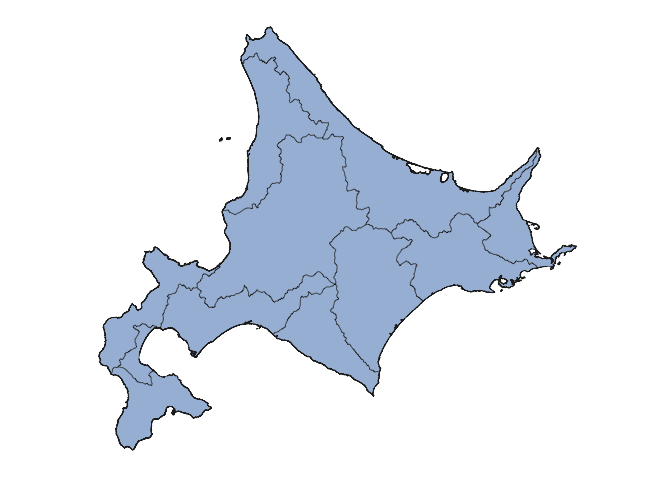
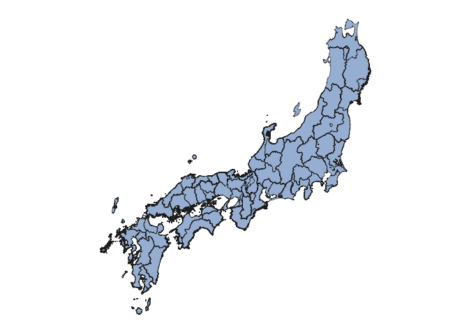
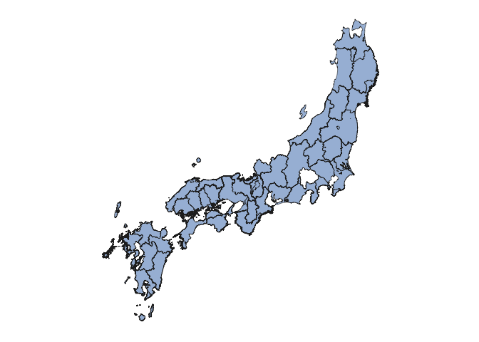
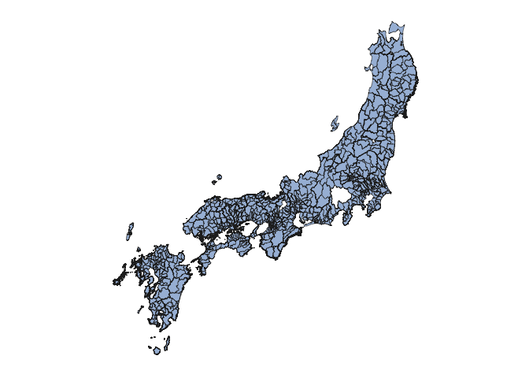

GIS 1887
================
Ye Seul Byeon
5/16/2018

``` r
#reading in excel file
#list.files('data')
tabular <- read_xlsx('data/JapanG_RawData_beta.xlsx')

#tidying the tabular dataset
tabular_tidy <- tabular %>%
  #converting meiji year to calendar year
  mutate(MeijiYear = as.numeric(gsub("M", "", MeijiYear))) %>%
  mutate(Year = MeijiYear + 1867) %>%
  select(KGun_ID, Kuni_ID, Ken_Nm, Kuni_Nm, Gun_Nm, Year, G063, G064, G121, G203, G206)

#rename columns
names(tabular_tidy)[7:11] = c("All_Bovine", "All_Horses", "Malnutrition_Deaths", "Bovine_Bred", "Horses_Bred")

head(tabular_tidy)
```

    ## # A tibble: 6 x 11
    ##   KGun_ID Kuni_ID Ken_Nm Kuni_Nm Gun_Nm         Year All_Bovine All_Horses
    ##     <dbl>   <dbl> <chr>  <chr>   <chr>         <dbl>      <dbl>      <dbl>
    ## 1     101       1 Aomori Mutsu   Higashitsuga…  1887         82       6940
    ## 2     102       1 Aomori Mutsu   Nishitsugaru   1887         99       6810
    ## 3     103       1 Aomori Mutsu   Nakatsugaru …  1887        135       5698
    ## 4     104       1 Aomori Mutsu   Minamitsugaru  1887          0       6716
    ## 5     105       1 Aomori Mutsu   Kitatsugaru    1887        145       5081
    ## 6     106       1 Aomori Mutsu   Kamikita       1887       4203      16158
    ## # ... with 3 more variables: Malnutrition_Deaths <dbl>, Bovine_Bred <chr>,
    ## #   Horses_Bred <dbl>

``` r
#animal_consumption <- read_csv('data/animal_product_cleaned.csv') %>%
 # select(-c(8:11))

#cols_to_change = c(2, 3, 5:8)
#for(i in cols_to_change){
#   class(animal_consumption[, i]) = "double"
#}
#str(animal_consumption)
```

``` r
japan1887_kuni <- readOGR("./data/JapanKuni_1887.shp")
```

    ## OGR data source with driver: ESRI Shapefile 
    ## Source: "/Users/yeseulbyeon/Desktop/treatyports/data/JapanKuni_1887.shp", layer: "JapanKuni_1887"
    ## with 70 features
    ## It has 5 fields

``` r
hokkaido1887_kuni <- readOGR("./data/JapanKuni_Hokkaido__1887.shp")
```

    ## OGR data source with driver: ESRI Shapefile 
    ## Source: "/Users/yeseulbyeon/Desktop/treatyports/data/JapanKuni_Hokkaido__1887.shp", layer: "JapanKuni_Hokkaido__1887"
    ## with 10 features
    ## It has 5 fields

``` r
japan1887_gun <- readOGR("./data/JapanGun_1887.shp")
```

    ## OGR data source with driver: ESRI Shapefile 
    ## Source: "/Users/yeseulbyeon/Desktop/treatyports/data/JapanGun_1887.shp", layer: "JapanGun_1887"
    ## with 677 features
    ## It has 21 fields

``` r
japan1887_ken <- readOGR("./data/JapanKen_1887.shp")
```

    ## OGR data source with driver: ESRI Shapefile 
    ## Source: "/Users/yeseulbyeon/Desktop/treatyports/data/JapanKen_1887.shp", layer: "JapanKen_1887"
    ## with 39 features
    ## It has 3 fields

``` r
#hokkaido kuni
(hokkaido1887_process <- hokkaido1887_kuni %>%
  fortify(region = "KUNI_RM") %>%
  as_tibble() %>%
  left_join(hokkaido1887_kuni@data, by = c("id" = "KUNI_RM")))
```

    ## Warning: Column `id`/`KUNI_RM` joining character vector and factor,
    ## coercing into character vector

    ## # A tibble: 67,574 x 11
    ##     long   lat order hole  piece id     group  OBJECTID KUNI_JP     KEN_RM
    ##    <dbl> <dbl> <int> <lgl> <fct> <chr>  <fct>     <int> <fct>       <fct> 
    ##  1  142.  42.9     1 FALSE 1     Hidaka Hidak…       78 "\u0093ú\u… Hidaka
    ##  2  142.  42.9     2 FALSE 1     Hidaka Hidak…       78 "\u0093ú\u… Hidaka
    ##  3  142.  42.9     3 FALSE 1     Hidaka Hidak…       78 "\u0093ú\u… Hidaka
    ##  4  142.  42.9     4 FALSE 1     Hidaka Hidak…       78 "\u0093ú\u… Hidaka
    ##  5  142.  42.9     5 FALSE 1     Hidaka Hidak…       78 "\u0093ú\u… Hidaka
    ##  6  142.  42.9     6 FALSE 1     Hidaka Hidak…       78 "\u0093ú\u… Hidaka
    ##  7  142.  42.9     7 FALSE 1     Hidaka Hidak…       78 "\u0093ú\u… Hidaka
    ##  8  142.  42.9     8 FALSE 1     Hidaka Hidak…       78 "\u0093ú\u… Hidaka
    ##  9  142.  42.9     9 FALSE 1     Hidaka Hidak…       78 "\u0093ú\u… Hidaka
    ## 10  142.  42.9    10 FALSE 1     Hidaka Hidak…       78 "\u0093ú\u… Hidaka
    ## # ... with 67,564 more rows, and 1 more variable: KEN_JP <fct>

``` r
#japan kuni
(japan1887_kuni_process <- japan1887_kuni %>%
  fortify(region = "KUNI_RM") %>%
  as_tibble() %>%
  left_join(japan1887_kuni@data, by = c("id" = "KUNI_RM")))
```

    ## Warning: Column `id`/`KUNI_RM` joining character vector and factor,
    ## coercing into character vector

    ## # A tibble: 234,548 x 11
    ##     long   lat order hole  piece id    group OBJECTID KUNI_JP      KEN_RM 
    ##    <dbl> <dbl> <int> <lgl> <fct> <chr> <fct>    <int> <fct>        <fct>  
    ##  1  133.  34.8     1 FALSE 1     Aki   Aki.1        1 "\u0088À\u0… Hirosh…
    ##  2  133.  34.8     2 FALSE 1     Aki   Aki.1        1 "\u0088À\u0… Hirosh…
    ##  3  133.  34.8     3 FALSE 1     Aki   Aki.1        1 "\u0088À\u0… Hirosh…
    ##  4  133.  34.8     4 FALSE 1     Aki   Aki.1        1 "\u0088À\u0… Hirosh…
    ##  5  133.  34.8     5 FALSE 1     Aki   Aki.1        1 "\u0088À\u0… Hirosh…
    ##  6  133.  34.8     6 FALSE 1     Aki   Aki.1        1 "\u0088À\u0… Hirosh…
    ##  7  133.  34.8     7 FALSE 1     Aki   Aki.1        1 "\u0088À\u0… Hirosh…
    ##  8  133.  34.8     8 FALSE 1     Aki   Aki.1        1 "\u0088À\u0… Hirosh…
    ##  9  133.  34.8     9 FALSE 1     Aki   Aki.1        1 "\u0088À\u0… Hirosh…
    ## 10  133.  34.8    10 FALSE 1     Aki   Aki.1        1 "\u0088À\u0… Hirosh…
    ## # ... with 234,538 more rows, and 1 more variable: KEN_JP <fct>

``` r
#japan gun
(japan1887_gun_process <- japan1887_gun %>%
  fortify(region = "GUN_RM") %>%
  as_tibble() %>%
  left_join(japan1887_gun@data, by = c("id" = "GUN_RM")))
```

    ## Warning: Column `id`/`GUN_RM` joining character vector and factor, coercing
    ## into character vector

    ## # A tibble: 300,630 x 27
    ##     long   lat order hole  piece id    group GUN_CODE GUN_JP       KUNI_RM
    ##    <dbl> <dbl> <int> <lgl> <fct> <chr> <fct>    <dbl> <fct>        <fct>  
    ##  1  138.  35.2     1 FALSE 1     Abe   Abe.1     3301 "\u0088À\u0… Suruga 
    ##  2  138.  35.2     2 FALSE 1     Abe   Abe.1     3301 "\u0088À\u0… Suruga 
    ##  3  138.  35.1     3 FALSE 1     Abe   Abe.1     3301 "\u0088À\u0… Suruga 
    ##  4  138.  35.1     4 FALSE 1     Abe   Abe.1     3301 "\u0088À\u0… Suruga 
    ##  5  138.  35.1     5 FALSE 1     Abe   Abe.1     3301 "\u0088À\u0… Suruga 
    ##  6  138.  35.1     6 FALSE 1     Abe   Abe.1     3301 "\u0088À\u0… Suruga 
    ##  7  138.  35.1     7 FALSE 1     Abe   Abe.1     3301 "\u0088À\u0… Suruga 
    ##  8  138.  35.1     8 FALSE 1     Abe   Abe.1     3301 "\u0088À\u0… Suruga 
    ##  9  138.  35.1     9 FALSE 1     Abe   Abe.1     3301 "\u0088À\u0… Suruga 
    ## 10  138.  35.1    10 FALSE 1     Abe   Abe.1     3301 "\u0088À\u0… Suruga 
    ## # ... with 300,620 more rows, and 17 more variables: KUNI_JP <fct>,
    ## #   KEN_RM <fct>, KEN_JP <fct>, KUNI <int>, GUN <int>, M17_GUN <fct>,
    ## #   NEN__YEAR <fct>, NOTES <fct>, KuniCode <dbl>, M17_gunID <dbl>,
    ## #   Year <fct>, G278_koku <dbl>, G021_hou <dbl>, g021_per <dbl>,
    ## #   g15R_pop <dbl>, G026_sch <dbl>, CODE <int>

``` r
#japan ken
(japan1887_ken_process <- japan1887_ken %>%
  fortify(region = "KEN_RM") %>%
  as_tibble() %>%
  left_join(japan1887_ken@data, by = c("id" = "KEN_RM")))
```

    ## Warning: Column `id`/`KEN_RM` joining character vector and factor, coercing
    ## into character vector

    ## # A tibble: 169,386 x 9
    ##     long   lat order hole  piece id    group   OBJECTID KEN_JP          
    ##    <dbl> <dbl> <int> <lgl> <fct> <chr> <fct>      <int> <fct>           
    ##  1  137.  35.4     1 FALSE 1     Aichi Aichi.1        1 "\u0088¤\u0092m"
    ##  2  137.  35.4     2 FALSE 1     Aichi Aichi.1        1 "\u0088¤\u0092m"
    ##  3  137.  35.4     3 FALSE 1     Aichi Aichi.1        1 "\u0088¤\u0092m"
    ##  4  137.  35.4     4 FALSE 1     Aichi Aichi.1        1 "\u0088¤\u0092m"
    ##  5  137.  35.4     5 FALSE 1     Aichi Aichi.1        1 "\u0088¤\u0092m"
    ##  6  137.  35.4     6 FALSE 1     Aichi Aichi.1        1 "\u0088¤\u0092m"
    ##  7  137.  35.4     7 FALSE 1     Aichi Aichi.1        1 "\u0088¤\u0092m"
    ##  8  137.  35.4     8 FALSE 1     Aichi Aichi.1        1 "\u0088¤\u0092m"
    ##  9  137.  35.4     9 FALSE 1     Aichi Aichi.1        1 "\u0088¤\u0092m"
    ## 10  137.  35.4    10 FALSE 1     Aichi Aichi.1        1 "\u0088¤\u0092m"
    ## # ... with 169,376 more rows

``` r
(hokkaido <- ggplot(data = hokkaido1887_process, mapping = aes(x = long, y = lat, group = group)) + 
  coord_fixed(1.3) + 
  geom_polygon(color = "#252525", fill = "#a6bddb", size = 0.2))
```



``` r
(japan_kuni <- ggplot(data = japan1887_kuni_process, mapping = aes(x = long, y = lat, group = group)) + 
  coord_fixed(1.3) + 
  geom_polygon(color = "#252525", fill = "#a6bddb", size = 0.2))
```



``` r
(japan_ken <- ggplot(data = japan1887_ken_process, mapping = aes(x = long, y = lat, group = group)) + 
  coord_fixed(1.3) + 
  geom_polygon(color = "#252525", fill = "#a6bddb", size = 0.2))
```



``` r
(japan_gun <- ggplot(data = japan1887_gun_process, mapping = aes(x = long, y = lat, group = group)) + 
  coord_fixed(1.3) + 
  geom_polygon(color = '#252525', fill = "#a6bddb", size = 0.2))
```


