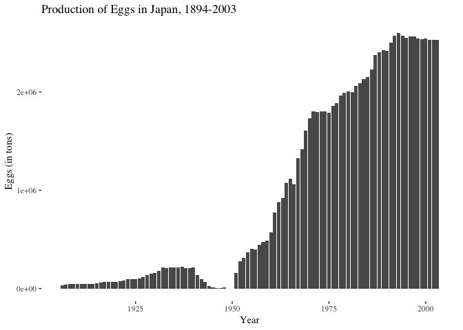

The Large Mammals of Hakodate
================
Ye Seul Byeon
5/28/2018

Introduction
------------

As the critical success of the recent film *Isle of Dogs* attests, the curious relationship between the Japanese people and their animal counterparts has a particular hold on the popular imagination. This popular attention is nearly matched by scholarly attention. In recent years, the subgenre of “animal studies” has sustained a bounty of rich scholarly works that, together with other works in the broader field of environmental history, form a new critical wave in modern Japanese history. Whether or not this can be identified an environmental "turn" is an open question, but I concur with many of these scholars that mastery over (and exploitation of) the natural world constitutes an important pillar of Japan’s modern transformation.

While all Japanese treaty ports are sites of radical change in their own right, Hakodate’s transformations were informed by important subtexts that both prefigure and outlast the duration of the Ansei treaties. The first of these subtexts concerns its location at the southeastern tip of Hokkaido, which has historically rendered it a contact zone between societies indigenous to the island and the increasingly expansionist societies to its south. (The boundaries between the two do not necessarily map neatly onto Ainu/Wajin ethnic boundaries - as David Howell points out, the end of the Tokugawa period saw significant migratory flows of wage laborers from northern Honshu to the fisheries of Hokkaido, which was complemented by the increasing integration of the Ainu into the economic order of the Shogunate.)

``` r
hokkaido_df <- data.frame(
  city = c("Hakodate", "Matsumae", "Sapporo"),
  lon = c(141, 140, 141.35),
  lat = c(41.8, 41.4, 43),
  stringsAsFactors = FALSE
) %>%
  filter (city != "Hakodate")

hakodate <- data.frame(
  city = c("Hakodate", "Matsumae", "Sapporo"),
  lon = c(141, 140, 141.35),
  lat = c(41.8, 41.4, 43),
  stringsAsFactors = FALSE
) %>%
  filter (city == "Hakodate")

leaflet() %>% 
  addProviderTiles(providers$Esri.WorldTerrain) %>%
  setView(141, 41.8, zoom = 6) %>%
  addCircleMarkers(data = hokkaido_df, ~lon, ~lat, popup = ~as.character(city), 
                   label = ~as.character(city), radius = 3, stroke = TRUE, 
                   fillOpacity = 1, color = "#1c9099") %>%
  addCircleMarkers(data = hakodate, ~lon, ~lat, popup = ~as.character(city), 
                   label = ~as.character(city), radius = 3, stroke = TRUE, fillOpacity = 1, 
                   color = "#ffa500")
```

Two crucial junctures punctuate the evolution of this relationship — the consolidation of the early modern state in the 17th and 18th century, and the consolidation of the Meiji state in the late 19th century. At each turn, we find Hokkaido enmeshed in a deeper web of economic and political dependency, while simultaneously being rebranded as a periphery and a cultural “other” vis-a-vis the center. Hakodate figures into this story as a local economic hub and a regional node in the expanding trade network, although still a second city to Matsumae in this role until its designation as a treaty port. The second subtext concerns the “discovery” of Hokkaido's natural resources in the late 19th century, chief among which was its animals. Among the various species that form Hokkaido's animal estate, two large mammals come to mind for the key roles they specifically played in shaping the treaty port of Hakodate: whales and cows.

The harvest of whale oil off Hakodate's shores was one of the most important economic impetuses behind the gunboat diplomacy that "opened" Japan to the West. The treaty of Kanagawa specifically earmarked Hakodate - a strategic, but by no means a central port from the Bakufu's perspective - as one of two "open ports" for use by American vessels. Its subsequent designation as a treaty port precipitated a curious form of urban development that reflected the needs and desires of an unlikely cast of resident treaty powers - America and Russia. It also reflected Hokkaido's exceptional status as a "new frontier" in the grand scheme of Japan's ongoing state-building process in the late 19th century.

If human interactions with whales inform the early seaward development of Hakodate, human interactions with cows provide us with a window into its landward development. Alfred Crosby is widely credited with theorizing and popularizing the idea of "ecological imperialism" to describe how the military conquest of the New World occurred alongside radical and catastrophic changes to its ecology. Crosby argues that an important ramification of these multifarious waves of conquest was the creation of "Neo-Europes" -- areas of intense European settler colonialism, where the physical environment gradually came to share many of the features of comparable temperate zones across the Atlantic. Applying this framework to Hakodate, we may inquire whether its ecological transformation at the hands of new settlers, both from across the Pacific Ocean and the Tsugaru Strait, merits the application of the term "ecological imperialism." In other words, might we be able to label Hakodate, and Hokkaido more broadly, as a "Neo-America" or a "Neo-Japan"?

Since there is a dearth of English-language research specifically dedicated to the environmental history of Hakodate, I consider my role in this project to be one of a archaeological curator: piecing together disparate fragments and imputing missing values to arrive at an approximate picture.




Bibliography
------------

CEAS Lecture Series - Daniel Botsman. Produced by CEAS UChicago. Youtube. May 5, 2017. <https://youtu.be/z8TwspRUjSg>.

Crosby, Alfred W.\* Ecological Imperialism: The Biological Expansion of Europe, 900-1900\*. Cambridge: Cambridge Univ. Press, 1993.

De Ganon, Pieter S. "The Animal Economy." PhD diss., Princeton, 2011.

Howell, David L. *Capitalism from Within: Economy, Society, and the State in a Japanese Fishery*. University of California Press, 1995.

Jones, Wellington D. "Hokkaido, the Northland of Japan." *Geographical Review* 11, no. 1 (1921): 16. <doi:10.2307/207854>.

Miller, Ian, and Harriet Ritvo. *The Nature of the Beasts: Empire and Exhibition at the Tokyo Imperial Zoo*. Berkeley: University of California Press, 2013.

Miller, Ian Jared, Julia Adeney Thomas, and Brett L. Walker, eds.\* Japan at Nature's Edge: The Environmental Context of a Global Power\*. Honolulu, HI: University of Hawaii Press.

Schmidt, Ben. "Data Narratives and Structural Histories: Melville, Maury, and American Whaling." *Sapping Attention*. October 30, 2012. Accessed May 19, 2018. <http://sappingattention.blogspot.com/2012/10/data-narratives-and-structural.html>.

Statistics Bureau, and Ministry of Internal Affairs and Communications. "Agriculture, Forestry and Fisheries." *Historical Statistics of Japan*. <http://www.stat.go.jp/english/data/chouki/07.html>.

Walker, Brett L., and William Cronon. *Lost Wolves of Japan*. University of Washington Press, 2009.

Walker, Brett L. *The Conquest of Ainu Lands: Ecology and Culture in Japanese Expansion, 1590-1800*. Berkeley: University of California Press, 2001.
